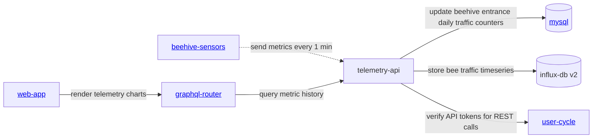

<iframe width="100%" height="400" src="https://www.youtube.com/embed/Ags3rplPkQE" title="Getting started with iot sensors development" frameborder="0" allow="accelerometer; autoplay; clipboard-write; encrypted-media; gyroscope; picture-in-picture; web-share" referrerpolicy="strict-origin-when-cross-origin" allowfullscreen></iframe>

## Architecture

Эти docs относятся к продукту [beehive scales](../../products/scales/scales.md). Sensor readings сохраняются через [hive telemetry storage](../../products/web_app/pro-tier/hive-telemetry-storage.md) и визуализируются в [timeseries analytics](../../products/web_app/pro-tier/timeseries-data-analytics.md).

### Services
- [https://github.com/Gratheon/hardware-beehive-sensors](https://github.com/Gratheon/hardware-beehive-sensors) — sensors repo на client side
- [https://github.com/gratheon/telemetry-api](https://github.com/gratheon/telemetry-api) — server side

