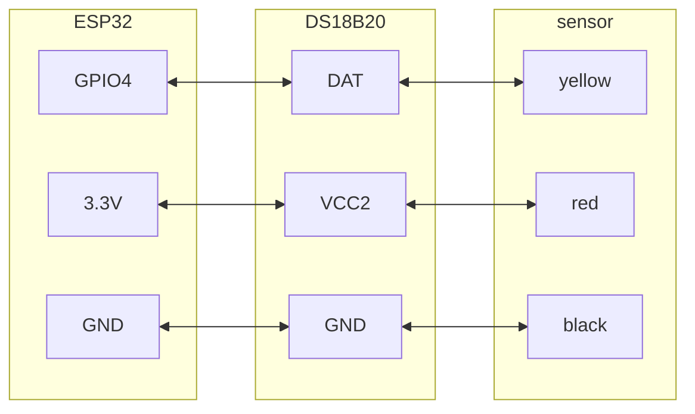

https://www.aliexpress.com/item/1005006431677780.html

### Схема подключения

Датчик температуры DS18B20:

- DATA подключается к IO4. Между DATA и VCC можно поставить подтягивающий резистор 4.7 kΩ.

## Описание

Водонепроницаемый температурный датчик DS18B20 с подключаемым клеммным адаптером можно использовать для разных задач, например для измерения температуры почвы или контроля температуры бака с горячей водой. Для стабильной работы водонепроницаемый DS18B20 также требует подтягивающий резистор, поэтому используется переходник.

## Характеристики

- Напряжение питания датчика: 3.0-5.5 V.
- Разрешение измерения: настраиваемое, 9-12 бит.
- Диапазон температуры: -55 до +125 °C. Кабель выдерживает температуру только до 85 °C.
- Провода датчика: жёлтый - DATA, красный - VCC, чёрный - GND.
- Кабели адаптера: DATA, VCC, BLK.
- Подходящие платформы: Arduino и Raspberry Pi.

## Комплект

- 1 датчик температуры DS18B20.
- 1 подключаемый клеммный адаптер.
- 1 трёхпиновый кабель.

<iframe width="100%" height="400" src="https://www.youtube.com/embed/iee3QBuVx6M" title="ESP32 &amp; DS18B20 thermometer - simple projects with Arduino and ESP32" frameborder="0" allow="accelerometer; autoplay; clipboard-write; encrypted-media; gyroscope; picture-in-picture; web-share" referrerpolicy="strict-origin-when-cross-origin" allowfullscreen></iframe>
