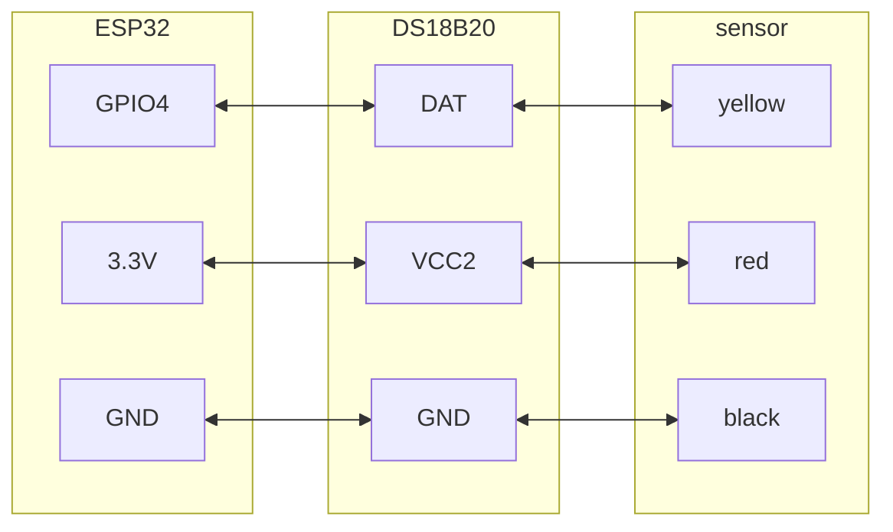

https://www.aliexpress.com/item/1005006431677780.html

### Wiring diagram
  

DS18B20 Temperature Sensor:
- DATA к IO4 (с опциональным 4.7kΩ pull-up resistor между DATA и VCC)

Описание:

Водонепроницаемый температурный sensor DS18B20 с pluggable terminal можно использовать во многих местах: например, для измерения температуры почвы или контроля температуры бака с горячей водой. Водонепроницаемый DS18B20 temperature sensor также должен подключаться через pull-up resistor; для этого мы спроектировали converter.

Product Specifications:

Напряжение питания temperature sensor: 3.0V ~ 5.5V

Разрешение temperature sensor: настраиваемое, от 9 до 12 bit

Temperature range: -55 ~ +125 ° (провод выдерживает максимальную температуру только до 85 градусов)

Temperature Sensor Output Lead: Yellow (DATA), Red (VCC) и Black (GND)

Adapter Cables: DATA, VCC, BLK,

Suitable platform: Arduino и Raspberry Pi

Package Included:

1PC * DS18B20 temperature sensor

1PC * pluggable terminal adapter

1PC * 3pin cable

<iframe width="100%" height="400" src="https://www.youtube.com/embed/iee3QBuVx6M" title="ESP32 &amp; DS18B20 thermometer - simple projects with Arduino and ESP32" frameborder="0" allow="accelerometer; autoplay; clipboard-write; encrypted-media; gyroscope; picture-in-picture; web-share" referrerpolicy="strict-origin-when-cross-origin" allowfullscreen></iframe>
