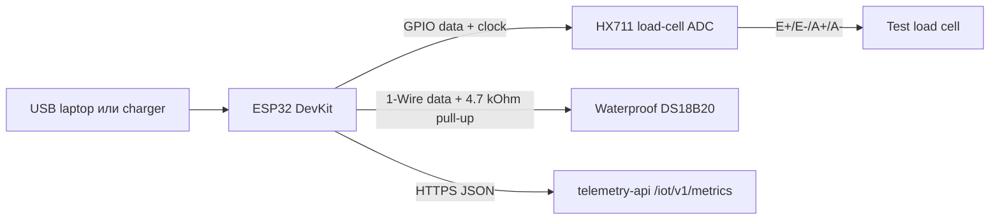

## Цель

Лабораторный этап - это настольная сборка электроники. Она должна быть дешёвой, простой для переподключения и удобной для отладки через USB serial. Ей не нужны наружное питание, герметичный корпус, солнечная зарядка или финальная механическая рама весов.

Используйте этот этап, чтобы проверить:

- сборку и прошивку ESP32 firmware;
- показания HX711 и тензодатчика;
- показания внутренней температуры DS18B20;
- локальную калибровку и tare logic;
- JSON upload в `/iot/v1/metrics`;
- видимость графиков Gratheon и поведение при missing data.

## Функциональность

- Читает один тензодатчик через HX711.
- Читает один водонепроницаемый зонд DS18B20.
- Отправляет телеметрию каждые 30-60 секунд для demos и debugging.
- Работает от USB-питания.
- Использует serial logs для настройки и troubleshooting.
- Хранит только минимальную конфигурацию: endpoint URL, API token, `hiveId` и calibration factor.

## Lab interconnect map

Высокоуровневый signal flow для Этапа 1 показан ниже. Подробную pin-by-pin проводку смотрите в [Обзоре системы](system-overview.md) и детальных [схемах подключения](wiring-diagrams/full-system-wiring.md).



## План электрических соединений

| Подсистема | Соединение с ESP32 | Тип сигнала | Правило лабораторной проводки | Почему это важно |
| --- | --- | --- | --- | --- |
| HX711 power | 3.3 V и GND | Power | Держите HX711 и ESP32 на общей земле. | Предотвращает drift ADC reference и случайные показания. |
| HX711 digital | Два GPIO, например DT на GPIO16 и SCK на GPIO17 | Digital | Сначала используйте короткие jumper wires, затем screw terminals, если показания скачут. | HX711 проще отлаживать, когда digital lines стабильны. |
| Load cell bridge | E+, E-, A+, A- к HX711 | Low-level analog differential | Не прокладывайте рядом с USB power bricks или switching converters. | Сигналы тензодатчика очень малы и чувствительны к шуму. |
| DS18B20 probe | 3.3 V, GND, одна GPIO data line | 1-Wire | Добавьте 4.7 kOhm pull-up от data к 3.3 V, если он не встроен в breakout. | Без pull-up датчик может появляться только периодически. |
| USB serial | USB cable | Power + debug | В lab mode держите serial logs включёнными. | Это самый быстрый способ проверить WiFi, calibration, payloads и API responses. |

## Рекомендуемое распределение pins для лаборатории

Точные pins могут измениться в прошивке, но лабораторная сборка должна резервировать pins по функциям, чтобы дизайн мог расти без полной перепроводки.

| Функция | Рекомендуемый ESP32 pin | Примечания |
| --- | --- | --- |
| HX711 DT | GPIO16 | Для первого прототипа избегайте boot strapping pins. |
| HX711 SCK | GPIO17 | Держите в паре с DT в firmware config. |
| DS18B20 data | GPIO4 | Часто используемый 1-Wire example pin, простой для документации. |
| I2C SDA для будущего humidity sensor | GPIO21 | Зарезервировать, даже если на этапе 1 не установлен. |
| I2C SCL для будущего humidity sensor | GPIO22 | Зарезервировать, даже если на этапе 1 не установлен. |
| Battery voltage ADC для будущей field-сборки | GPIO34 или GPIO35 | Input-only pins подходят для ADC sensing. |

## Механическая настройка

Лаборатории не нужна финальная рама hive-scale, но ей всё равно нужен повторяемый test fixture.

- Прикрутите тензодатчик к жёсткой доске или алюминиевому профилю, а не держите его рукой.
- Оставьте измерительный конец свободным, чтобы он изгибался в нужном направлении.
- Добавьте небольшую плоскую площадку или крючок для известных test weights.
- Зафиксируйте кабель tape или zip tie, чтобы движение кабеля не выглядело как weight drift.
- Сфотографируйте ориентацию тензодатчика, потому что calibration values имеют смысл только для повторяемой geometry.

## Калибровочный процесс

1. Начните без веса на fixture и выполните tare.
2. Положите известную массу, например 1 kg, 5 kg или 10 kg, в зависимости от test cell.
3. Рассчитайте и сохраните calibration factor в non-volatile memory.
4. Снимите и снова положите вес три раза.
5. Принимайте setup только если показания возвращаются близко к одному значению после каждого цикла.
6. Отправьте хотя бы один accepted telemetry payload в Gratheon и залогируйте calibration factor локально.

## Контракт Telemetry API

Для лабораторной проверки устройства должны использовать REST endpoint, уже доступный в telemetry-api:

```http
POST https://telemetry.gratheon.com/iot/v1/metrics
Authorization: Bearer <api-token>
Content-Type: application/json
```

```json
{
  "hiveId": "54",
  "timestamp": 1717238400,
  "dedupeKey": "esp32-54:1717238400",
  "fields": {
    "temperatureCelsius": 34.2,
    "humidityPercent": 61.5,
    "weightKg": 47.8
  }
}
```

Тот же контракт нужно повторно использовать на следующих этапах, чтобы прошивка не расходилась с текущим ingestion path.

## Приоритетные изменения прошивки

- Поддержать phase profiles: `lab`, `field-mvp` и `production`.
- В lab mode отправлять данные каждые **30-60 секунд**.
- Добавить поля first-run setup: `deviceId`, `hiveId`, API token, endpoint URL, send interval и calibration factor.
- Добавить calibration flow: tare empty scale, place known weight, calculate factor, store in non-volatile memory.
- Отправлять JSON в `/iot/v1/metrics` с `timestamp` и `dedupeKey`.

## Критерии выхода

- Показания веса достаточно стабильны, чтобы видеть известные test weights.
- Temperature readings видны в serial logs.
- Telemetry payload принят `telemetry-api`.
- Gratheon UI показывает отправленную историю.
- Calibration factor можно сохранить и повторно использовать после restart.

## Bill of materials

Подробный список покупок находится в [Phase 1 - Lab BOM](bill-of-materials.md). Основные детали: ESP32, HX711, один дешёвый тензодатчик, DS18B20, jumper wires, breadboard или screw terminals и USB power.
