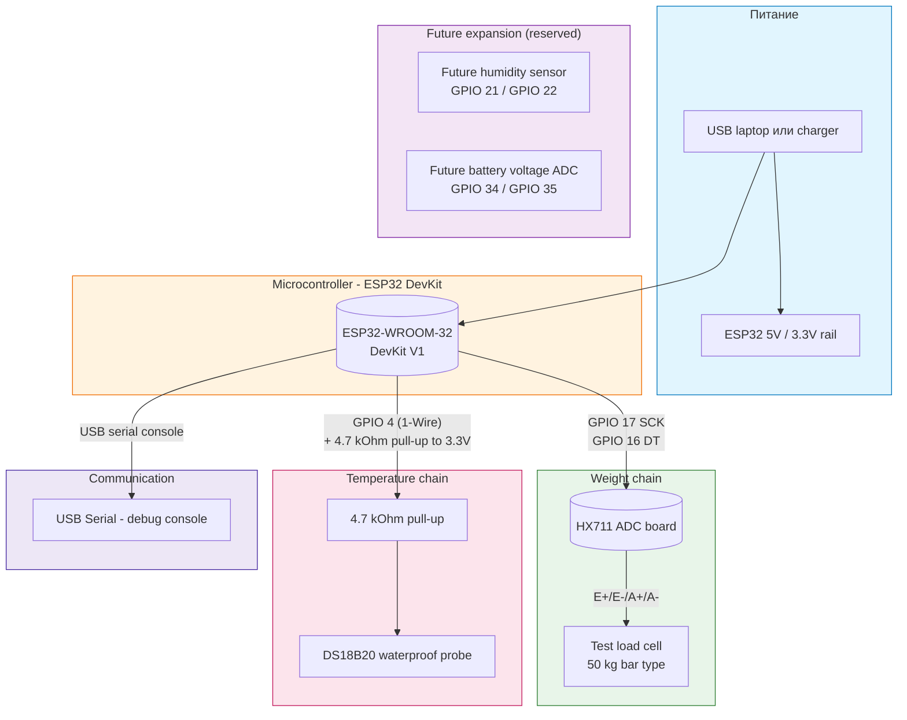

## Назначение

Эта страница дает высокоуровневый обзор системы для лабораторной проверки Этапа 1. Она разделена на диаграмму принципа работы ПО и схему подключения оборудования. Это стартовая точка, когда вы впервые открываете документацию проекта.

## Принцип работы ПО

Программная архитектура описывает логический поток данных от датчиков к бекенду.

```mermaid
flowchart TB
    subgraph SENSORS["Датчики"]
        LC[Load Cell (Вес)]
        TEMP[DS18B20 (Температура)]
    end

    subgraph MCU["Микроконтроллер (Прошивка)"]
        READ[Чтение данных датчиков]
        WIFI_CONN[Подключение к WiFi]
        SEND[Отправка телеметрии]
    end

    subgraph BACKEND["Облако"]
        TELEM[telemetry-api /iot/v1/metrics]
    end

    LC --> READ
    TEMP --> READ
    READ --> WIFI_CONN
    WIFI_CONN --> SEND
    SEND -- "HTTPS POST" --> TELEM
    
    style SENSORS fill:#e8f5e9,stroke:#2e7d32
    style MCU fill:#fff3e0,stroke:#ef6c00
    style BACKEND fill:#ede7f6,stroke:#4527a0
```

## Схема подключения оборудования

Эта диаграмма показывает физические соединения между компонентами. Нажмите на подкомпоненты для просмотра детальных страниц по подключению.


