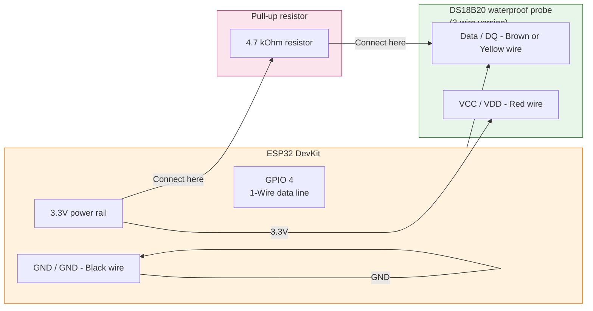
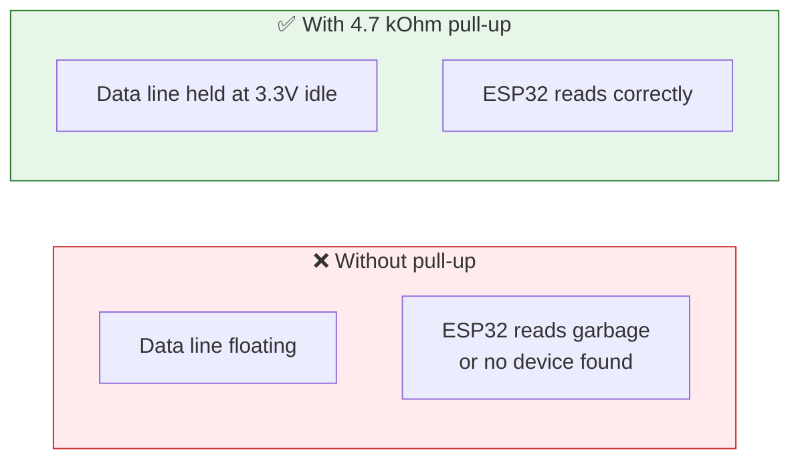
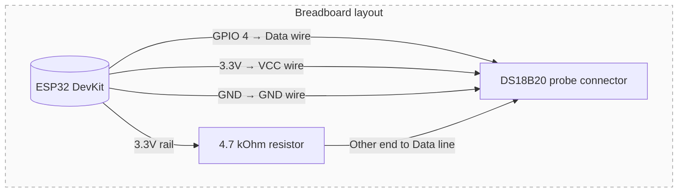

## Назначение

Подробная pin-by-pin проводка для температурного датчика. Используйте эту страницу, когда подключаете водонепроницаемый зонд DS18B20 к ESP32.

## 1-Wire соединения DS18B20



## Таблица pin allocation

| DS18B20 wire colour | Function | ESP32 connection | Notes |
| --- | --- | --- | --- |
| Red | VCC (power) | 3.3V on ESP32 | Не подключайте к 5V - на этой плате DS18B20 работает как 3.3V device |
| Black | GND (ground) | GND on ESP32 | Должна иметь общую землю с ESP32 |
| Brown or Yellow | Data / DQ | GPIO 4 через 4.7 kOhm pull-up | Pull-up обязателен для корректной 1-Wire работы |

## Почему pull-up resistor важен

DS18B20 использует 1-Wire protocol, которому нужен pull-up resistor на data line, чтобы удерживать её в logic high, когда ни одно устройство ей не управляет. Без этого resistor:

- probe может появляться в firmware scans только периодически;
- temperature readings будут ненадёжными или полностью отсутствовать;
- отладка станет запутанной, потому что симптомы похожи на dead sensor.



## Firmware config

Прошивка использует эти constants для DS18B20 connection:

- `DS18B20_PIN = 4` - GPIO pin для 1-Wire data line.
- 4.7 kOhm pull-up - это **hardware** component, он не настраивается в software.

## Физическая проводка на breadboard



### Шаги подключения

1. Подключите красный wire (VCC) от DS18B20 к 3.3V rail на breadboard, затем к ESP32 3.3V pin.
2. Подключите чёрный wire (GND) от DS18B20 к GND rail на breadboard, затем к ESP32 GND pin.
3. Подключите один конец 4.7 kOhm resistor к 3.3V rail.
4. Подключите другой конец 4.7 kOhm resistor к data line (brown or yellow wire).
5. Подключите data line от DS18B20 к GPIO 4 на ESP32.

## Проверка соединения

После подключения можно проверить соединение сканированием 1-Wire devices:

```cpp
// In setup(), after initializing the OneWire library:
auto devices = oneWire->search();
if (devices.empty()) {
    Serial.println("No DS18B20 found! Check pull-up resistor and wiring.");
} else {
    Serial.printf("Found DS18B20 with address: %s
", devices[0].toString().c_str());
}
```

Если устройство не найдено:

- убедитесь, что 4.7 kOhm resistor подключен между 3.3V и data line;
- проверьте, что все провода надёжно вставлены в breadboard rows;
- попробуйте поменять data wire (brown/yellow) с VCC - возможно, провода определены неверно;
- измерьте напряжение на data line мультиметром - в idle оно должно быть около 3.3V.

## Частые проблемы

| Симптом | Что проверить |
| --- | --- |
| No device found during scan | Убедитесь, что pull-up resistor подключен между 3.3V и data line |
| Intermittent readings | Проверьте все breadboard connections - loose wires дают intermittent contact |
| Показания -127°C или 85°C | Sensor не отвечает - снова проверьте проводку, особенно pull-up |
| Показания стабильные, но неправильные | Probe может быть повреждён или измерять не то, что вы ожидаете |
