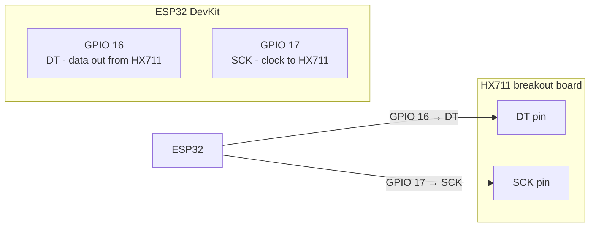
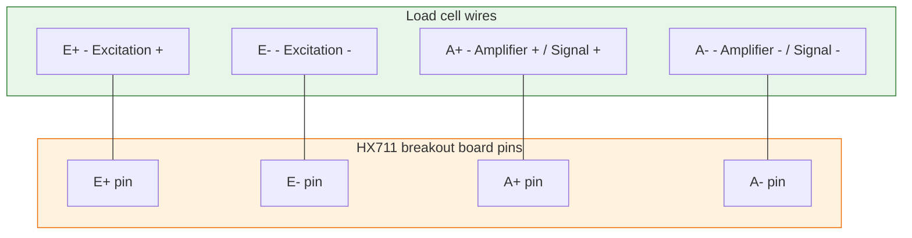
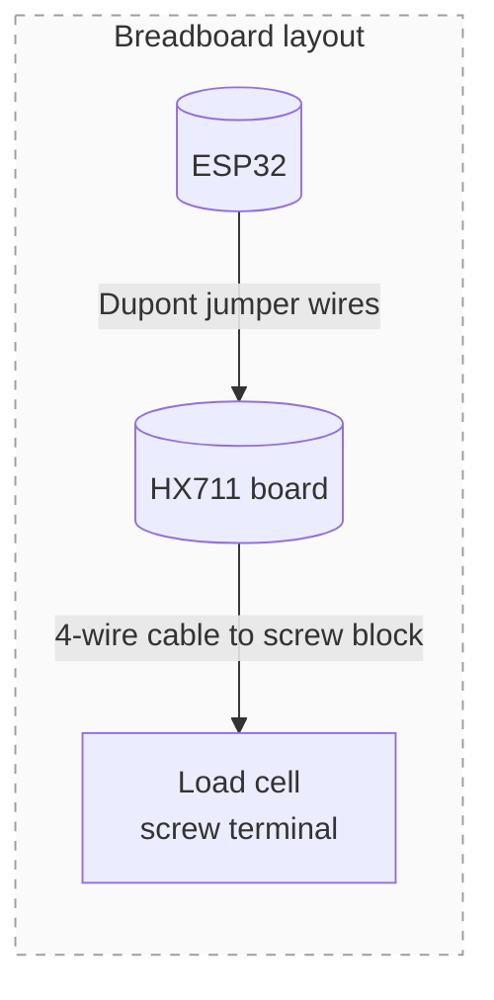

## Назначение

Подробная pin-by-pin проводка для цепочки веса. Используйте эту страницу, когда подключаете плату HX711 и тензодатчик к ESP32.

## Питание HX711

| HX711 pin | ESP32 pin | Wire colour (typical) | Notes |
| --- | --- | --- | --- |
| VCC | 5V или 3.3V | Red | Плата HX711 принимает 5 V и обычно формирует внутреннюю 3.3 V rail |
| GND | GND | Black | **Должна иметь общую землю с ESP32** - разные grounds вызывают ADC drift |

## Цифровые соединения HX711 с ESP32

Это две GPIO lines, с которыми работает прошивка:

**Firmware config:** `HX711_DT_PIN = 16`, `HX711_SCK_PIN = 17`. Их можно поменять позже, но фиксированные значения делают лабораторную проводку консистентной.

## Соединения load cell bridge с HX711

Тензодатчик - это мост Уитстона. Плата HX711 обычно явно маркирует каждый terminal:

### Типичные цвета проводов 4-wire load cell

| Bridge terminal | Common colour | HX711 label |
| --- | --- | --- |
| Excitation + (E+) | Red | TP или E+ |
| Excitation - (E-) | Black | TN или E- |
| Signal + (A+) | White | RP или A+ |
| Signal - (A-) | Green | RN или A- |

> **Tip:** Если показания идут в неправильную сторону, поменяйте местами A+ и A-. Полярность bridge - единственное, что переворачивает знак.

## Советы для breadboard wiring в лаборатории

- Сначала используйте короткие Dupont jumper wires между ESP32 и HX711.
- Если показания скачут, перейдите на screw-terminal blocks для power и signal lines.
- Держите load-cell cable вдали от USB power bricks или switching converters - bridge signals очень малы и чувствительны к шуму.
- Подпишите каждый провод masking tape: `E+`, `E-`, `A+`, `A-`, `DT`, `SCK`, `VCC`, `GND`.

## Частые проблемы

| Симптом | Что проверить |
| --- | --- |
| Показания случайно скачут | Убедитесь, что HX711 и ESP32 имеют общую землю |
| Нет показаний | Проверьте DT/SCK wiring; попробуйте поменять GPIO 16/17 в firmware config |
| Load cell показывает отрицательные значения | Поменяйте A+ и A- на load-cell terminal |
| Большой offset после tare | Кабель двигается или за что-то касается - зафиксируйте cable routing zip tie |
