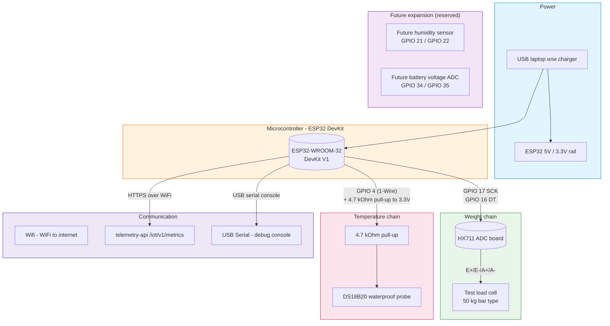

## Назначение

Эта страница показывает всю лабораторную систему Этапа 1 как единую wiring picture. Она должна быть стартовой точкой, когда вы впервые открываете project docs - остальные страницы возвращаются сюда.

## Полная схема подключения

