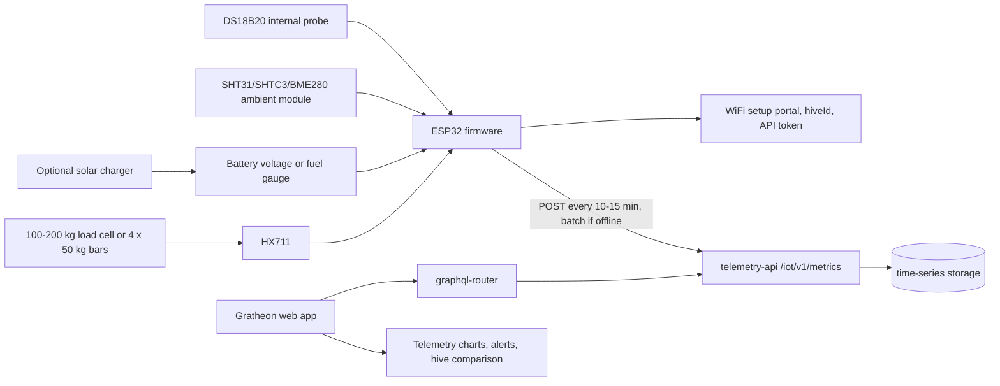

## Цель

Полевой MVP - первая полезная уличная версия. Она должна устанавливаться пчеловодом обычными инструментами и избегать инвазивной электроники внутри семьи. Product promise простой: DIY-весы для улья, которые отправляют в Gratheon вес, внутреннюю температуру, внешнюю влажность, состояние батареи и connectivity health.

Это рекомендуемый public pilot scope.

## Функциональность

- Измеряет вес улья для honey-flow, food-reserve, theft, storm или handling events.
- Измеряет внутреннюю температуру водонепроницаемым DS18B20 probe.
- Измеряет ambient humidity and temperature с SHT31, SHTC3 или BME280 в защищённом вентилируемом месте.
- Измеряет battery voltage или battery state, чтобы web app могла предупредить до остановки телеметрии.
- По умолчанию отправляет данные каждые 10-15 минут.
- Batches readings при слабом WiFi и повторяет отправку со стабильными `dedupeKey` values.
- Использует простой weatherproof enclosure, cable glands и external scale frame.
- Использует phone или web setup вместо outdoor LCD.

## Архитектура Field MVP

## Границы электрических подсистем

Field MVP должен перестать относиться к enclosure как к коробке с breadboard. Разделите hardware на обслуживаемые подсистемы.

| Subsystem | Inside enclosure | Outside enclosure | Connector or pass-through | Recommendation |
| --- | --- | --- | --- | --- |
| Weight | HX711, ESP32 | Load cell или scale frame | Cable gland для MVP, M8/M12 позже | Держите low-level load-cell cable коротким и разгруженным от натяжения. |
| Internal temperature | ESP32 pull-up resistor | DS18B20 probe routed into hive | PG7 cable gland или 3-pin waterproof connector | Используйте 3-wire powered mode, не parasite power. |
| Ambient humidity | SHT31/SHTC3/BME280 board | Vented air pocket outside direct rain | Internal cable, small protected vent или remote pod | Не герметизируйте humidity sensor в main box без air exchange. |
| Power | Battery holder, charger, fuse, switch | Optional solar panel | Separate gland или 2-pin waterproof connector | Держите solar/power wiring отдельно от load-cell signal cable. |
| Service/debug | USB или UART header | None during normal operation | Internal header only | Не делайте external USB hole в enclosure для MVP. |

## Правила проводки для полевой надёжности

- Ставьте physical strain relief на каждый кабель до solder joints или screw terminals.
- Делайте drip loops, чтобы дождь стекал ниже cable entry до попадания в enclosure.
- Держите load-cell analog wires вдали от solar charger и boost-converter wiring.
- Используйте ferrules или tinned wire ends в screw terminals только если terminal type безопасно это поддерживает.
- Подписывайте оба конца каждого кабеля. Outdoor debugging становится медленным, когда все black cables выглядят одинаково.
- Оставляйте небольшой service loop внутри коробки, чтобы lid можно было открыть без натяжения проводов.
- Добавляйте desiccant pack только как краткосрочное mitigation. Реальное решение - корректное sealing, cable entry и condensation path.

## Рекомендуемое field pin allocation

| Function | Suggested ESP32 pin | Interface | Notes |
| --- | --- | --- | --- |
| HX711 DT | GPIO16 | Digital | По возможности сохранить lab profile. |
| HX711 SCK | GPIO17 | Digital | Держать в паре с DT. |
| DS18B20 data | GPIO4 | 1-Wire | 4.7 kOhm pull-up to 3.3 V. |
| SHT31/BME280 SDA | GPIO21 | I2C | Если module remote, держите cable коротким. |
| SHT31/BME280 SCL | GPIO22 | I2C | Снизьте I2C speed, если cable length вызывает errors. |
| Battery voltage | GPIO34 or GPIO35 | ADC | Используйте resistor divider, рассчитанный на low standby leakage. |
| Fuel gauge | GPIO21/GPIO22 | I2C | MAX17048/LC709203 делят I2C с humidity sensor. |
| Wake/service button | Any safe GPIO | Digital input | Полезно для on-site setup без открытия logs. |

## Механический stack

MVP должен выбрать один из двух load paths и задокументировать его фотографиями.

### Option A - Single-point load cell

Используйте, когда 100-200 kg single-point или platform-scale load cell можно закрепить между двумя жёсткими plates.

- Bottom plate стоит на hive stand.
- Load cell прикручен в соответствии со стрелкой и load direction.
- Top plate поддерживает корпус улья.
- Добавьте mechanical stops, чтобы случайная перегрузка не погнула load cell навсегда.
- Добавьте side guides, которые не дают улью соскользнуть, но не создают второй load path.

### Option B - Four bar load cells

Используйте, когда low-cost 50 kg bar cells проще купить.

- Поставьте по одному sensor near each corner.
- Держите все четыре contact points на одинаковой высоте.
- Защитите провода от раздавливания и грызунов.
- Калибруйте полную раму, а не каждый sensor отдельно.
- Ожидайте больше corner-loading error, чем у хорошего single-point design.

## Размещение датчиков

| Sensor | Placement | Avoid |
| --- | --- | --- |
| Load cell | Между жёсткой подставкой и основанием улья | Off-axis force, rocking frame, water pooling around cable exit. |
| DS18B20 | Под крышкой или рядом с краем brood-area, не блокируя пчёл | Loose cable inside colony, direct contact with wet surfaces, crushing under boxes. |
| Humidity/ambient module | Затенённый vented pocket на underside enclosure или отдельный small pod | Direct sun, rain splash, sealed box, condensation drip path. |
| Battery/fuel gauge | Внутри enclosure рядом с батареей | Hot roof surface, exposed terminals. |
| Solar panel | Под углом, с drip loop кабеля перед входом в enclosure | Cable pointing upward into gland, shading by hive roof. |

## Power budget workflow

Не подбирайте solar только по marketing watts панели. Измерьте device current в MVP enclosure.

1. Измерьте deep-sleep current.
2. Измерьте wake current while reading sensors.
3. Измерьте длительность WiFi connect и HTTPS upload.
4. Рассчитайте daily energy для интервалов 10, 15 и 30 минут.
5. Выберите батарею, которая переживёт несколько cloudy days без solar input.
6. Добавляйте solar только после battery-only baseline.
7. Отправляйте battery voltage или fuel-gauge percent в каждом telemetry batch.

## Данные, отправляемые MVP

MVP firmware должен отправлять и beekeeper metrics, и support metrics.

| Type | Fields | Use |
| --- | --- | --- |
| Beekeeper metrics | `weightKg`, `temperatureCelsius`, `humidityPercent` | Honey flow, food shortage, overheating, humidity risk. |
| Device metrics | `batteryVoltage`, `batteryPercent`, `rssi`, `firmwareVersion`, `resetReason` | Support, missing-data alerts, field reliability. |
| Calibration metadata | calibration factor, tare timestamp, scale type | Объясняет, почему разные hive scales могут отличаться. |

## API changes to consider after MVP

Для первого release не обязательно, но полезно для field reliability:

- Добавить поля `batteryVoltage`, `batteryPercent`, `solarVoltage`, `rssi` и `firmwareVersion`.
- Добавить device registry в web app, чтобы пчеловод мог связать физическое устройство с ульем без ручного копирования `hiveId`.
- Добавить “last seen” и “missing telemetry” alert по последнему timestamp на device/hive.
- Добавить calibration metadata: load-cell factor, tare date и mechanical configuration.

## Research references

Research backing перенесён в [🧪 Research references](../research-references.md). Эта страница связывает Field MVP scope с разделом [Research](../../../research/) Gratheon и объясняет, почему weight, temperature, humidity, battery health и connectivity health идут раньше более тяжёлых sensor modalities.

## Критерии выхода

- Device survives rain-protected outdoor operation without water ingress.
- Weight trend достаточно полезен, чтобы обнаруживать daily gain/loss и sudden movement.
- Battery telemetry видна или как минимум логируется локально.
- Устройство может работать реалистичный pilot interval с выбранным report cadence.
- Пчеловод может установить его без soldering inside hive body.

## Bill of materials

Подробный список покупок находится в [Phase 2 - Field MVP BOM](bill-of-materials.md). Он добавляет к лабораторной электронике IP65 box, cable glands, battery, optional solar charger, humidity sensor и более надёжную field wiring.
