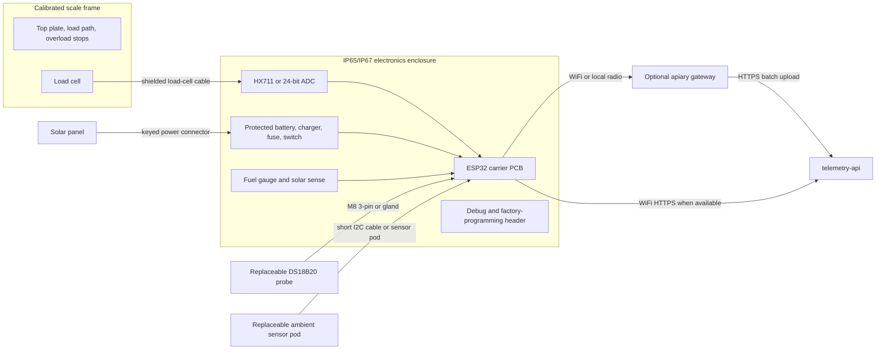
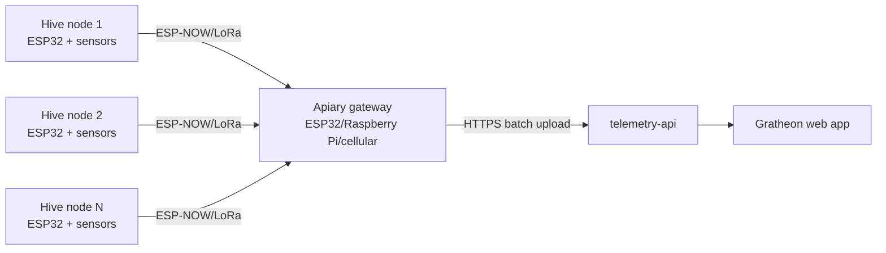

## Цель

Production phase превращает pilot design в hardware, который Gratheon может продавать и поддерживать. Приоритет меняется с самых дешёвых parts на repeatability, calibration, enclosure quality, supply-chain stability и remote diagnostics.

Этот этап всё ещё может использовать ESP32-class hardware, но должен двигаться к pre-assembled wiring, PCB или carrier board, откалиброванной mechanical frame и clean pairing flow в web app.

## Функциональность

- Factory-calibrated load-cell frame или repeatable calibration process.
- Pre-flashed firmware с device identity и secure pairing.
- Battery and solar subsystem, рассчитанная на месяцы работы.
- Waterproof connectors и strain relief для field servicing.
- Device health telemetry: battery, RSSI, firmware version, last seen, reset reason и enclosure temperature там, где полезно.
- Optional LoRa/ESP-NOW apiary gateway для нескольких ульев без WiFi.
- Optional cellular gateway или cellular device variant для remote single-hive deployments.
- Supportable replacement parts и documented mechanical tolerances.

## Production architecture

## Connector strategy

Production должен использовать connectors, чтобы field parts можно было заменить без вскрытия solder joints. Конкретная connector family может измениться, но interface count должен оставаться стабильным.

| Interface | Pins | Suggested connector | Signals | Service reason |
| --- | ---: | --- | --- | --- |
| Load cell | 4 or 6 | M12 4-pin/5-pin, sealed gland для early production | E+, E-, A+, A-, optional shield/sense | Load cell или frame можно заменить после mechanical damage. |
| DS18B20 internal probe | 3 | M8 3-pin или waterproof inline connector | 3.3 V, GND, 1-Wire data | Probe можно заменить после повреждения пчёлами, инструментами или влагой. |
| Ambient sensor pod | 4 | M8 4-pin или short sealed internal harness | 3.3 V, GND, SDA, SCL | Humidity sensor можно заменить при drift или corrosion. |
| Solar panel | 2 | Keyed waterproof 2-pin connector | Solar +, solar - | Предотвращает reversed polarity и упрощает seasonal replacement. |
| Battery pack | 2-3 | Internal keyed connector | Battery +, battery -, thermistor if used | Safe factory assembly и service swap. |
| Debug/programming | 4-6 | Internal JST или pogo pads | 3.3 V, GND, UART TX/RX, EN/BOOT | Factory flashing и support без exposed USB outdoors. |
| Gateway radio antenna | 1 | SMA/u.FL only if needed | RF | Оставлять только для LoRa/cellular variants. |

## Требования к электрическому дизайну

| Area | Requirement | Reason |
| --- | --- | --- |
| Grounding | Keep analog load-cell ground and digital ground controlled on PCB. | Уменьшает weight noise и support tickets. |
| Load-cell routing | Differential signal traces should be short, paired, and away from switching power. | Load-cell output - low-level analog signal. |
| Protection | Add input protection on external sensor and power lines. | Outdoor cable runs могут получать ESD и wiring mistakes. |
| Power switch | Provide a user-visible power/service switch or magnetic reed option. | Пчеловоду нужен clear safe state during installation. |
| Fuse/protection | Battery and solar input need current limiting and reverse-polarity protection. | Снижает fire и support risk. |
| Battery telemetry | Include fuel gauge or calibrated voltage divider plus solar input sensing. | Enables proactive low-battery alerts. |
| Firmware identity | Store unique `deviceId`, firmware version, and hardware revision. | Нужно для pairing, diagnostics и recalls. |
| Watchdog/reset reason | Report reset reason after every reboot. | Отличает brownout, crash и planned firmware update. |

## Механические production requirements

Scale mechanics должны рассматриваться как product subsystem, а не как generic bracket.

| Requirement | Practical implementation |
| --- | --- |
| Repeatable load path | Top plate должен передавать вес улья только через intended load-cell points. |
| Overload protection | Добавить mechanical stops до destructive deflection load cell. |
| Side-load protection | Добавить guides или frame geometry, которые сопротивляются sliding улья без обхода load cell. |
| Water drainage | Избегать pockets вокруг load cell, bolts и cable exits. |
| Corrosion resistance | Использовать aluminium, stainless, galvanized или coated parts для wet apiaries. |
| Calibration access | Calibration не должна требовать disassembling frame. |
| Cable protection | Прокладывать load-cell cable через protected channels или clips, вдали от hive tools и rodents. |
| Service labeling | Label frame orientation, max load, serial number и calibration date. |

## Рекомендация по chip и connectivity

### Начать с ESP32-WROOM DevKit

Используйте стандартный ESP32-WROOM DevKit для lab и field MVP, потому что он дешёвый, знакомый, Arduino-compatible и уже используется прототипом. У него достаточно RAM/CPU для local filtering, WiFi provisioning, TLS HTTP requests и deep sleep.

### Production variants

| Variant | Use when | Recommendation |
| --- | --- | --- |
| ESP32-WROOM module | Base production node with WiFi in range | Default production MCU, если field MVP стабилен. |
| ESP32-C3 | Lower cost/power, single-core is enough | Хорошая вторая board после стабилизации firmware. |
| ESP32-S3 | Need more RAM, USB, or future TinyML/audio experiments | Использовать для acoustic/edge ML prototypes, не для base scale. |
| ESP32 + LoRa | Remote apiary with no WiFi but multiple hives nearby | Production gateway architecture. |
| ESP32 + SIM7080/SIM7000 LTE-M/NB-IoT | Single remote hive without WiFi/LoRa gateway | Later paid/field kit; повышает cost и power complexity. |
| nRF52/STM32/RP2040 | Custom PCB or ultra-low-power redesign | Отложить до появления field data от ESP32 MVP. |

Decision rule: **WiFi first, LoRa gateway second, cellular last**. Cellular коммерчески привлекателен, но слишком дорог и чувствителен к питанию для low-friction DIY launch.

## Production remote-apiary architecture

Так первый kit остаётся простым, но сохраняет путь к remote apiaries: много дешёвых hive nodes и один internet-connected gateway.

## Production telemetry checklist

| Field | Required for base kit | Why |
| --- | --- | --- |
| `weightKg` | Yes | Main product value. |
| `temperatureCelsius` | Yes | Colony and sensor context. |
| `humidityPercent` | Yes | Moisture risk and ambient context. |
| `batteryVoltage` | Yes | Basic support signal. |
| `batteryPercent` | Recommended | Проще для beekeeper alerts. |
| `solarVoltage` | Recommended for solar SKU | Detects panel/cable failure. |
| `rssi` | Yes | Объясняет missing uploads и weak WiFi. |
| `firmwareVersion` | Yes | Support and rollout management. |
| `hardwareRevision` | Yes | Связывает telemetry с PCB и frame revision. |
| `resetReason` | Yes | Detects brownout and firmware crashes. |
| `calibrationId` | Recommended | Links data to factory or field calibration event. |

## Quality and acceptance tests

- Rain simulation или hose splash test, соответствующий заявленному IP rating.
- 24-72 hour soak test with telemetry upload, sleep cycles and battery logging.
- Known-weight calibration test at low, middle and high expected hive loads.
- Corner-load test for frame repeatability.
- Cable pull/strain-relief inspection.
- Power reverse-polarity and low-battery behavior test.
- Pairing test from unboxed device to Gratheon hive dashboard.
- Firmware update or recovery test if OTA is supported.

## Research references

Research backing перенесён в [🧪 Research references](../research-references.md). Эта страница связывает production-kit scope с разделом [Research](../../../research/) Gratheon и объясняет, почему multimodal sensing, gateway connectivity, calibrated mechanics и serviceable outdoor hardware формируют production roadmap.

## Критерии выхода

- Две или более identical units дают сопоставимые weight trends после calibration.
- Device можно привязать к Gratheon hive без ручных database edits.
- Support видит battery, RSSI, firmware version, last seen и reset reason.
- Enclosure and connectors выдерживают realistic rain, UV и service handling.
- Supply chain имеет минимум два acceptable sources для каждого critical component.

## Bill of materials

Подробный список покупок находится в [Phase 3 - Production BOM](bill-of-materials.md). Он включает field MVP components плюс calibrated mechanical parts, PCB/carrier board, waterproof connectors, solar sizing и optional gateway connectivity.
