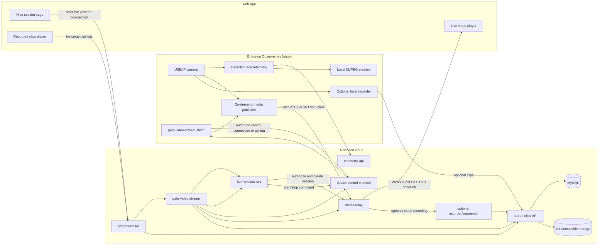

# Потоковое видео летка по запросу

## Контекст

Текущий видеопуть Entrance Observer ориентирован на хранение:

1. `entrance-observer` захватывает кадры с камеры на устройстве Jetson.
2. Edge-приложение создаёт короткие видеофрагменты, включая опциональные оверлеи детекции.
3. Фрагменты загружаются через GraphQL `gate-video-stream`.
4. `gate-video-stream` записывает временные файлы, нормализует MP4/WebM с помощью ffmpeg, сохраняет сегменты в S3-совместимом объектном хранилище и регистрирует потоки/сегменты в MySQL.
5. `web-app` читает `videoStreams` через `graphql-router` и воспроизводит HLS-плейлисты, которые отдаёт `gate-video-stream`.

Это работает для отладки, обучающих данных и исторического воспроизведения, но слишком тяжело как способ по умолчанию смотреть живой леток улья. Тратятся CPU на edge, CPU в облаке, канал загрузки, хранилище S3 и записи в БД даже когда никто не смотрит.

Желаемый пользовательский опыт другой: когда пчеловод открывает конкретный улей/секцию в `web-app`, он должен иметь возможность запустить live-просмотр более высокого качества по запросу. У `web-app` нет доступа к устройству Jetson, и она не должна пытаться обращаться к приватным URL вроде `http://jetson-orin:3030`. Живое видео, управление сессией, аутентификация, обход NAT и опциональная запись должны проходить через развёрнутый в облаке сервис `gate-video-stream`. Постоянная запись, хранение в S3 и кодирование для последующего воспроизведения должны оставаться опциональными.

## Решение

Расширить `gate-video-stream` до единого видеошлюза Gratheon как для сохранённых клипов, так и для live-потоков летка по запросу.

`gate-video-stream` должен владеть:

- пользовательскими GraphQL-операциями для запуска/остановки live-сессий, доступными через `graphql-router`
- каналом управления устройствами для `entrance-observer`
- интеграцией медиареле или встроенными relay-эндпоинтами
- опциональной записью live-сессий в существующую модель хранения S3/HLS
- листингом сохранённых потоков/сегментов для исторического воспроизведения

Режим по умолчанию должен стать ориентированным на телеметрию и лёгким по хранению:

- Непрерывные данные: телеметрия движения пчёл, состояние камеры/устройства и при необходимости превью-снимки с низкой частотой.
- Данные по запросу: качественное live-медиа только пока пользователь активно смотрит секцию улья.
- Опциональные постоянные данные: выбранные live-сессии или клипы аномалий можно записывать в существующую модель хранения `gate-video-stream`.

## Предлагаемая архитектура



`liveApi`, `control`, `relay` и `storedApi` — логические модули. Они могут начать как код внутри существующего репозитория и деплоя `gate-video-stream`. Если нагрузка позже потребует разделения, их можно вынести за той же границей `video.gratheon.com` без изменения продуктового API.

## Жизненный цикл сессии

1. `web-app` отображает страницу улья или короба и знает выбранный `boxId`/секцию.
2. Пользователь нажимает `Watch live` или страница автоматически запускает live-просмотр только после явного намерения пользователя — в зависимости от продуктового решения.
3. `web-app` вызывает GraphQL через `graphql-router`, например `startEntranceLiveStream(boxId, qualityProfile)`.
4. `graphql-router` проверяет аутентификацию и пересылает запрос в `gate-video-stream`.
5. `gate-video-stream` проверяет, что пользователь владеет коробом или имеет к нему доступ, затем создаёт краткоживущую сессию с:
   - `sessionId`
   - `boxId`
   - идентичностью авторизованного пользователя/устройства
   - временем истечения
   - эндпоинтом воспроизведения или данными WebRTC-сигналинга для `web-app`
   - эндпоинтом публикации или учётными данными relay для `entrance-observer`
   - запрошенным профилем качества
   - `recordingMode`: `off`, `manual`, `onDemand` или `event`
6. `entrance-observer` получает запрос сессии через исходящее соединение с `gate-video-stream`. Для MVP это может быть polling, затем WebSocket или MQTT для меньшей задержки.
   - Примечание по MVP: первая версия использует аутентифицированный REST polling из `entrance-observer` в `gate-video-stream` для команд и статуса, с placeholder-эндпоинтами воспроизведения/публикации, выдаваемыми `gate-video-stream`. Реальную публикацию медиа через relay можно подключить позже без изменения продуктовой GraphQL-границы.
7. `entrance-observer` запускает качественный медиа-публикатор только для этой сессии и подключается исходящим соединением к `gate-video-stream` или настроенному relay.
8. `web-app` подключает плеер к эндпоинту воспроизведения, возвращённому `gate-video-stream`.
9. Когда пользователь покидает секцию, закрывает плеер или сессия истекает, `web-app` отправляет `stopEntranceLiveStream(sessionId)` или `gate-video-stream` завершает сессию по таймауту.
10. `gate-video-stream` отправляет `STOP_STREAM` в канал управления устройством и освобождает ресурсы relay.
11. `entrance-observer` прекращает публикацию и возвращается в режим только телеметрии.

## Зачем использовать `gate-video-stream` как шлюз

Использование `gate-video-stream` упрощает архитектуру, потому что:

- `web-app` уже использует границу видеосервиса для воспроизведения видео летка.
- `graphql-router` уже федеративно объединяет GraphQL-поля `gate-video-stream`, такие как `videoStreams`.
- Существующий сервис уже знает модель хранения S3/HLS для исторических клипов.
- Запись live-сессий может переиспользовать те же концепции потока/сегмента вместо дублирования метаданных в другом месте.
- Пользовательские права на видео можно консолидировать в одном бэкенде.
- `web-app` никогда не нужен прямой доступ к устройству, а Jetson нужен только исходящий доступ к одному облачному видеосервису.

Рекомендуемая граница: `web-app` -> `graphql-router` -> `gate-video-stream` для всех видеодействий и `entrance-observer` -> `gate-video-stream` для действий устройства по видео/управлению.

## Рекомендации по транспорту медиа

### Рекомендуемая первая реализация: WebRTC через `gate-video-stream`

WebRTC лучше всего подходит для live-просмотра по инициативе пользователя, потому что обеспечивает:

- Низкую задержку для наведения камеры, диагностики и live-осмотра.
- Нативное воспроизведение в браузере в `web-app`.
- Обход NAT через STUN/TURN без прямого выставления устройств Jetson в интернет.
- Адаптивный битрейт и обработку потери пакетов.
- Опциональные data channels позже для сообщений статуса/управления.

`gate-video-stream` может интегрировать управляемый SFU/relay, запустить self-hosted компонент вроде LiveKit, Janus, mediasoup или использовать relay-модуль на Pion. Важный архитектурный момент: и Jetson, и браузер подключаются исходящим соединением к `gate-video-stream` или к relay-эндпоинтам, выданным `gate-video-stream`.

### Допустимая MVP-альтернатива: uplink RTMP/SRT с downlink HLS/LL-HLS

Если интеграция WebRTC на Jetson слишком сложна для первой полевой итерации, используйте более pipeline-дружественный uplink:

- Jetson публикует H.264/H.265 по SRT или RTMP на эндпоинт, выданный `gate-video-stream`.
- `gate-video-stream` перепаковывает в LL-HLS или HLS для воспроизведения в браузере.
- Задержка выше, чем у WebRTC, но операционная отладка может быть проще с ffmpeg/GStreamer.

Это приемлемо для наблюдения, но менее идеально для интерактивной калибровки камеры.

### Оставить локальный MJPEG только для локального UI устройства

Существующие MJPEG-эндпоинты `/video_feed` и `/video_feed_yolo` полезны для LAN/локальных страниц настройки, но не должны становиться облачным протоколом live-стриминга. MJPEG тяжёлый по полосе, не имеет адаптивного битрейта и не решает обход NAT или облачную авторизацию.

## Профили качества

Качество должно быть привязано к сессии, а не к глобальной настройке загрузки. Примерные профили:

| Профиль | Назначение | Разрешение/FPS | Примечания |
| --- | --- | --- | --- |
| `preview` | Быстрый взгляд на странице улья | 480p, 5-10 FPS | Низкая полоса, можно запускать автоматически после намерения пользователя. |
| `inspect` | Пользователь активно смотрит леток | 720p, 15-30 FPS | Режим live по умолчанию. |
| `diagnostic` | Выравнивание камеры / отладка модели | 1080p или нативное разрешение камеры, 15-30 FPS | Ограничено по времени, может требовать питание от сети и хорошую сеть. |
| `model-debug` | Оверлеи детекций и треков | 720p, 10-15 FPS | Можно стримить оверлей или отдельный канал метаданных. |

Оверлеи детекции предпочтительно отправлять как метаданные или рендерить на edge во вторичный поток только по запросу. Не кодировать оверлеи постоянно во всё видео по умолчанию.

## Режимы записи

Постоянное хранение видео должно стать опцией поверх live-стриминга, а не транспортом по умолчанию.

| Режим | Поведение | Путь хранения |
| --- | --- | --- |
| `off` | Live-поток только ретранслируется и отбрасывается. | Без записей в S3. |
| `manual` | Пользователь нажимает `Record this session`. | `gate-video-stream` записывает с relay или просит edge загрузить выбранный сегмент. |
| `event` | Edge записывает вокруг аномалий или событий с высокой уверенностью. | Существующая загрузка фрагментов остаётся полезной. |
| `sampled` | Небольшие запланированные выборки для оценки модели. | Низкая квота, явный срок хранения. |
| `always` | Непрерывное хранение только для лабораторных/тестовых установок. | Существующий путь S3/HLS, квота контролируется. |

Существующая мутация `uploadGateVideo` и S3-backed HLS-воспроизведение должны остаться для режимов `manual`, `event`, `sampled` и лабораторного `always`.

## Изменения API

### Плоскость управления GraphQL в `gate-video-stream`

Добавить пользовательские GraphQL-операции в `gate-video-stream` и открыть их через `graphql-router`:

```graphql
type EntranceLiveStreamSession {
  id: ID!
  boxId: ID!
  status: EntranceLiveStreamStatus!
  playbackUrl: URL
  signalingToken: String
  expiresAt: DateTime!
  qualityProfile: String!
  recordingMode: String!
}

enum EntranceLiveStreamStatus {
  REQUESTED
  DEVICE_OFFLINE
  STARTING
  ACTIVE
  STOPPING
  STOPPED
  FAILED
}

type Mutation {
  startEntranceLiveStream(boxId: ID!, qualityProfile: String, recordingMode: String): EntranceLiveStreamSession!
  stopEntranceLiveStream(sessionId: ID!): Boolean!
  keepEntranceLiveStreamAlive(sessionId: ID!): EntranceLiveStreamSession!
}

type Query {
  entranceLiveStreamSession(boxId: ID!): EntranceLiveStreamSession
}
```

### API управления устройствами в `gate-video-stream`

`entrance-observer` нужен облачный канал управления к `gate-video-stream`. Предпочтительно постоянное исходящее соединение от устройства к облаку, чтобы полевым роутерам не нужны были входящие правила.

Минимальные команды от `gate-video-stream` к устройству:

- `START_STREAM(sessionId, boxId, qualityProfile, relayCredentials, recordingMode)`
- `STOP_STREAM(sessionId)`
- `UPDATE_QUALITY(sessionId, qualityProfile)`
- `HEALTH_CHECK`

Минимальные сообщения от устройства обратно в `gate-video-stream`:

- `DEVICE_ONLINE(boxId, cameraStatus, appVersion)`
- `STREAM_STARTING(sessionId)`
- `STREAM_ACTIVE(sessionId, fps, bitrate, resolution, encoder)`
- `STREAM_FAILED(sessionId, errorCode, message)`
- `STREAM_STOPPED(sessionId, reason)`

Примечание по текущему MVP-контракту:

- `DEVICE_ONLINE` принимается через тот же эндпоинт `/api/entrance-live/device/event`, что и события жизненного цикла потока.
- Он обновляет присутствие устройства и сохраняет последний payload, но сам по себе не переводит состояние сессии дальше `REQUESTED`.
- Переходы состояния сессии управляются событиями только для `STREAM_STARTING`, `STREAM_ACTIVE`, `STREAM_FAILED` и `STREAM_STOPPED`.

Статус устройства должен включать доступность камеры, текущее состояние публикатора, текущий битрейт/FPS, тип кодировщика, качество сети и последнюю ошибку.

### Внутренние модули `gate-video-stream`

`gate-video-stream` должен добавить логические модули, а не отдельный сервис для первой реализации:

- `liveSessionModel`: строки сессий, TTL, переходы статуса, проверки владения.
- `deviceControl`: исходящие соединения устройств или polling inbox.
- `relayProvider`: выделение эндпоинтов WebRTC/SRT/RTMP и выдача токенов.
- `liveRecorder`: опциональная запись с relay в существующий pipeline сегментов.
- `storedStreams`: текущее поведение потока/сегмента/S3/HLS.

Это сохраняет простоту деплоя и оставляет возможность позже разделить тяжёлые relay-нагрузки.

## Изменения в `web-app`

- Добавить карточку live-камеры в UI секции улья/короба, рядом с существующим воспроизведением потока короба.
- Использовать только API `graphql-router`/`gate-video-stream`. Не вызывать локальные URL Jetson из браузера.
- Показывать статус устройства перед запуском: online/offline, время последней телеметрии, статус камеры.
- Запускать поток только по явному намерению пользователя для MVP.
- Останавливать поток при выгрузке страницы, таймауте скрытой вкладки, смене маршрута и таймауте неактивного плеера.
- Отображать выбор качества и таймер сессии.
- Показывать кнопку `Record` только если план пользователя и устройство разрешают хранение.
- Сохранить существующий плеер сохранённого видео для исторических клипов.

## Изменения в `entrance-observer`

- Оставить телеметрию и локальную детекцию работающими как сейчас.
- Добавить control client `gate-video-stream` для команд потока.
- Добавить pipeline медиа-публикатора отдельно от текущего загрузчика фрагментов.
- Подключаться исходящим соединением к эндпоинту и учётным данным, выданным `gate-video-stream`.
- Использовать аппаратное кодирование где доступно. На Jetson Orin Nano проверить поддержку кодировщика в развёрнутом стеке JetPack/L4T и предпочитать GStreamer pipelines вместо покадрового JPEG-кодирования в Python.
- Сохранить локальный кольцевой буфер для опциональной event/manual записи.
- Сделать `upload_videos_enabled` по умолчанию ориентированным на опциональную/event-driven загрузку, а не на непрерывную загрузку фрагментов по умолчанию.

## Безопасность и конфиденциальность

- Браузер никогда не должен подключаться напрямую к приватному URL устройства вроде `http://jetson-orin:3030` вне режима локальной настройки.
- Все live-сессии должны быть авторизованы для пользователя по владению коробом/ульем в `gate-video-stream`.
- Учётные данные сессии должны быть краткоживущими и ограниченными одним `boxId` и одной сессией потока.
- Устройства должны инициировать только исходящие соединения.
- Запись должна быть явной, с контролем квоты и видимостью для пользователя.
- Политика хранения должна различаться для сессий только live и записанных клипов.

## Наблюдаемость

Отслеживать по сессии в `gate-video-stream`:

- причину старта и действие пользователя
- выбранный профиль качества
- задержку команд устройству
- задержку запуска медиа
- FPS/битрейт/разрешение публикатора
- egress-битрейт relay
- пропущенные кадры / потерю пакетов
- CPU/GPU/температуру устройства, если доступно
- причину остановки
- записанные байты, если есть

Эти метрики должны быть доступны для поддержки и контроля затрат.

## План миграции

1. **Добавить статус устройства в `gate-video-stream`** — позволить `entrance-observer` сообщать online/состояние камеры для `boxId`, а `web-app` читать это через GraphQL.
2. **Добавить API управления сессиями** — создать GraphQL-мутации `gate-video-stream` и device-facing command inbox без изменения текущих загрузок.
3. **Прототип медиапути** — проверить камеру Jetson до браузера через `gate-video-stream` с одним профилем качества. Предпочитать WebRTC, использовать SRT/RTMP плюс HLS только если это ускорит полевую валидацию.
4. **Добавить live-карточку в web-app** — запуск/остановка потока из секции улья и принудительный idle timeout.
5. **Отдельная опция записи** — добавить flow `Record`, который записывает выбранные live-сессии или edge-клипы в существующее хранилище `gate-video-stream`.
6. **Изменить значения по умолчанию** — сделать постоянную загрузку клипов опциональной/event-driven, а не always-on.
7. **Оптимизировать профили качества** — настроить аппаратное кодирование, битрейт, оверлеи и сетевой fallback.
8. **Устареть storage-first live UX** — сохранить сохранённые клипы для истории/обучения, но использовать on-demand поток для live-просмотра.

## Открытые вопросы

- Какую relay-реализацию `gate-video-stream` должен интегрировать первой: managed LiveKit Cloud, self-hosted LiveKit, Janus, mediasoup или custom Pion module?
- Должен ли канал управления устройствами начать с polling для надёжности и простоты, а затем перейти на WebSocket/MQTT?
- Должен ли первый поток включать оверлеи детекции в видео или отправлять детекции как метаданные с таймингом для рендера в `web-app`?
- Какой idle timeout по умолчанию приемлем: 2, 5 или 10 минут?
- Должен ли автоматический старт происходить при открытии секции улья или только после нажатия `Watch live`?
- Какой план/квота должны включать запись и diagnostic mode высокого качества?

## Краткое резюме рекомендации

Строить live-просмотр как on-demand сессии, которыми владеет `gate-video-stream`. `web-app` должна запрашивать и воспроизводить live-потоки только через `graphql-router` и `gate-video-stream`; она не должна обращаться к Jetson напрямую. `entrance-observer` должен сохранять только исходящие соединения управления и медиа к `gate-video-stream`. Текущие S3/HLS-загрузки оставить как путь исторической записи, но не использовать постоянную загрузку как способ по умолчанию смотреть живой леток. Это снижает затраты на полосу и хранение по умолчанию, упрощает продуктовую архитектуру и сохраняет опциональные записи для верификации, поддержки и улучшения модели.
