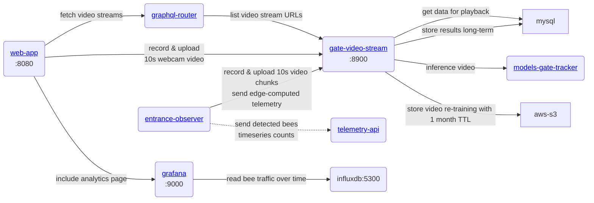

Основной клиентской службой является [beehive-entrance-video-processor](https://github.com/Gratheon/beehive-entrance-video-processor), ее необходимо запустить на периферийном устройстве для захвата и отправки данных на web-app. Нашим главным приоритетом является вывод на периферийном устройстве, но мы также хотим иметь гибридный вывод с поддержкой облака.

Обзор уровня продукта см. в [Entrance Observer](../../about/products/entrance_observer/entrance_observer.md). Собранные метрики подключаются к [хранилищу телеметрии Hive](../../about/products/web_app/pro-tier/hive_telemetry_storage.md) и [аналитике временных рядов](../../about/products/web_app/pro-tier/timeseries_data_analytics.md).
### Обработка, воспроизведение и аналитика видео

Защитная крышка камеры

## Выбор архитектуры обработки

Мы можем подойти к обработке видео с разных ракурсов:

| **Где** | **Плюсы** | **Минусы** |
| ------------------------------------------------------------------------------------------------------------------------------------------------------------------------------------------------------------------------------------------------------------------------------------------------------------------------------------------------------- | -------------------------------------------------------------------------------------------------------------------------------------------------------------------------------------------------------------------------------------------------- | -------------------------------------------------------------------------------------------------------------------------------------------------------------------------------------------------------------------------- |
| Устройство Edge без GPU  raspberry-pi    ex.   [🇨🇿 BeeLogger](https://www.notion.so/BeeLogger-ad269086bf8449faa0aae6754f879181?pvs=21), [BeePi](https://www.notion.so/BeePi-2e3023f492864fa98b2790743c3ba6e4?pvs=21) | - дешево ~ 95 евро за доску | - ограничено простыми числовыми моделями  - может быть ненадежным |
| Edge-устройство с GPU  (jetson nano)    ex.   [🇩🇪Apic.ai](https://www.notion.so/Apic-ai-7859a940fd644a3fa35008fd3a2f1909?pvs=21), [🇦🇺Beemate](https://www.notion.so/Beemate-7f54f62332334254b42e3e584dfae537?pvs=21), [🔬BeeAlarmed. Магистерская диссертация](https://www.notion.so/BeeAlarmed-Masters-thesis-d9c40374718b480ab08a3872f441a2d8?pvs=21) | - эффективный  - низкая зависимость от сети  - может работать в автономном режиме с собственным GPU | ~ стоимость 230 евро за одну плату |
| Гибрид:  - локальная рабочая станция с GPU  - Устройства потокового видео | - общая стоимость ниже | - более высокая первоначальная стоимость устройства  - необходимость выделенного места для рабочей станции |
| Только облако, напр.  [LabelBee](https://www.notion.so/LabelBee-482ad7f33192487caae38697b21b7f5d?pvs=21) |                                                                                                                                                                                                                                                                                     | - требуется высокая пропускная способность сети  - необходимо оптимизировать переменную пропускную способность сети  - дорого  - стоимость потоковой передачи и обработки видео  - стоимость хранения видео |
| Специализированные [устройства на печатной плате](https://jlcpcb.com/) | - энергоэффективность  - низкая себестоимость | - обычно мало оперативной памяти, GPU  - высокая стоимость разработки |
| На мобильном телефоне | - цена контролируется клиентом  - имеет встроенную сеть  - имеет камеру  - имеет экран  - имеет аккумулятор и управление питанием  - нет блокировки от производителя  - проще всего начать работу  - легко настроить пчеловоду  - автоматическое перераспределение приложений | - большое разнообразие телефонов, непостоянный опыт  - для обработки на телефоне, проблемы с GPU, необходимо использовать специальный мобильный TensorFlow  - слишком высокий уровень (в браузере), сложно обрабатывать исключения и может потребоваться вмешательство пользователя |