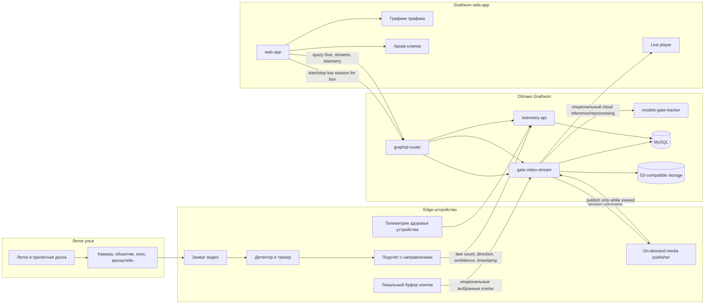

Entrance Observer — это edge-компонент компьютерного зрения, который наблюдает за летком улья, распознаёт движение пчёл и отправляет в веб-платформу Gratheon телеметрию пчелиного трафика, а при необходимости — видеодоказательства.

Живой просмотр должен запускаться **по запросу** из `web-app`, когда пользователь открывает или начинает смотреть конкретную секцию улья. У `web-app` нет прямого доступа к edge-устройству, поэтому live-сессии должны запускаться и воспроизводиться через `gate-video-stream` и `graphql-router`. Постоянная загрузка видео и S3-воспроизведение остаются опциональными режимами записи, а не стандартным способом смотреть леток в реальном времени. Целевая архитектура описана в [On-demand entrance video streaming](On-demand%20entrance%20video%20streaming.md).

Продуктовый обзор см. в [Entrance Observer](../../products/entrance_observer/entrance_observer.md). Собранные метрики связаны с [хранилищем телеметрии ульев](../../products/web_app/pro-tier/hive-telemetry-storage.md) и [аналитикой временных рядов](../../products/web_app/pro-tier/timeseries-data-analytics.md).

## Направление продукта

Entrance Observer должен развиваться через три понятные аппаратные фазы. Документация теперь сгруппирована сначала по фазам, потому что каждой фазе нужны и описание продукта, и отдельный bill of materials:

1. **[Фаза 1 — лабораторная валидация](phase-1-lab-validation/)** — доказать работу камеры, модели, телеметрии и управления live-сессиями на стенде разработчика.
2. **[Фаза 2 — полевой MVP](phase-2-field-mvp/)** — поставить защищённое пилотное устройство на настоящий леток и измерить надёжность, качество подсчёта, энергопотребление и пропускную способность.
3. **[Фаза 3 — production kit](phase-3-production-kit/)** — превратить проверенный дизайн в повторяемое, поддерживаемое и продаваемое устройство или набор SKU.

Такое разделение помогает быстро отлаживать первую сборку и одновременно показывает путь к законченному продукту Gratheon. Текущая прототипная платформа — **NVIDIA Jetson Orin Nano Super Developer Kit** с USB UVC-камерой. Jetson локально запускает [`entrance-observer`](https://github.com/Gratheon/entrance-observer), чтобы пасеке не нужно было постоянно стримить сырое видео в облако.

## Обзор фаз

| Фаза | Цель | Основной пользователь | Целевая стоимость | Описание продукта | BOM |
| --- | --- | --- | ---: | --- | --- |
| Фаза 1 — лаборатория | Быстрый стендовый прототип для камеры, модели, телеметрии и live-сессий | Разработчик, ML-инженер, contributor | €550-650 с текущим Jetson-стеком | [Описание продукта](phase-1-lab-validation/product-description.md) | [Bill of materials](phase-1-lab-validation/bill-of-materials.md) |
| Фаза 2 — Field MVP | Защищённое пилотное устройство для одного реального летка | Пилотный пчеловод, полевой тестировщик, support-инженер | €650-1000+ в зависимости от корпуса, питания и сети | [Описание продукта](phase-2-field-mvp/product-description.md) | [Bill of materials](phase-2-field-mvp/bill-of-materials.md) |
| Фаза 3 — Production | Повторяемый camera/edge-AI kit или семейство SKU | Платящий клиент, реселлер, managed-apiary, support-команда | Выбирается по полевым данным | [Описание продукта](phase-3-production-kit/product-description.md) | [Bill of materials](phase-3-production-kit/bill-of-materials.md) |

## Модель подключения системы

Аппаратную часть нужно описывать как связанные подсистемы, а не как случайный список деталей. Так явно видны границы камеры, питания, сети, сервиса и облака.

## Оценка текущего подхода

| Область | Текущее состояние | Пробел | Рекомендуемое изменение |
| --- | --- | --- | --- |
| Группировка документации | Раньше был один prototype BOM и отдельная страница будущих альтернатив. | Читатель должен был угадывать, какие детали относятся к лаборатории, полевому MVP или production. | Использовать phase-first структуру: в каждой фазе есть описание продукта и BOM. |
| Edge compute | Текущий reference — Jetson Orin Nano Super Developer Kit. | Хорош для итераций модели, но дорогой и энергоёмкий для солнечного customer-unit. | Оставить Jetson для Фазы 1 и ранней Фазы 2. До production сравнить Raspberry Pi 5 + Hailo и RK3588. |
| Камера | USB UVC 4K-камера с ручным варифокальным объективом. | Удобна для отладки, но это не повторяемая уличная camera head. | В лаборатории оставить USB; для поля заморозить FOV и тестировать CSI/MIPI, industrial board cameras или IP/H.265-модули. |
| Видеопродукт | Концептуально есть сохранённые клипы и on-demand live video. | Непрерывная загрузка тратит bandwidth, storage, edge CPU и cloud CPU. | По умолчанию telemetry-first, live video по запросу, clip storage — выборочно. |
| Корпус | Алюминиевый профиль, акриловые листы, кронштейн и dev-case — прототипные материалы. | Не weatherproof, не оптимизировано для UV/конденсата и плохо обслуживается. | Для Field MVP перейти к IP65/IP67-корпусу, герметичным вводам, hood/window strategy и фиксированному кронштейну. |
| Питание | Текущий BOM описывает compute/camera, но не измеренную энергию. | Solar feasibility нельзя решить без Wh/day, sleep modes и duty cycle модема. | Уже в Фазе 1 добавить power meters; в Фазе 2 — PoE/mains pilots; solar — только после измерений. |
| Сеть | WiFi-модуль задокументирован. | На пасеках часто слабый WiFi или нет интернета. | В Фазе 2 тестировать Ethernet/PoE и WiFi; для Фазы 3 определить LTE/gateway варианты. |
| Поддержка | SSH, `jtop`, Docker logs и GStreamer полезны разработчикам. | Customer support нужен device health без SSH. | Загружать health-поля: FPS, camera online, disk free, queue size, temperature, RSSI, app/model version, reset reason. |
| Стоимость | Прототип стоит примерно €550-650 до полевых деталей. | Production cost неизвестен и может определяться корпусом, питанием и service parts, а не только compute. | Вести BOM по фазам и выбирать production SKU после полевых данных. |

## Сводка компонентного анализа

Подробный анализ находится в [Component analysis and alternatives](Component%20analysis%20and%20alternatives.md). Кратко:

| Подсистема | Текущий выбор | Лучшее следующее действие |
| --- | --- | --- |
| Compute | Jetson Orin Nano Super Developer Kit | Оставить как reference, но benchmark Raspberry Pi 5 + Hailo AI HAT+ 26 TOPS и RK3588 на точном bee detector/tracker. |
| Камера | MOKOSE USB UVC camera | Оставить для лаборатории. Для поля заморозить FOV и оценить locked camera head с лучшей weather/cable/exposure стратегией. |
| Объектив | Manual varifocal CS/C lens | Использовать для поиска FOV, затем заменить или зафиксировать production lens. |
| Storage | Consumer NVMe SSD | Хорош для лаборатории. Production должен использовать industrial storage под retention policy. |
| Видео | Edge clips плюс planned live streaming | Для сессий использовать `gate-video-stream`; хранение клипов оставить опциональным. Избегать постоянной загрузки видео. |
| Корпус | 2020 extrusion и acrylic | Хорошие fixture-материалы, но не field product. Перейти к IP-rated box и optical hood/window. |
| Питание | Bench power не полностью описан | Сразу добавить измерения питания; позже разделить powered/PoE и solar SKU. |

## Поток данных

1. **Capture** — `entrance-observer` читает кадры с камеры на edge-устройстве.
2. **Infer and track** — edge-приложение обнаруживает пчёл возле летка, отслеживает движение через настроенные зоны и вычисляет directional counts.
3. **Aggregate** — raw detections превращаются в telemetry buckets: entrances, exits, unknown direction, confidence и health metadata.
4. **Upload metrics** — edge-устройство отправляет movement telemetry в [`telemetry-api`](../API/rest/telemetry-api.md) через device REST API.
5. **Start live stream on demand** — когда пчеловод открывает секцию улья и просит live video, `web-app` запускает короткую сессию через `gate-video-stream`. Edge-устройство публикует видео только пока сессия активна.
6. **Record clips when useful** — edge app или recorder в `gate-video-stream` могут сохранять выбранные клипы для playback, debugging и model retraining.
7. **Read in web-app** — Gratheon web-app использует [`graphql-router`](../API/GraphQL.md) для user-facing queries и строит time-series charts из telemetry data.
8. **Improve model** — выбранные клипы используются для проверки detections, retraining модели и сравнения cloud inference с edge inference.

## Ответственность API

| Компонент | Интерфейс | Ответственность |
| --- | --- | --- |
| `entrance-observer` | Local camera, REST/control clients | Захват кадров, detector/tracker, агрегирование метрик, local buffering и публикация live media только во время сессии. |
| `telemetry-api` | Device REST API | Приём movement telemetry и health metrics от устройств. |
| `gate-video-stream` | GraphQL/device control/media | Stored clips, live session control, media relay, optional recording. |
| `graphql-router` | User-facing GraphQL boundary | Авторизация/маршрутизация запросов `web-app` к telemetry и video services. |
| `web-app` | UI | Start/stop live sessions, charts, device status, archived clips. |

## Связанные страницы

- [Фаза 1 — лабораторная валидация](phase-1-lab-validation/)
- [Фаза 2 — полевой MVP](phase-2-field-mvp/)
- [Фаза 3 — production kit](phase-3-production-kit/)
- [Component analysis and alternatives](Component%20analysis%20and%20alternatives.md)
- [On-demand entrance video streaming](On-demand%20entrance%20video%20streaming.md)
- [Future production hardware alternatives](Future%20production%20hardware%20alternatives.md)
- [Jetson Orin setup](Jetson%20Orin%20setup.md)
- [Архив legacy research](legacy-research/ML%20processing%20devices.md)
