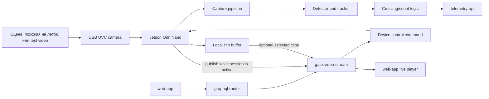

## Цель

Лабораторная фаза — контролируемая среда разработки для vision, telemetry и video-session software. Её должно быть легко собрать, легко диагностировать через SSH/GStreamer/OpenCV, и она должна быть достаточно мощной, чтобы улучшать качество модели без ранней аппаратной оптимизации.

В этой фазе нужно проверить:

- захват USB-camera в Linux;
- поведение bee detector и tracker на записанных и live clips;
- direction-aware counting через настроенные entrance regions;
- загрузку телеметрии в Gratheon;
- start/stop on-demand video sessions через `gate-video-stream`;
- local buffering и retry behavior при нестабильной сети;
- baseline data для будущих cost-down и solar решений.

## Functionality

- Локально запускает `entrance-observer` на Jetson Orin Nano Super Developer Kit.
- Захватывает видео с USB UVC camera с ручным varifocal lens.
- Обрабатывает benchmark profiles, например 640x480@30 FPS и 1280x720@15 FPS.
- Производит movement buckets: bees in, bees out, unknown direction, confidence, FPS и device health.
- Загружает telemetry continuously или короткими batches.
- Запускает live video только после запроса `web-app` к `gate-video-stream`.
- Хранит selected clips локально для debugging и model improvement.

## Лабораторная архитектура

## Component assessment

| Подсистема | Текущий компонент | Лабораторная оценка | Главный риск | Альтернатива для оценки позже |
| --- | --- | --- | --- | --- |
| Edge compute | NVIDIA Jetson Orin Nano Super Developer Kit, 8 GB | Лучший reference для model iteration, TensorRT, CUDA, Docker и debugging. | Высокие power/cost могут скрыть production constraints; Orin Nano не лучший video-encoding platform, потому что lacks NVENC. | Raspberry Pi 5 + Hailo AI HAT+ 26 TOPS; RK3588 как media-heavy alternative. |
| Camera | MOKOSE 4K USB UVC camera | Хороша для lab: UVC работает с Linux tools и быстро меняется. | Generic USB camera может иметь нестабильную exposure, rolling-shutter artifacts и bulky cabling. | CSI/MIPI camera или IP/smart camera with onboard H.265. |
| Lens | Manual varifocal CS/C lens | Полезен пока неизвестен required field of view. | Focus/zoom может сбиться; длинный focal length может быть слишком узким. | Fixed-focus locked lens после измерений geometry. |
| Storage | 250 GB NVMe SSD | Хорош для OS, Docker images, logs, clip buffers, test datasets. | Большой storage может маскировать плохую upload policy. | Smaller industrial microSD/eMMC или industrial NVMe для video-heavy SKU. |
| Network | M.2 WiFi module and antennas | Хорош для bench и indoor apiary WiFi tests. | На пасеках слабый WiFi, важна antenna placement. | Ethernet/PoE для fixed pilot sites; LTE router/gateway для remote sites. |
| Mechanical | 2020 aluminium extrusion, acrylic sheets, camera mount | Быстро менять fixture и camera alignment. | Не weatherproof, не UV/condensation optimized, не repeatable field installation. | IP65/IP67 enclosure, sealed optical window, sun shield, drain path, fixed bracket. |
| Display | 7 inch HDMI touchscreen | Полезен при первичной настройке. | Добавляет cost, power, openings и breakage risk. | Удалить из field builds; использовать web setup, SSH, logs или service laptop. |

## Почему Jetson остаётся в Phase 1

Jetson Orin Nano не обязательно финальный ответ, но это правильный reference board для ранней model work:

- Ultralytics/PyTorch workflows можно запускать до conversion на маленький accelerator.
- TensorRT даёт realistic high-performance edge baseline.
- Docker и JetPack дают familiar deployment target.
- GPU headroom позволяет одновременно тестировать detector, tracker, overlays, telemetry и local preview.

При этом лабораторная фаза обязана записывать power и FPS. Без measured FPS/W и count accuracy/W выбор будущего hardware будет маркетинговым, а не продуктовым решением.

## Lab benchmark plan

| Benchmark | How to run | Why it matters | Exit target |
| --- | --- | --- | --- |
| Detector + tracker FPS | Один и тот же labelled clip set, overlays off, telemetry on. | Generic TOPS не включает tracking/counting overhead. | Stable 15 FPS at 720p или 30 FPS at 640x480 на Jetson reference. |
| Count accuracy | Сравнить `bees_in`/`bees_out` с manually labelled clips. | Product value — count quality, не raw model FPS. | Direction error и false counts задокументированы по клипам. |
| FPS/W | Измерить wall power при обработке fixed clips. | Solar sizing зависит от watts. | Baseline exists before cost-down hardware. |
| Video session behavior | Start/stop live sessions через `gate-video-stream`. | Live view не должен требовать direct LAN access to Jetson. | Device returns to telemetry-only after session expiry. |
| Clip policy | Прогнать movement/no-movement video. | Предотвращает storage/bandwidth waste. | No permanent upload when nobody watches and no event is selected. |
| Thermal stability | 4-8 часов в enclosure-like location. | Outdoor pilot будет теплее стола. | No thermal throttling changing count output. |

## Software and API boundaries

| Компонент | Ответственность в lab |
| --- | --- |
| `entrance-observer` | Capture frames, detector/tracker, aggregate metrics, buffer clips, publish live media only during session. |
| `telemetry-api` | Приём movement telemetry и health metrics от device API. |
| `gate-video-stream` | Stored clips и live session control; отдаёт playback/publisher endpoints вместо прямого доступа к устройству. |
| `graphql-router` | User-facing GraphQL requests from `web-app`. |
| `web-app` | Start/stop live sessions, movement charts and clips. |

## Recommended lab operating modes

| Mode | Camera | AI | Video upload | Use |
| --- | --- | --- | --- | --- |
| Model debug | On | Full | Optional local clips | Improve detector/tracker quality. |
| Telemetry demo | On | Full | Off unless event selected | Show bee traffic charts without wasting storage. |
| Live session test | On | Full | Publish only while viewed | Validate `gate-video-stream` control path. |
| Dataset capture | On | Optional | Store local clips | Build labelled training/evaluation set. |
| Night/off-hours | Off or scheduled | Off | Off | Validate sleep and restart behavior. |

## Exit criteria

- Camera capture повторяется после reboot.
- `entrance-observer` обрабатывает fixed test set и выдаёт reproducible count metrics.
- Telemetry reaches Gratheon with stable device and hive identity.
- On-demand live viewing controlled through `gate-video-stream`, not direct browser-to-Jetson URL.
- Есть хотя бы один labelled benchmark set для сравнения Jetson, Hailo, RK3588 и future smart-camera options.
- Power, FPS, temperature и bandwidth recorded for current prototype.

## Bill of materials

Подробный список деталей находится в [Phase 1 - Lab BOM](bill-of-materials.md). Core parts: Jetson Orin Nano, USB UVC camera, varifocal lens, NVMe SSD, WiFi or Ethernet, bench power и temporary camera fixture.
