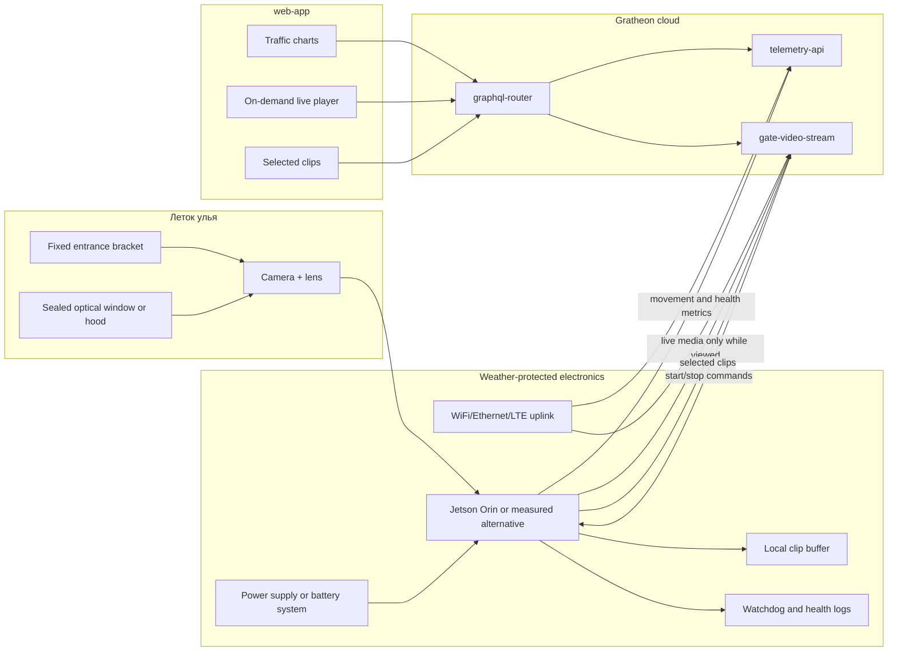

## Цель

Field MVP — первый полезный outdoor Entrance Observer. Он должен ответить на один вопрос: может ли пчеловод поставить камеру на настоящий леток и получать trustworthy bee-traffic telemetry без continuous video upload и direct device access?

Эта фаза должна сохранять Jetson reference platform, если measured cost-down prototype ещё не достиг accuracy и live-session targets. Главная новая работа — не дополнительный AI headroom, а weatherproof installation, power, network resilience, serviceability и repeatable camera geometry.

## Functionality

- Detects and tracks bees at one hive entrance.
- Produces direction-aware counts: `beesIn`, `beesOut`, unknown direction, confidence и count interval.
- Reports camera/device health: FPS, temperature, disk free space, network signal, app version, uptime и last error.
- Uploads telemetry continuously или short batches при слабой connectivity.
- Publishes live video only while authorized `gate-video-stream` session is active.
- Stores selected event clips locally and uploads only sampled/anomaly/manual clips.
- Survives rain-protected outdoor operation, temperature swings, insects, dust and beekeeper handling.

## Field MVP architecture

## Field operating modes

| Mode | Camera | AI | Network | Video | When used |
| --- | --- | --- | --- | --- | --- |
| Traffic telemetry | On during daylight | On | Periodic upload | Off | Default daily monitoring. |
| On-demand live | On | On | Active session | Relay through `gate-video-stream` | User actively watches a hive. |
| Event clip | On | On | Deferred upload allowed | Short selected clip | Anomaly, model QA sample, or manual recording. |
| Low-bandwidth field | On or lower FPS | On at reduced profile | Batched | No default video | Weak WiFi/LTE or metered data. |
| Night sleep | Off or low-power | Off | Heartbeat only if needed | Off | Darkness or no useful visual activity. |
| Service | On | Optional | Local web/SSH plus cloud | Optional | Camera alignment and maintenance visit. |

## Component assessment for outdoor MVP

| Subsystem | Keep from lab? | MVP requirement | Better field alternative |
| --- | --- | --- | --- |
| Compute | Keep Jetson if no benchmark alternative is ready. | Must be mounted with airflow, watchdog, stable power and remote logs. | Raspberry Pi 5 + Hailo AI HAT+ side-by-side if model converts and reaches target. |
| Camera | Keep USB UVC only if cable/exposure stable outdoors. | Locked focus, fixed angle, stable exposure and serviceable cable path. | CSI/MIPI camera or IP camera with onboard H.265. |
| Lens | Keep varifocal for pilot discovery. | Final pilot units should document and lock lens settings per entrance geometry. | Fixed-focus lens once FOV is known. |
| Optical cover | Do not use loose acrylic sheets as final field window. | Glare control, scratch tolerance, water shedding and cleaning access. | AR-coated acrylic/polycarbonate window, hood, tilted window or shaded opening. |
| Enclosure | Replace lab fixture. | IP65/IP67 box, cable glands, drain path, desiccant only as backup, UV-resistant materials. | Branded electrical enclosure with gasket, sealed connectors and sun shield. |
| Power | Bench USB-C is not enough. | Stable supply under camera + SSD + WiFi peaks; measure Wh/day for battery. | PoE for fixed sites; solar/battery after measured duty-cycle reduction. |
| Network | WiFi acceptable for pilot sites. | Antenna placement must work through enclosure; upload retries required. | Ethernet/PoE for stationary apiaries; LTE router/gateway for remote pilot. |
| Storage | Keep NVMe for buffering. | Retention policy must delete oldest clips and protect logs from filling disk. | Industrial storage for field units. |
| Local display | Remove. | Field setup should not depend on permanently installed screen. | Service laptop, phone setup page or LED/status button. |

## Camera and mechanical placement

Установка камеры важна не меньше модели. Пчёлы двигаются быстро, освещение меняется резко, а небольшой сдвиг камеры может изменить count behavior.

| Design choice | Recommendation | Why |
| --- | --- | --- |
| View geometry | Mount camera so entrance plane and crossing line remain visible across full landing board. | Count direction depends on stable crossing regions. |
| Height and angle | Record height, distance, angle, lens setting and sample frame in device notes. | Allows another unit to reproduce same FOV. |
| Focus | Lock focus after setup. | Focus drift looks like model regression. |
| Exposure | Prefer manual or constrained auto-exposure after dawn/noon/cloud tests. | Auto-exposure hunting causes missed detections. |
| Window | Tilt or hood window to reduce rain, glare and internal reflection. | Flat shiny window can ruin daytime images. |
| Cable routing | Use drip loops and strain relief before every gland/connector. | Prevents water ingress and cable pull damage. |

## Power strategy

Do not promise solar autonomy in MVP until real platform energy budget is measured. Jetson-class device with camera, AI, SSD and WiFi can require a large panel and battery if it stays active all day.

| Power option | Best use | Notes |
| --- | --- | --- |
| Mains adapter in sealed box | Lab-adjacent pilot or apiary with power | Simplest stable pilot power; must be safe outdoors. |
| PoE splitter or PoE-capable carrier | Fixed installation near Ethernet | Best MVP path when Ethernet is available. |
| Battery-only | Short pilot tests | Useful for measuring Wh/day, not production promise. |
| Solar + battery | Later MVP after duty cycle is known | Requires active watts, sleep watts, sunless-day target and safe charging design. |
| LTE router with own power | Remote pilot | Easy to deploy but raises energy and data costs. |

## Telemetry payload scope

| Metric group | Fields | Use |
| --- | --- | --- |
| Bee movement | `beesIn`, `beesOut`, `unknownDirection`, `netFlow`, `countIntervalSeconds`, `confidence` | Product value and alerts. |
| Vision health | `fps`, `frameWidth`, `frameHeight`, `cameraOnline`, `droppedFrames`, `exposureProfile` | Explains trustworthiness of counts. |
| Device health | `deviceTemperature`, `diskFreeBytes`, `uptimeSeconds`, `appVersion`, `modelVersion`, `lastError` | Support and remote diagnostics. |
| Network health | `rssi`, `uploadLatencyMs`, `queuedTelemetryCount`, `queuedClipCount` | Explains missing or delayed data. |
| Power health | `inputVoltage`, `batteryVoltage`, `batteryPercent` where available | Required before solar/battery claims. |

## Field acceptance tests

- 24-72 hour continuous outdoor run with telemetry and local logs.
- Rain or hose-splash test appropriate to claimed MVP enclosure, without overclaiming IP rating.
- Dawn/noon/evening lighting test with sample clips and count review.
- Temporary network outage test proving telemetry queueing and clip-retention limits.
- Power-cycle test proving app restarts, camera reconnects and device presence returns.
- Live-session test from `web-app` through `graphql-router` and `gate-video-stream` without direct device URL.
- Manual service test: beekeeper/technician can clean window and verify alignment without unnecessarily opening electronics.

## Exit criteria

- Real hive pilot produces useful bee-traffic trends for multiple days.
- Stored video is selective, not continuous by default.
- On-demand live view starts/stops reliably through cloud video gateway.
- Enclosure, window, cable entries and mount survive realistic outdoor handling.
- Team has measured energy, bandwidth, FPS, temperature and count accuracy for pilot hardware.
- Pilot produces enough data to decide whether to continue with Jetson, switch to Pi + Hailo or test another platform.

## Bill of materials

Подробный список находится в [Phase 2 - Field MVP BOM](bill-of-materials.md). Он добавляет к lab compute/camera stack настоящий enclosure, stable power, cable glands/connectors, mounting hardware, power measurement и service consumables.
