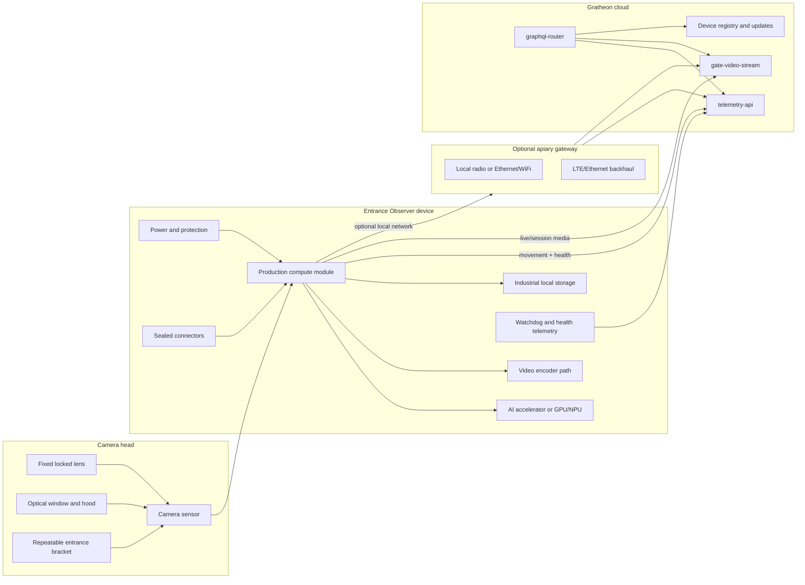

## Цель

Production phase переводит Entrance Observer из field prototype в повторяемый Gratheon kit. Финальный product должен выбираться по measured model, energy, video and field data, а не по удобству Jetson developer kit.

Production product must be:

- accurate enough for beekeeper decisions;
- power-aware enough for target installation mode;
- weatherproof and serviceable;
- secure and remotely supportable;
- manufacturable from stable suppliers;
- integrated with Gratheon telemetry, video and device-management flows.

## Recommended product strategy

Не стоит заставлять один hardware SKU решать все пасеки. Entrance video имеет разные ограничения в urban powered apiary и remote solar apiary.

| SKU | Target site | Video behavior | Connectivity | Likely compute direction | Product promise |
| --- | --- | --- | --- | --- | --- |
| Urban WiFi/video | Apiary with mains/PoE and good internet | On-demand live plus selected clips | Ethernet, PoE or WiFi | Jetson production SOM, Raspberry Pi + Hailo or RK3588 | Best live inspection and model QA. |
| Field telemetry-first | Remote apiary with limited power/data | Movement telemetry by default, rare low-res clips | LTE gateway, local gateway or store-and-forward | Pi + Hailo, RK3588 or smart camera only if energy fits | Bee traffic trends with low bandwidth. |
| Research/dev kit | Gratheon team and advanced contributors | Flexible recording and overlays | Lab network | Jetson Orin Nano dev kit | Dataset and model development, not customer default. |

## Production architecture

## Production component recommendations

| Subsystem | Recommended direction | Why | Defer or avoid |
| --- | --- | --- | --- |
| Compute | Benchmark Jetson reference against Raspberry Pi 5 + Hailo AI HAT+ 26 TOPS and one RK3588 board. Choose by count accuracy per watt and serviceability. | TOPS alone is not product metric; device must run camera, AI, tracking, encode, upload and watchdog together. | Do not select production board only because it is cheaper or has higher advertised TOPS. |
| AI runtime | Keep model export paths for TensorRT, HailoRT and one secondary NPU path. | Avoid locking dataset/model work to one vendor too early. | Avoid vendor-only smart-camera AI until model quality stable. |
| Camera | Move from generic USB camera to locked, documented camera head. | Production install needs repeatable FOV, focus, exposure and cable retention. | Avoid manual varifocal lenses on customer units unless physically locked/documented. |
| Sensor shutter | Prefer camera with low motion blur; test global shutter if rolling shutter causes count errors. | Bees move fast near entrance. | Do not overpay for global shutter until side-by-side clips show benefit. |
| Video encode | Prefer platform/camera pipeline with efficient H.264/H.265 encode. | Live sessions and clips should not starve AI or burn solar energy. | Avoid software H.265 on low-power CPUs for field SKU. |
| Storage | Use industrial-rated storage sized to retention policy. | Customer device should survive power cycles/temperature. | Avoid storing continuous video by default. |
| Enclosure | UV-resistant IP65/IP67 enclosure or camera-head + electronics-box assembly. | Weather failures become support failures. | Avoid acrylic hobby cases and ad-hoc frames for customer kits. |
| Connectors | Sealed connectors or rated glands with documented pinouts. | Cameras, power, antennas and optional sensors must be serviceable. | Avoid soldered field cables that cannot be replaced. |
| Power | Split powered/PoE SKU from solar SKU. | Product promise and BOM differ. | Do not claim solar autonomy without Wh/day and sunless-day validation. |
| Connectivity | Ethernet/PoE or WiFi for powered SKU; gateway/LTE for remote SKU. | Remote apiaries need deliberate data/power model. | Avoid cellular in every unit until costs and power proven. |

## Compute selection matrix

| Candidate | Strength | Weakness | Best production fit | Decision gate |
| --- | --- | --- | --- | --- |
| Jetson Orin Nano production module/carrier | Best ML ecosystem and TensorRT path. | Higher cost/power; Orin Nano lacks NVENC. | Premium/dev or powered video SKU. | Beats alternatives on accuracy or velocity enough to justify watts/cost. |
| Raspberry Pi 5 + Hailo AI HAT+ 26 TOPS | Good cost/power candidate with strong community and camera ecosystem. | Requires Hailo model conversion and tracker CPU benchmark. | Near-term production candidate for WiFi/PoE SKU. | Same count quality as Jetson with at least 2x better FPS/W or lower total cost. |
| Raspberry Pi 5 + Hailo AI HAT+ 13 TOPS | Lower cost than 26 TOPS. | Less headroom for tracker/future models. | Cost-down after 26 TOPS proven. | Meets target FPS/accuracy with thermal margin. |
| RK3588 board | Integrated NPU and often strong media codecs. | Vendor support, RKNN tooling and OS maintenance vary. | Alternative if video encode is central or Hailo conversion fails. | Stable full pipeline with lower energy/cost than Jetson. |
| Coral TPU | Very low power for supported models. | Current YOLO-style detector may need redesign. | Telemetry-only or simplified detector experiments. | Simplified model reaches count target. |
| Smart camera / vision module | Integrated sensor, encoder and sometimes AI. | Vendor lock-in, less control, supply risk. | Long-term solar field SKU research. | Vendor pipeline exposes frames/metadata/control needed by Gratheon. |

## Camera-head production requirements

| Requirement | Implementation rule |
| --- | --- |
| Repeatable FOV | Define entrance width coverage, working distance, angle and target pixel density. |
| Locked optics | Use fixed-focus or physically locked lens settings. |
| Lighting robustness | Test dawn, noon, shade, clouds, rain and backlight. Add hood or constrained exposure profile. |
| Clean optical path | Window must be cleanable, tilted/hooded and resistant to scratches/condensation. |
| Service replacement | Camera cable/head should be replaceable without rebuilding whole device. |
| Model metadata | Store camera model, lens, FOV profile and calibration image in device metadata. |

## Power and solar decision rules

Production must define installation mode before sizing power.

| Installation mode | Power design | Acceptance rule |
| --- | --- | --- |
| PoE powered | PoE splitter or board with Ethernet data and regulated power. | Runs full daytime profile and live sessions without brownouts. |
| Mains powered | Outdoor-safe supply and protected low-voltage DC into enclosure. | Safe installation, no exposed mains in hobby enclosure. |
| Solar telemetry-first | Battery from measured Wh/day, panel for worst season, aggressive sleep and low-video policy. | Survives target sunless days and reports low battery before failure. |
| Gateway remote | Hive nodes/device connect to one powered gateway with LTE/Ethernet. | Per-hive unit does not need modem unless economics support it. |

## Production telemetry and support checklist

| Field | Required | Why |
| --- | --- | --- |
| `beesIn`, `beesOut`, `unknownDirection`, `netFlow` | Yes | Core product value. |
| `confidence`, `countIntervalSeconds`, `modelVersion` | Yes | Explains data quality and model changes. |
| `fps`, `droppedFrames`, `cameraOnline` | Yes | Detects camera/processing failures. |
| `deviceTemperature`, `uptimeSeconds`, `resetReason` | Yes | Support and reliability diagnostics. |
| `diskFreeBytes`, `queuedTelemetryCount`, `queuedClipCount` | Yes | Prevents silent storage/upload failures. |
| `rssi`, `uploadLatencyMs`, `networkType` | Yes | Explains missing data and weak connectivity. |
| `inputVoltage`, `batteryVoltage`, `batteryPercent` | Required for battery/solar SKUs | Low-power alerting and warranty support. |
| `hardwareRevision`, `cameraProfileId`, `firmwareVersion` | Yes | Links field behavior to exact build. |

## Production quality gates

- Two or more identical units produce comparable counts on same labelled clip set.
- Outdoor enclosure passes rain, UV, condensation, heat and cable-pull tests appropriate to claimed rating.
- Live session starts, stops, expires and recovers without manual SSH.
- Device can be paired to Gratheon hive/box through web app without manual DB edits.
- Firmware update and rollback plan exists before customer sale.
- Critical parts have at least two suppliers or approved substitute.
- Production test fixture validates camera, AI, network, storage, power, LEDs/buttons and cloud registration.

## Exit criteria

- Production candidate selected using measured count accuracy, FPS/W, bandwidth, thermal stability, cost and support complexity.
- Camera head geometry frozen and documented.
- Power SKU boundaries explicit: powered/PoE, field telemetry-first and research/dev kit.
- BOM includes enclosure, connectors, labels, packaging, service tools and QA fixtures, not only compute/camera.
- Gratheon support can identify device state remotely without asking beekeeper to SSH into unit.

## Bill of materials

Подробный список находится в [Phase 3 - Production BOM](bill-of-materials.md). Он включает production compute candidates, camera-head choices, enclosure/connectors, power variants, networking, factory test tools and sourcing rules.
