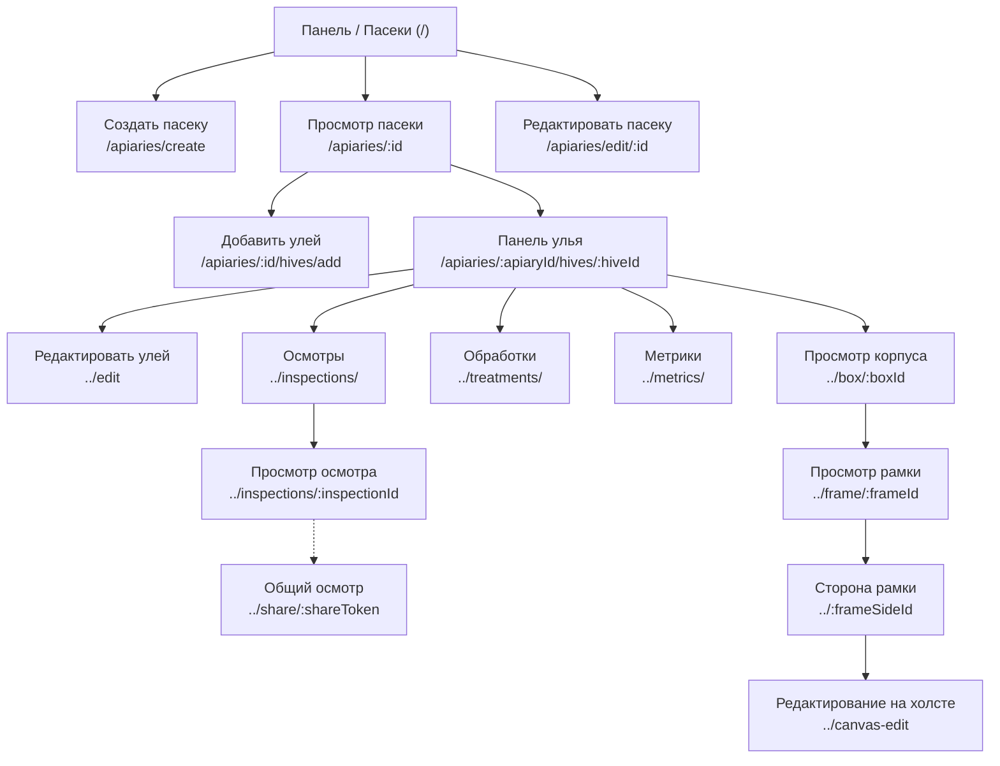
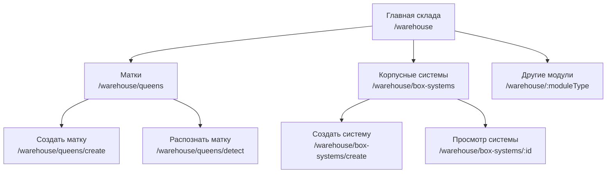
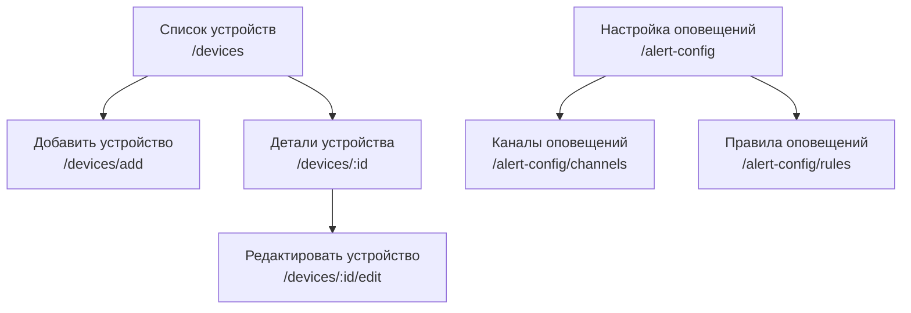
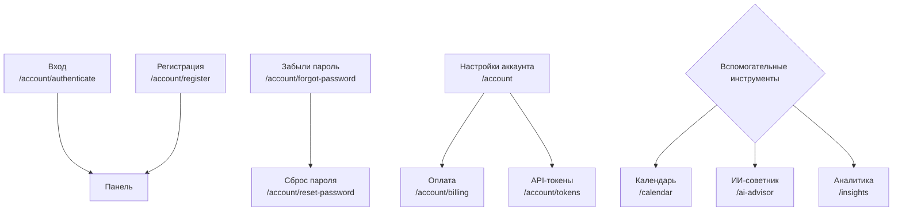

# Пользовательские пути и навигация в приложении

Эти диаграммы описывают типичные пользовательские сценарии и связи между страницами веб-приложения. Поскольку приложение охватывает несколько доменов, потоки разделены по тематическим областям.

## Основной пчеловодческий поток (пасеки и ульи)
Основной путь пользователя: список пасек, переход к отдельной пасеке, ульям и далее к корпусам и рамкам.

## Склад и инвентарь
Навигация для управления активами: матки, корпусные системы и другие модули.

## IoT-устройства и оповещения
Потоки, связанные с управлением оборудованием и настройкой оповещений.

## Настройки и онбординг
Аутентификация, управление аккаунтом и вспомогательные функции.

