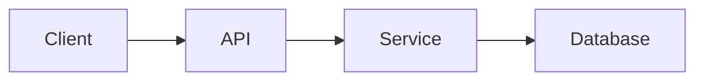

# [Название функции] — Техническая документация

### 🎯 Обзор
Краткое техническое описание того, что делает эта функция.

### 🏗️ Архитектура

#### Компоненты
- Компонент 1: Описание
- Компонент 2: Описание

#### Услуги
- Услуга 1: Цель и ответственность
- Услуга 2: Цель и ответственность

### 📋 Технические характеристики

#### Схема базы данных
```sql
-- Schema changes or relevant tables
```

#### GraphQL API
```graphql
# Relevant queries, mutations, subscriptions
```

#### REST API Конечные точки
```
GET /api/endpoint
POST /api/endpoint
```

### 🔧 Детали реализации

#### Фронтенд
- Используемые фреймворки/библиотеки
- Ключевые компоненты и структура
- Подход к государственному управлению

#### Бэкэнд
- Задействованные услуги
- Логика обработки данных
- Точки интеграции

#### Поток данных


### ⚙️ Конфигурация
Обязательные переменные среды, параметры или параметры конфигурации.

### 🧪 Тестирование

#### Модульные тесты
Подробности о местоположении и покрытии

#### Интеграционные тесты
Тестовые сценарии и подход

#### E2E-тесты
Подробности тестирования пользовательского потока

### 📊 Вопросы производительности

#### Оптимизации
- Применены стратегии оптимизации списка.
- Подходы к кэшированию
- Методы оптимизации запросов

#### Узкие места
- Выявлены узкие места производительности.
- Ресурсоемкие операции
- Ограничения или ограничения ставок

#### Метрики
- Время отклика: менее 100 мс
- Пропускная способность: X запросов в секунду
- Уровень успеха: более 95%
– Примечание. Используйте символы «меньше», «больше», «приблизительно» вместо символов < >, чтобы избежать ошибок анализа MDX.

### 🚫 Технические ограничения
- Текущие ограничения
- Известные проблемы
- Необходимы будущие улучшения

### 🔗 Сопутствующая документация
- [Связанная функция 1](./related-feature.md)
- [API Документация](../API/endpoint.md)
- Внешние ссылки

### 📚 Ресурсы для разработки
- Репозитории GitHub
- Файлы дизайна
- Архитектурные схемы

### 💬 Технические примечания
Замечания по реализации, ошибки или важный контекст для разработчиков.

---
## Журнал изменений

**Последнее обновление**: [Дата]