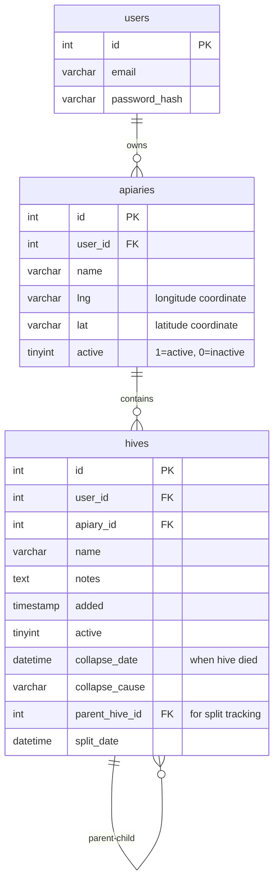
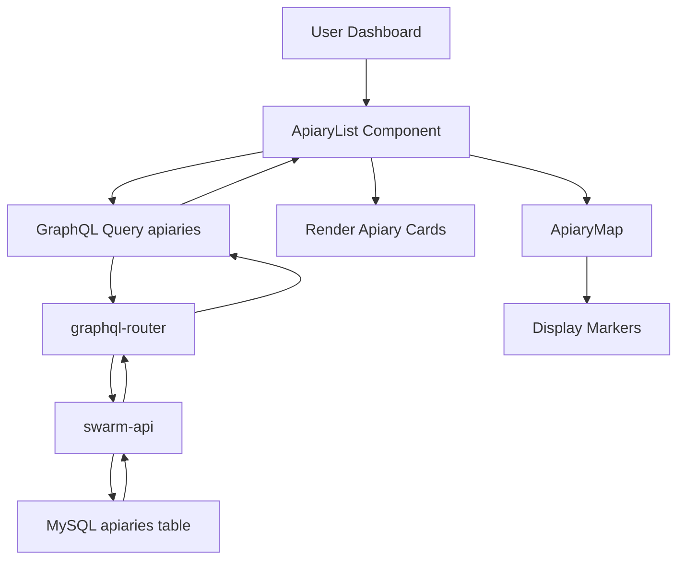

# Управление пасекой - Техническая документация
### 🎯 Обзор
Иерархическая система управления пасекой, позволяющая пользователям организовывать ульи в зависимости от местоположения или оперативные группы. Обеспечивает операции CRUD для пасек с отслеживанием координат GPS, ассоциациями ульев и поддержкой нескольких площадок для пчеловодов, управляющих семьями в нескольких местах.

### 🏗️ Архитектура

#### Компоненты
- **ApiaryList**: компонент React, отображающий все пользовательские пасеки с видом на карту.
- **ApiaryEditor**: компонент формы для создания/редактирования сведений о пасеке.
- **ApiaryMap**: интерактивная карта, показывающая расположение пасек с маркерами.
- **HiveList**: вложенный компонент, показывающий ульи на выбранной пасеке.

#### Услуги
- **swarm-api**: Основная служба обработки данных пасеки/улья.
- **graphql-router**: запросы пасеки маршрутизации федеративного шлюза.
- **gate-video-stream**: использует местоположение пасеки для связи с камерой (интеграция в будущем).

### 📋 Технические характеристики

#### Схема базы данных


#### GraphQL API
```graphql
type Apiary {
  id: ID!
  name: String
  location: String
  lat: String
  lng: String
  hives: [Hive]
}

type Query {
  apiaries: [Apiary]
  apiary(id: ID!): Apiary
}

type Mutation {
  addApiary(name: String!, lat: String, lng: String, location: String): Apiary
  updateApiary(id: ID!, name: String, lat: String, lng: String, location: String): Apiary
  deleteApiary(id: ID!): Boolean
}

input HiveInput {
  apiaryId: ID!
  name: String!
  boxCount: Int!
  frameCount: Int!
  colors: [String]
}

type Mutation {
  addHive(input: HiveInput!): Hive
  updateHive(input: HiveUpdateInput!): Hive
  deleteHive(id: ID!): Boolean
}
```

### 🔧 Детали реализации

#### Фронтенд
- **Framework**: Реагируйте с помощью TypeScript.
- **Библиотека карт**: листовка (реагирующая листовка) для визуализации местоположения.
- **Управление состоянием**: кэш клиента Apollo для данных пасеки/улья.
- **Формы**: форма React Hook с проверкой.
- **Ввод местоположения**: 
  - Ручной ввод координат GPS
  - Геокодирование адреса (будущая функция)
  - Нажмите на карту, чтобы установить координаты

#### Серверная часть (swarm-api)
- **Язык**: Перейти
- **Framework**: собственный сервер HTTP с GraphQL.
- **База данных**: MySQL с подготовленными операторами.
- **Аутентификация**: проверка токена JWT.
- **Авторизация**: запросы на уровне пользователя (пасеки, отфильтрованные по user_id).

#### Поток данных


#### Ключевые операции

**Создать пасеку**
```go
func (r *mutationResolver) AddApiary(ctx context.Context, name string, lat *string, lng *string, location *string) (*model.Apiary, error) {
    userID := ctx.Value("user_id").(int)
    
    query := `INSERT INTO apiaries (user_id, name, lat, lng) VALUES (?, ?, ?, ?)`
    result, err := r.DB.Exec(query, userID, name, safeString(lat, "0"), safeString(lng, "0"))
    
    id, _ := result.LastInsertId()
    
    return &model.Apiary{
        ID: strconv.FormatInt(id, 10),
        Name: &name,
        Lat: lat,
        Lng: lng,
    }, nil
}
```

**Список пасек с ульями**
```go
func (r *queryResolver) Apiaries(ctx context.Context) ([]*model.Apiary, error) {
    userID := ctx.Value("user_id").(int)
    
    apiaries, err := r.DB.Query(`
        SELECT id, name, lat, lng 
        FROM apiaries 
        WHERE user_id = ? AND active = 1
        ORDER BY name
    `, userID)
    
    for apiaries.Next() {
        var a model.Apiary
        apiaries.Scan(&a.ID, &a.Name, &a.Lat, &a.Lng)
        
        a.Hives, _ = r.loadHivesForApiary(a.ID, userID)
        result = append(result, &a)
    }
    
    return result, nil
}
```

**Удалить пасеку**
```go
func (r *mutationResolver) DeleteApiary(ctx context.Context, id string) (bool, error) {
    userID := ctx.Value("user_id").(int)
    
    hiveCount, _ := r.DB.QueryRow(`
        SELECT COUNT(*) FROM hives 
        WHERE apiary_id = ? AND user_id = ? AND active = 1
    `, id, userID).Scan(&count)
    
    if count > 0 {
        return false, errors.New("cannot delete apiary with active hives")
    }
    
    _, err := r.DB.Exec(`
        UPDATE apiaries SET active = 0 
        WHERE id = ? AND user_id = ?
    `, id, userID)
    
    return err == nil, err
}
```

### ⚙️ Конфигурация

#### Переменные среды
```bash
MYSQL_HOST=localhost
MYSQL_PORT=3306
MYSQL_DATABASE=swarm
MYSQL_USER=root
MYSQL_PASSWORD=pass

JWT_SECRET=xxx

GEOCODING_API_KEY=xxx
```

### 🧪 Тестирование

#### Модульные тесты
- Местоположение: `/test/apiary_test.go`
- Охват: операции CRUD, проверки авторизации.
- Тесты:
  - Создать пасеку с действительными/неверными координатами.
  - Список пасек для пользователя (изоляция)
  - Обновление информации о пасеке
  - Удаление пасеки (с ульями/без)
  - Проверка ассоциации улья

#### Интеграционные тесты
- Местоположение: `/test/integration/apiary_flow_test.go`
- Тесты:
  - Полный жизненный цикл пасеки (создать → добавить ульи → обновить → удалить)
  - Многопользовательская изоляция
  - Проверка координат
  - Каскадное поведение при удалении

#### E2E-тесты
Сценарии ручного тестирования:
- Создайте пасеку, добавьте ульи, проверьте отображение карты.
- Редактировать местоположение пасеки, проверять обновление координат.
- Попытка удалить пасеку с ульями (не удалась)
- Перемещение улья между пасеками
- Рабочий процесс управления несколькими пасеками

### 📊 Вопросы производительности

#### Оптимизации
- **Индексированные запросы**: user_id + проиндексированные активные столбцы.
- **Стремительная загрузка**: ульи загружаются с пасекой в одном пакете запросов.
- **Кэширование клиента**: кеш Apollo уменьшает количество избыточных запросов.
- **Разбивка на страницы**: будущее улучшение для пользователей с большим количеством пасек.

#### Узкие места
- Загрузка большого количества ульев на пасеку (100+) замедляет первоначальный рендеринг.
- Рендеринг карты с более чем 50 маркерами пасеки.
- Проблема с запросом N+1 при загрузке ульев (частично оптимизировано)

#### Метрики
- Средний запрос пасеки: менее 50 мс.
- Операция создания/обновления: менее 100 мс.
- Время рендеринга карты: менее 1 секунды (до 20 пасек)
- Типичный пользователь имеет 1-5 пасек, 5-30 ульев.

### 🚫 Технические ограничения

#### Текущие ограничения
- **Точность GPS**: хранится как VARCHAR(20), ограничивает точность.
- **Без геокодирования адреса**: только ручной ввод координат.
- **Каскадное удаление**: только мягкое удаление (активно = 0).
- **Массовые операции запрещены**: перед удалением пасеки необходимо удалять ульи по отдельности.
- **Поставщик карт**: зависит от внешнего сервиса тайлов (OpenStreetMap).
- **Нет кластеризации**: маркеры карты не группируются при большом уменьшении масштаба.

#### Известные проблемы
- Проверка координат является базовой (принимает недопустимые строки широты и долготы).
- Нет преобразования адреса в координаты (будущая функция)
- Удаление пасеки требует переназначения улья вручную (без автоматического перемещения).
- Маркеры на карте перекрываются, когда пасеки расположены близко друг к другу.

### 🔗 Сопутствующая документация
- [Управление ульем](./hive-management.md)
- [Разделить колонию](./split-colony.md) - Создает новый улей на той же пасеке.
- [swarm-api Сервис](https://github.com/Gratheon/swarm-api)

### 📚 Ресурсы для разработки

#### Репозитории GitHub
- [swarm-api](https://github.com/Gratheon/swarm-api) - Серверная часть пасеки/улья
- [web-app](https://github.com/Gratheon/web-app) - Компоненты frontend

#### Ключевые файлы
- Интерфейс: `/src/page/apiary/ApiaryList.tsx`
- Серверная часть: `/resolvers/apiary.go`
- Схема: `/schema.graphql`
- Миграции: `/migrations/20240818194700_init.sql`

### 💬 Технические примечания

- Пасека является основным иерархическим объектом (Пользователь → Пасека → Улей → Коробка → Рамка).
- Используется шаблон мягкого удаления (активный = 0) для сохранения исторических данных.
- Координаты GPS для простоты сохраняются в виде строк (рассмотрите тип POINT для пространственных запросов)
- Будущее: добавление геокодирования адресов, массовых операций с ульями, статистики пасеки.
- Рассмотрите возможность добавления заметок, фотографий или интеграции погоды на уровне пасеки.
- Защита от удаления предотвращает появление потерянных ульев (сначала необходимо переназначить или удалить ульи).

---
**Последнее обновление**: 5 декабря 2025 г.

