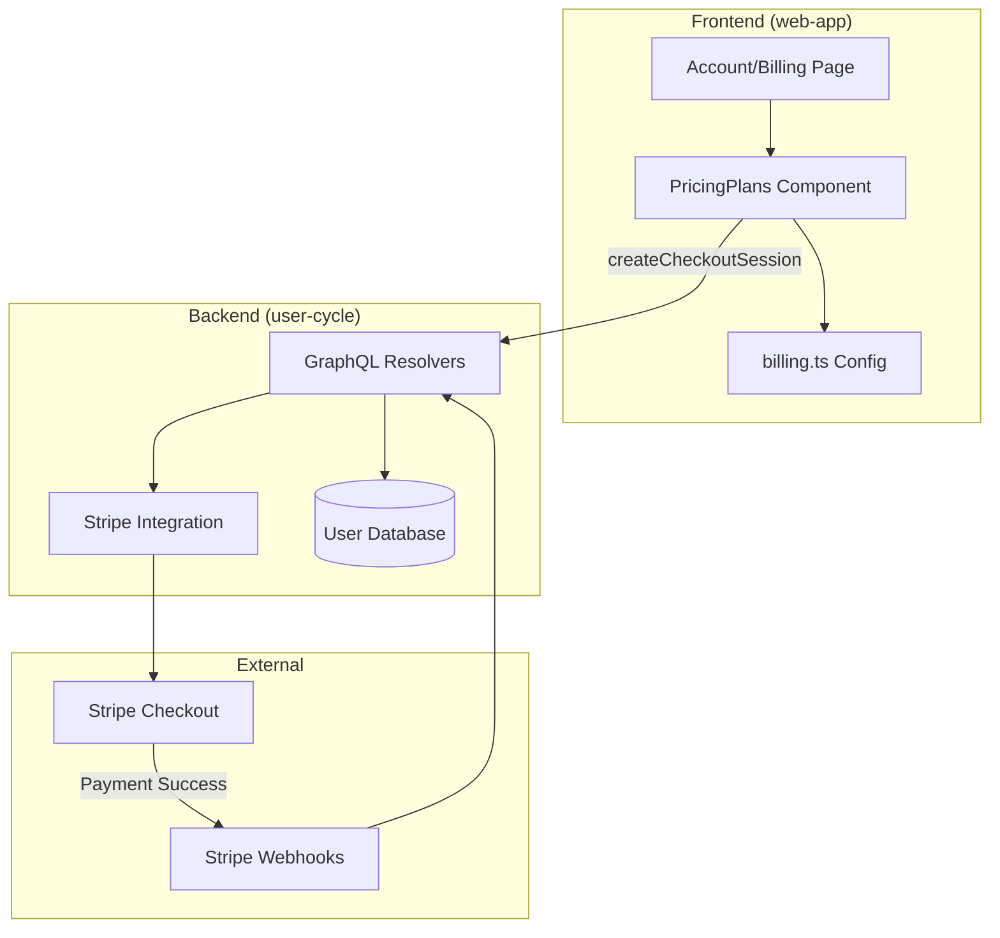
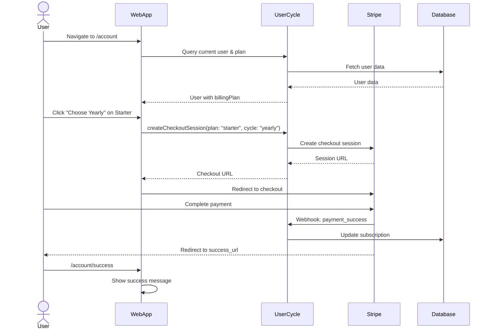
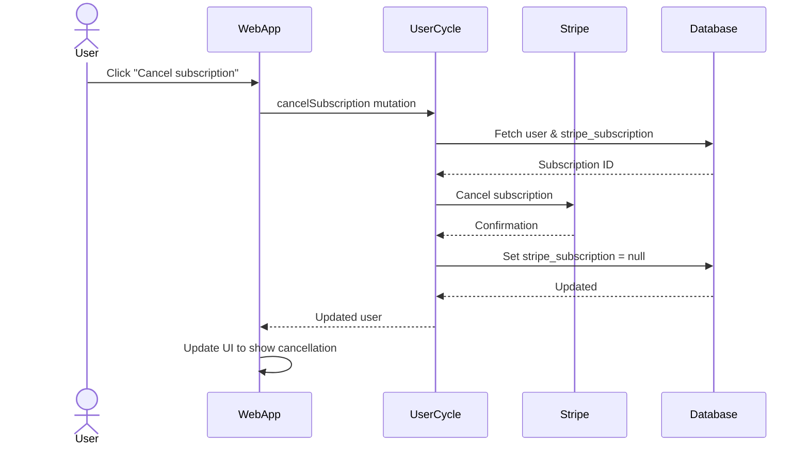

## Обзор

Система выставления счетов в Gratheon позволяет пользователям подписываться на различные ценовые уровни (Бесплатный, Начальный, Профессиональный) и управлять своими подписками. Система реализована в трёх репозиториях:
- **web-app**: интерфейс пользователя для управления выставлением счетов.
- **user-cycle**: интеграция backend GraphQL API и Stripe.
- **веб-сайт**: общедоступная страница с ценами.

## Архитектура

### Компоненты системы



## Ценовые уровни

### Бесплатно (любитель)
- **Цена**: Бесплатно навсегда.
- **Особенности**:
  - До 3 ульев
  - максимум 10 рамок на улей
  - Обнаружение рабочих пчел
  - Обнаружение королевы
  - Публичное совместное использование улья
  - Дневник лечения
- **Ограничения**:
  - Низкоприоритетная обработка ИИ
  - Сохранение изображения 1 год

### Стартер
- **Ежемесячно**: 22 евро/месяц.
- **Ежегодно**: 12 евро в месяц (144 евро в год) - **Сэкономьте 45 %**
- **Особенности**:
  - До 20 ульев
  - 30 рамок на улей
  - Анализ клеток
  - Счет Варроа (нижняя доска)
  - Планировщик размещения ульев
  - Инспекционное управление
  - ИИ-помощник пчеловода
- **Ограничения**:
  - 1 учетная запись пользователя
  - Сохранение изображения 2 года

### Профессионал
- **Ежемесячно**: 55 евро/месяц.
- **Ежегодно**: 33 евро в месяц (396 евро в год) - **Сэкономьте 40 %**
- **Особенности**:
  - До 150 ульев
  - Неограниченное количество кадров
  - Хранение телеметрии
  - Анализ данных таймсерий
  - Сравнение колоний
  - Неограниченное количество проверок
  - До 20 учетных записей пользователей
- **Ограничения**:
  - Разрешение телеметрии 10 минут
  - Сохранение изображения 3 года
- **Статус**: В разработке.

### Гибкий (аддон)
- **Цена**: 100 евро единоразово (1000 жетонов, срок действия 1 год)
- **Цель**: функции инфраструктуры с оплатой по факту использования.
- **Особенности**:
  - Обработка и хранение видео
  - Ограничения скорости телеметрии IoT
  - СМС оповещения
  - Интеграция вебхуков
  - Дополнительная емкость за пределами уровня
- **Статус**: В разработке (не отображается при выборе платежа web-app).

### Предприятие
- **Цена**: индивидуальная цена.
- **Особенности**:
  - Пользовательские интеграции
  - Локальное развертывание
  - Приоритетная поддержка 24/7
  - Повышенная безопасность
  - Неограниченный масштаб
- **Контакт**: Enterprise@gratheon.com

## Детали реализации

### Интерфейс (web-app)

#### Конфигурация (`src/config/billing.ts`)
Определяет все уровни выставления счетов с помощью:
- Названия и цвета уровней
- Ежемесячные/годовые цены.
- Проценты экономии
- Идентификаторы Stripe price

```typescript
export const BILLING_TIERS = {
  free: { name: 'Free', color: '#f0f0f0', textColor: '#666' },
  starter: {
    name: 'Starter',
    color: '#FFD900',
    monthly: { price: 22, currency: 'EUR', stripePrice: 'price_starter_monthly' },
    yearly: { 
      price: 12, 
      pricePerYear: 144, 
      currency: 'EUR', 
      savings: '45%', 
      stripePrice: 'price_starter_yearly' 
    }
  },
  // ... more tiers
}
```

#### Компоненты

**`src/page/accountEdit/billing/index.tsx`**
- Оболочка главной платежной страницы.
- Показывает статус подписки
- Отображает сроки годности
- Кнопка отмены подписки
- Встраивает компонент PricingPlans.

**`src/page/accountEdit/billing/pricingPlans.tsx`**
- Макет из 3 столбцов: Бесплатно, Начальный, Профессиональный.
- Месячное/годовое переключение на уровень
- Интеграция кассы Stripe
- Индикация текущего плана
- Обработка ошибок

**`src/page/accountEdit/billing/pricingPlans.css`**
- Адаптивный макет сетки
- Цвета, специфичные для уровня
- Эффекты при наведении
- Мобильный адаптивный

### Серверная часть (user-cycle)

#### GraphQL Схема (`schema.graphql`)
```graphql
type User {
  billingPlan: String
  hasSubscription: Boolean
  isSubscriptionExpired: Boolean
  date_expiration: DateTime
}

type BillingHistoryEvent {
  id: Int!
  userId: Int!
  eventType: String!
  billingPlan: String
  amount: Float
  currency: String
  details: String
  createdAt: String!
}

type Query {
  billingHistory: [BillingHistoryEvent]
}

type Mutation {
  createCheckoutSession(plan: String, cycle: String): URL
  cancelSubscription: CancelSubscriptionResult
}
```

#### История платежей

Функция истории выставления счетов отслеживает все события, связанные с выставлением счетов для пользователя:

**Типы событий**:
- `registration` — учетная запись пользователя создана.
- `purchase` – приобретена уровневая подписка.
- `cancellation` — подписка отменена пользователем
- `system_downgrade` – автоматический переход на уровень бесплатного пользования (например, сбой платежа)
- `upgrade` – План обновлен
- `downgrade` - План понижен

**Модель** (`src/models/billingHistory.ts`):
```typescript
export const billingHistoryModel = {
  async getByUserId(userId: number): Promise<BillingHistoryEvent[]> {
    // Fetch all events for user, ordered by createdAt DESC
  },
  
  async addRegistration(userId: number, plan: string) {
    // Track when user registers
  },
  
  async addPurchase(userId: number, plan: string, amount: number, currency: string) {
    // Track tier purchase
  },
  
  async addCancellation(userId: number, previousPlan: string) {
    // Track cancellation
  },
  
  async addSystemDowngrade(userId: number, reason: string) {
    // Track auto-downgrade to free tier
  }
}
```

**Таблица базы данных** (`billing_history`):
- `id`: первичный ключ с автоинкрементом
- `user_id`: внешний ключ к таблице учетных записей.
- `event_type`: ENUM('регистрация', 'покупка', 'отмена', 'system_downgrade', 'обновление', 'понижение версии')
- `billing_plan`: ENUM('бесплатный', 'стартовый', 'профессиональный', 'аддон', 'корпоративный')
- `amount`: десятичное число (сумма платежа)
- `currency`: VARCHAR (например, «EUR»)
- `details`: ТЕКСТ (строка JSON с дополнительной информацией)
- `created_at`: временная метка

**Отображение пользовательского интерфейса**:
История платежей отображается в виде временной шкалы на странице web-app `/account`:
- Дата регистрации
- Уровневые покупки с суммами
- Отмены
- Изменения в системе (например, автоматическое понижение рейтинга при сбое платежа)

Это заменяет необходимость в явных предупреждениях об истечении срока действия — пользователи могут видеть полный график выставления счетов.

#### Резолверы (`src/resolvers.ts`)

**`createCheckoutSession`**
- Проверяет аутентификацию пользователя
- Сопоставляет план/цикл с идентификатором цены Stripe.
- Создает сеанс оформления заказа Stripe
- Оформление возврата URL
- Поддерживает режимы: «подписка» (стартер, профессионал) или «оплата» (аддон)

```typescript
createCheckoutSession: async (parent, { plan, cycle }, ctx) => {
  if (!ctx.uid) return err(error_code.AUTHENTICATION_REQUIRED);
  
  const user = await userModel.getById(ctx.uid);
  let priceId = getPriceIdForPlan(plan, cycle);
  let mode = plan === 'addon' ? 'payment' : 'subscription';
  
  const session = await stripe.checkout.sessions.create({
    customer_email: user.email,
    mode: mode,
    line_items: [{ price: priceId, quantity: 1 }],
    success_url: `${appUrl}/account/success`,
    cancel_url: `${appUrl}/account/cancel`,
    metadata: { plan, cycle }
  });
  
  return session.url;
}
```

**`cancelSubscription`**
- Отменяет подписку на Stripe.
- Обновление базы данных пользователей.
- Возвращает обновленный объект пользователя

#### Конфигурация (`src/config/config.default.ts`)
```typescript
stripe: {
  secret: 'sk_test_...',
  webhook_secret: 'whsec_...',
  plans: {
    starter: {
      monthly: 'price_starter_monthly_placeholder',
      yearly: 'price_starter_yearly_placeholder'
    },
    professional: {
      monthly: 'price_professional_monthly_placeholder',
      yearly: 'price_professional_yearly_placeholder'
    },
    addon: {
      oneTime: 'price_addon_onetime_placeholder'
    }
  }
}
```

### Веб-сайт (публичные цены)

**`src/components/CustomPricingPage.js`**
- Публичная страница цен
- Показывает все уровни: любитель, начинающий, гибкий, профессиональный, корпоративный.
- Подробные списки функций
- Аддон-калькулятор (в разработке)
- Ссылки на регистрацию/продажу

## Пользовательский процесс

### Процесс покупки подписки



### Порядок отмены подписки



## Схема базы данных

### таблица счетов (в user-cycle MySQL)
- `id`: первичный ключ.
- `email`: адрес электронной почты пользователя.
- `stripe_subscription`: идентификатор подписки Stripe (обнуляемый).
- `billing_plan`: ENUM('бесплатно', 'стартовый', 'профессиональный', 'аддон', 'корпоративный') - По умолчанию: "бесплатно"
- `date_expiration`: дата истечения срока действия подписки.
- `date_added`: дата создания учетной записи.

### таблица billing_history (в user-cycle MySQL)
- `id`: первичный ключ с автоинкрементом.
- `user_id`: внешний ключ к таблице учетных записей.
- `event_type`: ENUM('регистрация', 'покупка', 'отмена', 'system_downgrade', 'обновление', 'понижение версии')
- `billing_plan`: ENUM('бесплатный', 'стартовый', 'профессиональный', 'аддон', 'корпоративный')
- `amount`: DECIMAL(10,2) - Сумма платежа (обнуляемая)
- `currency`: VARCHAR(3) – например, «EUR» (обнуляемое)
- `details`: TEXT – строка JSON с дополнительной информацией (обнуляемая)
- `created_at`: TIMESTAMP - По умолчанию: CURRENT_TIMESTAMP

**Файлы миграции**:
- `migrations/023-create-billing-history.sql` — Создает таблицу и заполняет данные учетной записи.
- `migrations/024-update-billing-plan-enum.sql` — обновляет значения перечисления со старых («базовый», «профессиональный») на новые («начинающий», «профессиональный»).

## Интеграция полос

### Идентификаторы цен (Производство)
Должно быть настроено в `user-cycle/src/config/config.default.ts`:
- `price_starter_monthly`: стартовый ежемесячный план.
- `price_starter_yearly`: стартовый годовой план
- `price_professional_monthly`: профессиональный ежемесячный план.
- `price_professional_yearly`: профессиональный годовой план
- `price_addon_onetime`: Гибкая единоразовая оплата аддона.

### Вебхуки
Настройте в панели инструментов Stripe:
- `checkout.session.completed`: обработка успешных платежей.
– `customer.subscription.deleted`: обработка отмены
- `customer.subscription.updated`: обработка изменений плана.

Конечная точка вебхука: `https://app.gratheon.com/webhooks/stripe`

## Переменные среды

### user-cycle
- `STRIPE_SECRET_KEY`: секретный ключ Stripe API.
- `STRIPE_WEBHOOK_SECRET`: секрет подписи веб-перехватчика Stripe.
- `JWT_KEY`: ключ подписи токена сеанса.
- `MYSQL_HOST`, `MYSQL_USER`, `MYSQL_PASSWORD`, `MYSQL_DATABASE`: конфигурация базы данных.

### web-app
- `VITE_API_URL`: конечная точка GraphQL API (указывает на user-cycle)

## Вопросы безопасности

1. **Аутентификация**: для всех изменений выставления счетов требуется действительный токен JWT в контексте.
2. **Защита CSRF**: мутации GraphQL используют POST с правильным CORS.
3. **Проверка вебхука**: подписи вебхуков Stripe должны быть проверены.
4. **Ценовая целостность**: цены определяются на стороне сервера, а не на стороне клиента.
5. **Безопасность сеанса**: срок действия сеанса оформления заказа истекает через 24 часа.

## Тестирование

### Контрольный список ручного тестирования
- [ ] Уровень бесплатного пользования отображается правильно.
- [ ] Стартовые ежемесячные/ежегодные работы по отбору
- [ ] Профессиональные ежемесячные/ежегодные отборочные работы
- [ ] При оформлении заказа Stripe корректно перенаправляется
- [ ] Страница успеха отображается после оплаты.
- [ ] Страница отмены отображается, если пользователь отказывается от оформления заказа.
- [ ] Отмена подписки работает
- [ ] Просроченная подписка показывает предупреждение
- [ ] Значок текущего плана отображается правильно.

### Тестовые карты с полосками
- Успех: `4242 4242 4242 4242`
- Отклонение: `4000 0000 0000 0002`
- 3D Secure: `4000 0027 6000 3184`

## Известные проблемы и будущие улучшения

### Завершенные функции
- ✅ Отслеживание истории платежей (события регистрации, покупки, отмены)
- ✅ Автоматический переход на уровень бесплатного пользования при сбое платежа
- ✅ Никаких жестких ограничений по платному доступу — пользователи сохраняют доступ к приложению.
- ✅ Обновленная структура цен (годовая скидка 45 % для Starter, 40 % для Professional)
- ✅ Чистый пользовательский интерфейс выбора уровня с индикатором текущего плана.
- ✅ Миграция перечисления базы данных (с «базового»/«профессионального» на «начинающего»/«профессионального»)

### Текущая работа
- 🚧 Пользовательский интерфейс временной шкалы истории платежей в web-app.
- 🚧 Удалить гибкий уровень из выбора web-app (оставить только на веб-сайте)
- 🚧 Контроль доступа на уровне функций (замена жесткого платного доступа)
- 🚧 Улучшение визуального дизайна выбора уровня.

### Планируемые функции
- Порядок обновления/понижения подписки
- Отслеживание использования гибкого дополнения.
- История счетов на странице учетной записи
- Управление способами оплаты
- Мультивалютная поддержка
- Корпоративные индивидуальные контракты
- Пропорциональное выставление счетов за изменения плана.
- Напоминания о продлении подписки

### Стратегия блокировки на уровне функций

В будущей реализации функции будут проверяться индивидуально:

```typescript
// Example feature check
const { hasAccess, requiredTier } = useFeatureAccess('cell-analysis')

if (!hasAccess) {
  return (
    <UpgradePrompt 
      feature="Cell Analysis" 
      requiredTier={requiredTier}
      description="Analyze honeycomb cells and track resources"
    />
  )
}
```

Преимущества:
- Пользователи обнаруживают функции естественным образом
- Контекстные подсказки по обновлению показывают ценность.
- Лучший UX, чем блокировка всего приложения.
- Четкое сопоставление функций и уровней.

## Примечания по развертыванию

### web-app
1. Сборка: `npm run build`
2. Среда: установите для `VITE_API_URL` производственный user-cycle URL.
3. Разверните статические файлы на CDN/хостинг.

### user-cycle
1. Установите ключи производственного Stripe в конфигурации.
2. Настройте веб-хук Stripe URL.
3. Разверните сервис GraphQL.
4. Проверьте миграцию базы данных

### сайт
1. Обновите страницу цен, если уровни изменились.
2. Восстановите Докузавра: `npm run build`.
3. Разверните статический сайт

## Поддержка и устранение неполадок

### Распространенные проблемы

**"Не удалось создать сеанс оформления заказа"**
- Проверьте правильность ключей Stripe API.
- Убедитесь, что идентификаторы цен существуют на панели инструментов Stripe.
- Проверьте журналы сервера на наличие ошибок API.

**"Срок действия подписки истек"**
- Пользователю необходимо продлить подписку
- Проверьте `date_expiration` в базе данных.
- Проверьте статус подписки Stripe.

**Вебхук не срабатывает**
- Проверьте вебхук URL на панели управления Stripe.
- Проверьте правильность секретного кода веб-перехватчика.
- Проверка журналов веб-перехватчиков Stripe.

## Контакт

- Технические проблемы: создайте проблему в соответствующем репозитории.
- Поддержка по выставлению счетов: support@gratheon.com
- Корпоративные продажи: Enterprise@gratheon.com

