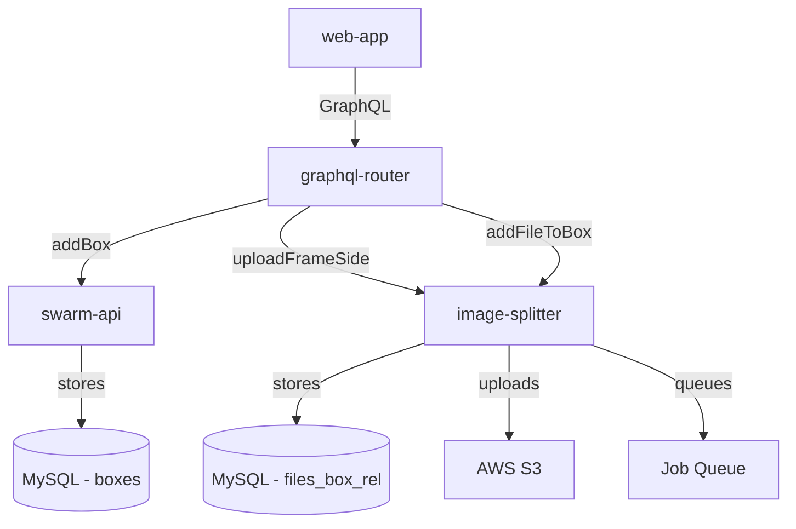

В этом документе описывается техническая реализация функции нижней доски улья для мониторинга клещей Варроа. Эта функция охватывает три микросервиса: swarm-api, image-splitter и web-app.

## Архитектура

### Зависимости сервисов



### Поток данных

1. **Пользователь создает нижнее поле**:
   - web-app → graphql-router → swarm-api
   - Создает запись в таблице `boxes` с помощью `type = 'BOTTOM'`.

2. **Пользователь загружает изображение**:
   - web-app → graphql-router → image-splitter
   – Шаг 1. `uploadFrameSide` загружается в S3, возвращает `fileId`.
   – Шаг 2: `addFileToBox` связывает файл с ящиком в `files_box_rel`.

3. **Обработка изображений**:
   - image-splitter ставит в очередь задание по обнаружению варроа.
   - Задание обрабатывает изображение асинхронно.
   - Результаты сохраняются в поле `detectedObjects` JSON.

## Схема базы данных

### swarm-api Схема

#### таблица ящиков
```sql
CREATE TABLE `boxes` (
  `id` int unsigned NOT NULL AUTO_INCREMENT,
  `user_id` int unsigned NOT NULL,
  `hive_id` int NOT NULL,
  `active` tinyint(1) NOT NULL DEFAULT '1',
  `color` varchar(10) DEFAULT '#ffc848',
  `position` mediumint DEFAULT NULL,
  `type` enum('SUPER','DEEP','GATE','VENTILATION','QUEEN_EXCLUDER','HORIZONTAL_FEEDER','BOTTOM') 
         CHARACTER SET utf8mb4 COLLATE utf8mb4_0900_ai_ci NOT NULL DEFAULT 'DEEP',
  PRIMARY KEY (`id`)
) ENGINE=InnoDB DEFAULT CHARSET=utf8mb4 COLLATE=utf8mb4_general_ci;
```

**Миграция**: `migrations/20251201025115_add_bottom_box_type.sql`

### image-splitter Схема

#### таблица files_box_rel
```sql
CREATE TABLE `files_box_rel` (
  `box_id` int unsigned NOT NULL,
  `file_id` int unsigned NOT NULL,
  `user_id` int unsigned NOT NULL,
  `inspection_id` INT NULL DEFAULT NULL,
  `added_time` datetime DEFAULT CURRENT_TIMESTAMP,
  INDEX (`user_id`, `box_id`, `inspection_id`)
) ENGINE=InnoDB DEFAULT CHARSET=utf8mb4 COLLATE=utf8mb4_bin;
```

**Миграция**: `migrations/018-box-files.sql`

**Цель**: связывает загруженные файлы с определенными ящиками с поддержкой проверки версий.

#### Отношения
- `box_id` → `swarm-api.boxes.id` (справка по зарубежной службе)
- `file_id` → `image-splitter.files.id`
- `user_id` → владение пользователем
- `inspection_id` → `swarm-api.inspections.id` (NULL = текущее состояние)

## GraphQL API

### swarm-api

#### Добавить мутацию Box
```graphql
mutation addBox($hiveId: ID!, $position: Int!, $type: BoxType!) {
  addBox(hiveId: $hiveId, position: $position, type: $type) {
    id
    type
    position
    color
  }
}
```

**Переменные**:
```json
{
  "hiveId": "123",
  "position": 0,
  "type": "BOTTOM"
}
```

**Реализация**: `graph/schema.resolvers.go::AddBox()`

### image-splitter

#### Загрузить мутацию файла
```graphql
mutation uploadFrameSide($file: Upload!) {
  uploadFrameSide(file: $file) {
    id
    url
    resizes {
      id
      url
      max_dimension_px
    }
  }
}
```

**Возвраты**:
```json
{
  "data": {
    "uploadFrameSide": {
      "id": "456",
      "url": "https://s3.../original.jpg",
      "resizes": [...]
    }
  }
}
```

**Реализация**: `src/graphql/upload-frame-side.ts`

#### Связать файл с мутацией Box
```graphql
mutation addFileToBox($boxId: ID!, $fileId: ID!, $hiveId: ID!) {
  addFileToBox(boxId: $boxId, fileId: $fileId, hiveId: $hiveId)
}
```

**Переменные**:
```json
{
  "boxId": "123",
  "fileId": "456",
  "hiveId": "789"
}
```

**Реализация**: `src/graphql/resolvers.ts::addFileToBox()`

## Реализация frontend

### Компонент BottomBox

**Местоположение**: `web-app/src/page/hiveEdit/bottomBox/BottomBox.tsx`

**Основные характеристики**:
- Загрузка файла с проверкой
- Двухэтапный процесс мутации
- Обработка ошибок
- Загрузка состояний

**Структура кода**:
```typescript
export default function BottomBox({ boxId, hiveId }) {
  // Step 1: Upload file
  const [uploadFile] = useUploadMutation(...)
  
  // Step 2: Link to box
  const [addFileToBoxMutation] = useMutation(...)
  
  async function onFileSelect(event) {
    const file = event.target.files?.[0]
    
    // Upload file to S3
    const uploadResult = await uploadFile({ file })
    const fileId = uploadResult.data.uploadFrameSide.id
    
    // Link file to box
    await addFileToBoxMutation({ boxId, fileId, hiveId })
  }
  
  return (
    <div>
      <input type="file" onChange={onFileSelect} />
      {data && }
    </div>
  )
}
```

### Точки интеграции

**hiveButtons.tsx**: добавляет кнопку «Добавить нижнюю часть».
```typescript
<Button onClick={() => onBoxAdd(boxTypes.BOTTOM)}>
  <span><T>Add bottom</T></span>
</Button>
```

**index.tsx**: отображает компонент BottomBox.
```typescript
{box && box.type === boxTypes.BOTTOM && (
  <BottomBox boxId={boxId} hiveId={hiveId} />
)}
```

## Бэкэнд-реализация

### swarm-api (Вперёд)

#### Модель коробки
**Местоположение**: `graph/model/box.go`

**Основные методы**:
- `Create()` — Создает новый блок с проверкой типа.
- `ListByHive()` — Извлекает коробки для улья.
- `Get()` — извлекает один ящик

**Константы типа**:
```go
const (
    BoxTypeDeep             BoxType = "DEEP"
    BoxTypeSuper            BoxType = "SUPER"
    BoxTypeGate             BoxType = "GATE"
    BoxTypeVentilation      BoxType = "VENTILATION"
    BoxTypeQueenExcluder    BoxType = "QUEEN_EXCLUDER"
    BoxTypeHorizontalFeeder BoxType = "HORIZONTAL_FEEDER"
    BoxTypeBottom           BoxType = "BOTTOM"
)
```

### image-splitter (TypeScript)

#### boxФайловая модель
**Местоположение**: `src/models/boxFile.ts`

**Основные методы**:
```typescript
export default {
  async addBoxRelation(fileId, boxId, userId, inspectionId = null) {
    await storage().query(
      sql`INSERT INTO files_box_rel 
          (file_id, box_id, user_id, inspection_id) 
          VALUES (${fileId}, ${boxId}, ${userId}, ${inspectionId})`
    );
  },
  
  async getBoxFiles(boxId, userId, inspectionId = null) {
    // Returns files for specific box
  }
}
```

#### Резолвер
**Местоположение**: `src/graphql/resolvers.ts`

```typescript
addFileToBox: async (_, {boxId, fileId, hiveId}, {uid}) => {
  await boxFileModel.addBoxRelation(fileId, boxId, uid);
  await fileModel.addHiveRelation(fileId, hiveId, uid);
  return true;
}
```

## Проверка версий

### Как это работает

1. **Текущее состояние**: изображения имеют `inspection_id = NULL`.
2. **Создать проверку**: 
   - Текущие изображения клонированы
   - Клоны получают новый `inspection_id`
   - Исходные изображения остаются с `NULL` (становятся новым текущим состоянием)
3. **Исторический обзор**: запрос с конкретным `inspection_id`.

### SQL-запросы

**Получить текущие изображения**:
```sql
SELECT * FROM files_box_rel 
WHERE box_id = ? AND user_id = ? AND inspection_id IS NULL;
```

**Получите исторические изображения**:
```sql
SELECT * FROM files_box_rel 
WHERE box_id = ? AND user_id = ? AND inspection_id = ?;
```

## Интеграция очереди заданий

### Работа по обнаружению Варроа

Когда файл загружается, задание по обнаружению варроа ставится в очередь:

```typescript
await jobs.addJob(TYPE_VARROA, fileId);
```

**Тип вакансии**: `TYPE_VARROA = 'varroa'`

**Обработка**:
1. Сотрудник забирает задание из очереди.
2. Загружает изображение с S3.
3. Запускает модель обнаружения варроа.
4. Сохраняет результаты в поле `detectedObjects` JSON.
5. Обновляет статус задания для завершения.

## Развертывание

### Предварительные условия
- База данных MySQL для обоих сервисов.
- Настроен сегмент AWS S3.
- Redis для очереди заданий

### Этапы миграции

1. **Развертывание swarm-api**:
```bash
cd swarm-api
just migrate-db-dev
# Applies: migrations/20251201025115_add_bottom_box_type.sql
```

2. **Развертывание image-splitter**:
```bash
cd image-splitter
just stop && just start
# Auto-runs: migrations/018-box-files.sql
```

3. **Развертывание web-app**:
```bash
cd web-app
pnpm build
# Upload dist/ to hosting
```

4. **Перезапустите graphql-router**:
```bash
docker restart gratheon-graphql-router-1
```

### Проверка

```sql
-- Check box type enum
SHOW COLUMNS FROM boxes LIKE 'type';

-- Check files_box_rel table
DESCRIBE files_box_rel;

-- Test data flow
INSERT INTO boxes (user_id, hive_id, type, position) 
VALUES (1, 1, 'BOTTOM', 0);

-- Should return the box
SELECT * FROM boxes WHERE type = 'BOTTOM';
```

## Тестирование

### Модульные тесты

**swarm-api**:
```bash
cd swarm-api
go test ./...
```

**image-splitter**:
```bash
cd image-splitter
npm test
```

**web-app**:
```bash
cd web-app
pnpm test:unit
```

### Процесс интеграционного теста

1. Создайте улей через API.
2. Добавьте НИЖНИЙ блок в улей.
3. Загрузите изображение через компонент BottomBox.
4. Проверьте:
   - Файл существует в S3.
   - Запись в таблицу `files`.
   - Запись в таблицу `files_box_rel`.
   - Запись в таблицу `files_hive_rel`.
   - Задание Варроа в очереди

### Ручной тест

1. Перейдите в улей в web-app.
2. Нажмите кнопку «Добавить низ».
3. Убедитесь, что нижнее поле появилось в структуре.
4. Нажмите на нижнее поле.
5. Загрузите файл изображения.
6. Проверьте базу данных:
```sql
SELECT * FROM files_box_rel 
ORDER BY added_time DESC LIMIT 1;
```

## Поиск неисправностей

### Распространенные проблемы

**Проблема**: «Данные для столбца «тип» обрезаны»
- **Причина**: миграция не выполнена.
- **Исправление**: запустите `just migrate-db-dev` в swarm-api.

**Проблема**: «Неизвестное поле addFileToBox»
- **Причина**: graphql-router не перезапущен.
- **Исправление**: перезапустите graphql-router, чтобы перезагрузить схему.

**Проблема**: «Невозможно разрешить таблицу files_box_rel»
- **Причина**: миграция не выполняется в image-splitter.
- **Исправление**: перестроить контейнер image-splitter.

**Проблема**: изображения загружаются, но не связаны.
- **Причина**: пропал вызов `addFileToBox`.
- **Исправление**: компонент Check BottomBox вызывает обе мутации.

## Будущие улучшения

### Этап 2: отображение изображений
- Добавить запрос для получения изображений коробок.
- Отображение изображений в пользовательском интерфейсе
- Показать историю загрузок
- Возможность удаления изображений

### Фаза 3: Обнаружение Варроа
- Внедрить модель подсчета варроа
- Отображать количество изображений
- Показать регионы обнаружения
- Оценки уверенности

### Этап 4: Аналитика
- Графики исторических тенденций
- Корреляция лечения
- Прогнозирующие оповещения
- Сравнение между ульями

## Сопутствующая документация

- [Руководство пользователя нижней платы](../../products/web_app/starter-tier/🧮 Hive bottom board & varroa monitoring.md)
- [Схемы БД](./🥞 DB schemas/)

## Журнал изменений

- **01.12.2025**: Начальная реализация.
  - Добавлен тип коробки НИЖНЯЯ.
  - Создана таблица files_box_rel.
  - Реализован поток загрузки
  - Добавлен компонент BottomBox.

