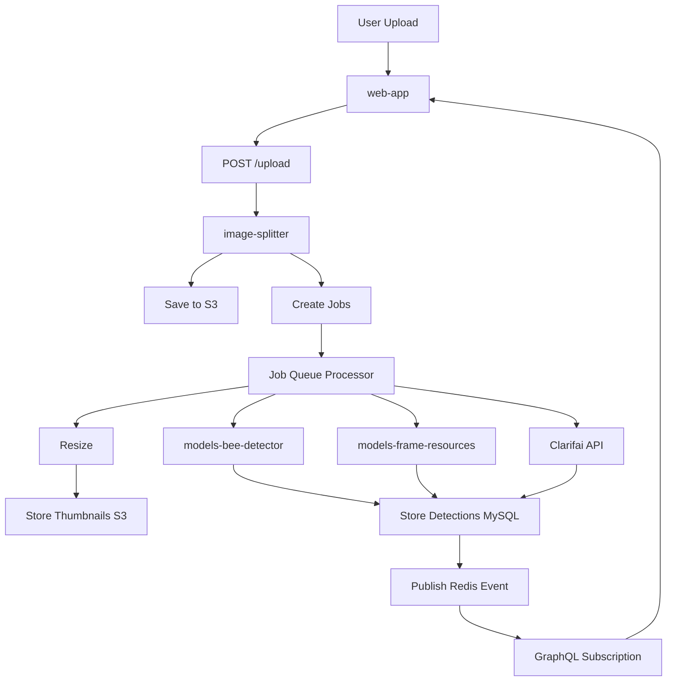

# Загрузка фоторамки — техническая документация

### 🎯 Обзор
Система загрузки фотографий рамок, позволяющая пользователям загружать изображения рамок ульев с помощью конвейера автоматической обработки, который запускает модели обнаружения ИИ, генерирует миниатюры, сохраняет изображения в хранилище объектов и обеспечивает обратную связь для анализа в режиме реального времени. Основная функция рабочего процесса для всего анализа ИИ на основе кадров.

### 🏗️ Архитектура

#### Компоненты
- **FileUploader**: компонент React для интерфейса перетаскивания и загрузки по щелчку.
- **FrameSideView**: контейнер, управляющий состоянием загрузки и визуализацией обнаружения.
- **DetectionOverlay**: визуализация результатов обнаружения ИИ на основе холста.
- **ZoomableImage**: оптимизированный просмотрщик изображений с отложенной загрузкой.

#### Услуги
- **image-splitter**: основной сервис, управляющий обработкой изображений, вызовом модели машинного обучения, хранением.
- **models-bee-detector**: обнаружение рабочей пчелы, дрона, матки.
- **models-frame-resources**: обнаружение клеток (расплод, мед, пыльца).
- **Clarifai API**: Чашка королевы, обнаружение клеща варроа.
- **AWS S3/Minio**: хранилище объектов для оригинальных изображений и миниатюр.

### 📋 Технические характеристики

#### Конвейер обработки изображений
```
1. Upload (web-app) → Direct POST to image-splitter
2. Store original → S3/Minio bucket
3. Create job queue entries (resize, detect_bees, detect_cells, etc.)
4. Process jobs asynchronously:
   - Generate thumbnails (200px, 800px, 1600px)
   - Invoke ML models
   - Store detection results
5. Publish Redis events for real-time updates
6. Update GraphQL cache
```

#### GraphQL API
```graphql
mutation uploadFrameSide($frameId: ID!, $side: FrameSide!, $file: Upload!) {
  uploadFrameSide(frameId: $frameId, side: $side, file: $file) {
    id
    url
    thumbnailUrl
    detections {
      type
      count
      boxes {
        x
        y
        width
        height
        confidence
      }
    }
  }
}

query frameSide($id: ID!) {
  frameSide(id: $id) {
    id
    url
    resizedSmall: url(size: SMALL)
    resizedMedium: url(size: MEDIUM)
    resizedLarge: url(size: LARGE)
    detections {
      bees
      queens
      cells {
        total
        capped_brood
        larvae
        eggs
        pollen
        honey
        empty
      }
    }
  }
}

subscription frameSideProcessing($frameSideId: ID!) {
  frameSideProcessing(frameSideId: $frameSideId) {
    status
    progress
    message
  }
}
```

#### REST API Конечные точки
```
POST /upload/:frameSideId
  - Direct file upload endpoint
  - Multipart form-data
  - Returns: { url, id, status }

GET /file/:frameSideId/:size?
  - Retrieve image by size (original, small, medium, large)
  - Returns: Image binary with appropriate Content-Type
```

#### Схема базы данных
```sql
CREATE TABLE frame_sides (
  id INT PRIMARY KEY AUTO_INCREMENT,
  frame_id INT NOT NULL,
  side ENUM('left', 'right') NOT NULL,
  file_url VARCHAR(512),
  created_at TIMESTAMP DEFAULT CURRENT_TIMESTAMP,
  updated_at TIMESTAMP DEFAULT CURRENT_TIMESTAMP ON UPDATE CURRENT_TIMESTAMP,
  FOREIGN KEY (frame_id) REFERENCES frames(id) ON DELETE CASCADE
);

CREATE TABLE detections (
  id INT PRIMARY KEY AUTO_INCREMENT,
  frame_side_id INT NOT NULL,
  detection_type ENUM('bee', 'queen', 'cell', 'varroa', 'cup', 'beetle', 'ant'),
  bbox_json JSON,
  confidence FLOAT,
  created_at TIMESTAMP DEFAULT CURRENT_TIMESTAMP,
  FOREIGN KEY (frame_side_id) REFERENCES frame_sides(id) ON DELETE CASCADE
);

CREATE TABLE jobs (
  id INT PRIMARY KEY AUTO_INCREMENT,
  type ENUM('resize', 'detect_bees', 'detect_cells', 'detect_queens', 'detect_varroa', 'detect_cups'),
  frame_side_id INT NOT NULL,
  status ENUM('pending', 'processing', 'completed', 'failed'),
  retries INT DEFAULT 0,
  created_at TIMESTAMP DEFAULT CURRENT_TIMESTAMP,
  processed_at TIMESTAMP NULL
);

CREATE INDEX idx_jobs_status ON jobs(status, created_at);
CREATE INDEX idx_detections_frame_side ON detections(frame_side_id, detection_type);
```

### 🔧 Детали реализации

#### Фронтенд
- **Framework**: Реагируйте с помощью TypeScript.
- **Загрузка файла**: прямой POST на image-splitter (для больших файлов в обход маршрутизатора GraphQL).
- **Управление состоянием**: кэш клиента Apollo + состояние локального компонента.
- **Оптимизация**: 
  - Прогрессивная загрузка изображений (маленький → средний → большой)
  - Рендеринг обнаружения на основе холста с ускорением GPU.
  - Виртуальная прокрутка списков кадров.
- **Обновления в режиме реального времени**: подписки GraphQL через издательство/подписку Redis.

#### Серверная часть (image-splitter)
- **Язык**: TypeScript/Node.js с Fastify.
- **Очередь заданий**: постоянная очередь на основе MySQL с логикой повтора.
- **Обработка изображений**: 
  - Джимп для изменения размера
  - webp-конвертер для оптимизации формата
  - 3 размера миниатюр: 200 пикселей, 800 пикселей, 1600 пикселей.
- **Оркестрация машинного обучения**: последовательная обработка заданий.
  1. Изменение размера задания (создаются миниатюры)
  2. Обнаружение пчел (внутренняя модель)
  3. Обнаружение клеток (внутренняя модель)
  4. Обнаружение королевы/варроа/чашки (Clarifai)
- **Хранение**: AWS S3 (производство), Minio (разработка)
- **Обработка ошибок**: интеграция Sentry, механизм повтора задания (максимум 3 попытки).

#### Поток данных



### 🧪 Тестирование

#### Модульные тесты
- Местоположение: `/test/unit/upload.test.ts`
- Охват: проверка изображений, создание миниатюр, создание рабочих мест.
- Имитация S3 и взаимодействия с базой данных.

#### Интеграционные тесты
- Местоположение: `/test/integration/upload-flow.test.ts`
- Тесты: Полная загрузка → хранение → обработка заданий → обнаружение.
- Использует Docker Создание тестовой среды.

#### E2E-тесты
- Руководство по ручному тестированию фокусируется на:
  - Загружайте изображения различных форматов (JPEG, PNG, WebP)
  - Обработка больших файлов (до 10 МБ)
  - Восстановление при прерывании сети
  - Одновременные загрузки
  - Точность визуализации обнаружения

### 📊 Вопросы производительности

#### Оптимизации
- **Прямая загрузка**: обход маршрутизатора GraphQL для уменьшения задержки.
- **Прогрессивная загрузка**: сначала показывать низкое разрешение (200 пикселей) → обновить до 800 пикселей → полное разрешение при увеличении.
- **Отложенная обработка заданий**: фоновая обработка не блокирует ответ на загрузку.
- **Пул соединений**: пул соединений MySQL (10 соединений).
- **Пакетное обнаружение**: по возможности обрабатывайте несколько кадров в одном запросе модели ML.

#### Узкие места
- Время вывода модели ML: 5–15 секунд на кадр.
- Ограничение скорости Clarifai API: 10 запросов в секунду.
- Скорость загрузки S3: зависит от сети
- Большие изображения (>5 МБ): более медленная обработка.

#### Метрики
- Среднее время загрузки: менее 2 секунд.
- Среднее время обработки: 15-30 секунд (все обнаружения)
- Генерация миниатюр: менее 3 секунд.
- Уровень успеха: более 98%
- Частота повторных попыток выполнения задания: менее 5 %.

### 🚫 Технические ограничения

#### Текущие ограничения
- **Размер файла**: ограничение 10 МБ (настраивается).
- **Форматы**: только JPEG, PNG, WebP.
- **Одновременные загрузки**: 5 на пользователя (скорость ограничена).
- **Очередь обработки**: FIFO, без приоритезации.
- **Хранилище**: автоматическая очистка старых изображений не производится.
– **Миниатюры**: фиксированные размеры (200 пикселей, 800 пикселей, 1600 пикселей).

#### Известные проблемы
- Большие портретные изображения могут превышать объем памяти при изменении размера.
- Точность модели Clarifai для маток низкая (точность ~ 60%).
- Нет коррекции поворота изображения (ориентация EXIF игнорируется)
- Отсутствует обнаружение повторяющихся загрузок.

### 🔗 Сопутствующая документация
- [Управление кадрами](./frame-side-management.md)
- [Обнаружение королевы](./queen-detection.md)
- [image-splitter Сервис](https://github.com/Gratheon/image-splitter)
- [models-bee-detector](https://github.com/Gratheon/models-bee-detector)

### 📚 Ресурсы для разработки

#### Репозитории GitHub
- [разделитель изображений](https://github.com/Gratheon/image-splitter)
- [web-app](https://github.com/Gratheon/web-app) (компонент загрузки)
- [models-bee-detector](https://github.com/Gratheon/models-bee-detector)
- [models-frame-resources](https://github.com/Gratheon/models-frame-resources)

#### Ключевые файлы
- Интерфейс: `/src/page/hive/frameSide/FileUploader.tsx`
- Серверная часть: `/src/routes/upload.ts`
- Обработчик заданий: `/src/jobs/processor.ts`
- Хранилище обнаружений: `/src/db/detections.ts`

### 💬 Технические примечания

- Конечная точка прямой загрузки обходит GraphQL для повышения производительности (обработка больших файлов).
- Очередь заданий использует MySQL для сохранения (выдерживает перезапуск службы)
- Публикация/подписка Redis предоставляет обновления для web-app в режиме реального времени.
- Создание миниатюр имеет решающее значение для быстрого рендеринга пользовательского интерфейса (полные изображения занимают 3–8 МБ).
- Модели машинного обучения выполняются на отдельных сервисах для изоляции ресурсов GPU.
- Clarifai используется для моделей, еще не прошедших внутреннее обучение (королевы, варроа)
– Рассмотрите возможность реализации дедупликации изображений (на основе хэша) для экономии места.
- Будущее: добавление предварительной обработки изображения (поворот, обрезка, регулировка яркости)

---
**Последнее обновление**: 5 декабря 2025 г.

