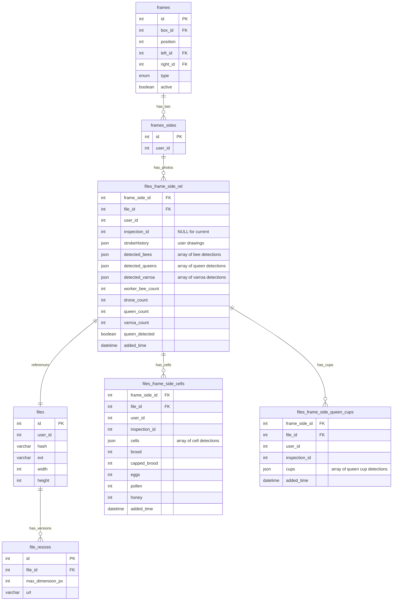
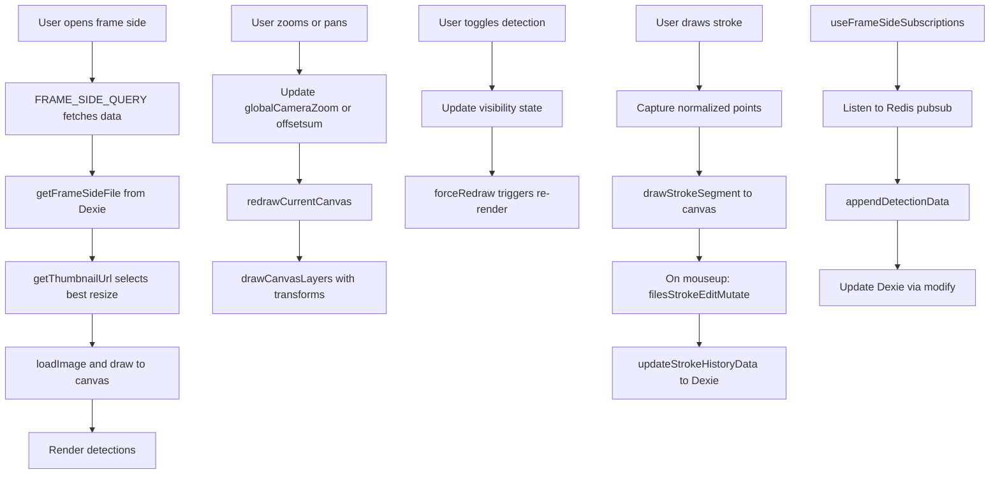

# Управление со стороны рамы — техническая документация

### 🎯 Обзор
Интерактивный просмотрщик фотографий в кадре с возможностью масштабирования, панорамирования, переключения наложения обнаружения и возможности аннотаций. Поддерживает прогрессивную загрузку изображений, рисование на холсте и визуализацию обнаружения в реальном времени для комплексного анализа кадров.

### 🏗️ Архитектура

#### Компоненты
- **FrameSide**: основной компонент контейнера, извлекающий данные на стороне кадра и управляющий состоянием загрузки.
- **FrameSideDrawing**: основной компонент холста, обрабатывающий наложения рисования, масштабирования, панорамирования и обнаружения.
- **DrawingCanvas**: рендеринг холста со встроенной визуализацией обнаружения и пользовательскими аннотациями.
- **uploadFile**: компонент загрузки файла для начальной загрузки фотографии кадра.

#### Услуги
- **image-splitter**: сохраняет загруженные изображения, предоставляет версии с измененным размером, управляет данными обнаружения в формате JSON.
- **swarm-api**: сохраняет структуру фрейма/блока и ссылкиframe_side.
- **web-app**: интерфейсное приложение React с кэшированием локальной базы данных Dexie.

### 📋 Технические характеристики

#### Схема базы данных


#### GraphQL API
```text
type FrameSide {
  id: ID!
  frameId: ID
  isQueenConfirmed: Boolean
  file: File
  cells: FrameSideCells
  frameSideFile: FrameSideFile
  inspections: [FrameSideInspection]
}

type FrameSideFile {
  file: File!
  frameSideId: ID
  hiveId: ID
  strokeHistory: JSON
  detectedBees: JSON
  detectedQueenCount: Int
  detectedWorkerBeeCount: Int
  detectedDroneCount: Int
  isBeeDetectionComplete: Boolean
  detectedCells: JSON
  isCellsDetectionComplete: Boolean
  detectedQueenCups: JSON
  isQueenCupsDetectionComplete: Boolean
  isQueenDetectionComplete: Boolean
  queenDetected: Boolean!
  workerCount: Int
  droneCount: Int
  detectedVarroa: JSON
  varroaCount: Int
}

type File {
  id: ID!
  url: URL!
  resizes: [FileResize]
}

type FileResize {
  id: ID!
  file_id: ID!
  max_dimension_px: Int!
  url: URL!
}

type FrameSideCells {
  id: ID!
  broodPercent: Int
  cappedBroodPercent: Int
  eggsPercent: Int
  pollenPercent: Int
  honeyPercent: Int
}

type FrameSideInspection {
  frameSideId: ID!
  inspectionId: ID!
  file: File
  cells: FrameSideCells
  frameSideFile: FrameSideFile
}

type Query {
  hiveFrameSideFile(frameSideId: ID!): FrameSideFile
  hiveFrameSideCells(frameSideId: ID!): FrameSideCells
  frameSidesInspections(frameSideIds: [ID], inspectionId: ID!): [FrameSideInspection]
  file(id: ID!): File
  hiveFiles(hiveId: ID!): [FrameSideFile]
  boxFiles(boxId: ID!, inspectionId: ID): [BoxFile]
}

type Mutation {
  uploadFrameSide(file: Upload!): File
  addFileToFrameSide(frameSideId: ID!, fileId: ID!, hiveId: ID!): Boolean
  filesStrokeEditMutation(files: [FilesUpdateInput]): Boolean
  updateFrameSideCells(cells: FrameSideCellsInput!): Boolean!
  confirmFrameSideQueen(frameSideId: ID!, isConfirmed: Boolean!): Boolean!
  cloneFramesForInspection(frameSideIDs: [ID], inspectionId: ID!): Boolean!
}

input FilesUpdateInput {
  frameSideId: ID!
  fileId: ID!
  strokeHistory: JSON!
}

input FrameSideCellsInput {
  id: ID!
  broodPercent: Int
  cappedBroodPercent: Int
  eggsPercent: Int
  pollenPercent: Int
  honeyPercent: Int
}
```

### 🔧 Детали реализации

#### Интерфейс (web-app)
- **Framework**: Реагируйте с помощью TypeScript.
- **Рендеринг на холсте**: HTML5 Canvas API.
- **Рисование**: события указателя API для поддержки мыши и сенсорного ввода.
- **Масштабирование**: преобразование CSS с ускорением GPU.
- **Загрузка изображения**: прогрессивный JPEG с эффектом размытия.

#### Прогрессивная загрузка изображений
```
1. Initial load: Select best resize from file_resizes table (>128px width)
2. Image loaded via HTMLImageElement and drawn to canvas
3. Canvas size calculated based on viewport width and device pixel ratio
4. Resizes stored with max_dimension_px and URL in database
```

#### Реализация масштабирования и панорамирования
- **Диапазон масштабирования**: от MIN_ZOOM (1x) до MAX_ZOOM (100x).
- **Средний зум**: MED_ZOOM (2x) для обнаружения мобильных устройств.
- **Механизм масштабирования**: масштабирование холста с помощью globalCameraZoom.
- **Панорамирование**: перемещение на основе перетаскивания со смещением (координаты x, y).
- **Управление панорамированием**: флаг isPanning, startPanPosition, отслеживание InitialPanOffset.
- **Мобильные устройства**: масштабирование отключено в области просмотра шириной менее 1200 пикселей.
- **Ограничения**: запретить масштабирование ниже 1x и выше 100x.


#### Реализация инструмента рисования
- **Рисование от руки**: захват событий перемещения указателя с поддержкой давления.
- **Хранилище путей**: массив StrokeHistory из массивов DrawingLine, каждый из которых содержит DrawingPoint (x, y, lineWidth, цвет).
- **Точки рисования**: нормализованные координаты (0–1) относительно размеров холста.
- **Рендеринг линий**: квадратичные кривые для плавных обводок с помощьюquadaticCurveTo.
- **Отменить**: извлечь последний штрих из массива StrokeHistory.
- **Очистить**: пустой массив StrokeHistory.
- **Постоянство**: filesStrokeEditMutation сохраняется на серверной стороне, updateStrokeHistoryData обновляет кэш Dexie.

#### Поток данных



### 🧪 Тестирование

#### Модульные тесты
- Расчеты масштабирования и ограничения
- Логика рендеринга наложения обнаружения
- Захват и хранение пути рисования.
- Выбор изображения URL в зависимости от уровня масштабирования.
- Управление состоянием переключения обнаружения

#### Интеграционные тесты
- Прогрессивная последовательность загрузки изображений
- Синхронизация данных обнаружения с серверной частью
- Сохранение аннотаций
- Производительность рендеринга холста
- Обработка сенсорных событий на мобильном телефоне

#### E2E-тесты
- Пользователь загружает фотографию и просматривает ее.
- Пользователь плавно увеличивает и уменьшает масштаб
- Пользователь включает/выключает типы обнаружения.
- Пользователь рисует аннотации и отменяет действия.
- Пользователь переключается между сторонами кадра

### 📊 Вопросы производительности

#### Оптимизации
- **Мемоизация холста**: React.memo при наложении обнаружения.
- **Регулирование рендеринга**: RequestAnimationFrame для плавного масштабирования.
- **Предварительная загрузка изображения**: предварительная загрузка следующего уровня масштабирования.
- **Пакетирование обнаружения**: рендеринг всех обнаружений одного типа за один проход.
- **Ускорение GPU**: CSS-преобразования для масштабирования и панорамирования.
- **Ленивый рендеринг**: отображать только видимые обнаружения.

#### Метрики
- Начальная загрузка: менее 500 мс (маленькое изображение)
- Переход масштабирования: менее 100 мс (60 кадров в секунду)
- Переключение обнаружения: менее 50 мс
- Скорость отклика при рисовании: менее 16 мс (60 кадров в секунду)
- Память: до 100 МБ для больших изображений.

#### Узкие места
– Большие изображения (более 4000x3000 пикселей) могут повлиять на работу мобильных устройств.
- Множество обнаружений (более 1000) медленного рендеринга наложения.
- Рисование с большим количеством путей (более 100) влияет на производительность отмены.

### 🚫 Технические ограничения
- Максимальное увеличение 100x (может пикселизироваться при экстремальных уровнях масштабирования)
- Инструменты рисования ограничены от руки (без фигур и текста).
- Нет совместных аннотаций (только для одного пользователя)
- Аннотации не версионированы (перезаписываются при сохранении)
- Производительность мобильных устройств снижается при использовании очень больших изображений.
- Масштабирование отключено на мобильных устройствах (ширина < 1200 пикселей).

### 🔗 Сопутствующая документация
- [Загрузка фотографии в рамке Техническая документация](./frame-photo-upload.md)
- [Техническая документация по обнаружению королевы](./queen-detection.md)

### 📚 Ресурсы для разработки
- [web-app компоненты рамы](https://github.com/Gratheon/web-app/tree/main/src/page/hiveEdit/frame)
- [image-splitter GraphQL резольверы](https://github.com/Gratheon/image-splitter/blob/main/src/graphql/resolvers.ts)
- [Холст API Документация](https://developer.mozilla.org/en-US/docs/Web/API/Canvas_API)
- [API событий указателя](https://developer.mozilla.org/en-US/docs/Web/API/Pointer_events)

### 💬 Технические примечания
- Реализована поддержка панорамирования, но ее можно улучшить с помощью сенсорных жестов.
- Средство рендеринга WebGL может повысить производительность при многих обнаружениях.
- Рассмотрите формат WebP для изображений меньшего размера с тем же качеством.
- Инструмент рисования может выиграть от наложения SVG вместо Canvas для лучшего качества.
- Сенсорные жесты (масштабирование щипком) улучшат работу на мобильных устройствах (в настоящее время масштабирование отключено на мобильных устройствах).
– Рассмотрите возможность добавления инструментов измерения (линейка, калькулятор площади).

---
**Последнее обновление**: 5 декабря 2025 г.