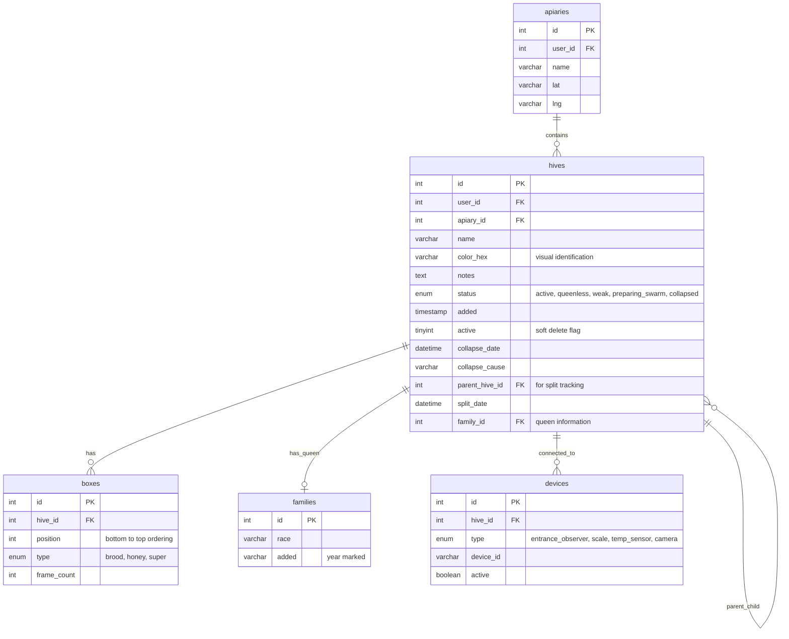
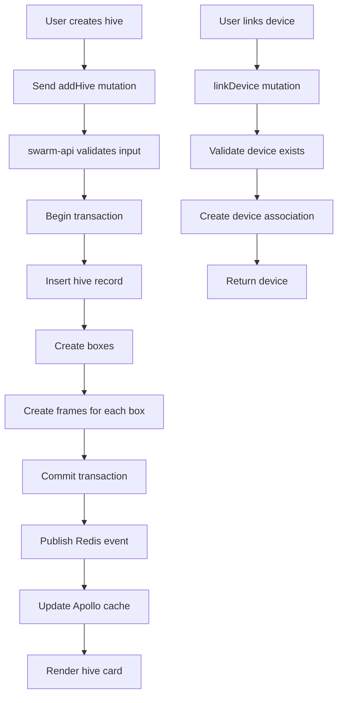

# Управление ульем — техническая документация

### 🎯 Обзор
Основные операции CRUD улья с управлением иерархической структурой, отслеживанием статуса, интеграцией устройств и поддержкой происхождения колоний. Позволяет пчеловодам создавать и систематизировать отдельные записи ульев с отслеживанием оборудования и ассоциацией датчиков.

### 🏗️ Архитектура

#### Компоненты
- **HiveList**: компонент React, отображающий все ульи на пасеке.
- **HiveCard**: индивидуальная визуализация улья с указанием цвета, имени и статуса.
- **HiveEditor**: компонент формы для создания/редактирования сведений об кусте.
- **HiveStatusBadge**: визуальный индикатор состояния здоровья улья.
- **DeviceAssociationPanel**: пользовательский интерфейс для связи датчиков и камер.

#### Услуги
- **swarm-api**: основная служба, обрабатывающая операции CRUD куста.
- **gate-video-stream**: Интегрируется с камерами наблюдения на входе.
- **beehive-sensors**: связывает датчики температуры/влажности.
- **graphql-router**: запросы куста маршрутизации шлюза федерации.

### 📋 Технические характеристики

#### Схема базы данных


#### GraphQL API
```graphql
type Hive {
  id: ID!
  name: String!
  color: String
  status: HiveStatus!
  notes: String
  apiary: Apiary!
  boxes: [Box!]!
  family: Family
  devices: [Device!]
  parentHive: Hive
  childHives: [Hive!]
  collapseDate: DateTime
  collapseCause: String
  splitDate: DateTime
  added: DateTime!
  active: Boolean!
}

enum HiveStatus {
  ACTIVE
  QUEENLESS
  WEAK
  PREPARING_SWARM
  COLLAPSED
}

type Box {
  id: ID!
  position: Int!
  type: BoxType!
  frameCount: Int!
  frames: [Frame!]
}

enum BoxType {
  BROOD
  HONEY
  SUPER
}

type Device {
  id: ID!
  type: DeviceType!
  deviceId: String!
  active: Boolean!
}

enum DeviceType {
  ENTRANCE_OBSERVER
  SCALE
  TEMP_SENSOR
  CAMERA
}

input HiveInput {
  apiaryId: ID!
  name: String!
  color: String
  notes: String
  boxCount: Int!
  framesPerBox: Int!
}

input UpdateHiveInput {
  id: ID!
  name: String
  color: String
  notes: String
  status: HiveStatus
}

type Query {
  hive(id: ID!): Hive!
  hives(apiaryId: ID!): [Hive!]!
  hivesByStatus(status: HiveStatus!): [Hive!]!
}

type Mutation {
  addHive(input: HiveInput!): Hive!
  updateHive(input: UpdateHiveInput!): Hive!
  deleteHive(id: ID!): Boolean!
  setHiveStatus(hiveId: ID!, status: HiveStatus!): Hive!
  linkDevice(hiveId: ID!, deviceType: DeviceType!, deviceId: String!): Device!
  unlinkDevice(deviceId: ID!): Boolean!
}
```

### 🔧 Детали реализации

#### Интерфейс (web-app)
- **Framework**: Реагируйте с помощью TypeScript.
- **Управление состоянием**: кэш клиента Apollo.
- **Палитра цветов**: палитра цветов React для идентификации улья.
- **Выбор статуса**: раскрывающийся список со значками-индикаторами.
- **Drag-and-Drop**: для изменения порядка ульев на пасеке (в будущем).

#### Серверная часть (swarm-api)
- **Язык**: Перейти
- **База данных**: MySQL с ограничениями внешнего ключа.
- **Транзакции**: атомный улей + ящики + создание фреймов.
- **Мягкое удаление**: активный флаг предотвращает потерю данных.
- **Каскадные правила**: ВКЛ. УДАЛЕНИЕ КАСКАДА для блоков/фреймов.

#### Ключевые операции

**Создать улей**
```go
func (r *mutationResolver) AddHive(ctx context.Context, input HiveInput) (*Hive, error) {
    tx := r.DB.Begin()
    
    // Create hive record
    hive := &Hive{
        UserID: userID,
        ApiaryID: input.ApiaryId,
        Name: input.Name,
        Color: input.Color,
        Status: "active",
    }
    tx.Create(hive)
    
    // Create initial boxes and frames
    for i := 0; i < input.BoxCount; i++ {
        box := &Box{
            HiveID: hive.ID,
            Position: i,
            Type: "brood",
            FrameCount: input.FramesPerBox,
        }
        tx.Create(box)
        
        // Create frames for this box
        for j := 0; j < input.FramesPerBox; j++ {
            frame := &Frame{
                BoxID: box.ID,
                Position: j,
            }
            tx.Create(frame)
        }
    }
    
    tx.Commit()
    return hive, nil
}
```

#### Поток данных


### ⚙️ Конфигурация

**Переменные среды (swarm-api)**
```bash
MYSQL_HOST=localhost
MYSQL_PORT=3306
MYSQL_DATABASE=swarm
MYSQL_USER=swarm_api
MYSQL_PASSWORD=<secret>

JWT_SECRET=<secret>

REDIS_HOST=localhost:6379
REDIS_PASSWORD=<secret>

DEFAULT_BOX_COUNT=2
DEFAULT_FRAMES_PER_BOX=10
MAX_BOXES_PER_HIVE=10
MAX_FRAMES_PER_BOX=12
```

### 🧪 Тестирование

#### Модульные тесты
- Операции Hive CRUD
- Проверка переходов состояний
- Проверка шестнадцатеричного цвета
- Логика связывания устройств
- Поведение мягкого удаления

#### Интеграционные тесты
- Полное создание улья с коробками и рамками
- Обновление Hive сохраняет отношения
- Удаление ульев каскадируется в коробки/рамки.
- Привязка устройства и отсоединение
- Отношения между родителями и детьми в улье.

#### E2E-тесты
- Пользователь создает улей из 2 коробок по 10 рамок в каждой.
- Пользователь редактирует имя и цвет улья.
- Пользователь меняет статус улья на «безматочный».
- Пользователь связывает устройство наблюдения за входом
- Пользователь удаляет куст (мягкое удаление)

### 📊 Вопросы производительности

#### Оптимизации
- Индексы базы данных по user_id, apiary_id, активные
- Пакетная обработка транзакций для создания ульев + ящиков + фреймов.
- Кэширование Redis для часто используемых кустов.
- Пагинация для больших списков пасечных ульев.
- Ленивая загрузка коробок и рамок

#### Метрики
- Создание улья: менее 300 мс (с 2 ящиками, 20 рамками)
- Обновление улья: менее 100 мс.
- Удаление улья (мягкое): менее 50 мс.
- Запрос списка ульев: менее 200 мс (с 50 ульями)
- Соединение устройств: менее 100 мс

#### Узкие места
- Создание ульев с множеством коробок (более 5) и рамок (всего более 50)
- Запрос списка ульев с полными данными блока/фрейма (используйте нумерацию страниц)
- Обновления в реальном времени для многих одновременных пользователей

### 🚫 Технические ограничения
- Максимум 10 коробок на улей (настраивается)
- Максимум 12 рамок в коробке (стандарт Лангстрота)
- Цвет должен соответствовать допустимому шестнадцатеричному коду (#RRGGBB).
- Невозможно восстановить удаленные ульи.
- Устройство должно существовать перед связыванием (автоматическое создание отсутствует)
- Отношения родитель-потомок не отслеживают операции слияния (только разделения).

### 🔗 Сопутствующая документация
- [Техническая документация по управлению пасекой](./apiary-management.md)
- [Техническая документация разделенной колонии](./split-colony.md)
- [Техническая документация «Присоединиться к колониям»](./join-colonies.md)

### 📚 Ресурсы для разработки
- [swarm-api репозиторий](https://github.com/Gratheon/swarm-api)
- [GraphQL схема](https://github.com/Gratheon/graphql-schema-registry)
- [Управление ульем UI](https://github.com/Gratheon/web-app/src/components/HiveCard)

### 💬 Технические примечания
- Рассмотрите возможность добавления GPS-координат на уровне улья (в настоящее время только на уровне пасеки).
- Переходы состояний могут быть автоматизированы на основе результатов обнаружения королевы.
- Палитра цветов может предлагать цвета на основе соглашения о маркировке года пчеловодства.
- Возможно, вы захотите добавить временную шкалу «заметок», чтобы отслеживать наблюдения инспекций с течением времени.
- Для связывания устройств можно использовать сканирование QR-кода для упрощения настройки.
- Рассмотрите возможность добавления шаблонов ульев для распространенных конфигураций (8-рамочный, 10-рамочный, верхняя панель).

---
**Последнее обновление**: 5 декабря 2025 г.
**Поддерживается**: серверная команда

