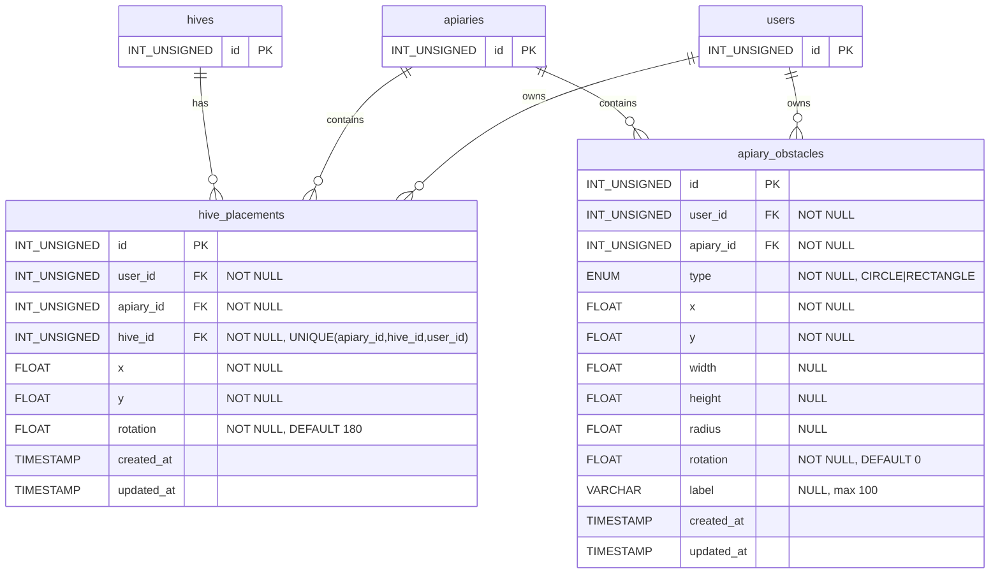

# Планировщик размещения ульев — техническая документация

### 🎯 Обзор
Интерактивный инструмент планирования на основе холста для оптимального размещения ульев на пасеках. Включает симуляцию солнца в реальном времени, рендеринг многоугольных теней и комплексное манипулирование объектами с функцией автоматического сохранения. Создан с использованием хуков HTML5 Canvas и React.

### 🏗️ Архитектура

#### Компоненты
- **HivePlacement**: основной компонент React (`/web-app/src/page/apiaryEdit/hivePlacement/index.tsx`).
- **Рендеринг на холсте**: пользовательские функции рисования ульев, препятствий, теней и элементов пользовательского интерфейса.
- **Управление состоянием**: перехватчики React с размещением на основе карты для поиска O(1).

#### Услуги
- **swarm-api**: размещение улья CRUD, управление препятствиями, GraphQL API
- **web-app**: приложение Frontend React с рендерингом на холсте.
- **mysql**: сохранение данных о местах размещения и препятствиях.

### 📋 Технические характеристики

#### Схема базы данных

Миграция: `20251208190000_add_hive_placement.sql`



**Индексы:**
- `hive_placements`: `idx_apiary_user (apiary_id, user_id)`
- `apiary_obstacles`: `idx_apiary_user (apiary_id, user_id)`

**Ограничения:**
- Все внешние ключи: `ON DELETE CASCADE`.
- `hive_placements`: уникальное ограничение для `(apiary_id, hive_id, user_id)`.

#### GraphQL API
```graphql
type HivePlacement {
  id: ID!
  apiaryId: ID!
  hiveId: ID!
  x: Float!
  y: Float!
  rotation: Float!
}

type ApiaryObstacle {
  id: ID!
  apiaryId: ID!
  type: ObstacleType!
  x: Float!
  y: Float!
  width: Float
  height: Float
  radius: Float
  rotation: Float!
  label: String
}

enum ObstacleType {
  CIRCLE
  RECTANGLE
}

input ApiaryObstacleInput {
  type: ObstacleType!
  x: Float!
  y: Float!
  width: Float
  height: Float
  radius: Float
  rotation: Float!
  label: String
}

# Queries
hivePlacements(apiaryId: ID!): [HivePlacement!]!
apiaryObstacles(apiaryId: ID!): [ApiaryObstacle!]!

# Mutations
updateHivePlacement(
  apiaryId: ID!
  hiveId: ID!
  x: Float!
  y: Float!
  rotation: Float!
): HivePlacement!

addApiaryObstacle(
  apiaryId: ID!
  obstacle: ApiaryObstacleInput!
): ApiaryObstacle!

updateApiaryObstacle(
  id: ID!
  obstacle: ApiaryObstacleInput!
): ApiaryObstacle!

deleteApiaryObstacle(id: ID!): Boolean!
```

### 🔧 Детали реализации

#### Архитектура frontend

**Управление государством**
```typescript
// Placements stored as Map for O(1) access
const [placements, setPlacements] = useState<Map<string, HivePlacement>>(new Map())
const [obstacles, setObstacles] = useState<Obstacle[]>([])

// Interaction states
const [selectedHive, setSelectedHive] = useState<string | null>(null)
const [selectedObstacle, setSelectedObstacle] = useState<string | null>(null)
const [isDragging, setIsDragging] = useState(false)
const [isDraggingRotation, setIsDraggingRotation] = useState(false)
const [isDraggingObstacle, setIsDraggingObstacle] = useState(false)
const [isResizingObstacle, setIsResizingObstacle] = useState(false)
const [isDraggingObstacleRotation, setIsDraggingObstacleRotation] = useState(false)

// Sun simulation
const [sunAngle, setSunAngle] = useState(90) // Start at East
const [autoRotate, setAutoRotate] = useState(false)
```

**Размеры холста**
```typescript
const HIVE_SIZE = 30 // pixels
const CANVAS_HEIGHT = 600 // fixed height
const [canvasWidth, setCanvasWidth] = useState(800) // dynamic, responsive

// ResizeObserver for width tracking
useEffect(() => {
  const updateCanvasWidth = () => {
    if (containerRef.current) {
      const width = containerRef.current.offsetWidth
      setCanvasWidth(Math.max(600, width))
    }
  }
  
  const observer = new ResizeObserver(updateCanvasWidth)
  if (containerRef.current) observer.observe(containerRef.current)
  
  return () => observer.disconnect()
}, [])
```

**Конвейер рендеринга**
```typescript
const drawCanvas = () => {
  const ctx = canvas.getContext('2d')
  
  // 1. Clear canvas
  ctx.clearRect(0, 0, canvasWidth, CANVAS_HEIGHT)
  
  // 2. Draw background
  ctx.fillStyle = '#e8f5e9'
  ctx.fillRect(0, 0, canvasWidth, CANVAS_HEIGHT)
  
  // 3. Draw compass with sun
  drawCompass(ctx)
  
  // 4. Draw shadows (obstacles + hives)
  drawShadows(ctx)
  
  // 5. Draw obstacles with handles
  drawObstacles(ctx)
  
  // 6. Draw hives with handles
  drawHives(ctx)
}
```

**Теневой алгоритм (критический)**
```typescript
// Shadow offset calculation (away from sun)
const angleRad = (sunAngle - 90) * (Math.PI / 180)
const shadowLength = 80
const shadowOffsetX = -Math.cos(angleRad) * shadowLength  // Negative = away from sun
const shadowOffsetY = -Math.sin(angleRad) * shadowLength

// Polygonal shadow for rectangles
const drawRectangleShadow = (obstacle) => {
  const rotRad = (obstacle.rotation || 0) * (Math.PI / 180)
  
  // 1. Get rotated corners
  const corners = [
    { x: -width/2, y: -height/2 },
    { x: width/2, y: -height/2 },
    { x: width/2, y: height/2 },
    { x: -width/2, y: height/2 }
  ]
  const rotatedCorners = corners.map(c => ({
    x: obs.x + c.x * Math.cos(rotRad) - c.y * Math.sin(rotRad),
    y: obs.y + c.x * Math.sin(rotRad) + c.y * Math.cos(rotRad)
  }))
  
  // 2. Draw continuous path: object → shadow → close
  ctx.beginPath()
  // Draw object outline
  rotatedCorners.forEach((c, i) => {
    if (i === 0) ctx.moveTo(c.x, c.y)
    else ctx.lineTo(c.x, c.y)
  })
  // Draw to shadow projections (reverse order)
  for (let i = rotatedCorners.length - 1; i >= 0; i--) {
    const c = rotatedCorners[i]
    ctx.lineTo(c.x + shadowOffsetX, c.y + shadowOffsetY)
  }
  ctx.closePath()
  ctx.fill()
}
```

**Стратегия инициализации (шаблон слияния)**
```typescript
useEffect(() => {
  if (loading || !hives.length) return
  
  const map = new Map()
  
  // 1. Load saved placements from backend
  if (data?.hivePlacements) {
    data.hivePlacements.forEach(p => map.set(p.hiveId, p))
  }
  
  // 2. Add defaults for hives without placements
  hives.forEach((hive, index) => {
    if (!map.has(hive.id)) {
      map.set(hive.id, {
        hiveId: hive.id,
        x: 150 + (index % 5) * 120,
        y: 150 + Math.floor(index / 5) * 100,
        rotation: 180  // South-facing by default
      })
    }
  })
  
  setPlacements(map)
  setInitializedPlacements(true)
}, [data, hives.length, loading])
```

#### Бэкэнд (Go)

**Модели**
```go
// graph/model/hive_placement.go
type HivePlacement struct {
    ID       uint    `json:"id"`
    UserID   uint    `json:"userId"`
    ApiaryID uint    `json:"apiaryId"`
    HiveID   uint    `json:"hiveId"`
    X        float64 `json:"x"`
    Y        float64 `json:"y"`
    Rotation float64 `json:"rotation"`
}

func (hp *HivePlacement) Upsert(apiaryId, hiveId string, x, y, rotation float64) (*HivePlacement, error) {
    // Check for existing placement
    var existingID uint
    err := hp.Db.QueryRow(`
        SELECT id FROM hive_placements 
        WHERE apiary_id=? AND hive_id=? AND user_id=?
    `, apiaryId, hiveId, hp.UserID).Scan(&existingID)
    
    if err == sql.ErrNoRows {
        // Insert new
        result, err := hp.Db.Exec(`
            INSERT INTO hive_placements (user_id, apiary_id, hive_id, x, y, rotation)
            VALUES (?, ?, ?, ?, ?, ?)
        `, hp.UserID, apiaryId, hiveId, x, y, rotation)
        // ... handle result
    } else {
        // Update existing
        _, err = hp.Db.Exec(`
            UPDATE hive_placements 
            SET x=?, y=?, rotation=? 
            WHERE id=? AND user_id=?
        `, x, y, rotation, existingID, hp.UserID)
        // ... handle result
    }
}
```

**Резолверы**
```go
// graph/schema.resolvers.go
func (r *queryResolver) HivePlacements(ctx context.Context, apiaryID string) ([]*model.HivePlacement, error) {
    uid := ctx.Value("userID").(string)
    return (&model.HivePlacement{
        Db:     r.Resolver.Db,
        UserID: uid,
    }).List(apiaryID)
}

func (r *mutationResolver) UpdateHivePlacement(ctx context.Context, 
    apiaryID string, hiveID string, x float64, y float64, rotation float64) (*model.HivePlacement, error) {
    uid := ctx.Value("userID").(string)
    return (&model.HivePlacement{
        Db:     r.Resolver.Db,
        UserID: uid,
    }).Upsert(apiaryID, hiveID, x, y, rotation)
}
```

### 🎨 Шаблоны взаимодействия

#### Обработка событий мыши
```typescript
handleCanvasMouseDown(e) {
  const { x, y } = getMousePos(e)
  
  // Priority 1: Check selected object handles
  if (selectedObstacle) {
    if (isOverResizeHandle(x, y)) {
      setIsResizingObstacle(true)
      return
    }
    if (isOverRotationHandle(x, y)) {
      setIsDraggingObstacleRotation(true)
      return
    }
    if (isInsideObstacle(x, y)) {
      setIsDraggingObstacle(true)
      return
    }
  }
  
  // Priority 2: Check hive handles
  if (selectedHive) {
    if (isOverHiveRotationHandle(x, y)) {
      setIsDraggingRotation(true)
      return
    }
    if (isInsideHive(x, y)) {
      setIsDragging(true)
      return
    }
  }
  
  // Priority 3: Select new object
  for (const obstacle of obstacles) {
    if (isInsideObstacle(x, y, obstacle)) {
      setSelectedObstacle(obstacle.id)
      setSelectedHive(null)
      setIsDraggingObstacle(true)
      return
    }
  }
  
  for (const hive of hives) {
    if (isInsideHive(x, y, hive)) {
      setSelectedHive(hive.id)
      setSelectedObstacle(null)
      setIsDragging(true)
      return
    }
  }
}
```

#### Стратегия автосохранения
```typescript
handleCanvasMouseUp() {
  // Only save on mouse up, not on every move
  if ((isDraggingObstacle || isResizingObstacle || isDraggingObstacleRotation) 
      && selectedObstacle) {
    const obs = obstacles.find(o => o.id === selectedObstacle)
    if (obs) {
      updateObstacle({
        id: selectedObstacle,
        obstacle: {
          type: obs.type,
          x: obs.x,
          y: obs.y,
          width: obs.width,
          height: obs.height,
          radius: obs.radius,
          rotation: obs.rotation
        }
      })
    }
  }
  
  if ((isDragging || isDraggingRotation) && selectedHive) {
    const placement = placements.get(selectedHive)
    if (placement) {
      updatePlacement({
        apiaryId,
        hiveId: selectedHive,
        x: placement.x,
        y: placement.y,
        rotation: placement.rotation
      })
    }
  }
  
  // Reset all dragging states
  setIsDragging(false)
  setIsDraggingRotation(false)
  setIsDraggingObstacle(false)
  setIsDraggingObstacleRotation(false)
  setIsResizingObstacle(false)
}
```

### 📊 Вопросы производительности

**Оптимизация рендеринга**
— Холст перерисовывается при изменении состояния (приемлемо для объектов `<100`).
- Расчет теней: O(n), где n = препятствия + ульи.
– Места размещения на основе карты: поиск O(1).
- ResizeObserver регулируется браузером (~ 16 мс)

**Управление памятью**
- Один элемент холста (без утечек памяти)
— Прослушиватели событий правильно очищены в useEffect.
- Обновления карты создают новую карту (неизменяемый шаблон).
- Нет роста памяти во время длительных сеансов

**Оптимизация сети**
- Отменены сохранения (только при поднятии мыши)
- мутации GraphQL, пакетно распространяемые браузером.
- Нет опроса (обновления на основе push через мутации)
- Запросы, кэшированные клиентом Apollo.

### 🔒 Безопасность

**Авторизация**
- Идентификатор пользователя из контекста JWT.
- Все запросы фильтруются по user_id
- Ограничения внешнего ключа предотвращают потерю данных.
- ON DELETE CASCADE для очистки данных.

**Проверка ввода**
- Система типа Go проверяет входные данные GraphQL.
- Ограничения базы данных обеспечивают целостность данных.
- Интерфейс предотвращает размещение за пределами поля
- Установлены ограничения минимального/максимального размера.

**Изоляция данных**
- Каждый пользователь видит только свои места размещения
- Уникальные ограничения предотвращают дублирование мест размещения.
- Изоляция на уровне пасеки в запросах

### 🐛 Известные проблемы и ограничения

1. **Поддержка браузера**: ResizeObserver недоступен в IE11 (приемлемо).
2. **Touch Events**: базовая поддержка, не оптимизирована для мобильных устройств.
3. **Отменить/Повторить**: не реализовано (будущее улучшение).
4. **Навигация с помощью клавиатуры**: не реализовано (пробел в доступности).
5. **Средства чтения с экрана**: ограниченная поддержка (интерфейс на основе холста).

### 🚀 Будущие улучшения

**Этап 2**
- Инструмент измерения расстояния
- Наложение визуализации траектории полета
- Индикатор направления ветра
- Печать/экспорт в PDF

**Этап 3**
- Импортировать препятствия со спутниковых снимков.
- Клонировать макет на другие пасеки
- Сезонные настройки угла солнца
- Оптимизация мобильных сенсорных жестов

**Этап 4**
- Совместное планирование (многопользовательское)
- Историческое управление версиями макета
- Библиотека шаблонов макетов
- AR-визуализация (наложение мобильной камеры)

### 📚 Сопутствующая документация
- [Управление пасекой](./apiary-management.md)
- [Управление ульем](./hive-management.md)
- [Регистрация пользователя](./user-registration.md)

### 🧪 Тестирование
Подробные сценарии тестирования и критерии приемки см. в [HIVE_PLACEMENT_TESTING.md](https://github.com/Gratheon/web-app/blob/main/docs/HIVE_PLACEMENT_TESTING.md).

