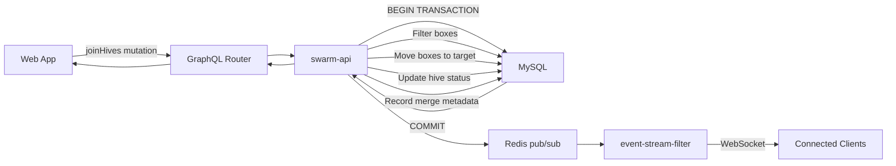

# Присоединяйтесь к колониям — техническая документация

### 🎯 Обзор
Функция «Присоединиться к колониям» позволяет объединить две пчелиные семьи путем перемещения ящиков из исходного улья в целевой, с опциями управления матками, автоматической фильтрацией типов ящиков и полным историческим отслеживанием. Трансляция событий в реальном времени обеспечивает согласованность пользовательского интерфейса во всех сеансах.

### 🏗️ Архитектура

#### Компоненты
- **JoinColonyModal**: компонент React (260 строк) с двухпанельным сравнением кустов.
- **joinHives**: мутация GraphQL с проверкой и атомарными операциями.
- **event-stream-filter**: трансляция событий в реальном времени для обновлений пользовательского интерфейса.

#### Услуги
- **swarm-api**: основная логика слияния, перемещение блоков, обновления статуса.
- **web-app**: пользовательский интерфейс frontend с интерактивным переключением типа слияния.
- **Redis**: pub/sub для трансляции событий в реальном времени.
- **event-stream-filter**: соединения WebSocket для обновлений в реальном времени.

#### Поток данных


### 📋 Технические характеристики

#### Схема базы данных
```sql
ALTER TABLE hives
  ADD COLUMN merged_into_hive_id INT UNSIGNED NULL,
  ADD COLUMN merge_date DATETIME NULL,
  ADD COLUMN merge_type ENUM('both_queens', 'source_queen_kept', 'target_queen_kept') NULL,
  ADD INDEX idx_merged_into_hive_id (merged_into_hive_id);
```

#### GraphQL API

**Мутация**
```graphql
mutation JoinHives($sourceHiveId: ID!, $targetHiveId: ID!, $mergeType: MergeType!) {
  joinHives(
    sourceHiveId: $sourceHiveId
    targetHiveId: $targetHiveId
    mergeType: $mergeType
  ) {
    id
    name
    status
    mergedIntoHiveId
    mergeDate
    mergeType
    mergedFromHives {
      id
      name
      mergeDate
      mergeType
    }
  }
}

enum MergeType {
  both_queens
  source_queen_kept
  target_queen_kept
}
```

**Запрос**
```graphql
query GetHive($hiveId: ID!) {
  hive(id: $hiveId) {
    id
    name
    status
    mergedIntoHive {
      id
      name
    }
    mergedFromHives {
      id
      name
      mergeDate
      mergeType
    }
  }
}
```

#### События Redis
```
hive:join:{targetHiveId}
hive:merged:{sourceHiveId}
```

### 🔧 Детали реализации

#### Фронтенд
- **Framework**: Реагируйте с помощью TypeScript.
- **Управление состоянием**: useState для модального состояния, выбора цели, типа слияния.
- **Компоненты пользовательского интерфейса**:
  - Двухпанельный макет (источник слева, цель справа)
  - Кнопка переключения типа слияния (циклически переключается между 3 вариантами)
  - Проверка в реальном времени и обработка ошибок
- **Обработка событий**: подписка на WebSocket для получения обновлений в реальном времени.

#### Бэкэнд (Go)
**Логика фильтрации блоков**
```go
func filterMovableBoxes(boxes []Box) []Box {
    var movableBoxes []Box
    for _, box := range boxes {
        if box.Type != "BOTTOM" && box.Type != "GATE" {
            movableBoxes = append(movableBoxes, box)
        }
    }
    return movableBoxes
}
```

**Процесс объединения**
1. Проверка существования исходного и целевого ульев.
2. Подтвердить ту же пасеку
3. Проверьте исходный код, который еще не объединен.
4. Получите все коробки из исходного улья.
5. Фильтры (исключая ДНО и ВОРОТА)
6. Получите максимальную позицию в целевом улье.
7. Начать транзакцию
8. Переместите коробки: `UPDATE boxes SET hive_id = ?, position = ? WHERE id IN (?)`.
9. Обновить исходный куст: `UPDATE hives SET status = 'merged', merged_into_hive_id = ?, merge_date = NOW(), merge_type = ? WHERE id = ?`.
10. Зафиксировать транзакцию
11. Публикация событий Redis
12. Верните обновленный целевой улей.

#### Производительность
- Транзакция базы данных обеспечивает атомарность (все или ничего)
- Фильтрация ящиков выполняется в памяти (быстрая работа)
- Перерасчет позиции в одном ОБНОВЛЕНИИ
- Redis pub/sub неблокирует ответ на мутацию.
- События WebSocket доставляются асинхронно.

### ⚙️ Конфигурация
Никакой специальной настройки не требуется. Использует существующие:
- пул соединений MySQL
- Соединение Redis для публикации/подписки
- Сервер WebSocket в фильтре потока событий.