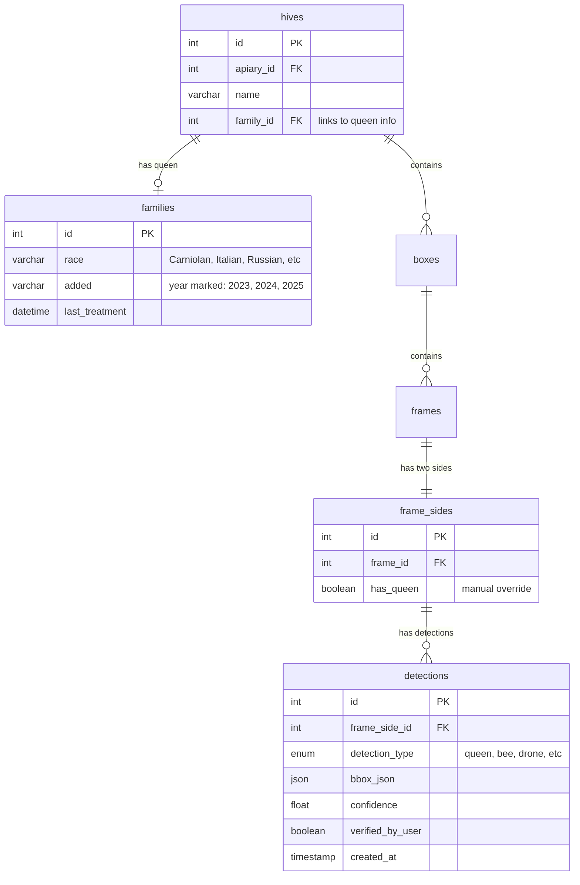
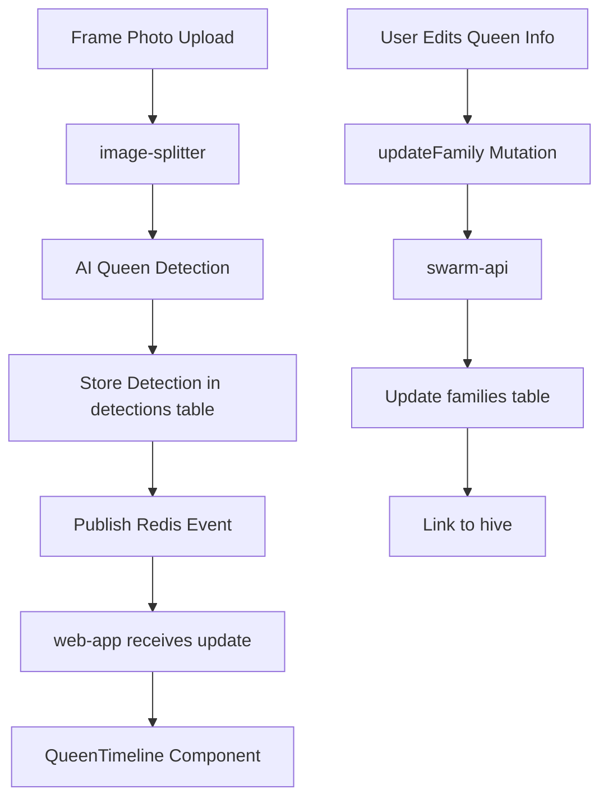

# Queen Management – ​​Техническая документация

### 🎯 Обзор
Система управления информацией о жизненном цикле пчелиных маток и разведении, отслеживающая изменения присутствия, расы, возраста и статуса. Интегрируется с обнаружением искусственного интеллекта для автоматического обнаружения маток и обеспечивает пчеловодам визуализацию временной шкалы для мониторинга репродуктивного здоровья пчелиной семьи и планирования замены маток.

### 🏗️ Архитектура

#### Компоненты
- **QueenStatusPanel**: компонент React для переключения присутствия ферзя в каждом кадре.
- **QueenInfoEditor**: добавлена форма для редактирования расы, цвета и года королевы.
- **QueenTimeline**: визуализация календаря, показывающая наблюдения королевы и этапы ее жизненного цикла.
- **QueenIndicator**: значок, показывающий статус присутствия королевы в обзоре улья.

#### Услуги
- **swarm-api**: Сохраняет данные о семье (королеве) и присутствии королевы на уровне кадра.
- **image-splitter**: предоставляет результаты обнаружения королевы AI.
- **graphql-router**: объединяет запросы между службами.

### 📋 Технические характеристики

#### Схема базы данных


#### GraphQL API
```graphql
type Family {
  id: ID!
  race: String
  added: String
  age: Int
  lastTreatment: DateTime
  treatments: [Treatment]
}

input FamilyInput {
  id: ID
  race: String
  added: String
}

type Hive {
  id: ID!
  name: String
  family: Family
  boxes: [Box]
  lastQueenSighting: DateTime
  queenPresent: Boolean
}

type FrameSide {
  id: ID!
  brood: Int
  cappedBrood: Int
  eggs: Int
  pollen: Int
  honey: Int
  queenDetections: [QueenDetection]
  hasQueen: Boolean
}

type Query {
  hive(id: ID!): Hive
  queenTimeline(hiveId: ID!): [QueenSighting]
}

type Mutation {
  updateFamily(hiveId: ID!, input: FamilyInput!): Family
  markQueenPresence(frameSideId: ID!, present: Boolean!): FrameSide
}

type QueenSighting {
  date: DateTime!
  frameSideId: ID!
  confidence: Float
  manuallyVerified: Boolean
}
```

### 🔧 Детали реализации

#### Фронтенд
- **Framework**: Реагируйте с помощью TypeScript.
- **Управление состоянием**: кэш клиента Apollo.
- **Временная шкала**: пользовательский компонент календаря, показывающий историю наблюдения королевы.
- **Формы**: форма React Hook для редактирования информации о королеве.
- **Визуализация**: цветные индикаторы присутствия королевы в каждом кадре.

#### Серверная часть (swarm-api)
- **Язык**: Перейти
- **База данных**: MySQL с отношениями внешнего ключа.
- **Расчет возраста**: вычисляемое поле на основе года `added` по сравнению с текущим годом.

#### Ключевые операции

**Мутации**
- `updateFamily(hiveId, input)` — Создание или обновление информации о разведении маток для улья.
- `markQueenPresence(frameSideId, present)` - Переключить присутствие ферзя на определенной стороне кадра

**Запросы**
- `hive(id)` — Получить улей с информацией о семье/королеве.
- `queenTimeline(hiveId)` — Получить хронологический список наблюдений королев на основе обнаружений ИИ.

**Вычисляемые поля**
- `Family.age` — Рассчитать возраст королевы на основе добавленного года по сравнению с текущим годом.
- `Hive.queenPresent` — совокупное логическое значение на основе данных недавнего обнаружения.
- `Hive.lastQueenSighting` — дата последнего обнаружения.

#### Поток данных


### ⚙️ Конфигурация

#### Переменные среды
```bash
MYSQL_HOST=localhost
MYSQL_PORT=3306
MYSQL_DATABASE=swarm
MYSQL_USER=root
MYSQL_PASSWORD=pass

JWT_SECRET=xxx

QUEEN_DETECTION_CONFIDENCE_THRESHOLD=0.6
```

### 🧪 Тестирование

#### Модульные тесты
- Местоположение: `/test/family_test.go`
- Охват: операции CRUD, расчет возраста, запросы временной шкалы.
- Тесты:
  - Создать семью с расой и годом
  - Обновить информацию о семье
  - Рассчитать возраст королевы по добавленному году
  - Временная шкала запроса королевы с обнаружениями
  - Фильтрация обнаружений с низкой достоверностью

#### Интеграционные тесты
- Местоположение: `/test/integration/queen_management_test.go`
- Тесты:
  - Полный рабочий процесс: загрузка фотографии → обнаружение AI → проверка вручную → обновление временной шкалы.
  - Жизненный цикл семьи с разделением улья
  - Отслеживание нескольких ульев королевы
  - Краевые случаи расчета возраста

#### E2E-тесты
Сценарии ручного тестирования:
- Создать улей, добавить информацию о королеве, проверить отображение
- Загрузите кадр с королевой, проверьте обновление временной шкалы.
- Разделенный улей, королева следов как у родителя, так и у ребенка
- Редактировать расу королев, проверять настойчивость

### 📊 Вопросы производительности

#### Оптимизации
- **Индексированные запросы**: Frame_side_id +Detection_type индексируются для быстрых запросов на временной шкале.
- **Вычисляемый возраст**: возраст рассчитывается «на лету» (без сохраненного значения).
- **Стремительная загрузка**: семейство загружается с ульем одним запросом.
- **Разбивка на страницы**: ограничение до 100 последних наблюдений.

#### Метрики
- Запрос временной шкалы королевы: менее 100 мс (обычно 10-20 наблюдений)
- Обновление информации о семье: менее 50 мс.
- Расчет возраста: менее 1 мс (в памяти)
- У типичного пользователя во всех ульях имеется от 1 до 5 маток.

### 🚫 Технические ограничения

#### Текущие ограничения
- **Нет стадий жизненного цикла**: в базе данных не сохраняется статус девственности/спаривания/несушки (будущее улучшение)
- **Ввод вручную**: расу и год необходимо вводить вручную (нет стандартизированного списка).
- **Ограниченная история**: отслеживается только присутствие, а не изменения поведения.
- **Нет маркировки королевы**: невозможно записать цвет метки краской.
- **Только год**: в поле `added` год хранится в виде строки (без точности месяца/дня).
- **Одна королева**: предполагает одну матку на улей (не обрабатывается несколько маток во время разделения)

#### Известные проблемы
- Поле `added` имеет значение VARCHAR(4) вместо DATE (ограничивает точность).
- Порог достоверности обнаружения королевы жестко запрограммирован (должен настраиваться для каждого пользователя)
- Нет автоматических оповещений о замене королевы, когда королева стареет.
- Временная шкала не делает различий между обнаружением ИИ и подтверждением вручную.
- Нет отслеживания происхождения королевы (отношения матери и дочери)

### 🔗 Сопутствующая документация
- [Обнаружение королевы](./queen-detection.md)
- [Загрузка фоторамки](./frame-photo-upload.md)
- [Управление ульем](./hive-management.md)
- [Split Colony](./split-colony.md) - Отслеживание королевы после разделения
- [swarm-api Сервис](https://github.com/Gratheon/swarm-api)

### 📚 Ресурсы для разработки

#### Репозитории GitHub
- [swarm-api](https://github.com/Gratheon/swarm-api) - Сервер данных королевы
- [web-app](https://github.com/Gratheon/web-app) - Интерфейс управления королевой
- [image-splitter](https://github.com/Gratheon/image-splitter) - Интеграция обнаружения

#### Ключевые файлы
- Серверная часть: `/resolvers/family.go`
- Интерфейс: `/src/page/hive/QueenManagement.tsx`
- Схема: `/schema.graphql`
- Миграции: `/migrations/20240818194700_init.sql`

### 💬 Технические примечания

- Концепция семьи представляет пчелиную матку и ее генетическое происхождение.
- Семья может перемещаться между ульями (во время разделения или повторной матки)
- Обнаружение королевы с помощью ИИ автоматически заполняет временную шкалу без ручного ввода.
- Будущее улучшение: добавление стадий жизненного цикла (первичный, спаривание, кладка, отказ)
- Рассмотрите возможность сохранения цветового знака королевы (белый, желтый, красный, зеленый, синий по годам)
- Расчет возраста прост (текущий год - добавленный год) без точности месяца.
- Временная шкала показывает как обнаружения ИИ, так и подтверждения вручную.
- Отсутствие королевы без обнаружения создает статус «без королевы» для предупреждений.

#### Будущие улучшения
1. Добавить отслеживание стадий жизненного цикла (королева → девственница → спаривание → кладка → старая)
2. Храните цвет и дату маркировки королевы.
3. Добавьте автоматические оповещения, когда королеву не видели в течение X дней.
4. Отслеживание происхождения королевы (отношения матери и дочери через раскол)
5. Улучшите поле `added` до правильного типа DATE с указанием месяца и дня.
6. Добавьте рабочий процесс замены ферзя (отметьте старую ферзя, введите новую)
7. Стандартизировать раскрывающийся список рас (Карниол, Итальянский, Бакфаст и т. д.)
8. Добавьте показатели производительности матки (качество расплода, темперамент).

---
**Последнее обновление**: 5 декабря 2025 г.

