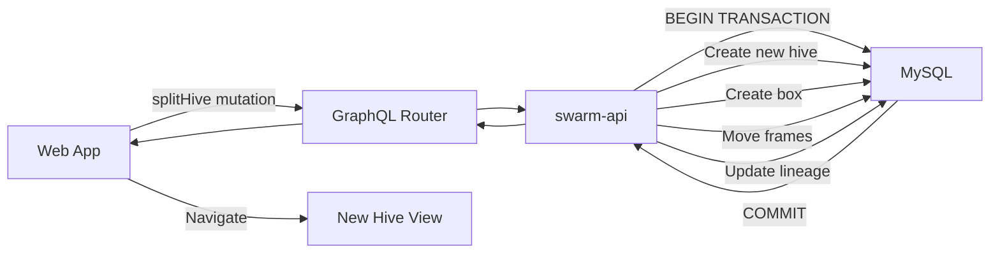

# Сплит-колония — техническая документация

### 🎯 Обзор
Функция разделения колоний обеспечивает атомарную миграцию кадров между ульями с полным сохранением данных, отслеживанием происхождения и оптимизированной производительностью пользовательского интерфейса. Поддерживает выбор 1–10 кадров с визуальным предварительным просмотром и автоматическим созданием улья.

### 🏗️ Архитектура

#### Компоненты
- **SplitHiveModal**: основной компонент React, обрабатывающий разделенный рабочий процесс пользовательского интерфейса.
- **FramePreview**: мемоизированный компонент для миниатюр кадров с выделением.
- **randomHiveName**: запрос GraphQL для генерации имени.

#### Услуги
- **swarm-api**: операции Hive CRUD, логика миграции кадров, отслеживание родительских и дочерних элементов.
- **image-splitter**: хранение и обслуживание изображений кадров (изменения не требуются).
- **web-app**: приложение Frontend React с управлением состоянием.

### 📋 Технические характеристики

#### Схема базы данных
```sql
ALTER TABLE hives
  ADD COLUMN parent_hive_id INT UNSIGNED NULL,
  ADD COLUMN split_date DATETIME NULL,
  ADD INDEX idx_parent_hive_id (parent_hive_id);
```

#### GraphQL API
```graphql
mutation splitHive($sourceHiveId: ID!, $name: String!, $frameIds: [ID!]!) {
  splitHive(sourceHiveId: $sourceHiveId, name: $name, frameIds: $frameIds) {
    id
    name
    parentHive {
      id
      name
    }
    splitDate
  }
}

query randomHiveName($lang: String!) {
  randomHiveName(lang: $lang)
}

query getHive($hiveId: ID!) {
  hive(id: $hiveId) {
    id
    name
    parentHive {
      id
      name
      splitDate
    }
    childHives {
      id
      name
      splitDate
    }
  }
}
```

### 🔧 Детали реализации

#### Фронтенд
- **Framework**: Реагируйте с помощью TypeScript.
- **Управление состоянием**: состояние локального компонента с помощью useState.
- **Оптимизация**: React.memo в FramePreview для предотвращения повторного рендеринга.
- **Стилизация**: CSS с преобразованиями с ускорением на графическом процессоре для обратной связи при выборе.
- **Загрузка изображения**: ленивая загрузка с наблюдателем пересечений.

#### Бэкэнд
- **Язык**: Перейти
- **База данных**: MySQL с транзакциями для атомарных операций.
- **Миграция данных**: 
  - Перемещает кадры с помощью `UPDATE frames SET box_id = ? WHERE id IN (?)`.
  - Сохраняет стороны кадра (внешние ключи left_id, right_id)
  - Последовательное изменение порядка позиций в целевом поле.
  - Обновляет родительский_hive_id и Split_date атомарно.

#### Поток данных


### ⚙️ Конфигурация
Никакой специальной настройки не требуется. Использует существующее соединение с базой данных swarm-api и URL-адреса image-splitter.

### 🧪 Тестирование

#### Критерии приемки

**Выбор кадра**
- Отображать все кадры из всех ящиков, сгруппированных по ящикам, с четкими заголовками.
- Показывать миниатюры изображений слева и справа для каждого кадра.
- Поддержка выбора 1-10 кадров минимум/максимум
- Визуальная обратная связь для выбранных кадров (желтая подсветка)
- Отключить выбор при достижении лимита в 10 кадров.
- Кадры упорядочены по положению внутри каждого поля (слева направо).

**Создание улья**
- Автоматическое создание нового имени улья с помощью запроса `randomHiveName`.
- Поддержка нескольких языков (en, ru, et, tr, pl, de, fr)
- Предоставьте кнопку обновления для восстановления имени.
- Создать новый улей на той же пасеке, что и исходный улей.
- Создать один глубокий ящик в новом улье для выбранных рамок.

**Миграция данных**
- атомарно перемещать выбранные рамки в коробку нового улья.
- Сохранять стороны кадра (ссылки left_id, right_id)
- Сохранение изображений кадров в сервисе image-splitter.
- Сохраняйте всю статистику кадра (обнаружение матки, подсчет пчел, анализ клеток)
- Последовательное изменение порядка позиций кадров в целевом поле (0, 1, 2, ...)
- При желании наследовать семейную ссылку от родительского улья.

**Отслеживание происхождения**
- Запишите идентификатор родительского улья в новом улье (`parent_hive_id`).
- Запись разделенной даты/времени (`split_date`)
— Отображать «Отделить от [Имя родителя] на [Дата]» в представлении дочернего куста.
— Отобразить «Дочерние ульи: [Дочерний 1], [Дочерний 2]...» в представлении родительского улья.
- Кликабельные ссылки для перехода между родительскими и дочерними ульями.

### 📊 Вопросы производительности
- Выбор флажка реагирует мгновенно (менее 100 мс)
- Нет полного повторного рендеринга всех выделенных кадров (обновляются только кадры, выбранные при щелчке).
- Плавные визуальные переходы с помощью CSS-преобразований с ускорением на графическом процессоре.
- Регулируемые щелчки для предотвращения случайного двойного выбора.
- Изображения кадров с отложенной загрузкой (загружаются только видимые кадры)
- Транзакция базы данных обеспечивает атомарную операцию (все или ничего)

### 🚫 Технические ограничения
- Невозможно разделить на другую пасеку (только та же пасека)
- Нет автоматической рекомендации рамки на основе структуры выводка.
- Нет операции отмены (требуется ручное слияние)
- Никакого массового разделения нескольких ульев одновременно.
- Требуется ручное отслеживание ферзя между сплитами

### 🔗 Сопутствующая документация
- [Техническая документация «Присоединиться к колониям»](./join-colonies.md)
- [Управление ульем](./hive-management.md)

### 📚 Ресурсы для разработки
- [swarm-api Репозиторий](https://github.com/Gratheon/swarm-api)
- [web-app Репозиторий](https://github.com/Gratheon/web-app)
- [GraphQL Схема](https://github.com/Gratheon/graphql-schema-registry)

### 💬 Технические примечания
- Миграция кадров является атомарной с использованием транзакций базы данных для предотвращения потери данных.
- Ссылки на изображения в image-splitter остаются неизменными (кадры сохраняют свой left_id/right_id)
- Критическая оптимизация пользовательского интерфейса: React.memo предотвращает ненужный повторный рендеринг более 20 компонентов кадра.
- Отслеживание происхождения допускает неограниченную глубину (разделения можно разделить рекурсивно)
- В автоматически создаваемых именах используются списки слов для конкретного языка, хранящиеся в swarm-api.

---
**Последнее обновление**: 5 декабря 2025 г.

