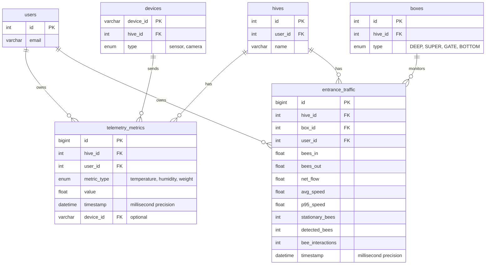
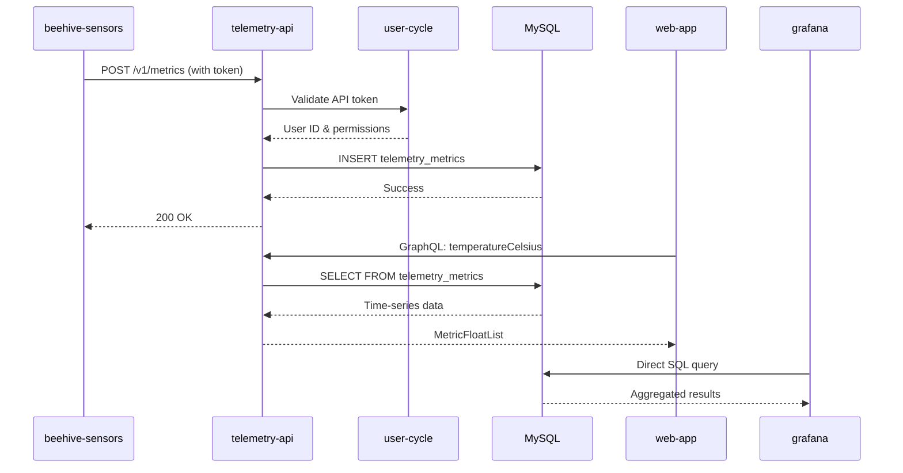

# Хранилище телеметрии Hive — техническая документация

### 🎯 Обзор
Система хранения и запроса временных рядов данных датчиков Интернета вещей из ульев. Обрабатывает прием данных с нескольких типов устройств (датчики температуры/влажности, весы, входные камеры) и предоставляет API-интерфейсы GraphQL/REST для получения данных с помощью гибких запросов временного диапазона и функций агрегирования.

### 🏗️ Архитектура

#### Компоненты
- **TelemetryChart**: компонент React для рендеринга графиков временных рядов.
- **MetricSelector**: пользовательский интерфейс для выбора показателей для отображения.
- **TimeRangeFilter**: выбор диапазона дат для исторических запросов.
- **HiveTelemetryPanel**: виджет информационной панели, показывающий данные датчиков в реальном времени.
- **GrafanaEmbed**: интеграция iFrame для расширенной аналитики.

#### Услуги
- **telemetry-api**: основная служба для хранения и извлечения показателей.
- **beehive-sensors**: аппаратное устройство отправляет данные о температуре, влажности и весе.
- **entrance-observer**: служба видеоаналитики, отправляющая показатели трафика пчел.
- **user-cycle**: служба аутентификации для проверки токена API.
- **graphql-router**: запросы телеметрии маршрутизации шлюза федерации.
- **grafana**: расширенная платформа визуализации и аналитики.

### 📋 Технические характеристики

#### Схема базы данных



**Обоснование конструкции таблицы:**
- Отдельные таблицы для разных категорий метрик (экологический и входной трафик)
- Метки времени с миллисекундной точностью для высокочастотных данных
— Составные индексы (hive_id, временная метка DESC) для запросов временного диапазона.
— Индексы (user_id, hive_id) для изоляции данных.
– Индексы (metric_type, timestamp DESC) для отфильтрованных запросов.
- device_id отслеживает источник данных для отладки

#### GraphQL API
```graphql
scalar DateTime

enum AggregationType {
  DAILY_AVG
  DAILY_MAX
  DAILY_MIN
}

type TelemetryError {
  message: String
  code: String
}

type MetricFloat {
  t: DateTime!
  v: Float
}

type MetricFloatList {
  metrics: [MetricFloat]
}

union MetricListResult = MetricFloatList | TelemetryError

type BeeMovementInOutResult {
  beesIn: Float
  beesOut: Float
  netFlow: Float
  avgSpeed: Float
  p95Speed: Float
  stationaryBees: Int
  detectedBees: Int
  beeInteractions: Int
  time: DateTime
}

type EntranceMovementRecord {
  id: ID!
  hiveId: ID!
  boxId: ID!
  beesOut: Float
  beesIn: Float
  time: DateTime!
  netFlow: Float
  avgSpeed: Float
  p95Speed: Float
  stationaryBees: Int
  detectedBees: Int
  beeInteractions: Int
}

type EntranceMovementList {
  metrics: [EntranceMovementRecord]
}

union EntranceMovementResult = EntranceMovementList | TelemetryError

input MetricSetInput {
  temperatureCelsius: Float
  humidityPercent: Float
  weightKg: Float
}

type AddMetricMessage {
  message: String
}

union AddMetricResult = AddMetricMessage | TelemetryError

type Query {
  temperatureCelsius(
    hiveId: ID!
    timeRangeMin: Int
  ): MetricListResult
  
  humidityPercent(
    hiveId: ID!
    timeRangeMin: Int
  ): MetricListResult
  
  weightKg(
    hiveId: ID!
    timeRangeMin: Int
  ): MetricListResult
  
  weightKgAggregated(
    hiveId: ID!
    days: Int!
    aggregation: AggregationType
  ): MetricListResult
  
  entranceMovementToday(
    hiveId: ID!
    boxId: ID!
  ): BeeMovementInOutResult
  
  entranceMovement(
    hiveId: ID!
    boxId: ID
    timeFrom: DateTime!
    timeTo: DateTime!
  ): EntranceMovementResult
}

type Mutation {
  addMetric(
    hiveId: ID!
    fields: MetricSetInput!
  ): AddMetricResult
}
```

**Примечания к проектированию:**
— Короткие имена полей (t, v) в MetricFloat для уменьшения размера полезной нагрузки.
- Типы объединения для обработки ошибок.
- Гибкий диапазон времени (минуты назад) и абсолютные временные метки.
- Агрегация во время запроса для гибкости.

#### REST API Конечные точки
```
POST /v1/metrics/:hiveId
Body: {
  "temperatureCelsius": 34.5,
  "humidityPercent": 65.2,
  "weightKg": 45.3
}
Headers: {
  "Authorization": "Bearer <user_api_token>"
}

POST /v1/entrance/:hiveId/:boxId
Body: {
  "beesIn": 12.5,
  "beesOut": 10.2,
  "netFlow": 2.3,
  "avgSpeed": 1.2,
  "p95Speed": 2.5,
  "stationaryBees": 5,
  "detectedBees": 18,
  "beeInteractions": 3
}
Headers: {
  "Authorization": "Bearer <device_token>"
}

GET /v1/metrics/:hiveId/temperature?from=2024-12-01&to=2024-12-06
GET /v1/metrics/:hiveId/humidity?minutes=60
GET /v1/metrics/:hiveId/weight?days=7&aggregation=DAILY_AVG
```

**REST Дизайн:**
- Префикс версии (/v1) для обратной совместимости.
- Аутентификация на основе токена через user-cycle.
- Поддержка как абсолютных временных меток, так и относительных временных диапазонов.
- Возможность массовой вставки пакетных данных датчиков

### 🔧 Детали реализации

#### Интерфейс (web-app)
- **Framework**: React 18 с TypeScript.
- **Библиотека графиков**: упрощенные графики от TradingView
- **Управление состоянием**: клиент Apollo для кэширования GraphQL.
- **Обновления в режиме реального времени**: опрос каждые 30 секунд для получения актуальных данных.
- **Форматирование данных**: специальные приемы для преобразования показателей.

**Ключевые компоненты:**
```typescript
interface TelemetryChartProps {
  hiveId: string;
  metricType: 'temperature' | 'humidity' | 'weight';
  timeRangeMinutes?: number;
  aggregation?: AggregationType;
}

const TelemetryChart: React.FC<TelemetryChartProps> = ({
  hiveId,
  metricType,
  timeRangeMinutes = 60,
  aggregation
}) => {
  const { data, loading, error } = useQuery(GET_METRIC_QUERY, {
    variables: { hiveId, timeRangeMin: timeRangeMinutes },
    pollInterval: 30000
  });
  
  return <LineChart data={data?.metrics} />;
};
```

#### Серверная часть (telemetry-api)
- **Язык**: Node.js с TypeScript.
- **Среда**: сервер Apollo для GraphQL.
- **База данных**: MySQL 8.0 с оптимизацией временных рядов.
- **Аутентификация**: проверка токена JWT через user-cycle.
- **Ограничение скорости**: 100 запросов/мин на устройство, 60 запросов/мин на пользователя.

**Поток приема данных:**
```typescript
async function addMetric(
  hiveId: number,
  userId: number,
  fields: MetricSetInput,
  deviceId?: string
): Promise<void> {
  const timestamp = new Date();
  const insertPromises = [];
  
  if (fields.temperatureCelsius !== undefined) {
    insertPromises.push(
      db.telemetry_metrics.insert({
        hive_id: hiveId,
        user_id: userId,
        metric_type: 'temperature',
        value: fields.temperatureCelsius,
        timestamp,
        device_id: deviceId
      })
    );
  }
  
  await Promise.all(insertPromises);
}
```

**Оптимизация запросов:**
```typescript
async function getTemperature(
  hiveId: number,
  timeRangeMin: number = 60
): Promise<MetricFloat[]> {
  const fromTime = new Date(Date.now() - timeRangeMin * 60 * 1000);
  
  return db.query(`
    SELECT 
      timestamp as t,
      value as v
    FROM telemetry_metrics
    WHERE hive_id = ? 
      AND metric_type = 'temperature'
      AND timestamp >= ?
    ORDER BY timestamp ASC
    LIMIT 10000
  `, [hiveId, fromTime]);
}
```

**Логика агрегирования:**
```typescript
async function getWeightAggregated(
  hiveId: number,
  days: number,
  aggregation: AggregationType
): Promise<MetricFloat[]> {
  const aggFunc = {
    DAILY_AVG: 'AVG',
    DAILY_MAX: 'MAX',
    DAILY_MIN: 'MIN'
  }[aggregation];
  
  return db.query(`
    SELECT 
      DATE(timestamp) as t,
      ${aggFunc}(value) as v
    FROM telemetry_metrics
    WHERE hive_id = ?
      AND metric_type = 'weight'
      AND timestamp >= DATE_SUB(NOW(), INTERVAL ? DAY)
    GROUP BY DATE(timestamp)
    ORDER BY t ASC
  `, [hiveId, days]);
}
```

#### Поток данных


### ⚙️ Конфигурация

#### Переменные среды (telemetry-api)
```bash
MYSQL_HOST=localhost
MYSQL_PORT=3306
MYSQL_USER=telemetry
MYSQL_PASSWORD=secret
MYSQL_DATABASE=gratheon

USER_CYCLE_URL=http://user-cycle:8080
GRAPHQL_ROUTER_URL=http://graphql-router:8080

RATE_LIMIT_DEVICE=100
RATE_LIMIT_USER=60

DATA_RETENTION_DAYS_HOBBYIST=365
DATA_RETENTION_DAYS_STARTER=730
DATA_RETENTION_DAYS_PRO=1095
```

#### Конфигурация устройства (beehive-sensors)
```ini
[telemetry]
api_endpoint=https://telemetry.gratheon.com/v1/metrics
api_token=your_api_token_here
hive_id=123
interval_seconds=5
batch_size=12
```

### 🧪 Тестирование

#### Модульные тесты
Местоположение: `/test/unit/`

**Охват:**
- Проверка приема метрик (обязательные поля, типы данных)
- Логика запроса временного диапазона (относительная и абсолютная)
- Агрегационные расчеты (среднее, мин, макс)
- Обработка ошибок (неверные идентификаторы ульев, несанкционированный доступ)

```typescript
describe('TelemetryAPI', () => {
  describe('addMetric', () => {
    it('should insert temperature metric', async () => {
      const result = await addMetric(hiveId, userId, {
        temperatureCelsius: 34.5
      });
      expect(result).toBeDefined();
    });
    
    it('should reject invalid temperature values', async () => {
      await expect(
        addMetric(hiveId, userId, { temperatureCelsius: 150 })
      ).rejects.toThrow('Invalid temperature range');
    });
  });
});
```

#### Интеграционные тесты
Местоположение: `/test/integration/`

**Сценарии:**
- Сквозной поток данных от устройства к базе данных
- Проверка формата ответа на запрос GraphQL.
- Аутентификация токена с помощью user-cycle.
- Принуждение к ограничению ставок
- Выполнение политики хранения данных

#### E2E-тесты
Местоположение: `web-app/e2e/telemetry.spec.ts`

**Потоки пользователя:**
- Просматривайте данные датчиков в реальном времени на панели управления улья.
- Запрос исторических данных с помощью выбора временного диапазона
- Экспорт данных телеметрии в формате CSV.
- Настройка пороговых оповещений на основе показателей.

### 📊 Вопросы производительности

#### Оптимизации
- **Индексы базы данных**: составные индексы по (hive_id, timestamp) для запросов быстрого диапазона.
- **Кэширование запросов**: кэширование сервера Apollo для часто используемых диапазонов времени (5 минут TTL).
- **Пул соединений**: пул соединений MySQL (мин.: 10, макс.: 100).
- **Пакетная вставка**: группируйте несколько показателей с одного устройства в одну транзакцию.
- **Ограничения запросов**: максимум 10 000 точек данных на запрос во избежание проблем с памятью.
- **Агрегация**: предварительный расчет ежедневных агрегатов для длительных временных диапазонов (более 30 дней).

#### Узкие места
- **Высокочастотная запись**: датчики отправляют данные каждые 5 секунд, примерно 17 280 вставок на улей в день.
– **Запросы с большим временным диапазоном**: запросы старше 1 года требуют агрегирования во избежание проблем с памятью.
- **Одновременная запись на устройство**: MySQL блокирует запись во время массовой вставки с нескольких устройств.
- **Grafana нагрузка**: сложные запросы информационной панели могут генерировать более 20 запросов к базе данных одновременно.

#### Метрики
- **Время ответа на запрос**: менее 500 мс для 24-часового диапазона, менее 2 секунд для 30-дневного диапазона.
- **Пропускная способность записи**: более 1000 метрик в секунду на всех устройствах.
- **Размер базы данных**: примерно 500 МБ на улей в год (исходные показатели).
- **Успех**: более 99,5% (исключая сбои сети)
- **API доступность**: время безотказной работы более 99,9 % (отслеживается посредством проверок работоспособности).

**Мониторинг производительности:**
```typescript
interface PerformanceMetrics {
  queryDuration: number;
  dataPoints: number;
  cacheHit: boolean;
  dbConnectionTime: number;
}

async function logQueryPerformance(
  operation: string,
  metrics: PerformanceMetrics
) {
  if (metrics.queryDuration > 2000) {
    logger.warn('Slow query detected', { operation, metrics });
  }
}
```

### 🚫 Технические ограничения

**Текущие ограничения:**
- Максимальный диапазон запросов: 2 года без агрегации.
- Ограничение количества точек данных на запрос: 10 000 записей.
- Частота записи: минимум 1 секундный интервал на устройство
- Поддерживаемые метрики: температура, влажность, вес, только входной трафик.
- Нет потоковой передачи через веб-сокет в реальном времени (только опрос)
- Grafana требует отдельной аутентификации (не интегрированной SSO)

**Известные проблемы:**
- Переход на летнее время может привести к появлению пробелов в временных метках на диаграммах.
- Дрейф тактовой частоты устройства может привести к выходу из строя вставок.
- Разделение даты MySQL еще не реализовано (планируется для большого количества пользователей)
- Нет автоматического обнаружения выбросов или сглаживания данных.
- Для показателей входящего трафика требуется box_id (не агрегация на уровне куста).

**Будущие улучшения:**
- Добавить поддержку датчиков CO2, давления, звука, вибрации.
- Внедрение подписок на веб-сокеты для обновлений в реальном времени.
- Добавьте прогнозную аналитику и обнаружение аномалий.
- Создание автоматического формирования отчетов.
- Внедрить сжатие данных для более старых показателей (более 1 года).
- Добавьте запросы агрегации нескольких ульев для аналитики на уровне пасеки.

### 🔗 Сопутствующая документация
- [Хранилище телеметрии Hive (Руководство пользователя)](../../../products/web_app/pro-tier/hive-telemetry-storage.md)
- [Управление оповещениями](../../../products/web_app/flexible-tier/alerts.md)
- [Аналитика сравнения колоний](../../../products/web_app/pro-tier/colony-comparison-analytics.md)
- [GraphQL API Ссылка](../../API/GraphQL.md)
- [REST API Ссылка](../../API/REST.md)
- [Руководство по аутентификации](../../API/Authentication.md)

### 📚 Ресурсы для разработки
- **Репозиторий GitHub**: [telemetry-api](https://github.com/Gratheon/telemetry-api)
- **Схема архитектуры**: доступна в репозитории README.
- **API Схема**: `/schema.graphql` в репозитории.
- **Миграция базы данных**: каталог `/migrations`.
- **Grafana Панели**: `/grafana/dashboards` (экспорт JSON)

### 💬 Технические примечания

**Решения по реализации:**
– Выберите MySQL вместо InfluxDB/ClickHouse, чтобы снизить сложность эксплуатации (единый механизм базы данных).
- REST API поддерживается для совместимости с устаревшими устройствами (новые устройства должны использовать GraphQL)
- Опрос вместо веб-сокетов для упрощения масштабирования и снижения использования ресурсов сервера.
- Отдельная таблица для входного трафика из-за другой схемы (несколько метрик на одну временную метку)
- Короткие имена полей (t, v) в ответах GraphQL для оптимизации использования мобильных данных.

**Аспекты интеграции:**
- Устройства должны корректно обрабатывать сбои в сети (буферизировать и повторять попытки).
- Токены API следует менять каждые 90 дней в целях безопасности.
- Запросы с большим временным диапазоном должны использовать агрегацию, чтобы предотвратить тайм-аут.
- Для внедрения Grafana требуется настройка CORS на telemetry-api.
- Политики хранения данных выполняются ежедневно с помощью задания cron (удаляет старые записи).

---
## Журнал изменений

**Последнее обновление**: 6 декабря 2025 г.