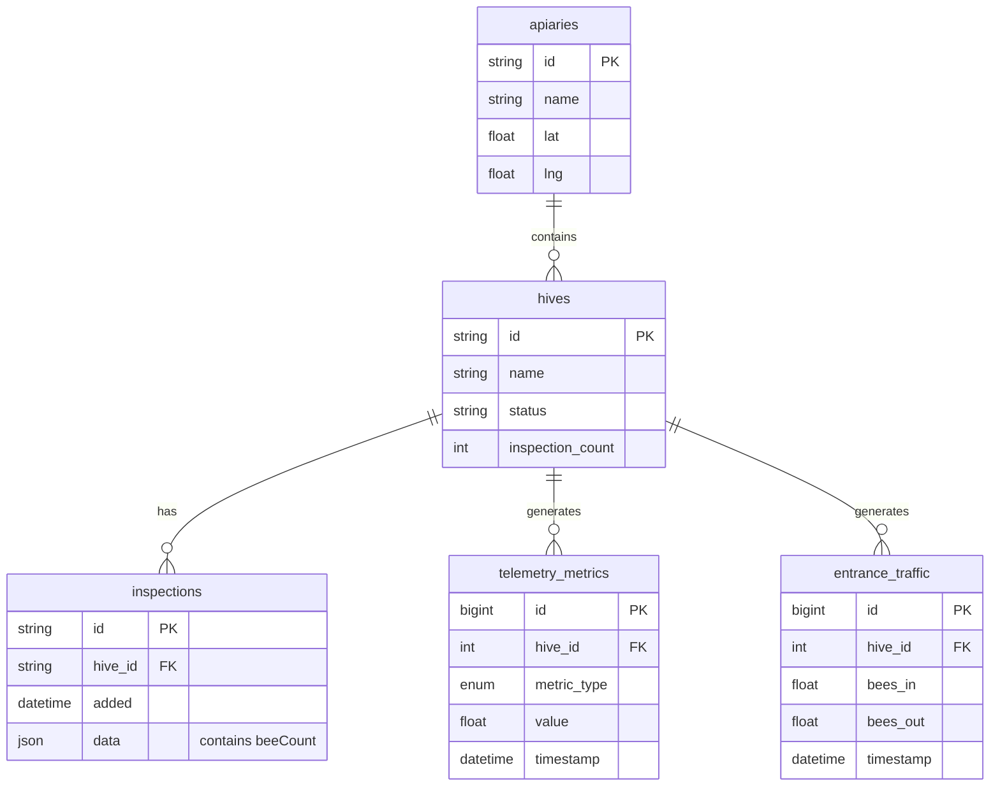

# Аналитика данных таймсерий — техническая документация

### 🎯 Обзор
Интерактивная система визуализации данных телеметрии, созданная с помощью React и облегченных диаграмм, доступная в двух режимах: просмотр отдельного улья (показатели за последние 7 дней на вкладке «Метрики») и панель аналитики нескольких ульев (страница `/time`) для сравнения между колониями. Обеспечивает визуализацию в реальном времени данных телеметрии, записей проверок и показателей окружающей среды с синхронизированной навигацией по оси времени и возможностями экспорта данных.

### 🏗️ Архитектура

#### Компоненты

**Индивидуальное представление куста** (`/apiaries/:id/hives/:id` — вкладка «Метрики»):
- **HiveWeightGraph**: компонент-контейнер для показателей одного улья.
- **WeightChart**: данные о весе отдельного улья за 7 дней.
- **TemperatureChart**: данные о температуре за 7 дней для отдельного улья.
- **EntranceMovementChart**: 7-дневный входной трафик для отдельного улья.

**Multi-Hive Analytics** (страница `/time`):
- **TimeView**: основной компонент контейнера, управляющий состоянием и получением данных.
- **ChartContainer**: многоразовая оболочка для всех типов диаграмм с функциями экспорта и оповещений.
- **PopulationChart**: оценки численности пчел по результатам проверок с наложением идеальной кривой.
- **MultiHiveWeightChart**: сравнение среднесуточного веса между ульями.
- **MultiHiveTemperatureChart**: мониторинг внутренней температуры.
- **MultiHiveEntranceChart**: анализ входного потока трафика.
- **MultiHiveEntranceSpeedChart**: отслеживание скорости движения пчел.
- **MultiHiveEntranceDetectedChart**: обнаружение общего количества пчел.
- **MultiHiveEntranceStationaryChart**: мониторинг поведения сторожевых пчел.
- **MultiHiveEntranceInteractionsChart**: анализ взаимодействия между пчелами.
- **WeatherSection**: виджеты корреляции данных об окружающей среде.
- **ApiarySelector**: раскрывающийся список для фильтрации пасеки.
- **HiveSelector**: список флажков с множественным выбором для фильтрации куста.
- **TimeRangeSelector**: переключатели для выбора временного диапазона.
- **ChartToggles**: флажки позволяют включать/отключать диаграммы.

#### Услуги
- **telemetry-api**: GraphQL запросы на вес, температуру, входные показатели
- **web-app локальная база данных Dexie**: хранилище IndexedDB для ульев и проверок.
- **graphql-router**: объединенный шлюз для запросов телеметрии.
- **метеослужбы**: внешние API для данных об окружающей среде.

### 📋 Технические характеристики

#### Схема базы данных



#### GraphQL API

**Индивидуальный запрос просмотра Hive:**
```graphql
query hiveWeight(
  $hiveId: ID!
  $timeRangeMin: Int
  $timeFrom: DateTime!
  $timeTo: DateTime!
) {
  weightKg(hiveId: $hiveId, timeRangeMin: $timeRangeMin) {
    ... on MetricFloatList {
      metrics {
        t
        v
      }
    }
    ... on TelemetryError {
      message
      code
    }
  }
  
  temperatureCelsius(hiveId: $hiveId, timeRangeMin: $timeRangeMin) {
    ... on MetricFloatList {
      metrics {
        t
        v
      }
    }
    ... on TelemetryError {
      message
      code
    }
  }
  
  entranceMovement(hiveId: $hiveId, timeFrom: $timeFrom, timeTo: $timeTo) {
    ... on EntranceMovementList {
      metrics {
        time
        beesIn
        beesOut
        netFlow
      }
    }
    ... on TelemetryError {
      message
      code
    }
  }
}
```

**Запрос Multi-Hive Analytics:**
```graphql
query MultiHiveTelemetry(
  $days: Int!
  $temperatureTimeRangeMin: Int!
  $timeFrom: DateTime!
  $timeTo: DateTime!
) {
  weightKgAggregated(
    hiveId: "123"
    days: $days
    aggregation: DAILY_AVG
  ) {
    ... on MetricFloatList {
      metrics {
        t
        v
      }
    }
    ... on TelemetryError {
      message
      code
    }
  }
  
  temperatureCelsius(
    hiveId: "123"
    timeRangeMin: $temperatureTimeRangeMin
  ) {
    ... on MetricFloatList {
      metrics {
        t
        v
      }
    }
  }
  
  entranceMovement(
    hiveId: "123"
    timeFrom: $timeFrom
    timeTo: $timeTo
  ) {
    ... on EntranceMovementList {
      metrics {
        time
        beesIn
        beesOut
        netFlow
        avgSpeed
        p95Speed
        stationaryBees
        detectedBees
        beeInteractions
      }
    }
  }
}

query HIVES {
  apiaries {
    id
    name
    lat
    lng
    hives {
      id
      name
      status
      inspectionCount
      family {
        id
      }
    }
  }
}
```

**Построение запроса:**
- Динамически генерирует запрос GraphQL на основе выбранных ульев.
- Отдельные псевдонимы для каждого улья (например, `hive_123_weight`, `hive_456_weight`).
- Типы Union корректно обрабатывают ошибки.
- Переменные управляют временными диапазонами и агрегированием.

#### Схема локального хранилища

```typescript
interface LocalStorageKeys {
  'timeView.selectedApiaryId': string | null
  'timeView.selectedHiveIds': string[]
  'timeView.enabledCharts': {
    population: boolean
    weight: boolean
    temperature: boolean
    entrance: boolean
    entranceSpeed: boolean
    entranceDetected: boolean
    entranceStationary: boolean
    entranceInteractions: boolean
    weather: boolean
    weatherTemperature: boolean
    wind: boolean
    rain: boolean
    solarRadiation: boolean
    cloudCover: boolean
    pollen: boolean
    pollution: boolean
  }
  'timeView.showIdealCurve': boolean
}
```

### 🔧 Детали реализации

#### Интерфейс (web-app)
- **Framework**: React 18 с TypeScript.
- **Маршрутизация**: response-router-dom v6 с параметрами запроса URL.
- **Управление состоянием**: перехватчики React (useState, useMemo, useEffect, useRef)
- **Извлечение данных**: клиент Apollo GraphQL с Dexie.js для локальной IndexedDB.
- **Диаграммы**: облегченные графики (библиотека TradingView)
- **Стилизация**: модули CSS с препроцессором LESS.

**Управление состоянием:**
```typescript
const [selectedApiaryId, setSelectedApiaryId] = useState<string | null>()
const [selectedHiveIds, setSelectedHiveIds] = useState<string[]>([])
const [timeRangeDays, setTimeRangeDays] = useState(90)
const [showIdealCurve, setShowIdealCurve] = useState(true)
const [enabledCharts, setEnabledCharts] = useState({...})
```

**Поток данных (отдельный просмотр куста):**
1. Пользователь переходит на страницу сведений об кусте.
2. Щелкает вкладку «Метрики» в навигации по кусту.
3. Исправлен 7-дневный запрос для получения веса, температуры и входных данных.
4. Три диаграммы отображаются с синхронизированной осью времени.
5. Графики автоматически обновляются каждые 30 секунд.

**Поток данных (аналитика нескольких ульев):**
1. Получите пасеки и ульи с GraphQL.
2. Храните ульи в локальной базе данных Dexie для автономного доступа.
3. Пользователь выбирает пасеку → фильтрует ульи.
4. Пользователь выбирает ульи → запускает запрос телеметрии.
5. Динамический запрос GraphQL извлекает все показатели для выбранных ульев.
6. Данные преобразуются и передаются компонентам диаграммы.
7. Диаграммы отображаются с синхронизированной осью времени.

**URL Параметры запроса:**
- `?hiveId=123` — автоматически выберите улей и прокрутите для просмотра.
- `?apiaryId=456` - Предварительный выбор пасеки
- `?chartType=weight` - Включить определенный тип диаграммы
- `?scrollTo=weight` — Прокрутка до определенного раздела диаграммы.

**Синхронизация графиков:**
```typescript
const { chartRefs, syncCharts } = useChartSync()

const syncCharts = (sourceChart: any) => {
  const timeRange = sourceChart.timeScale().getVisibleLogicalRange()
  chartRefs.current.forEach(chart => {
    if (chart !== sourceChart) {
      chart.timeScale().setVisibleLogicalRange(timeRange)
    }
  })
}
```

**Экспорт данных:**
```typescript
const exportToCSV = () => {
  const headers = ['Timestamp', ...hiveNames]
  const rows = dataPoints.map(point => [
    point.time,
    ...point.values
  ])
  const csv = [headers, ...rows]
    .map(row => row.join(','))
    .join('\n')
  
  const blob = new Blob([csv], { type: 'text/csv' })
  const url = URL.createObjectURL(blob)
  const a = document.createElement('a')
  a.href = url
  a.download = `${title}_${timestamp}.csv`
  a.click()
}
```

#### Интеграция с серверной частью
- **telemetry-api**: предоставляет данные о весе, температуре и входных показателях.
- **Dexie.js**: IndexedDB на стороне клиента для ульев и проверок.
- **Клиент Apollo**: клиент GraphQL с кэшированием и опросом.
- **LocalStorage**: сохраняются пользовательские настройки и настройки диаграммы.

**Dexie Схема:**
```typescript
class HiveDatabase extends Dexie {
  hives: Table<Hive, string>
  inspections: Table<Inspection, string>
  
  constructor() {
    super('HiveDatabase')
    this.version(1).stores({
      hives: 'id, name, status',
      inspections: 'id, hive_id, added'
    })
  }
}
```

**GraphQL Построение запроса:**
```typescript
const telemetryQueryString = useMemo(() => {
  if (!activeHives.length) return null
  
  const queries = activeHives.map(hive => `
    hive_${hive.id}_weight: weightKgAggregated(
      hiveId: "${hive.id}"
      days: $days
      aggregation: DAILY_AVG
    ) {
      ... on MetricFloatList {
        metrics { t v }
      }
    }
  `).join('\n')
  
  return gql`
    query MultiHiveTelemetry($days: Int!, ...) {
      ${queries}
    }
  `
}, [activeHives])
```

#### Преобразование данных

**Данные о весе:**
```typescript
const weightDataByHive = useMemo(() => {
  const result = {}
  activeHives.forEach(hive => {
    result[hive.id] = {
      hiveName: hive.name,
      data: telemetryData[`hive_${hive.id}_weight`]?.metrics || []
    }
  })
  return result
}, [telemetryData, activeHives])
```

**Данные о населении:**
```typescript
const inspectionsByHive = useMemo(() => {
  const grouped = {}
  inspections.forEach(ins => {
    const population = JSON.parse(ins.data || '{}')?.hive?.beeCount
    if (!grouped[ins.hiveId]) grouped[ins.hiveId] = []
    grouped[ins.hiveId].push({
      date: new Date(ins.added),
      population
    })
  })
  
  Object.keys(grouped).forEach(hiveId => {
    grouped[hiveId].sort((a, b) => a.date.getTime() - b.date.getTime())
  })
  
  return grouped
}, [inspections])
```

### ⚙️ Конфигурация

#### Переменные среды
```bash
REACT_APP_GRAPHQL_URL=http://graphql-router:8080
REACT_APP_TELEMETRY_API_URL=http://telemetry-api:8600
```

#### Параметры диаграммы
```typescript
const defaultChartOptions = {
  layout: {
    attributionLogo: false,
    background: { color: '#FFFFFF' },
    textColor: '#333'
  },
  timeScale: {
    timeVisible: true,
    secondsVisible: false,
    fixLeftEdge: true,
    fixRightEdge: true
  },
  grid: {
    vertLines: { color: '#e1e1e1' },
    horzLines: { color: '#e1e1e1' }
  },
  crosshair: {
    mode: 1
  }
}
```

### 🧪 Тестирование

#### Модульные тесты
Местоположение: `/test/page/time/`

**Охват:**
- Управление состоянием (выбор пасеки, фильтрация ульев, временной диапазон)
- Сохранение локального хранилища
- Анализ параметра URL
- Логика преобразования данных
- Функциональность переключения диаграммы

#### Интеграционные тесты
Местоположение: `/test/integration/time/`

**Сценарии:**
- Загрузить страницу с параметрами URL
- Выберите пасеку и проверьте обновления списка ульев.
- Переключение нескольких ульев и проверка изменений запроса.
- Изменить временной диапазон и проверить обновление данных.
- Экспорт данных диаграммы в формате CSV.
- Синхронизированное масштабирование и панорамирование диаграммы

#### E2E-тесты
Местоположение: `e2e/timeseries-analytics.spec.ts`

**Потоки пользователя:**
- Перейдите на страницу /time.
- Выберите конкретную пасеку из раскрывающегося списка.
- Выберите несколько ульев для сравнения
- Отрегулируйте ползунок временного диапазона
- Включить/отключить определенные графики
- Экспорт данных о весе в формате CSV.
- Поделиться просмотром через URL с параметрами.

### 📊 Вопросы производительности

#### Оптимизации
- **Мемоизация**: используйтеMemo для дорогостоящих преобразований данных.
- **Динамические запросы**: получение данных только для выбранных ульев.
- **Агрегация**: средние значения за день за период более 30 дней.
- **Отложенная загрузка**: диаграммы отображаются только при включении.
- **Кэширование IndexedDB**: кусты и проверки кэшируются локально.
- **Кэширование Apollo**: ответы GraphQL кэшируются с помощью TTL.
- **Повторное использование диаграмм**: экземпляры упрощенных диаграмм объединены в пул.

#### Узкие места
- **Большие временные диапазоны**: получение данных высокого разрешения за 365 дней (более 10 000 точек).
- **Много ульев**: одновременное сравнение более 10 ульев приводит к созданию сложных запросов.
- **Визуализация диаграмм**: одновременная визуализация более 8 диаграмм при загрузке страницы.
- **Объем входных данных**: показатели входа обновляются каждую секунду (86 тыс. баллов в день).

#### Метрики
- **Первоначальная загрузка страницы**: менее 2 секунд с кэшированными данными.
- **Изменение временного диапазона**: менее 1 секунды для 90-дневного запроса.
- **Масштабирование/панорамирование диаграммы**: плавная прокрутка со скоростью 60 кадров в секунду с синхронизацией.
- **Экспорт в CSV**: менее 500 мс для 10 000 точек данных.
- **Использование памяти**: менее 200 МБ с 5 ульями, 90 дней, все графики.

**Мониторинг производительности:**
```typescript
useEffect(() => {
  const startTime = performance.now()
  
  if (telemetryData) {
    const endTime = performance.now()
    console.log(`Data loaded in ${endTime - startTime}ms`)
  }
}, [telemetryData])
```

### 🚫 Технические ограничения

**Текущие ограничения:**
- Максимум 10 ульев сравниваются одновременно (ограничение сложности запроса)
- Температура ограничена 7 днями (7 * 24 * 60 = максимум 10 080 минут)
- Нет потоковой передачи в реальном времени (опрос каждые 30 секунд)
- Экспорт диаграмм ограничен видимыми точками данных.
- Нет пользовательских функций агрегирования (только AVG, MIN, MAX)
- Для данных о погоде требуются GPS-координаты пасеки.
- Кривая численности требует ручного ввода данных проверки.
- Для входных показателей требуется аппаратное обеспечение (entrance-observer).

**Известные проблемы:**
- Синхронизация диаграмм может задерживаться, если включено более 6 диаграмм.
- Большой экспорт CSV (более 50 тысяч строк) может ненадолго зависать в браузере.
— Анализ параметра URL не подтверждает владение кустом.
- Превышена квота LocalStorage в старых браузерах (ограничение в 5 МБ).
- При обработке часового пояса используется местное время браузера (а не UTC).

**Будущие улучшения:**
- Добавление подписок на веб-сокеты для обновлений в реальном времени.
- Реализовать рендеринг изображений диаграмм на стороне сервера для отчетов.
- Добавить пользовательские функции агрегирования (медиана, процентили)
- Поддержка экспорта PDF с многостраничными макетами.
- Добавляйте статистические наложения (скользящие средние, линии тренда)
- Внедрение аннотаций диаграмм для маркировки событий.
- Добавить режим сравнения (этот год и прошлый год)
- Поддержка агрегации нескольких пасек для коммерческих пчеловодов.

### 🔗 Сопутствующая документация
- [Аналитика данных таймсерий (Руководство пользователя)](../../../products/web_app/pro-tier/timeseries-data-analytics.md)
- [Хранилище телеметрии улья](../../../products/web_app/pro-tier/hive-telemetry-storage.md)
- [Аналитика сравнения колоний](../../../products/web_app/pro-tier/colony-comparison-analytics.md)
- [API телеметрии](telemetry-storage.md)

### 📚 Ресурсы для разработки
- **Репозиторий GitHub**: [web-app](https://github.com/Gratheon/web-app)
- **Библиотека диаграмм**: [lightweight-charts](https://tradingview.github.io/lightweight-charts/)
- **Документация Dexie.js**: [dexie.org](https://dexie.org/)
- **Клиент Apollo**: [apollographql.com](https://www.apollographql.com/docs/react/)

### 💬 Технические примечания

**Решения по реализации:**
- Два отдельных представления: быстрые показатели улья (7 дней) и комплексная аналитика нескольких ульев.
- Выбирайте облегченные диаграммы вместо Chart.js для повышения производительности при работе с большими наборами данных.
- Используется IndexedDB (Dexie) вместо Redux для автономной архитектуры.
- Динамические запросы GraphQL позволяют избежать избыточной выборки данных для невыбранных ульев.
- LocalStorage для настроек балансирует постоянство и конфиденциальность.
- Параметры URL позволяют использовать общие глубокие ссылки на определенные представления.
- Синхронизация диаграмм использует шаблон pub-sub для слабой связи.
- В индивидуальном представлении улья используется фиксированный 7-дневный диапазон для простоты и производительности.

**Аспекты интеграции:**
— Список ульев должен быть синхронизирован с GraphQL с локальной базой данных при начальной загрузке.
- Запрос температуры ограничен 7 днями, чтобы предотвратить проблемы с памятью.
— Массив ссылок на графики необходимо очистить, чтобы предотвратить утечку памяти.
- При экспорте CSV используются URL-адреса больших двоичных объектов, которые необходимо отозвать после загрузки.
- Пороговые значения оповещений выбираются отдельно и накладываются на графики.
- Для данных о погоде требуются внешние ключи API, настроенные на серверной стороне.

**Настройка диаграммы:**
— Каждый тип диаграммы расширяет базовый компонент ChartContainer.
- Цветовые схемы соответствуют рекомендациям бренда.
- Средства форматирования подсказок обрабатывают различные типы единиц измерения (кг, °C, количество).
- Расположение легенды позволяет избежать перекрытия строк данных.
- Линии сетки используют нежные цвета для уменьшения визуального шума.

---
## Журнал изменений

**Последнее обновление**: 6 декабря 2025 г.