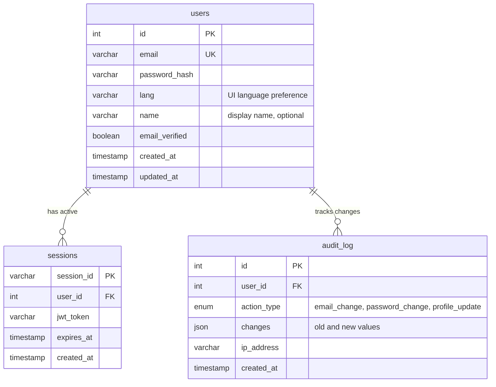
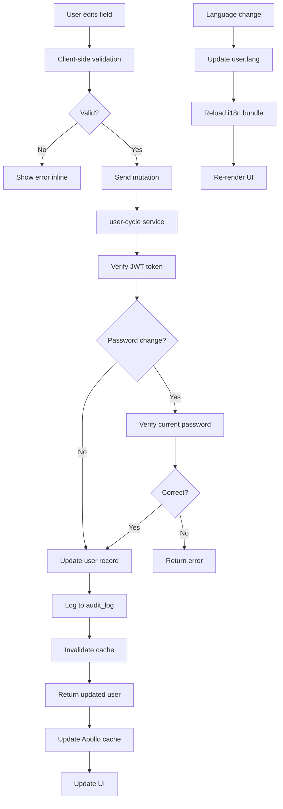

# Редактирование профиля пользователя — техническая документация

### 🎯 Обзор
Система управления настройками учетных записей пользователей, позволяющая аутентифицированным пользователям обновлять информацию профиля, менять пароли, переключать языковые настройки и управлять настройками учетной записи. Интегрируется с системами аутентификации и локализации для немедленного эффекта.

### 🏗️ Архитектура

#### Компоненты
- **AccountSettingsForm**: компонент формы React для редактирования профиля.
- **PasswordChangeModal**: отдельное модальное окно для безопасного обновления паролей.
- **LanguageSwitcher**: раскрывающийся список для выбора языка с немедленным обновлением пользовательского интерфейса.
- **SettingsPanel**: контейнер, в котором хранятся все настройки учетной записи.

#### Услуги
- **user-cycle**: основная служба, обрабатывающая обновления профилей пользователей и аутентификацию.
- **graphql-router**: мутации пользователей маршрутизации федеративного шлюза.
- **redis**: управление сеансами и аннулирование кеша.

### 📋 Технические характеристики

#### Схема базы данных


#### GraphQL API
```graphql
type User {
  id: ID!
  email: String!
  name: String
  lang: String!
  emailVerified: Boolean!
  createdAt: DateTime!
  updatedAt: DateTime!
}

input UpdateProfileInput {
  name: String
  email: String
  lang: String
}

input ChangePasswordInput {
  currentPassword: String!
  newPassword: String!
}

type Mutation {
  updateProfile(input: UpdateProfileInput!): User!
  changePassword(input: ChangePasswordInput!): Boolean!
  updateLanguage(lang: String!): User!
}

type Query {
  me: User
  accountSettings: User
}
```

### 🔧 Детали реализации

#### Фронтенд
- **Framework**: Реагируйте с помощью TypeScript.
- **Формы**: форма React Hook с проверкой да.
- **Управление состоянием**: кэш клиента Apollo с оптимистичными обновлениями.
- **Переключение языка**: обновляет localStorage + запускает перезагрузку i18n.
- **Надежность пароля**: библиотека zxcvbn для обратной связи в режиме реального времени.

#### Серверная часть (user-cycle)
- **Язык**: Перейти
- **Framework**: собственный сервер HTTP с преобразователем GraphQL.
- **Проверка**: формат электронной почты, надежность пароля (минимум 8 символов).
- **Безопасность**: проверка текущего пароля при его изменении.
- **Аудит**: записывайте все изменения профиля в таблицу Audit_log.

#### Поток данных


### ⚙️ Конфигурация

**Переменные среды (user-cycle)**
```bash
MYSQL_HOST=localhost
MYSQL_PORT=3306
MYSQL_DATABASE=users
MYSQL_USER=user_cycle
MYSQL_PASSWORD=<secret>

JWT_SECRET=<secret>
JWT_EXPIRY=30d

BCRYPT_COST=12
PASSWORD_MIN_LENGTH=8

REDIS_HOST=localhost:6379
REDIS_PASSWORD=<secret>

ALLOWED_LANGUAGES=en,ru,uk,et,de,fr,es
```

### 🧪 Тестирование

#### Модульные тесты
- Проверка формата электронной почты
- Требования к надежности пароля
- Проверка кода языка
- Текущая проверка пароля
- Создание журнала аудита

#### Интеграционные тесты
- Полный процесс обновления профиля
- Изменение пароля с обновлением JWT.
- Изменение языка запускает обновление кэша.
- Обеспечение уникальности электронной почты.
- Одновременная обработка обновлений

#### E2E-тесты
- Пользователь обновляет имя и сохраняет
- Пользователь успешно меняет пароль
- Пользователь переключает язык, обновляет интерфейс.
- Отклонение неверного текущего пароля
- Разрешение конфликтов по электронной почте

### 📊 Вопросы производительности

#### Оптимизации
- Оптимистичные обновления пользовательского интерфейса для мгновенной обратной связи.
- Отменена проверка формы (300 мс).
- Частичные обновления (отправлены только измененные поля)
— Кэш Redis для профиля пользователя (TTL: 1 час)
- Индексы базы данных по электронной почте и идентификатору

#### Метрики
- Ответ на обновление профиля API: менее 200 мс.
- Ответ на смену пароля: менее 500 мс (хеширование bcrypt)
- Реакция переключения языка: менее 100 мс
- Коэффициент попадания в кэш: более 80%
- Проверка формы: менее 50 мс.

### 🔒 Вопросы безопасности

#### Изменение пароля
- Требуется проверка текущего пароля.
- Новый пароль должен отличаться от текущего
- Хеширование Bcrypt с коэффициентом стоимости 12.
- Автоматическое обновление сеанса при смене пароля.
- Уведомление по электронной почте отправляется при смене пароля.

#### Изменения электронной почты
- Уникальность электронной почты обеспечивается на уровне БД.
- Сравнение без учета регистра
– Необязательно: проверка электронной почты для нового адреса (пока не реализовано).
- В журнале аудита записываются старые и новые электронные письма.

#### Проверка ввода
- Электронная почта: соответствует RFC 5322.
- Пароль: минимум 8 символов, максимум нет.
- Язык: должен быть в списке ALLOWED_LANGUAGES.
- Имя: максимум 100 символов, буквенно-цифровые + пробелы.

#### Контрольный журнал
- Все изменения профиля регистрируются с отметкой времени.
- IP-адрес записан для проверки безопасности.
- Изменения сохраняются в формате JSON (старые и новые значения)
- Сохраняется в течение 2 лет.

### 🚫 Технические ограничения
- Нет загрузки изображения профиля (планируемая функция)
- Нет настройки двухфакторной аутентификации (отдельная функция)
- Изменения электронной почты пока не требуют проверки (брешь в безопасности).
- Никаких массовых обновлений профиля.
- Аннулирование сеанса при смене пароля влияет на все устройства (по замыслу).

### 🔗 Сопутствующая документация
- [Техническая документация по регистрации пользователей](./user-registration.md)

### 📚 Ресурсы для разработки
- [user-cycle репозиторий](https://github.com/Gratheon/user-cycle)
- [GraphQL схема](https://github.com/Gratheon/graphql-schema-registry)
- [Настройки аккаунта UI](https://github.com/Gratheon/web-app/src/components/AccountSettings)

### 💬 Технические примечания
– Рассмотрите возможность добавления процесса проверки электронной почты для изменений электронной почты (улучшение безопасности).
- Возможно, вы захотите добавить ссылку «удалить учетную запись» в настройки (отдельная функция).
- Переключение языка происходит мгновенно, но для некоторого статического контента требуется перезагрузка страницы.
- Измеритель надежности пароля помогает пользователям создавать безопасные пароли.
- Журнал аудита со временем увеличивается. Рассмотрите стратегию архивирования через 2 года.

---
**Последнее обновление**: 5 декабря 2025 г.
**Поддерживается**: серверная команда

