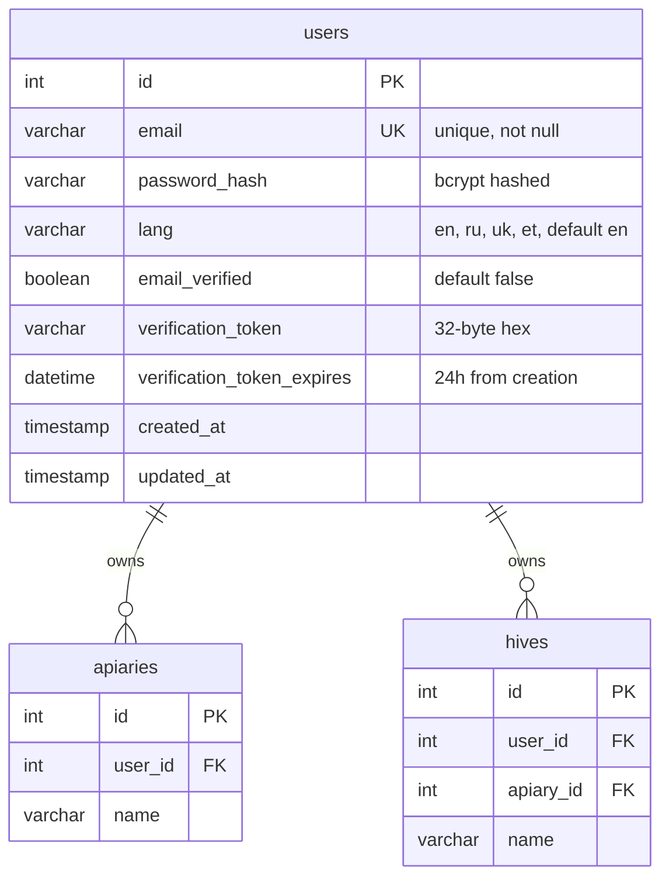
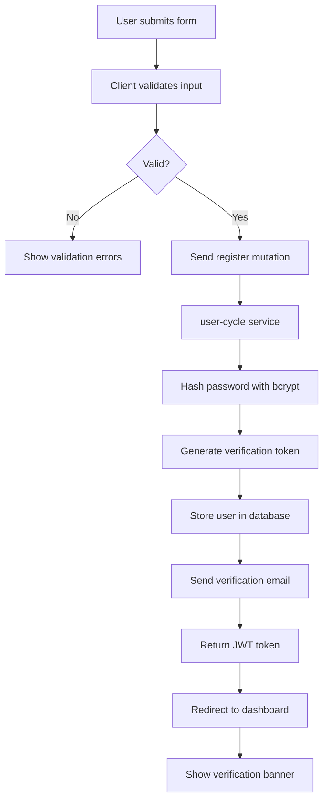
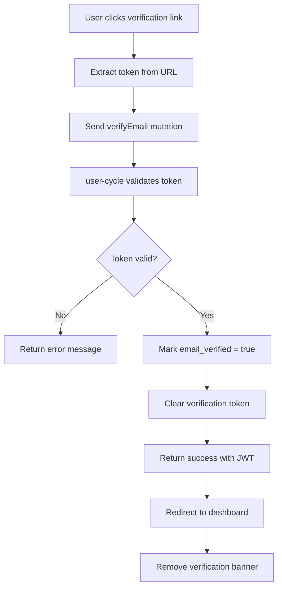

# Регистрация пользователя – Техническая документация

### 🎯 Обзор
Система регистрации пользователей по электронной почте с автоматическим определением языка, рабочим процессом проверки электронной почты и безопасным хешированием паролей. Основа для аутентификации пользователей и персонализированного взаимодействия на платформе.

### 🏗️ Архитектура

#### Компоненты
- **RegistrationForm**: компонент формы React с проверкой на стороне клиента.
- **EmailVerificationBanner**: компонент пользовательского интерфейса, предлагающий пользователям подтвердить электронную почту.
- **LanguageDetector**: утилита определения языка браузера.

#### Услуги
- **user-cycle**: основная служба, обеспечивающая аутентификацию пользователей и управление профилями.
- **graphql-router**: мутации регистрации маршрутизации федеративного шлюза.
- **email-service**: служба SMTP для отправки писем с подтверждением (через user-cycle).

### 📋 Технические характеристики

#### Схема базы данных


#### GraphQL API
```graphql
type User {
  id: ID!
  email: String!
  lang: String
  emailVerified: Boolean!
  createdAt: DateTime!
}

type AuthPayload {
  token: String!
  user: User!
}

type Mutation {
  register(email: String!, password: String!, lang: String): AuthPayload!
  verifyEmail(token: String!): AuthPayload!
  resendVerificationEmail(email: String!): Boolean!
}

input RegisterInput {
  email: String!
  password: String!
  lang: String
}
```

### 🔧 Детали реализации

#### Фронтенд
- **Framework**: Реагируйте с помощью TypeScript.
- **Проверка**: формат электронной почты на стороне клиента и проверка надежности пароля.
- **Определение языка**: `navigator.language` или `navigator.languages[0]`.
- **Управление состоянием**: состояние локального компонента для обработки формы.
- **Обработка ошибок**: отображать ошибки проверки и ошибки API в реальном времени.

#### Серверная часть (user-cycle)
- **Язык**: Перейти
- **Хеширование паролей**: bcrypt с коэффициентом стоимости 12.
- **Генерация токенов**: криптографически безопасные случайные токены (32 байта, шестнадцатеричное кодирование).
- **Служба электронной почты**: интеграция SMTP для проверки электронных писем.
- **Срок действия токена**: 24 часа для токенов проверки.

#### Процесс регистрации


#### Процедура проверки электронной почты


### ⚙️ Конфигурация

**Переменные среды (user-cycle)**
```bash
SMTP_HOST=smtp.gmail.com
SMTP_PORT=587
SMTP_USER=noreply@gratheon.com
SMTP_PASSWORD=<secret>
SMTP_FROM=Gratheon <noreply@gratheon.com>
VERIFICATION_URL_BASE=https://app.gratheon.com/verify
JWT_SECRET=<secret>
BCRYPT_COST=12
```

### 🧪 Тестирование

#### Модульные тесты
- Хеширование и проверка пароля
- Генерация и проверка токенов
- Логика определения языка
- Регулярное выражение проверки электронной почты

#### Интеграционные тесты
- Полный процесс регистрации
- Рабочий процесс проверки электронной почты
- Дублирующая обработка электронной почты
- Проверка срока действия токена

#### E2E-тесты
- Пользователь заполняет регистрационную форму
- Получает письмо с подтверждением и нажимает на него.
- Успешный вход в систему после проверки

### 📊 Вопросы производительности

#### Оптимизации
- Асинхронная отправка электронной почты (неблокирующая)
- Индексы базы данных по электронной почте и Verification_token.
- Проверка на стороне клиента перед вызовами API.
- Кэширование токена JWT в localStorage.

#### Метрики
- Ответ на регистрацию API: менее 500 мс (исключая отправку по электронной почте)
- Доставка электронной почты: менее 30 секунд.
- Время хеширования пароля: менее 200 мс.
- Проверка формы: менее 50 мс.

### 🔒 Вопросы безопасности

#### Безопасность пароля
- Минимум 8 символов.
- хеширование bcrypt с коэффициентом стоимости 12
- Никаких требований к сложности пароля (длина важнее)
- Пароли никогда не регистрируются и не сохраняются в виде обычного текста.

#### Проверка электронной почты
- Криптографически безопасные случайные токены
- Срок действия токенов истекает через 24 часа.
- Токены одноразовые (очищаются после проверки)
- Ограничение скорости повторных запросов (1 раз в 5 минут)

#### Безопасность аккаунта
- Уникальность электронной почты обеспечивается на уровне базы данных.
- Сравнение адресов электронной почты без учета регистра
- Защита от перечисления пользователей (общие сообщения об ошибках)
- HTTPS требуется для всех конечных точек регистрации.

### 🚫 Технические ограничения
- Нет интеграции OAuth/SSO (Google, Facebook и т. д.)
- Нет возможности подтверждения номера телефона
- Отправка электронной почты зависит от доступности внешней службы SMTP.
- Обнаружение языка ограничено языками, сообщаемыми браузером.
- Нет CAPTCHA или защиты от ботов (может добавиться, если спам станет проблемой)

### 🔗 Сопутствующая документация
- [Техническая документация по редактированию профиля пользователя](./user-profile-editing.md)

### 📚 Ресурсы для разработки
- [user-cycle репозиторий](https://github.com/Gratheon/user-cycle)
- [GraphQL схема](https://github.com/Gratheon/graphql-schema-registry)
- [Схема процесса регистрации](https://www.notion.so/User-registration-password-restoration-48f81c4ccbc748ceadf618b28eda9a39)

### 💬 Технические примечания
– Рассмотрите возможность добавления поставщиков OAuth в будущем для более быстрого подключения.
- Уровень доставки электронной почты в настоящее время составляет около 98% (отслеживание показателей отказов).
- Точность определения языка зависит от настроек браузера (рассмотрите возможность использования резервного варианта на основе IP).
- Токены JWT действительны в течение 30 дней, для долгосрочных сеансов может потребоваться механизм обновления.

---
**Последнее обновление**: 5 декабря 2025 г.
**Поддерживается**: серверная команда

