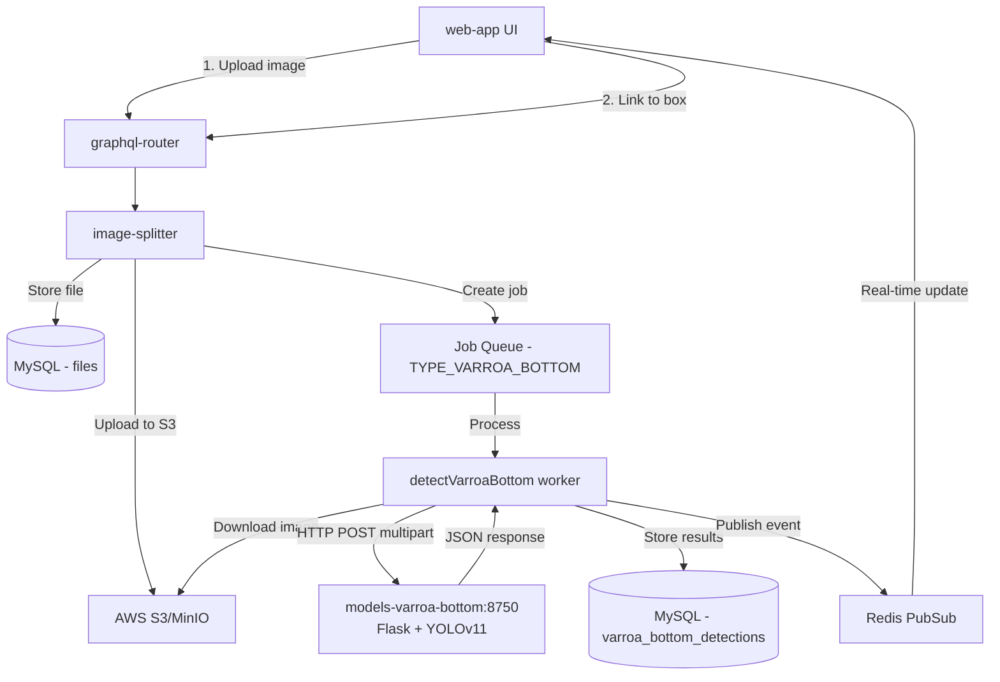
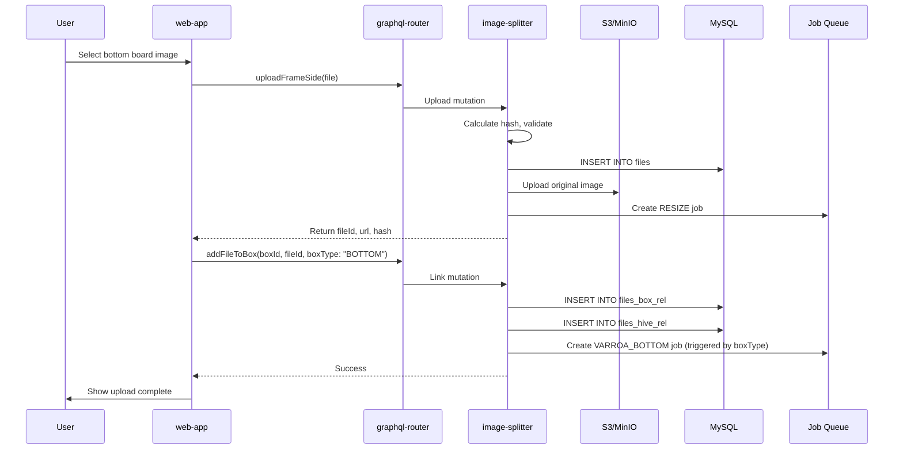
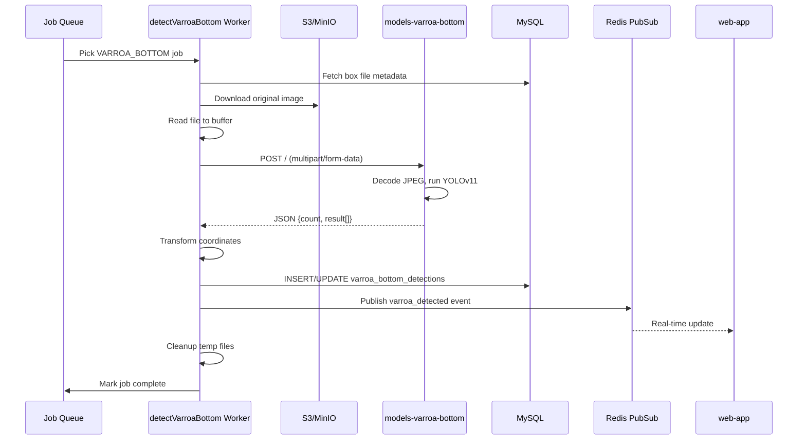
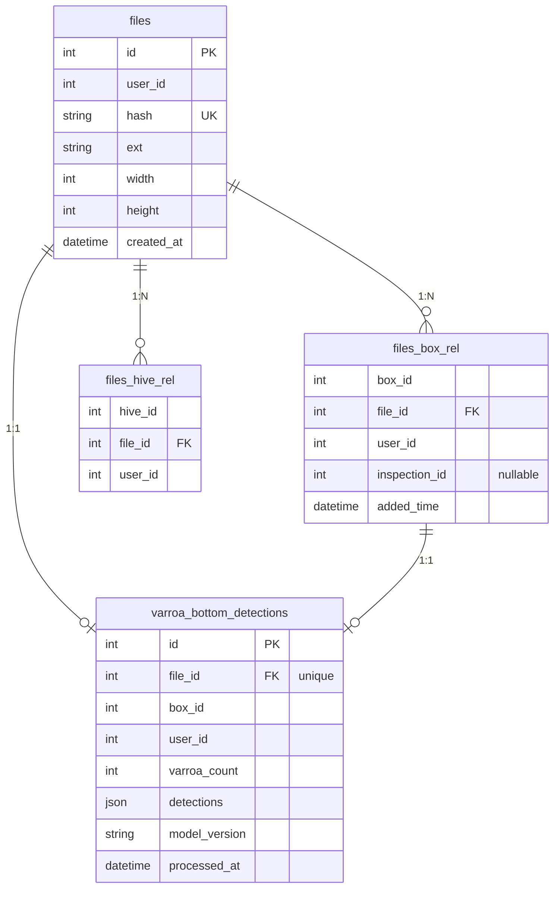

# Обнаружение нижней платы Варроа — техническая документация

### 🎯 Обзор
Эта функция позволяет обнаруживать клещей варроа по изображениям нижней доски улья с использованием моделей AI/ML. Нижние доски (белые липкие листы, помещенные на пол улья) собирают упавших клещей варроа, которые затем подсчитываются по загруженным фотографиям. В отличие от обнаружения варроа на основе кадров, которое использует Clarifai API, обнаружение нижней платы вызывает автономную службу модели YOLOv11.

**Статус:** ✅ **Реализован** (декабрь 2024 г.)

### 🏗️ Архитектура

#### Обзор системы


#### Компоненты

**Внешний интерфейс (web-app)**
- `src/page/hiveEdit/bottomBox/BottomBox.tsx` — Загрузка компонента пользовательского интерфейса с выбором файла.
- `src/page/hiveEdit/index.tsx` — Интеграция структуры улья с изображением нижней доски.
- Мутации GraphQL: `uploadFrameSide`, `addFileToBox`.

**Вердерные службы**
- **image-splitter** (TypeScript/Node.js) — загрузка изображений, хранение, оркестровка обнаружения варроа.
  - Рабочий: `src/workers/detectVarroaBottom.ts` - Загружает изображение, вызывает модель API, сохраняет результаты.
  - Модель: `src/models/boxFile.ts` - Операции с базой данных для коробочных файлов и обнаружений
  - Конфигурация: `src/config/config.dev.ts`, `src/config/config.default.ts` - Конфигурация модели URL
  
- **models-varroa-bottom** (Python/Flask) - сервер вывода YOLOv11
  - `server_flask.py` — сервер Flask HTTP, обрабатывающий загрузку составных данных/данных формы.
  - `detect.py` - оболочка вывода модели YOLOv11
  - Модель: YOLOv11-nano, обученная на изображениях клещей варроа (best.pt)
  - Порт: 8750
  
- **graphql-router** - шлюз API маршрутизирует запросы/мутации GraphQL

**Инфраструктура**
- AWS S3/MinIO — хранилище изображений (исходные версии + версии с измененным размером: 1024 пикселей, 512 пикселей, 128 пикселей)
- MySQL — Метаданные, связи блоков и результаты обнаружения.
- Redis — очередь заданий и публикация/подписка для обновлений в реальном времени.

### 📋 Технические характеристики

#### Схема базы данных

**Ключевые таблицы (база данных image-splitter):**

**файлы** – метаданные загруженного изображения.
- Первичный ключ: `id`, уникальный: `(user_id, hash)`.
- Магазины: хэш, расширение, размеры, временная метка загрузки.

**files_box_rel** — связывает файлы с нижними полями.
- Составной ключ: `(file_id, box_id, user_id)`
- Поддерживает контроль версий через обнуляемый `inspection_id`.

**varroa_bottom_detections** — результаты обнаружения ИИ
- Первичный ключ: `id`, уникальный: `file_id` (одно обнаружение на файл)
- Хранит: varroa_count, обнаруженные JSON, model_version, обработанную временную метку.
- Индексируется: `(user_id, box_id)` для быстрых запросов.

**jobs** – очередь асинхронных задач.
- Поддерживает логику повторов со счетчиком `calls`.
- Индексировано: `(name, process_start_time, process_end_time, calls)`

**Миграции:**
- `018-box-files.sql` - таблица files_box_rel
- `020-varroa-bottom-detections.sql` - таблица varroa_bottom_detections
- `017-jobs.sql` - таблица вакансий

**Формат JSON обнаружения (нормализованный диапазон 0–1):**
```json
[
  {
    "x": 0.5586,
    "y": 0.6187,
    "w": 0.0157,
    "c": 0.92
  },
  {
    "x": 0.2741,
    "y": 0.2944,
    "w": 0.0152,
    "c": 0.88
  }
]
```
- Координаты нормализуются в диапазоне 0–1 относительно размеров исходного изображения.
- `x`, `y` = центральное положение (точность до 4 десятичных знаков)
- `w` = ширина как часть ширины изображения (точность до 4 десятичных знаков)  
- `c` = показатель достоверности (точность до 2 десятичных знаков)

#### GraphQL API

**Мутации:**
```graphql
# Upload image file (returns fileId) - used for ALL image uploads including bottom boards
mutation uploadFrameSide($file: Upload!) {
  uploadFrameSide(file: $file) {
    id
    url
    hash
    resizes {
      id
      url
      max_dimension_px
    }
  }
}

# Link uploaded file to bottom box (triggers varroa detection job)
mutation addFileToBox($boxId: ID!, $fileId: ID!, $hiveId: ID!, $boxType: String) {
  addFileToBox(boxId: $boxId, fileId: $fileId, hiveId: $hiveId, boxType: $boxType)
}
```

**Запрос:**
```graphql
# Get bottom box files with varroa detection results
query varroaBottomDetections($boxId: ID!, $inspectionId: ID) {
  varroaBottomDetections(boxId: $boxId, inspectionId: $inspectionId) {
    id
    fileId
    boxId
    varroaCount
    detections
    processedAt
  }
}

# Get box files
query boxFiles($boxId: ID!, $inspectionId: ID) {
  boxFiles(boxId: $boxId, inspectionId: $inspectionId) {
    fileId
    userId
    boxId
    file {
      id
      url
      hash
      ext
    }
    addedTime
  }
}
```

**Подписки (обновления в реальном времени):**
```graphql
# Subscribe to varroa detection completion events
subscription onBoxVarroaDetected($boxId: String) {
  onBoxVarroaDetected(boxId: $boxId) {
    fileId
    boxId
    varroaCount
    detections
    isComplete
  }
}
```

**Последовательность подписки:**
1. Worker публикует на канале Redis: `{userId}.box.{boxId}.varroa_detected`.
2. фильтр потока событий пересылает на подписку GraphQL WebSocket.
3. web-app получает обновления в реальном времени и повторно извлекает данные обнаружения.
4. Обновления пользовательского интерфейса для отображения результатов обнаружения без перезагрузки страницы.

**Реализация:**
- фильтр потока событий: `src/index.ts` - преобразователь `onBoxVarroaDetected`
- web-app: `src/page/hiveEdit/bottomBox/BottomBox.tsx` - `useSubscription` крючок
- image-splitter: `src/workers/detectVarroaBottom.ts` — публикует событие после завершения обнаружения.

**Примечание по реализации:** Имя мутации `uploadFrameSide` сохранено для обратной совместимости — оно обрабатывает ВСЕ загрузки файлов, включая изображения нижней платы, а не только стороны кадра.

#### REST API - models-varroa-bottom

**Конечная точка:** `POST /`  
**Хост:** `http://models-varroa-bottom:8750` (Docker) или `http://localhost:8750` (локальный)
**Тип контента:** `multipart/form-data`
**Реализация:** Flask + YOLOv11-nano
**Модель:** `/app/model/weights/best.pt`
**Параметры вывода:**
- `conf_thres`: 0,1 (порог достоверности)
- `iou_thres`: 0,5 (порог IoU для NMS)
- `imgsz`: 6016 (размер изображения для вывода)
- `max_det`: 2000 (максимальное количество обнаружений на изображение)

**Запрос:**
```bash
curl -X POST -F "file=@bottom_board.jpg" http://localhost:8750
```

**Ответ (успешное обнаружение):**
```json
{
  "message": "File processed successfully",
  "count": 191,
  "result": [
    {
      "x1": 2193.928955078125,
      "y1": 3836.9970703125,
      "x2": 2257.2607421875,
      "y2": 3905.6357421875,
      "confidence": 0.9389985203742981,
      "class": 0,
      "class_name": "varroa_mite"
    }
  ]
}
```

**Ответ (нет обнаружений):**
```json
{
  "message": "No varroa mites detected",
  "result": [],
  "count": 0
}
```

**Ответ (Ошибка – отсутствует файл):**
```json
{
  "message": "Missing 'file' field in form data"
}
```

**Ответ (Ошибка – неверный файл):**
```json
{
  "message": "No file selected"
}
```

### 🔧 Детали реализации

#### Процесс загрузки файла



**Ключевые файлы:**
- `web-app/src/page/hiveEdit/bottomBox/BottomBox.tsx` — компонент пользовательского интерфейса, триггеры загрузки + ссылка с `boxType: "BOTTOM"`
- `image-splitter/src/graphql/upload-frame-side.ts` — обрабатывает загрузку файлов, создает только задание ИЗМЕНЕНИЯ РАЗМЕРА.
- `image-splitter/src/graphql/resolvers.ts` - `addFileToBox` проверяет поле Type и создает задание VARROA_BOTTOM.

#### Порядок обработки обнаружения



**Ключевые файлы:**
- `image-splitter/src/workers/detectVarroaBottom.ts` — Основная рабочая логика
- `image-splitter/src/workers/orchestrator.ts` — регистрирует работника для заданий VARROA_BOTTOM.
- `image-splitter/src/models/boxFile.ts` - Операции с БД для обнаружения
- `models-varroa-bottom/server_flask.py` - Сервер Flask HTTP
- `models-varroa-bottom/detect.py` - оболочка вывода YOLOv11

#### Отношения модели данных



### ⚙️ Конфигурация

**URL-адреса сервисов:**
- Разработчик: `http://models-varroa-bottom:8750` (имя службы Docker)
- Prod: `http://localhost:8750` (обе службы используют `network_mode: host`)

**Режимы сети:**
- Dev: мостовая сеть по умолчанию Docker (службы взаимодействуют через имена).
- Prod: хост-сеть (`network_mode: host` в обоих docker-compose.prod.yml).

**Файлы конфигурации:**
- `image-splitter/src/config/config.dev.ts` - Среда разработки
- `image-splitter/src/config/config.default.ts` - Производственная среда
- `models-varroa-bottom/docker-compose.dev.yml` - Развертывание для разработчиков
- `models-varroa-bottom/docker-compose.prod.yml` - Развертывание Prod с использованием сети хоста.

### 🧪 Тестирование

#### Быстрый тест — модель API
```bash
cd models-varroa-bottom
curl -X POST -F "file=@Sample images/IMG_6098.jpg" http://localhost:8750
```

#### Полный интеграционный тест
1. Запустите службы: `just start` в обоих репозиториях.
2. Загрузите изображение через web-app UI.
3. Проверьте журналы: `docker logs gratheon-image-splitter-1 | grep detectVarroaBottom`.
4. Результаты запроса: `SELECT * FROM varroa_bottom_detections ORDER BY processed_at DESC LIMIT 1;`

#### Отладка обработки заданий
```bash
# Check if job was created
mysql -h localhost -P 5100 -u root -ptest image-splitter \
  -e "SELECT * FROM jobs WHERE name='varroa_bottom' ORDER BY id DESC LIMIT 5;"

# Check for failures
mysql -h localhost -P 5100 -u root -ptest image-splitter \
  -e "SELECT id, ref_id, error FROM jobs WHERE name='varroa_bottom' AND error IS NOT NULL;"
```

### 📊 Вопросы производительности

#### Обработка изображений
- Изображения нижней доски: обычно 6048x8064 пикселей, 3–6 МБ.
- Время обработки: 5-15 секунд на изображение на процессоре
- Не требуется дробление изображения (в отличие от обнаружения кадров)
- Одиночный вызов модели HTTP уменьшает задержку.

#### Реализовано оптимизаций
1. **Загрузка файлового буфера** – для надежности отправка всего файла в память, а не потоковая передача.
2. **Flask Threading** — поддерживается несколько одновременных запросов.
3. **Кэширование модели** — модель YOLOv11 загружается один раз при запуске сервера и повторно используется для всех запросов.
4. **Кэширование базы данных** — результаты сохраняются, повторная обработка при последующих представлениях не требуется.
5. **Очередь заданий** – асинхронная обработка не блокирует ответ на загрузку.

#### Использование ресурсов
- **models-varroa-bottom**: ~2 ГБ ОЗУ, менее 10 % загрузки ЦП во время вывода.
- **image-splitter**: ~500 МБ ОЗУ для рабочего процесса.
- **S3 Хранилище**: исходная версия (3–6 МБ) + 3 версии с измененным размером (1024 пикселя, 512 пикселей, 128 пикселей)

### 🐛 Распространенные проблемы

| Выпуск | Диагностика | Решение |
|-------|-----------|----------|
| Нет результатов обнаружения | Проверьте таблицу заданий на наличие сбоев | Убедитесь, что `boxType: "BOTTOM"` был передан в мутации |
| 0 обнаружений на изображении с клещами | Проверьте журналы модели, протестируйте изображение вручную | Проверьте магические байты JPEG изображения (`ffd8`), проверьте вес загруженной модели |
| В соединении отказано | Неправильная конфигурация сети | Разработчик: используйте `models-varroa-bottom:8750`, продукт: используйте `localhost:8750` с хост-сетью |
| Превышен лимит памяти | Большое изображение (>6 МБ) | Уже обработано предварительной обработкой изображений >4000 пикселей |
| Тайм-аут | Медленный вывод | Увеличьте таймаут (сейчас 120 с), проверьте ресурсы ЦП |

### 📝 Будущие улучшения

**Краткосрочный:**
1. Добавьте подписку GraphQL для получения обновлений обнаружения в реальном времени.
2. Наложение обнаружения отображения на загруженных изображениях в пользовательском интерфейсе.
3. Анализ исторических тенденций (количество варроа с течением времени)
4. Экспортируйте данные обнаружения в формате CSV/JSON.

**Долгосрочная перспектива:**
1. Поддержка GPU для более быстрого вывода
2. Пакетная обработка нескольких изображений.
3. Пользовательский интерфейс настройки достоверности обнаружения
4. Интеграция с рекомендациями по лечению
5. Поддержка мобильного приложения для загрузки изображений.

### 🔗 Сопутствующая документация

- [Загрузка фоторамки](./frame-photo-upload.md)
- [Нижнее управление доской](./bottom-board-management.md)
- [Управление ульем](./hive-management.md)

### 📌 Изменены ключевые файлы

**image-splitter:**
- `src/workers/detectVarroaBottom.ts` - Новый работник для обнаружения варроа
- `src/models/boxFile.ts` — Операции с базой данных для обнаружения
- `src/models/jobs.ts` - Добавлена константа TYPE_VARROA_BOTTOM.
- `src/workers/orchestrator.ts` - Зарегистрирован новый работник
- `src/graphql/resolvers.ts` - Добавлена обработка параметра boxType.
- `src/graphql/upload-frame-side.ts` - Исправлено создание рабочих мест (только изменение размера)
- `src/config/config.dev.ts` - Добавлена конфигурация varroaBottomUrl.
- `src/config/config.default.ts` - Добавлена конфигурация varroaBottomUrl.
- `migrations/020-varroa-bottom-detections.sql` - Новая таблица обнаружений

**web-app:**
- `src/page/hiveEdit/bottomBox/BottomBox.tsx` - Добавлен параметр boxType в мутацию.

**models-varroa-bottom:**
- `server_flask.py` — Новый сервер Flask (заменил старый сервер server.py на основе cgi)
- `detect.py` - Добавлено подробное логирование.
- `requirements-server.txt` - Добавлена зависимость от Flask.
- `Dockerfile` — обновлено для использования сервера Flask.
- `docker-compose.dev.yml` — Новая конфигурация разработчика
- `docker-compose.prod.yml` — Новая конфигурация продукта с хостовой сетью.
- `justfile` - Добавлены команды запуска/остановки для dev/prod.

#### Узкие места
- models-varroa-bottom только для ЦП (нет требований к графическому процессору для каждого восходящего потока)
- Загрузка изображения с S3 (устраняется локальным кэшированием в /tmp)
- Последовательная обработка заданий (рассмотрите возможность использования параллельных работников, если очередь растет)

#### Метрики
- Время обнаружения: менее 10 секунд на изображение
- Точность: более 90 % по результатам тестов VarroDetector.
- Ложные срабатывания: менее 5% (обломки могут быть неправильно классифицированы)

### 🚫 Технические ограничения

**Текущие ограничения:**
- Вывод только по процессору (поддержка GPU не реализована в models-varroa-bottom)
- Версия для одной модели (без A/B-тестирования)
- Конфигурация порога отсутствия доверия (жестко запрограммирована в модели)
- Нет пакетной обработки (по одному изображению за раз)

**Известные проблемы:**
- Мусор на нижней плате может привести к ложным срабатываниям.
- Очень слабое освещение снижает точность обнаружения.
- Изображения размером более 10 МБ могут истечь по истечении времени ожидания.
- Нет возможности управления версиями модели или возможности отката.

**Будущие улучшения:**
- Добавлена поддержка GPU для более быстрого вывода.
- Реализовать контроль пользовательского интерфейса порога доверия.
- Поддержка пакетной загрузки и обработки
- Версионирование модели и A/B-тестирование.
- Расширенная фильтрация (размер, проверка цвета)

### 🔗 Сопутствующая документация

- [Нижняя доска «Счет Варроа» (Продукт)](../../../about/products/web_app/starter-tier/hive_bottom_varroa_count.md) — Описание функции, доступное пользователю
- [Управление нижней платой](./bottom-board-management.md) - Реализация типа коробки
- [Загрузка фотографии в рамке](./frame-photo-upload.md) - Аналогичный процесс загрузки файлов
- [Управление проверками](./frame-side-management.md) - Система управления версиями

### 📚 Ресурсы для разработки

**Репозитории:**
- [models-varroa-bottom](https://github.com/Gratheon/models-varroa-bottom) - сервер вывода YOLOv11
- [VarroDetector](https://github.com/jodivaso/VarroDetector) — проект с открытым исходным кодом
- [image-splitter](https://github.com/Gratheon/image-splitter) - Сервис обработки изображений
- [swarm-api](https://github.com/Gratheon/swarm-api) - Структура улья API

**Внешние ссылки:**
- [Документация YOLOv11](https://docs.ultralytics.com/)
- [Бумага по обнаружению Варроа](https://theapiarist.org/ai-and-beekeeping-counting-mites/)
- [Коалиция за здоровье медоносных пчел](https://honeybeehealthcoalition.org/varroa/)

### 💬 Технические примечания

**Почему бы не использовать Clarifai для нижних досок?**
- Для обнаружения варроа кадра используется Clarifai, поскольку для больших изображений требуется разделение на фрагменты (9 разбиений).
- Нижние платы проще - распознавание одного полного изображения
- models-varroa-bottom является специализированным, с открытым исходным кодом и размещается самостоятельно (без затрат API).
- Повышенная точность для контекста нижней платы по сравнению с общим обнаружением кадра.

**Проверка версий:**
- Когда пользователь создает проверку, текущие ассоциации файлов сохраняются с помощью `inspection_id`.
- Новые загрузки получают `inspection_id = NULL` (текущее состояние).
- Исторические запросы используют `inspection_id` для получения старых снимков.
- Та же схема, что и для управления боковой частью рамы.

**Расходы на хранение:**
- Среднее изображение нижней доски: 4 МБ.
– Метаданные обнаружения: менее 1 КБ в формате JSON.
- Стоимость хранения S3 незначительна (менее 0,01 доллара США в месяц на пользователя)
- Для нижних досок не требуется изменение размера изображения (в отличие от фреймов с миниатюрами)

---
**Последнее обновление**: 22 декабря 2024 г.  
**Статус реализации**: ✅ Завершено  
**Ключевые компоненты**: рабочий процесс image-splitter, сервер Flask models-varroa-bottom, интеграция пользовательского интерфейса web-app.