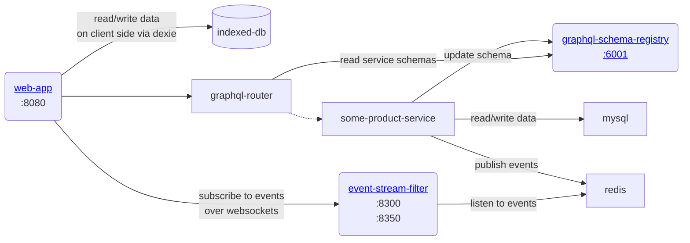
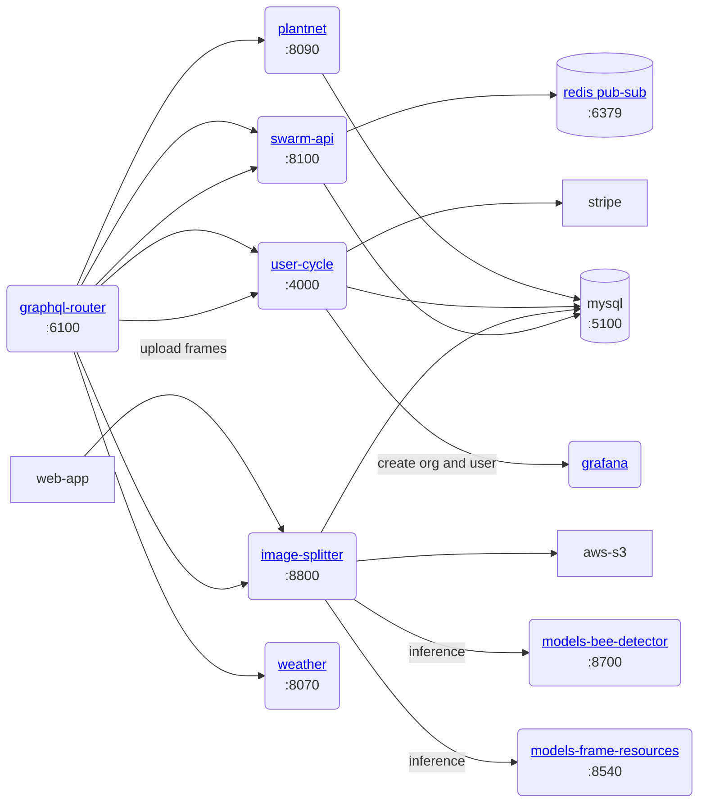

> Цель этого документа — дать толчок вашей разработке web-app в качестве инженера.
## Предварительные условия среды

💡 Для разработки [сервисов веб-приложения](../../products/web_app/web_app.md) вам потребуется Linux или Mac OSX с **Docker**.

Для разработки сервисов обработки видео [Entrance Observer](../../products/entrance_observer/entrance_observer.md) вам понадобится [Jetson Orin Nano](../entrance-observer/Jetson%20Orin%20setup.md) или [Jetson Nano](../entrance-observer/Jetson%20Nano%20setup.md) для поддержки GPU и совместимости с Docker images.

## Архитектура
### Основные услуги

Следующие сервисы являются обязательными, вам нужно будет проверить их с помощью git и запустить в следующем порядке:

- mysql ← предоставляет хранилище для других сервисов Node и Go.
- redis ← обеспечивает уровень pub-sub и кэширования
-graphql-schema-registry ← хранит схему микросервисов графа
- graphql-router ← маршрутизирует запросы API к другим микросервисам, используя [graphql Federation](https://www.apollographql.com/docs/federation/), что по сути означает, что запросы разделяются и направляются в микросервис, который отвечает за определенную часть схемы.

### Основные службы и маршрутизация

### Услуги по продуктам

- go-api ← основной сервис, который управляет объектами домена, такими как пасека, улей, секция улья, рамка, сторона рамки.
- image-splitter ← основной сервис, управляющий обработкой изображений + хранящий данные об обнаруженных объектах в кадре фотографии

Обратите внимание, что некоторые службы могут все еще находиться в разработке и работать нестабильно или только на стадии проекта (например, обработка видео).

## Настройка разработки

Начните с проверки [https://github.com/gratheon/web-app](https://github.com/gratheon/web-app). Это просто одностраничное приложение, React single-page app, и ему не требуется Docker image, но вы можете увидеть зависимости API, которые ему потребуются.

Запуск чистого `just start` позволит вам использовать производственную серверную часть для разработки frontend, поэтому вы сможете войти в систему, используя **существующие учетные данные**. Обязательно используйте для этого адрес электронной почты/пароль, поскольку вход в Google не работает на локальном хосте.

Это наиболее полезно в случае, если вам нужно внести косметические изменения или изменения только для FE, которые не изменяют и не вносят никаких изменений в схему API.

<iframe width="100%" height="400" src="https://www.youtube.com/embed/T4b2uxrf8U4" title="Making easy web-app changes" frameborder="0" allow="accelerometer; autoplay; clipboard-write; encrypted-media; gyroscope; picture-in-picture; web-share" referrerpolicy="strict-origin-when-cross-origin" allowfullscreen></iframe>

Чтобы иметь полную гибкость при изменении схемы и backend, вам необходимо проверить все зависимые от ядра службы на основе диаграммы архитектуры и понять, как связаны службы на внутренней стороне.

После оформления заказа за каждую услугу

- Вам нужно будет запустить `just start`, чтобы запустить Docker-контейнер.
- Установите `src/config/config.dev.ts`, который не был зафиксирован в репозитории. Конфигурации обычно включают учетные данные для доступа к БД, AWS S3 или внешним службам.

💡 Обратите внимание, что некоторые службы выполняют миграцию БД при запуске, поэтому убедитесь, что у вас запущен MySQL и предварительно созданы базы данных с действительным доступом пользователя. Обратите внимание, что большинство сервисов еще не подключаются к MySQL автоматически, поэтому вам необходимо запустить сервисы в правильном порядке или перезапустить модуль.

<iframe width="100%" height="400" src="https://www.youtube.com/embed/dCtL5icnsC0" title="Docs - web-app development 2" frameborder="0" allow="accelerometer; autoplay; clipboard-write; encrypted-media; gyroscope; picture-in-picture; web-share" referrerpolicy="strict-origin-when-cross-origin" allowfullscreen></iframe>

### Дополнительные услуги

Некоторые службы не блокируют пользовательский интерфейс или серверную часть в целом, но необходимы для некоторых конкретных функций, поэтому вам может понадобиться в зависимости от вашей работы:

- models-bee-detector ← обнаруживает пчел
- event-stream-filter ← отправляет события во фронтенд
- gate-video-stream
- models-gate-tracker

## Функции

### Нижняя доска и мониторинг Варроа

Пчеловоды могут отслеживать заражение клещом варроа, загружая изображения нижней доски улья.

См. руководство пользователя в разделе «Подсчет варроа на нижней доске](../../products/web_app/starter-tier/hive_bottom_varroa_count.md)», в разделе «Обнаружение дна варроа](features/varroa-bottom-detection.md)» для получения технических подробностей и в [Схеме DB](🥞%20DB%20schemas/image-splitter.md) для структур таблиц.
– **Загрузка изображения:** Двухэтапный процесс:
    1. Загрузите изображение в S3 с помощью мутации `uploadFrameSide`.
    2. Свяжите изображение с блоком с помощью мутации `addFileToBox` в image-splitter.
– **База данных:** изображения хранятся в таблице `files_box_rel` со ссылками на `box_id`, `file_id` и `inspection_id` для управления версиями.
- **Обработка:** Изображения автоматически помещаются в очередь для обнаружения варроа (задание TYPE_VARROA).
- **Услуги:**
    - **swarm-api**: Управление ящиком и тип НИЖНЯЯ
    - **image-splitter**: загрузка, хранение и связывание файлов.
    - **web-app**: компонент BottomBox для пользовательского интерфейса.

См. руководство пользователя в разделе «Подсчет варроа на нижней доске](../../products/web_app/starter-tier/hive_bottom_varroa_count.md)», в разделе «Обнаружение дна варроа](features/varroa-bottom-detection.md)» для получения технических подробностей и в [Схеме DB](🥞%20DB%20schemas/image-splitter.md) для структур таблиц.

### Совместное использование проверок

Пользователи могут делиться результатами осмотра отдельных ульев с другими через уникальный общедоступный URL.

- **Создание ссылки.** В представлении списка проверок при нажатии кнопки «Поделиться» в проверке создается уникальный URL, содержащий безопасный общий токен.
- **Общественный доступ.** Любой, у кого есть эта ссылка, может просмотреть конкретные детали проверки без необходимости входа в систему.
- **Только чтение и ограниченная область действия:** Доступ по ссылке общего доступа разрешен только для чтения. Встроенный общий токен ограничивает доступ к данным конкретно для общей проверки и, возможно, для сведений о родительском улье/пасеке, необходимых для контекста. Это предотвращает доступ к любым другим данным или возможность внесения изменений.
- **Безопасность:** общие токены проверяются, а доступ контролируется предопределенными областями, связанными с токеном. Маршрутизатор **GraphQL реализует эти области**, обеспечивая безопасный и ограниченный доступ к данным путем блокировки несанкционированных запросов. (Технические подробности см. в [GraphQL API Аутентификация](../API/GraphQL.md#share-token-authentication-read-only-access)).

### Разделенная колония

Создавайте новые ульи, перемещая выбранные рамки из сильной семьи. Предотвращает роение и способствует расширению пасеки.

Примечания к функциям, доступным для пользователя, находятся в [разделенной пчелиной колонии](../../products/web_app/hobbyist-tier/split-bee-colony.md).

**Технический обзор:**
- **Мутация:** `splitHive(sourceHiveId, name, frameIds)` — Создает новый улей с 1–10 выбранными рамками.
- **База данных:** Новая запись улья с отслеживанием `parent_hive_id` и `split_date`.
- **Сервисы:** swarm-api (разделенная логика), web-app (интерфейс SplitHiveModal).
- **В реальном времени:** Redis pub/sub транслирует событие `hive:split`.

### Присоединяйтесь к колонии (объедините ульи)

Объедините две колонии, перемещая коробки из исходного в целевой улей. Укрепляет слабые семьи и управляет генетикой маток.

Примечания к функциям, доступным для пользователя, находятся в папке [join bee colonies](../../products/web_app/hobbyist-tier/join-bee-colonies.md).

**Технический обзор:**
- **Мутация:** `joinHives(sourceHiveId, targetHiveId, mergeType)` — объединяет ульи с вариантами управления матками.
– **База данных:** Исходный куст, отмеченный `merged_into_hive_id`, `merge_date`, `merge_type`.
- **Логика блока:** блоки BOTTOM/GATE остаются в исходном положении, все остальные перемещаются в цель.
- **Сервисы:** swarm-api (логика слияния, перемещение рамки), web-app (пользовательский интерфейс JoinColonyModal).
- **В режиме реального времени** Redis pub/sub транслирует события `hive:join` и `hive:merged`.