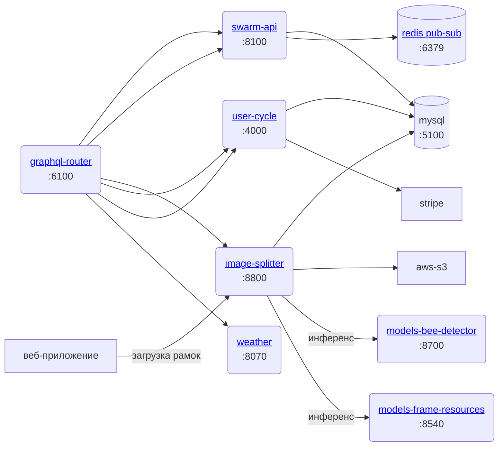

> Цель этого документа — помочь вам начать разработку веб-приложения как инженеру

## Требования к окружению

💡 Вам понадобится Linux или Mac OSX с **Docker** для разработки сервисов [Веб-приложения](../../products/web_app/index.md)

Для разработки сервисов обработки видео [Entrance Observer](../../products/entrance_observer/entrance_observer.md) вам понадобится [Jetson Orin Nano](../entrance-observer/Jetson%20Orin%20setup.md). Старые заметки [Jetson Nano](../entrance-observer/legacy-research/Jetson%20Nano%20setup.md) сохранены только как устаревшие исследования, так как текущая архитектура ориентирована на Jetson Orin.

## Архитектура
### Основные сервисы

Следующие сервисы обязательны, вам нужно будет клонировать их через git и запустить в следующем порядке:

- mysql ← обеспечивает хранилище для других node и go сервисов
- redis ← обеспечивает слой pub-sub и кеширования
- graphql-schema-registry ← хранит graphql схему микросервисов
- graphql-router ← маршрутизирует API запросы к другим микросервисам, используя [graphql federation](https://www.apollographql.com/docs/federation/), что означает, что запросы разделяются и направляются в микросервис, ответственный за определённую часть схемы

### Основные сервисы и маршрутизация

```mermaid
flowchart LR
	web-app --"чтение/запись данных \n на стороне клиента через dexie"--> indexed-db[(indexed-db)]
	web-app("<a href='https://github.com/Gratheon/web-app'>веб-приложение</a>\n:8080") --> graphql-router
	web-app --"подписка на события\n по websocket"--> event-stream-filter("<a href='https://github.com/Gratheon/event-stream-filter'>event-stream-filter</a>\n:8300\n:8350") --"прослушивание событий"--> redis

	некий-сервис продукта --"публикация событий"--> redis
	graphql-router --"чтение схем сервисов"--> graphql-schema-registry("<a href='https://github.com/tot-ra/graphql-schema-registry'>graphql-schema-registry</a>\n<a href='http://localhost:6001/'>:6001</a>\n")
	graphql-router -.-> некий-сервис продукта --"чтение/запись данных"--> mysql
	некий-сервис продукта --"обновление схемы"--> graphql-schema-registry
```


### Сервисы продуктов

- go-api ← основной сервис, управляющий доменными сущностями такими как пчелиная усадьба, улей, секция улья, рамка, сторона рамки
- image-splitter ← основной сервис, управляющий обработкой изображений + хранящий данные о обнаруженных объектах на фотографии рамки

Обратите внимание, что некоторые сервисы всё ещё находятся в разработке и могут быть нестабильными или только на стадии черновика (обработка видео, например)



## Настройка разработки

Начните с клонирования [https://github.com/gratheon/web-app](https://github.com/gratheon/web-app). Это просто одностраничное React-приложение и ему не нужен docker образ, но вы можете увидеть зависимости API, которые оно потребует. 

Запуск чистого `just start` позволит вам использовать production backend для разработки фронтенда, так что вы сможете войти с **существующими учётными данными**. Убедитесь, что используете email/пароль, так как вход через Google не работает на localhost.

Это наиболее полезно в случае, если вам нужно внести косметические изменения или изменения только во фронте, которые не изменяют и не вводят никаких изменений в схему API.

<iframe width="100%" height="400" src="https://www.youtube.com/embed/T4b2uxrf8U4" title="Внесение простых изменений в веб-приложение" frameborder="0" allow="accelerometer; autoplay; clipboard-write; encrypted-media; gyroscope; picture-in-picture; web-share" referrerpolicy="strict-origin-when-cross-origin" allowfullscreen></iframe>


Для полной гибкости схемы и изменения бэкенда вам нужно будет клонировать все основные зависимые сервисы на основе диаграммы архитектуры и понять, как связаны между собой сервисы на бэкенде

После клонирования для каждого сервиса:
- Вам нужно запустить `just start` для запуска docker контейнера
- Установить `src/config/config.dev.ts`, который не был закоммичен в репозиторий. Конфигурации обычно включают учётные данные для доступа к БД, AWS S3 или внешним сервисам

💡 Обратите внимание, что некоторые сервисы запускают миграции БД при старте, поэтому убедитесь, что mysql запущена и базы данных предварительно созданы с действительным доступом пользователя. Обратите внимание, что большинство сервисов ещё не переподключаются к mysql автоматически, так что вам нужно запускать сервисы в правильном порядке или перезапускать pod

<iframe width="100%" height="400" src="https://www.youtube.com/embed/dCtL5icnsC0" title="Документация - разработка веб-приложения 2" frameborder="0" allow="accelerometer; autoplay; clipboard-write; encrypted-media; gyroscope; picture-in-picture; web-share" referrerpolicy="strict-origin-when-cross-origin" allowfullscreen></iframe>

### Дополнительные сервисы

Некоторые сервисы не блокируют UI или бэкенд в целом, но требуются для некоторых специфических функций, так что вам могут понадобиться в зависимости от вашей работы:

- models-bee-detector ← обнаруживает пчёл
- event-stream-filter ← отправляет события на фронтенд
- gate-video-stream
- models-gate-tracker


## Функции

### Дно улья и мониторинг варроатоза

Эта функция позволяет автоматически обнаруживать клещей варроа на дне улья с помощью компьютерного зрения.