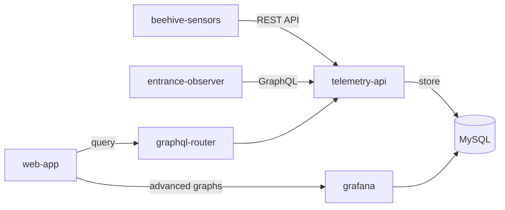

Храните и визуализируйте временные ряды от IoT-устройств, подключённых к ульям: температуру, влажность, вес и активность у летка. Это помогает долго наблюдать за состоянием семьи и принимать решения на основе данных.

## Обзор

Профессиональным пчеловодам нужны исторические данные, чтобы принимать обоснованные решения по управлению ульями. Система хранения телеметрии собирает метрики с аппаратных сенсоров и сохраняет их для анализа и визуализации.

Функция поддерживает:

- непрерывный мониторинг условий в улье;
- анализ сезонных трендов;
- раннее обнаружение аномалий по паттернам данных;
- доказательное принятие решений перед вмешательствами.

## Поддерживаемые метрики

### Данные среды

- **Температура** — внутренняя температура улья в °C.
- **Влажность** — уровень влажности внутри улья в процентах.
- **Вес** — общий вес улья для отслеживания медосбора, кг.

### Активность у летка

- **Пчёлы входят/выходят** — количество пчёл по направлениям.
- **Чистый поток** — разница между входящими и выходящими пчёлами.
- **Средняя скорость** — скорость движения пчёл.
- **Неподвижные пчёлы** — пчёлы, которые задерживаются у летка.
- **Обнаруженные пчёлы** — общее число пчёл в кадре камеры.
- **Взаимодействия пчёл** — контакты между пчёлами у летка.

## Как это работает

1. **Подключите оборудование**
   - Установите beehive-sensors для температуры, влажности и веса.
   - Установите entrance-observer для анализа трафика у летка.
   - Настройте устройства с API-токеном.

2. **Автоматический сбор данных**
   - Сенсоры отправляют данные в telemetry-api.
   - Данные сохраняются в таблицах MySQL, оптимизированных под временные ряды.
   - Авторизация проверяется через user-cycle.

3. **Просмотр и анализ**
   - Актуальные метрики отображаются на дашборде улья.
   - Исторические графики поддерживают разные диапазоны времени.
   - Для продвинутой визуализации используется Grafana.
   - Данные можно выгружать для внешнего анализа.

4. **Настройка уведомлений**
   - Создавайте правила по порогам.
   - Получайте уведомления, если метрики выходят за безопасные диапазоны.
   - Отслеживайте резкие изменения и аномалии.

## Хранение данных

Pro tier включает:

- **Период хранения**: 3 года исторических данных.
- **Разрешение**: от минутных до дневных агрегатов.
- **Диапазоны запросов**: от последнего часа до 2 лет.
- **Объём**: примерно 500 MB на улей в год.

## Архитектура



Система использует:

- **telemetry-api** — основной сервис хранения и запросов метрик;
- **MySQL** — хранилище временных рядов с индексами по hive_id и timestamp;
- **graphql-router** — API gateway для запросов веб-приложения;
- **grafana** — продвинутая визуализация и аналитика.

## API-доступ

Доступны REST и GraphQL API.

**REST API** для IoT-устройств:

```text
POST /v1/metrics/:hiveId
POST /v1/entrance/:hiveId/:boxId
GET /v1/metrics/:hiveId/temperature?minutes=60
```

**GraphQL API** для веб-приложения:

```graphql
query {
  temperatureCelsius(hiveId: "123", timeRangeMin: 60)
  humidityPercent(hiveId: "123", timeRangeMin: 1440)
  weightKgAggregated(hiveId: "123", days: 7, aggregation: DAILY_AVG)
  entranceMovement(hiveId: "123", timeFrom: "2024-12-01", timeTo: "2024-12-06")
}
```

## Сценарии

### Сезонное сравнение

Сравнивайте температуру и влажность по годам, чтобы планировать весеннее развитие и подготовку к зимовке.

### Отслеживание медосбора

Следите за изменениями веса, чтобы увидеть начало взятка, определить время откачки и оценить дневной прирост.

### Мониторинг здоровья семьи

Отслеживайте активность у летка, чтобы заметить безматочные семьи, грабёж или изменения поведения.

### Эффективность обработок

Анализируйте метрики до и после обработок, чтобы подтвердить восстановление семьи и подобрать оптимальное время вмешательства.

## Технические ограничения

- Максимальный диапазон запроса без агрегации: 2 года.
- Лимит точек данных: 10 000 записей на запрос.
- Минимальный интервал записи: 1 секунда на устройство.
- Обновления через polling, без real-time websockets.
- Grafana требует отдельной авторизации.

## Связанные функции

- [🔔 Уведомления](../flexible-tier/alerts.md) — правила и каналы оповещения.
- [📊 Аналитика временных рядов](timeseries-data-analytics.md) — сравнение метрик между ульями.

## Ресурсы

- [Техническая документация](/ru/docs/web-app/features/telemetry-storage/)
- [Telemetry API на GitHub](https://github.com/Gratheon/telemetry-api)
- [Настройка датчиков улья](/ru/docs/beehive-sensors/)
- [Настройка Entrance Observer](/ru/docs/entrance-observer/)