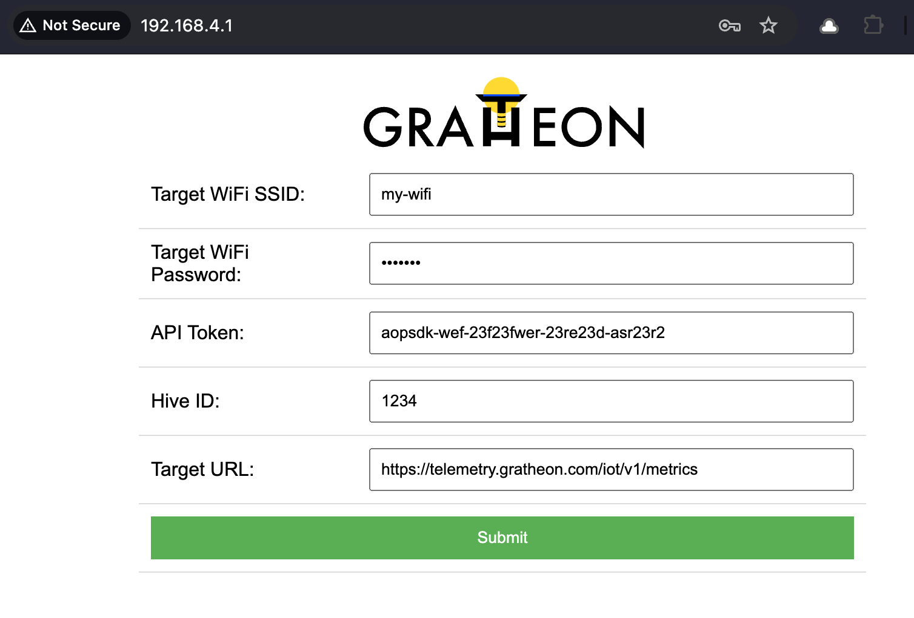

### Setting up Arduino IDE for firmware upload
- download [Arduino IDE](https://www.arduino.cc/en/software)
- under preferences, set this URL as extra sources [https://raw.githubusercontent.com/espressif/arduino-esp32/gh-pages/package_esp32_index.json](https://raw.githubusercontent.com/espressif/arduino-esp32/gh-pages/package_esp32_index.json)
- ESP32 chips come in different flavours. If you got same component as described in the bill of materials - [ESP32](components/ESP32.md), then connect it over USB to your machine
- Choose `ESP32-WROOM-DA Module` from device list

- Make sure to change Arduino IDE upload speed to 115200 baud under Tools so that your device can receive data when you upload it

- Install [DallasTemperature@3.9.0](https://github.com/milesburton/Arduino-Temperature-Control-Library) library in Arduino IDE (DallasTemperature@3.9.0
- Install [HX711](https://github.com/RobTillaart/HX711) library (by RobTillaart) in Arduino IDE 

### Uploading firmware
- Checkout our client firmware `git clone git@github.com:Gratheon/beehive-sensors.git`
- Upload code to the device using a button `->`. You should see something like:
  
- Click on the reset button (`FN`) on the chip

### Configuring powered-on ESP32
- Connect to the ESP32 WIFI access point `gratheon`, use password `gratheon`
- Open browser and navigate to wifi access point default gateway - [http://192.168.4.1](http://192.168.4.1)
- Enter the configuration:
	- WiFi credentials (SSID, password) for the sensor to connect to the internet
	- Hive ID - to identify the hive that is being monitored in web-app. You can take that you can take from URL, for example in `https://app.gratheon.com/apiaries/7/hives/54` the here ID is the last digits `54`
	- API Token - to identify request belonging to user (you). You can generate token from account settings at [https://app.gratheon.com/account](https://app.gratheon.com/account)
- Click `Save` button. Your ESP32 will restart and connect to your WIFI network and start sending data to the telemetry API service

