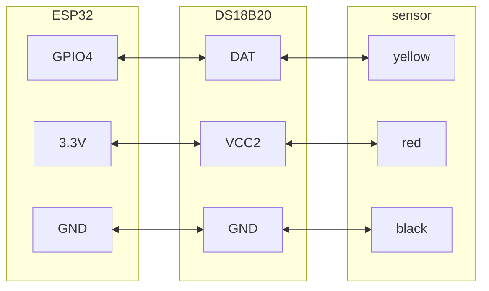
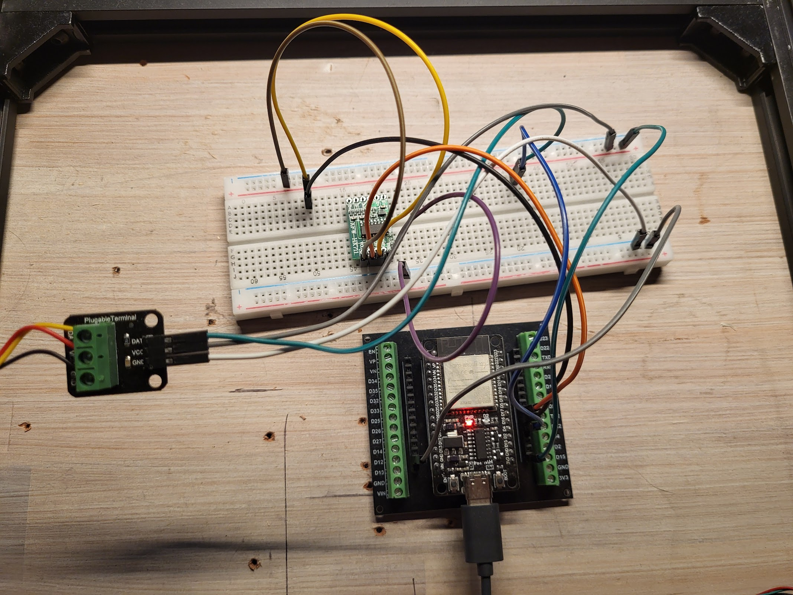

https://www.aliexpress.com/item/1005006431677780.html

### Wiring diagram
  

DS18B20 Temperature Sensor:
- DATA to IO4 (with an optional 4.7kΩ pull-up resistor between DATA and VCC)

Description:

Pluggable terminal waterproof DS18B20 temperature sensor can be used in many places, such as soil temperature detection, hot water tank temperature control, waterproof DS18B20 temperature sensor must also be connected to a pull-up resistor can be used, for which we designed the converter to send use.

Product Specifications:

Temperature sensor supply voltage: 3.0V ~ 5.5V

Temperature sensor resolution: 9 to 12 adjustable resolution

Temperature range: -55 ~ +125 ° (lead can only withstand the highest temperature of 85 degrees)

Temperature Sensor Output Lead: Yellow (DATA) Red (VCC) and Black (GND)

Adapter Cables: DATA, VCC, BLK,

Suitable platform: for Arduino and Raspberry Pi

Package Included:

1PC * DS18B20 temperature sensor

1PC * pluggable terminal adapter

1PC * 3pin cable

<iframe width="100%" height="400" src="https://www.youtube.com/embed/iee3QBuVx6M" title="ESP32 &amp; DS18B20 thermometer - simple projects with Arduino and ESP32" frameborder="0" allow="accelerometer; autoplay; clipboard-write; encrypted-media; gyroscope; picture-in-picture; web-share" referrerpolicy="strict-origin-when-cross-origin" allowfullscreen></iframe>