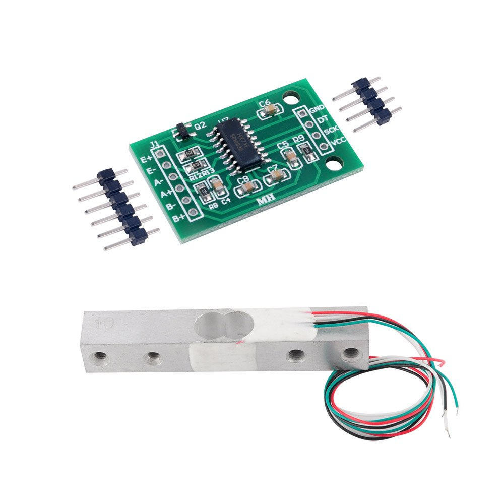
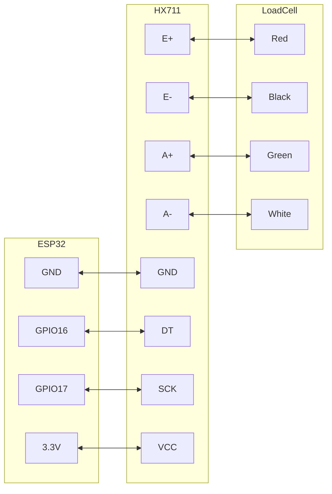
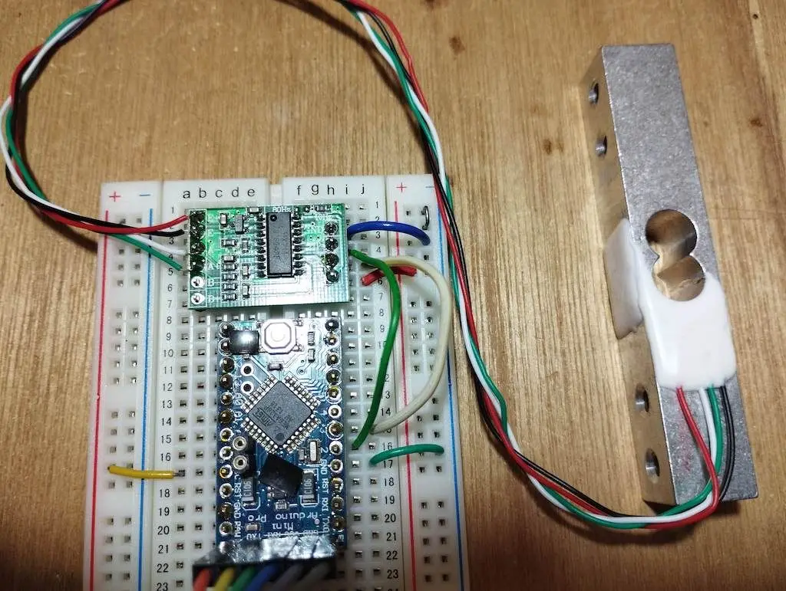

https://www.aliexpress.com/item/1005006827930173.html
[https://www.amazon.de/-/en/gp/product/B079FQNJJH/](https://www.amazon.de/-/en/gp/product/B079FQNJJH/)

### Wiring

#### Single Load Cell Setup
HX711 Load Cell Amplifier:

- E = Excitation. E+ (Red) and E- (Black) are the excitation wires for the load cell, providing the voltage that powers the load cell.
- A = Amplifier. A+ (White) and A- (Green) are the signal wires from the load cell, carrying the differential signal that the HX711 amplifies.



#### Four Load Cells Setup (for complete beehive weight measurement)

**Yes, you can connect 4 weight sensors to a single ESP32!** Each load cell needs its own HX711 amplifier. Here's how the connections work:

```mermaid
flowchart TD
    subgraph ESP32
        VCC[3.3V]
        GND[GND]
        GPIO16[GPIO16 - DT1]
        GPIO17[GPIO17 - SCK1]
        GPIO18[GPIO18 - DT2] 
        GPIO19[GPIO19 - SCK2]
        GPIO21[GPIO21 - DT3]
        GPIO22[GPIO22 - SCK3]
        GPIO23[GPIO23 - DT4]
        GPIO25[GPIO25 - SCK4]
    end

    subgraph HX711_1[HX711 #1 - Front Left]
        DT1[DT]
        SCK1[SCK]
        VCC1[VCC]
        GND1[GND]
        E1+[E+]
        E1-[E-]
        A1+[A+]
        A1-[A-]
    end

    subgraph HX711_2[HX711 #2 - Front Right]
        DT2[DT]
        SCK2[SCK]
        VCC2[VCC]
        GND2[GND]
        E2+[E+]
        E2-[E-]
        A2+[A+]
        A2-[A-]
    end

    subgraph HX711_3[HX711 #3 - Back Left]
        DT3[DT]
        SCK3[SCK]
        VCC3[VCC]
        GND3[GND]
        E3+[E+]
        E3-[E-]
        A3+[A+]
        A3-[A-]
    end

    subgraph HX711_4[HX711 #4 - Back Right]
        DT4[DT]
        SCK4[SCK]
        VCC4[VCC]
        GND4[GND]
        E4+[E+]
        E4-[E-]
        A4+[A+]
        A4-[A-]
    end

    subgraph LoadCell1[Load Cell 1 - Front Left]
        Red1[Red - E+]
        Black1[Black - E-]
        White1[White - A-]
        Green1[Green - A+]
    end

    subgraph LoadCell2[Load Cell 2 - Front Right]
        Red2[Red - E+]
        Black2[Black - E-]
        White2[White - A-]
        Green2[Green - A+]
    end

    subgraph LoadCell3[Load Cell 3 - Back Left]
        Red3[Red - E+]
        Black3[Black - E-]
        White3[White - A-]
        Green3[Green - A+]
    end

    subgraph LoadCell4[Load Cell 4 - Back Right]
        Red4[Red - E+]
        Black4[Black - E-]
        White4[White - A-]
        Green4[Green - A+]
    end

    %% Power connections
    VCC -.-> VCC1
    VCC -.-> VCC2
    VCC -.-> VCC3
    VCC -.-> VCC4
    
    GND -.-> GND1
    GND -.-> GND2
    GND -.-> GND3
    GND -.-> GND4

    %% Digital connections
    GPIO16 --- DT1
    GPIO17 --- SCK1
    GPIO18 --- DT2
    GPIO19 --- SCK2
    GPIO21 --- DT3
    GPIO22 --- SCK3
    GPIO23 --- DT4
    GPIO25 --- SCK4

    %% Load cell connections
    E1+ --- Red1
    E1- --- Black1
    A1+ --- Green1
    A1- --- White1

    E2+ --- Red2
    E2- --- Black2
    A2+ --- Green2
    A2- --- White2

    E3+ --- Red3
    E3- --- Black3
    A3+ --- Green3
    A3- --- White3

    E4+ --- Red4
    E4- --- Black4
    A4+ --- Green4
    A4- --- White4
```



**Alternative Wiring (Shared SCK):**
You can share the SCK (clock) line between all HX711 modules to save ESP32 pins. In this case, you'd only need 5 pins total (1 shared SCK + 4 separate DT pins):

```
ESP32 GPIO17 → All HX711 SCK pins (shared)
ESP32 GPIO16 → HX711 #1 DT
ESP32 GPIO18 → HX711 #2 DT  
ESP32 GPIO21 → HX711 #3 DT
ESP32 GPIO23 → HX711 #4 DT
3.3V → All HX711 VCC pins
GND → All HX711 GND pins
```





# Features

Two selectable differential input channels

On-chip active low noise PGA with selectable gain of 3264 and 128

On-chip power supply regulator for load-cell and ADC analog power supply

On-chip oscillator requiring no external component with optional external crystal

On-chip power-on-reset

Simple digital control and serial interface: pin-driven controlsno programming needed

Selectable 10SPS or 80SPS output data rate

Simultaneous 50 and 60Hz supply rejection

Current consumption including on-chip analog power supply regulator: normal operation < 1.5mApower down < 1uA

Operation supply voltage range: 2.6 ~ 5.5V

Operating Temperature Range:-20 degree ~ +85 degree

### Connection Summary

**For 4-sensor beehive scale setup:**

| Load Cell Position | HX711 Module | ESP32 DT Pin | ESP32 SCK Pin | Load Cell Wires |
|-------------------|--------------|--------------|---------------|-----------------|
| Front Left        | HX711 #1     | GPIO16       | GPIO17        | Red→E+, Black→E-, White→A-, Green→A+ |
| Front Right       | HX711 #2     | GPIO18       | GPIO19*       | Red→E+, Black→E-, White→A-, Green→A+ |
| Back Left         | HX711 #3     | GPIO21       | GPIO22*       | Red→E+, Black→E-, White→A-, Green→A+ |
| Back Right        | HX711 #4     | GPIO23       | GPIO25*       | Red→E+, Black→E-, White→A-, Green→A+ |

*Can be shared (all connected to GPIO17) to save pins.

**Power connections:**
- ESP32 3.3V → All HX711 VCC pins
- ESP32 GND → All HX711 GND pins

**Arduino Code Example:**
```cpp
#include "HX711.h"

// Define pins for each HX711
#define DT1 16
#define SCK1 17
#define DT2 18  
#define SCK2 19  // or 17 if sharing SCK
#define DT3 21
#define SCK3 22  // or 17 if sharing SCK
#define DT4 23
#define SCK4 25  // or 17 if sharing SCK

// Create HX711 instances
HX711 scale1, scale2, scale3, scale4;

void setup() {
  Serial.begin(115200);
  
  // Initialize each scale
  scale1.begin(DT1, SCK1);
  scale2.begin(DT2, SCK2);
  scale3.begin(DT3, SCK3);
  scale4.begin(DT4, SCK4);
  
  // Calibration factors (determine experimentally)
  scale1.set_scale(2280.f);
  scale2.set_scale(2280.f);
  scale3.set_scale(2280.f);
  scale4.set_scale(2280.f);
  
  // Tare (zero) all scales
  scale1.tare();
  scale2.tare();
  scale3.tare();
  scale4.tare();
}

void loop() {
  float weight1 = scale1.get_units(10);  // Average of 10 readings
  float weight2 = scale2.get_units(10);
  float weight3 = scale3.get_units(10);
  float weight4 = scale4.get_units(10);
  
  float totalWeight = weight1 + weight2 + weight3 + weight4;
  
  Serial.printf("Corner weights: %.2f, %.2f, %.2f, %.2f kg\n", 
                weight1, weight2, weight3, weight4);
  Serial.printf("Total hive weight: %.2f kg\n", totalWeight);
  
  delay(1000);
}
```

Red to E+

Black to E-

Green to A+

White to A-


<iframe width="100%" height="400" src="https://www.youtube.com/embed/AwSBbMUPjSc" title="HX711 Load Cell Arduino | HX711 calibration | Weighing Scale | Strain Gauge" frameborder="0" allow="accelerometer; autoplay; clipboard-write; encrypted-media; gyroscope; picture-in-picture; web-share" referrerpolicy="strict-origin-when-cross-origin" allowfullscreen></iframe>


## Alternative 
https://www.aliexpress.com/item/1005006593556468.html