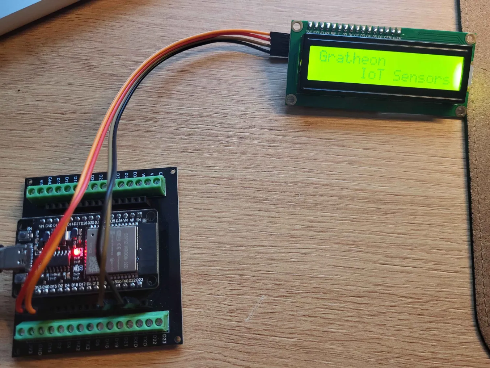
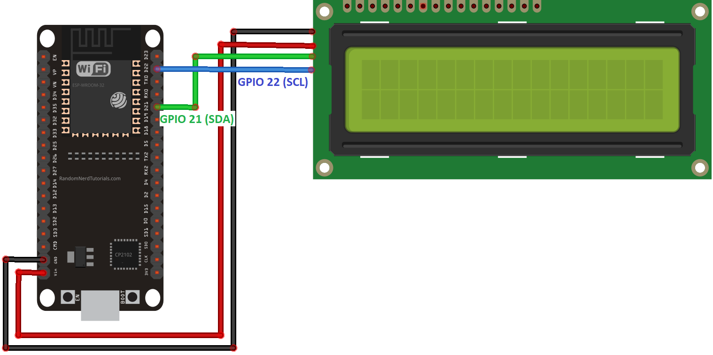

https://www.aliexpress.com/item/1005006100081942.html
https://github.com/blackhack/LCD_I2C






```
#include <LCD_I2C.h>

LCD_I2C lcd(0x27, 16, 2); // Default address of most PCF8574 modules, change according

void setup()
{
    lcd.begin(); // If you are using more I2C devices using the Wire library use lcd.begin(false)
                 // this stop the library(LCD_I2C) from calling Wire.begin()
    // Note: On ESP32 you would rather use:
    //
    //   lcd.begin(4,5);
    //
    // which maps 'Wire' sda to pin 4 and scl to pin 5 in this example.

    lcd.backlight();
}

void loop()
{
    lcd.print("     Hello"); // You can make spaces using well... spaces
    lcd.setCursor(5, 1); // Or setting the cursor in the desired position.
}

```

<iframe width="100%" height="400" src="https://www.youtube.com/embed/COssWn4Pcm4" title="Using LCD1602 or LCD2004 with ESP32" frameborder="0" allow="accelerometer; autoplay; clipboard-write; encrypted-media; gyroscope; picture-in-picture; web-share" referrerpolicy="strict-origin-when-cross-origin" allowfullscreen></iframe>