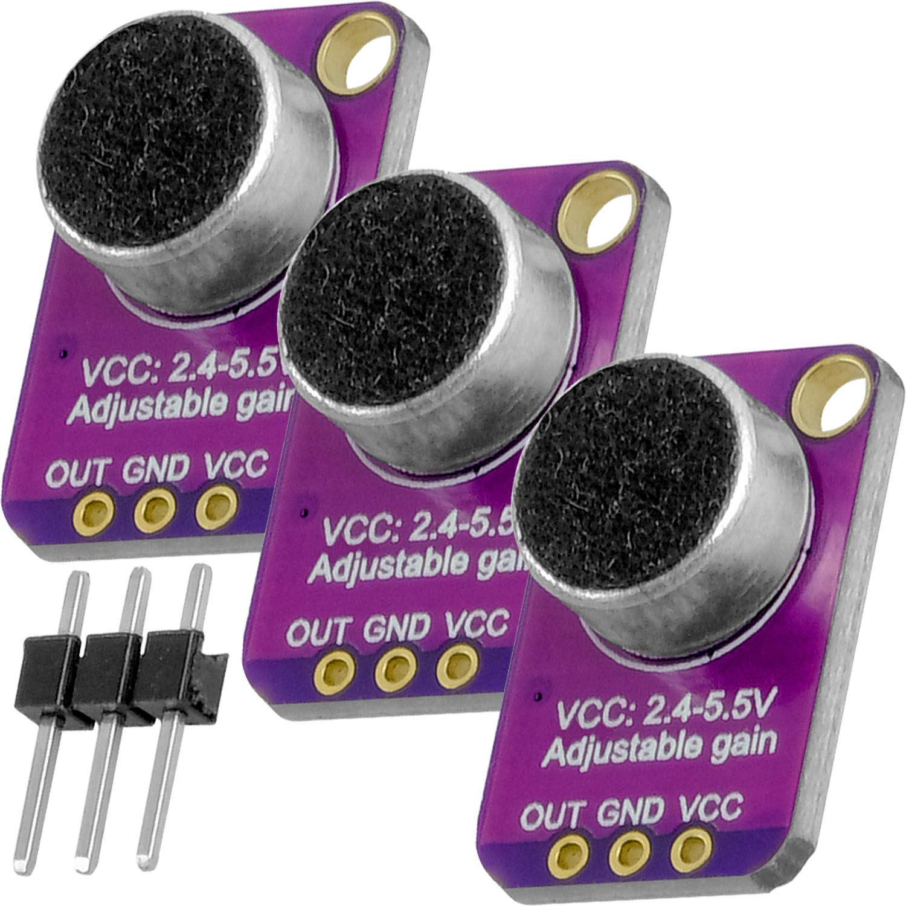

Microphone Amplifier Stable MAX9814 module Auto Gain Control MAX4466

https://www.aliexpress.com/item/1005001718734058.html?spm=a2g0o.order_list.order_list_main.77.768b1802ichOiR

[https://www.amazon.de/-/en/gp/product/B08T1V3752](https://www.amazon.de/-/en/gp/product/B08T1V3752)

<iframe width="100%" height="400" src="https://www.youtube.com/embed/bMs5J4bJOD0" title="How to Use a Microphone with Arduino (Lesson #12)" frameborder="0" allow="accelerometer; autoplay; clipboard-write; encrypted-media; gyroscope; picture-in-picture; web-share" referrerpolicy="strict-origin-when-cross-origin" allowfullscreen></iframe>