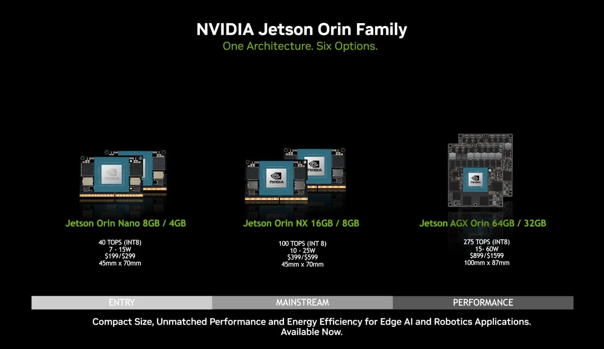

| Vendor               | Device                                                    | Price    |
| -------------------- | --------------------------------------------------------- | -------- |
|                      | Raspberry Pi 4                                            | 62 EUR   |
|                      | Raspberry Pi 5                                            |          |
|                      | Coral                                                     | 130 USD  |
| NVidia               | [Jetson Nano setup](Jetson%20Nano%20setup.md)             | 250 EUR  |
| NVidia               | [Jetson Orin Nano setup](../robotic-beehive/Jetson%20Orin%20Nano%20setup.md) | 650 EUR  |
| NVidia               | Jetson AGX Orin                                           | 2250 EUR |
| Sima.ai              |                                                           | 2000 EUR |
| VeriSilicon          |                                                           |          |
| RockChip             |                                                           |          |
| MediaTek             |                                                           |          |
| Analog Devices       |                                                           |          |
| Greener Wave         |                                                           |          |
| BrainChip            |                                                           |          |
| Innatera             |                                                           |          |
| Nordic Semiconductor |                                                           |          |
| AMD                  | Spartan 7                                                 |          |
|                      |                                                           |          |

