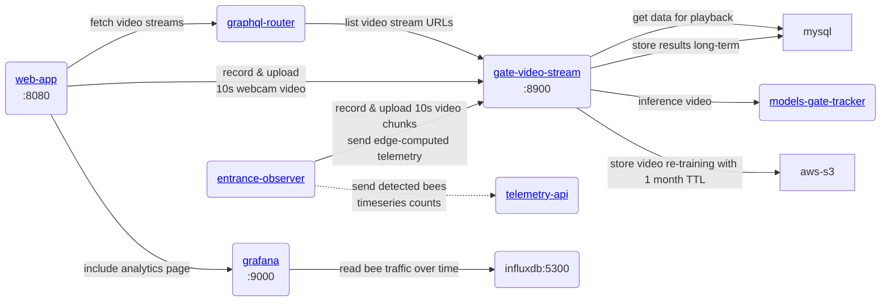

Main client service is [beehive-entrance-video-processor](https://github.com/Gratheon/beehive-entrance-video-processor), it needs to run on the edge device to capture and send data to web-app. Our main priority is inference on the edge device, but we also want to have hybrid inference with cloud support.
### Video processing, playback and analytics

Camera protection cover

## Choosing processing architecture

We can approach where to process video from different angles:

| **Where**                                                                                                                                                                                                                                                                                                                                                               | **Pros**                                                                                                                                                                                                                                                                            | **Cons**                                                                                                                                                                                                                                   |
| ----------------------------------------------------------------------------------------------------------------------------------------------------------------------------------------------------------------------------------------------------------------------------------------------------------------------------------------------------------------------- | ----------------------------------------------------------------------------------------------------------------------------------------------------------------------------------------------------------------------------------------------------------------------------------- | ------------------------------------------------------------------------------------------------------------------------------------------------------------------------------------------------------------------------------------------ |
| Edge device without GPU   raspberry-pi      ex.   [🇨🇿 BeeLogger](https://www.notion.so/BeeLogger-ad269086bf8449faa0aae6754f879181?pvs=21), [BeePi](https://www.notion.so/BeePi-2e3023f492864fa98b2790743c3ba6e4?pvs=21)                                                                                                                           | - cheap ~ 95 EUR for the board                                                                                                                                                                                                                                                      | - limited to simple numerical models   - may not be reliable                                                                                                                                                                          |
| Edge-device with GPU   (jetson nano)      ex.   [🇩🇪Apic.ai](https://www.notion.so/Apic-ai-7859a940fd644a3fa35008fd3a2f1909?pvs=21), [🇦🇺Beemate](https://www.notion.so/Beemate-7f54f62332334254b42e3e584dfae537?pvs=21), [🔬BeeAlarmed. Masters thesis](https://www.notion.so/BeeAlarmed-Masters-thesis-d9c40374718b480ab08a3872f441a2d8?pvs=21) | - efficient   - low network dependency   - can work offline with own GPU                                                                                                                                                                                                  | ~ cost 230 EUR for the board alone                                                                                                                                                                                                         |
| Hybrid:   - on-premise (local) GPU workstation   - Video streaming devices                                                                                                                                                                                                                                                                                    | - lower cost in total                                                                                                                                                                                                                                                               | - higher initial cost for the device   - need of dedicated workstation location                                                                                                                                                       |
| Cloud-only, ex.  [LabelBee](https://www.notion.so/LabelBee-482ad7f33192487caae38697b21b7f5d?pvs=21)                                                                                                                                                                                                                                                                     |                                                                                                                                                                                                                                                                                     | - need high network bandwidth   - need to optimize for variable network bandwidth   - expensive   - video streaming and processing cost   - video storage cost                                                         |
| Specialized [PCB devices](https://jlcpcb.com/)                                                                                                                                                                                                                                                                                                                          | - energy efficiency   - low production cost                                                                                                                                                                                                                                    | - usually low on RAM, GPU   - high development cost                                                                                                                                                                                   |
| On a mobile phone                                                                                                                                                                                                                                                                                                                                                       | - price controlled by the customer   - has built-in networking   - has a camera   - has screen   - has battery & power management   - no vendor-lock   - easiest to get started   - easy for beekeeper to setup   - automatic app redeploys | - high variety of phones, inconsistent experience   - for processing on the phone, issues with GPU, need to use custom mobile tensorflow   - too high-level (in-browser), hard to handle exceptions & may need user intervention |
