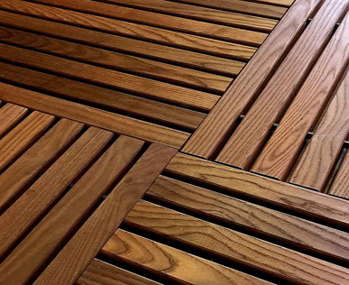
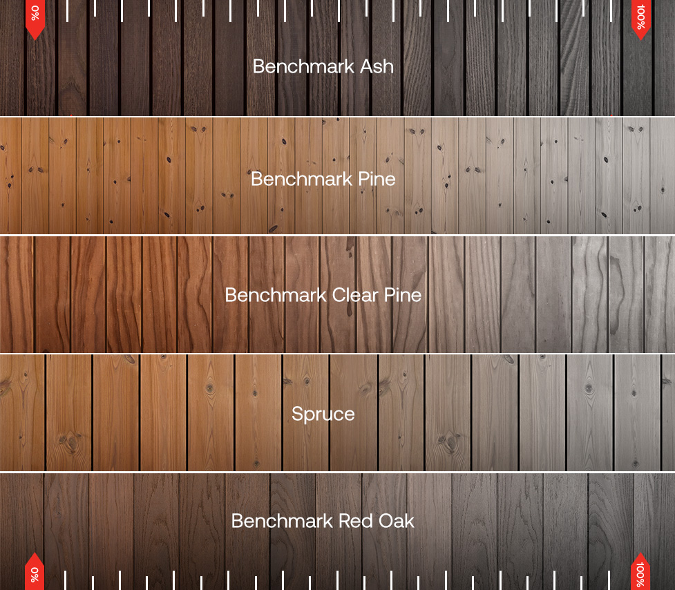
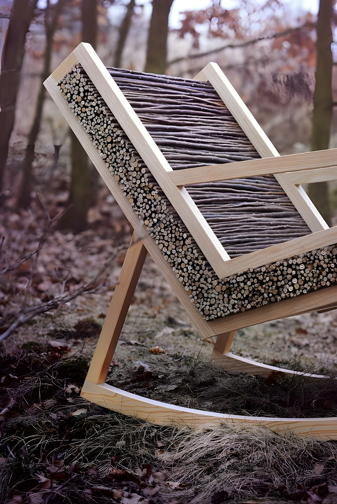

`status: idea`

Facebook groups / contractors may help here [https://www.facebook.com/groups/142661069830141/](https://www.facebook.com/groups/142661069830141/)

## Problem statement

[Ugly beehives](https://www.notion.so/Ugly-beehives-49a604ea99fa429691b0e23dccc1f172?pvs=21)

For designers to understand the state of current beekeeping practices and to have motivation to make life better, here are some community pictures of beehives

## Design styles

## 1. Modern, minimalistic, industrial, utilitarian

(plastic, metal, glass)

Possibly for [Robotic Apiary](https://www.notion.so/Robotic-Apiary-c14f4ea70f3146b5868a2d7874b8a958?pvs=21)

Some ideas

- Colors that highlight dangerous parts that should not be touched
- Transparent areas to show internal mechanisms

<iframe width="50%" height="200" src="https://www.youtube.com/embed/zNQv0ZX2eno" title="The modern principles of design | Braun | British GQ" frameborder="0" allow="accelerometer; autoplay; clipboard-write; encrypted-media; gyroscope; picture-in-picture; web-share" referrerpolicy="strict-origin-when-cross-origin" allowfullscreen></iframe>

<iframe width="50%" height="200" src="https://www.youtube.com/embed/BBFGECa7Vas" title="Dyson Industrial Design Language Analysis" frameborder="0" allow="accelerometer; autoplay; clipboard-write; encrypted-media; gyroscope; picture-in-picture; web-share" referrerpolicy="strict-origin-when-cross-origin" allowfullscreen></iframe>

## 2. Classic, Cosy

More for [R**obotic Beehive**](https://www.notion.so/Robotic-Beehive-fd9559a2950b44bc8291972299ced18e?pvs=21)

## 3. Nature-inspired, sustainable

## 4. Playful / Lego like

<iframe width="100%" height="400" src="https://www.youtube.com/embed/BFh3cO8KrgY" title="Real Beehive Built From LEGO!" frameborder="0" allow="accelerometer; autoplay; clipboard-write; encrypted-media; gyroscope; picture-in-picture; web-share" referrerpolicy="strict-origin-when-cross-origin" allowfullscreen></iframe>

## Industrial User Interface design inspiration

Rivian, Tesla