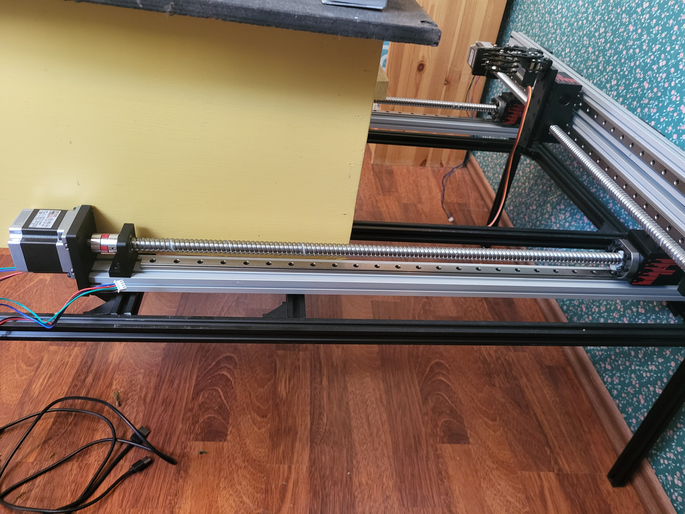
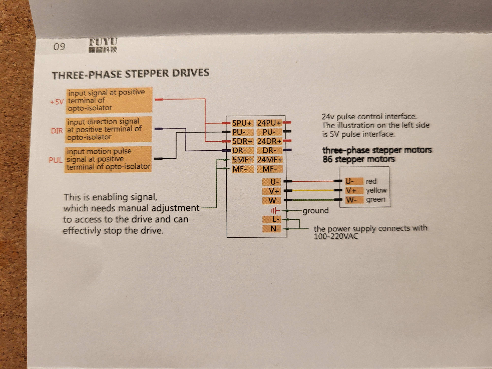
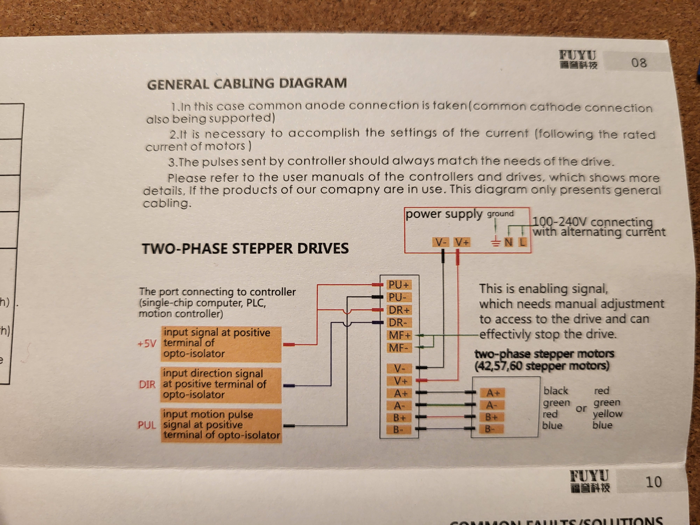
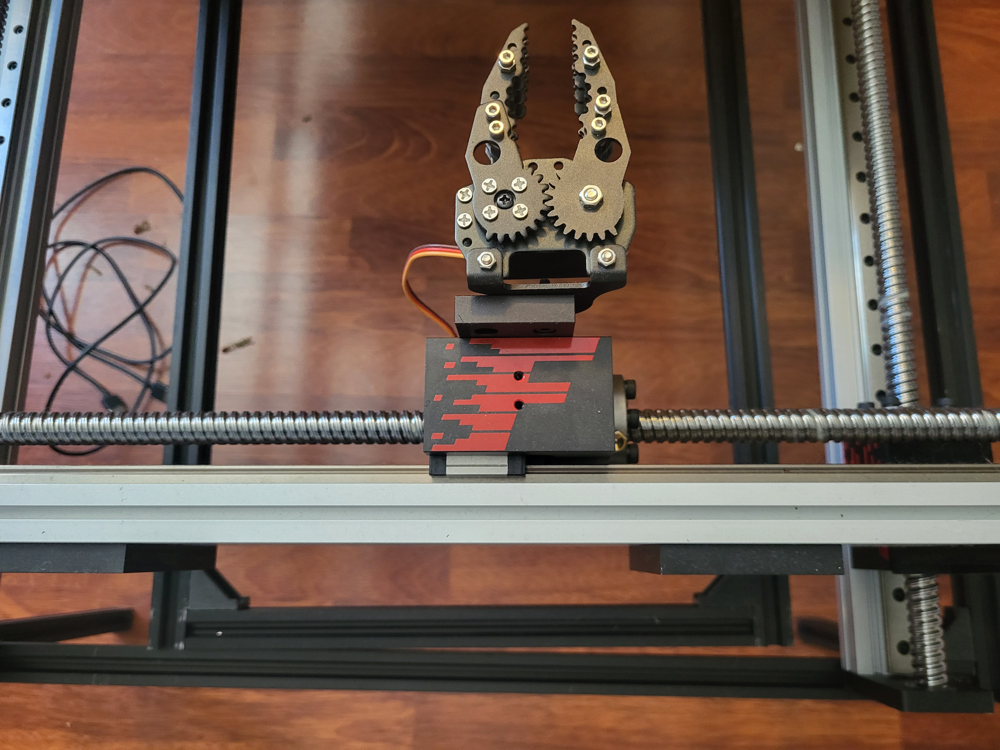
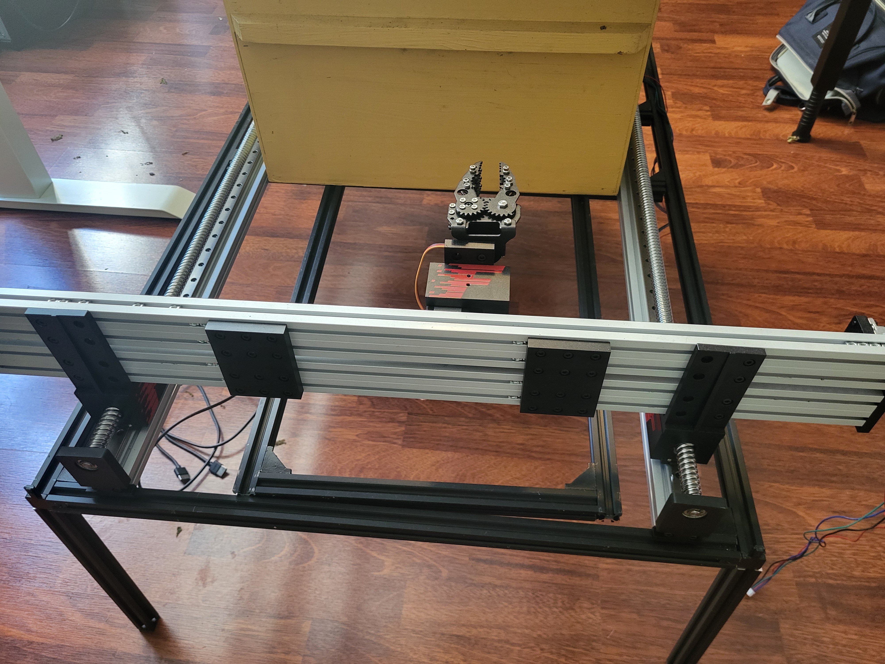
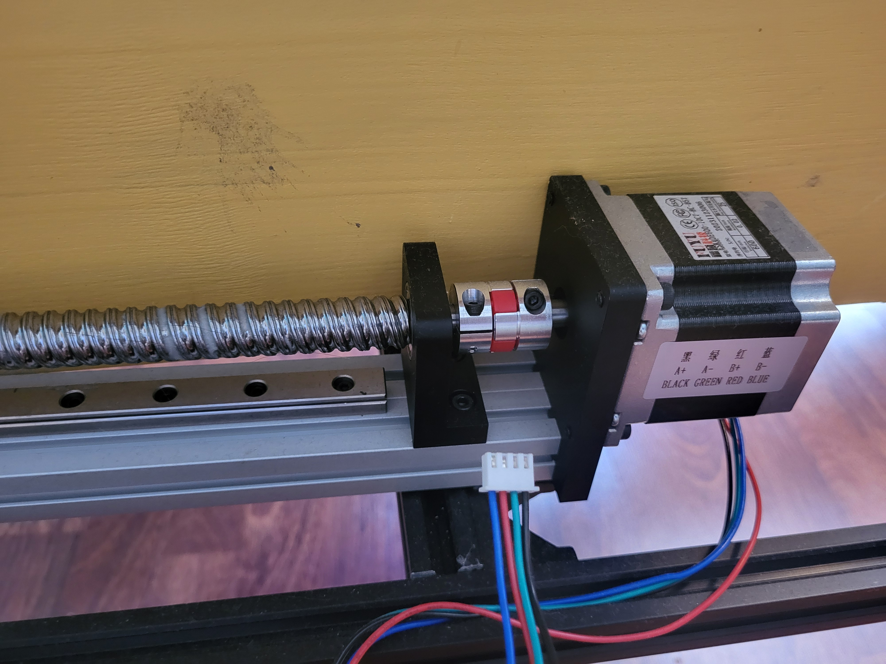
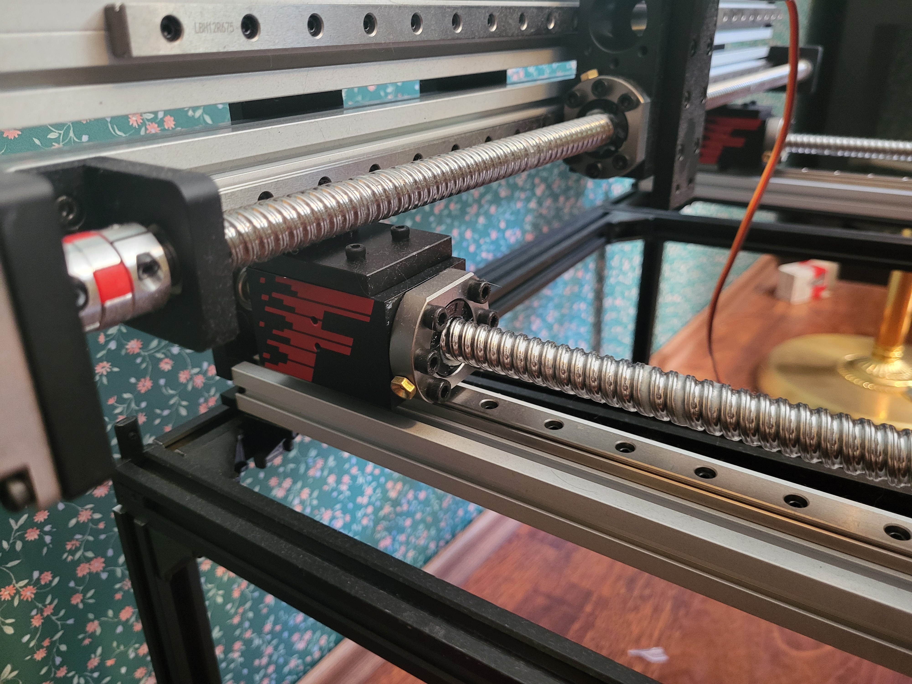
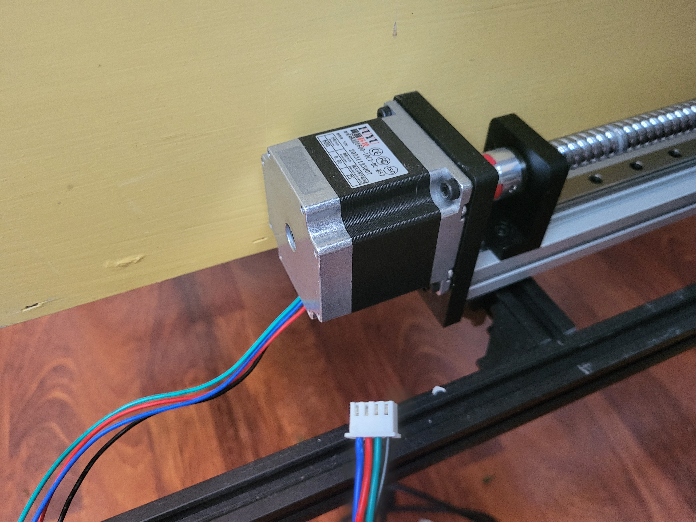

Pros

- cheap ~ 1300 USD with shipping
    - 4 motors
    - power supply
    - controller
    - 6 sensors
- controller has USB and COM ports

Cons

- windows-only API / drivers

## Useful docs/materials

[a rewrite of the controller app (USB, windows)](https://code.ihep.ac.cn/shangjiaxuan/amc4030-usb-serial-controller/-/tree/master)
[https://www.fuyumotion.com/uploads/a2aaef96.pdf](https://www.fuyumotion.com/uploads/a2aaef96.pdf)
[https://www.fuyumotion.com/manual/](https://www.fuyumotion.com/manual/)

[PDF](img/a2aaef96.pdf)

<object data={require('./img/a2aaef96.pdf').default} type="application/pdf" width="100%" height="800"></object>

<iframe width="708" height="399" src="https://www.youtube.com/embed/8gxms9ys1wY" title="AMC4030 Controler card wiring operation" frameborder="0" allow="accelerometer; autoplay; clipboard-write; encrypted-media; gyroscope; picture-in-picture; web-share" referrerpolicy="strict-origin-when-cross-origin" allowfullscreen></iframe>

