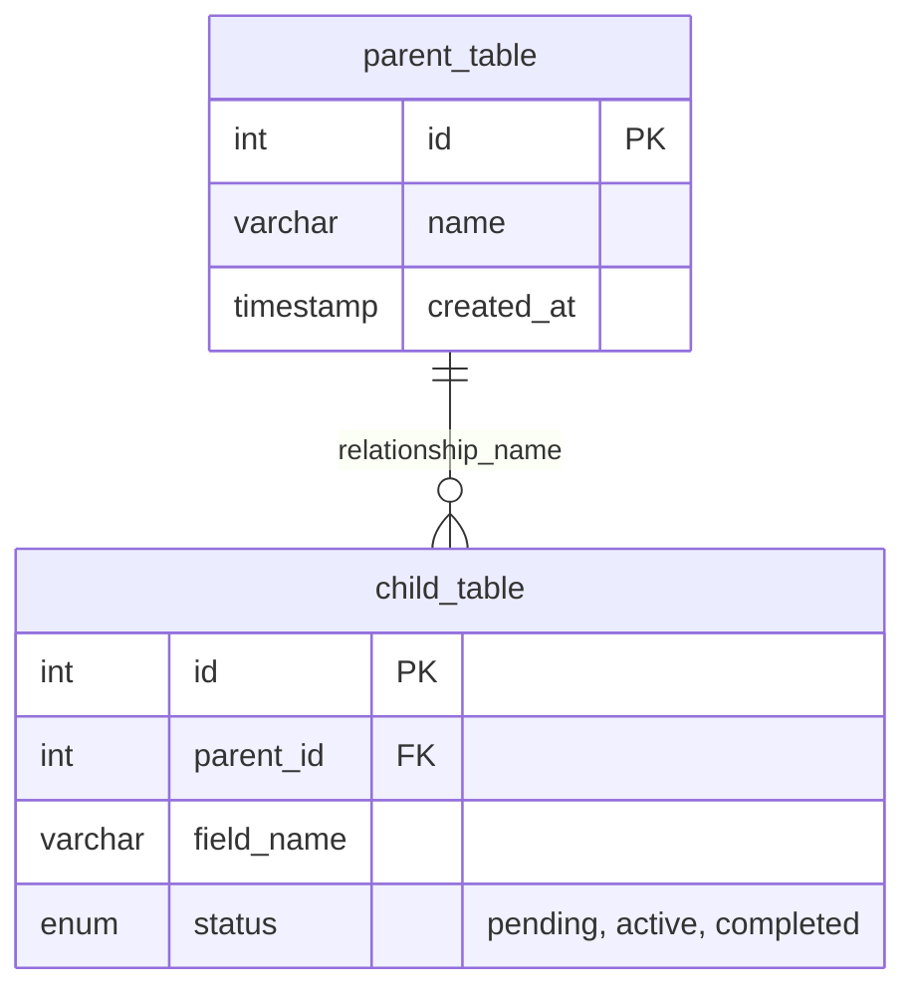
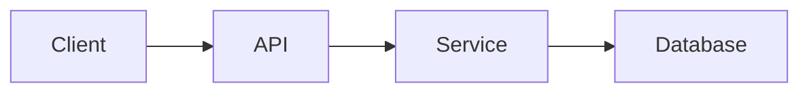

# Technical Documentation Templates

This directory contains templates for technical feature documentation. Use these templates to maintain consistency across all technical documentation.

## Templates

### feature-technical-template.md
**Purpose**: Developer-facing technical documentation
**Location**: Use in `/docs/web-app/features/`
**Audience**: Developers, architects, technical contributors

**When to use**:
- Documenting implementation details
- Specifying APIs and schemas
- Describing architecture and data flow
- Defining testing requirements
- Recording technical decisions

**Key sections**:
- Overview (technical summary)
- Architecture (components, services, data flow)
- Technical Specifications (DB, API, endpoints)
- Implementation Details (frontend, backend, algorithms)
- Configuration (env vars, settings)
- Testing (unit, integration, e2e)
- Performance Considerations
- Technical Limitations
- Related Documentation
- Development Resources

## Usage

### Creating a New Technical Documentation Page

1. Copy the template:
```bash
cp feature-technical-template.md ../features/[feature-slug].md
```

2. Fill in the sections:
   - Replace `[Feature Name]` with actual feature name
   - Write technical overview (1-2 sentences)
   - List components and services involved
   - Include actual schema changes with SQL
   - Include actual GraphQL/REST API specs
   - Add implementation details per layer
   - Create mermaid diagrams for data flow
   - Document testing approach and coverage
   - Note performance requirements and optimizations
   - List technical constraints and limitations
   - Link related technical docs and repos

3. Link from marketing page:
   - Ensure corresponding marketing page links to this doc

## Guidelines

### Writing Style
- **Be precise**: Exact technical terms, no ambiguity
- **Be complete**: Include all relevant technical details
- **Be structured**: Use consistent formatting for schemas, APIs
- **Code examples**: Include actual code when helpful
- **Diagrams**: Use mermaid for architecture and data flow

### What TO Include in Technical Docs
✅ Database ER diagrams (Mermaid format)
✅ GraphQL mutations, queries, subscriptions
✅ REST API endpoints with parameters
✅ Component architecture
✅ Data flow diagrams
✅ Key operation names with descriptions
✅ Performance metrics and requirements
✅ Testing coverage and approach
✅ Configuration requirements
✅ Technical constraints
✅ Development setup notes

### What NOT to Include in Technical Docs
❌ Marketing language or sales pitch
❌ Extensive user scenarios (brief context OK)
❌ User-facing benefits (link to marketing page instead)
❌ Raw SQL migration code (use ER diagrams instead)
❌ Detailed implementation code (keep operation names only)
❌ Less-than/greater-than symbols with numbers (use "under", "over" text)

### Code Formatting

**Database Schemas** (Use Mermaid ER Diagrams)


**Key Operations** (Names and Descriptions Only)
```markdown
**Mutations**
- `createEntity(input)` - Creates new entity with validation
- `updateEntity(id, input)` - Updates existing entity

**Queries**
- `entity(id)` - Fetches single entity with relations
- `entities(filter)` - Lists entities with pagination

**Computed Fields**
- `Entity.calculatedField` - Computed from field_a + field_b
```

**GraphQL APIs**
```graphql
mutation MutationName($param: Type!) {
  mutationName(param: $param) {
    field1
    field2
  }
}
```

**Mermaid Diagrams**


### MDX-Safe Formatting

These documentation files use MDX (Markdown + JSX). Follow these rules to avoid compilation errors:

**❌ AVOID: Comparison operators with numbers**
```markdown
- Response time: <100ms
- Success rate: >95%
```

**✅ USE: Plain text alternatives**
```markdown
- Response time: under 100ms
- Success rate: over 95%
- Latency: approximately 50ms
- Throughput: around 1000 req/s
```

**Alternative options if needed**:
- HTML entities: `&lt;100ms` → &lt;100ms
- Code blocks: \`<100ms\` → `<100ms`
- Text: "under 100ms" or "less than 100ms" (preferred)

**Why**: MDX interprets `<100` as the start of a JSX tag `<100>`, causing parsing errors.

## Examples

See these technical documentation examples:
- [Split Colony](../features/split-colony.md) - Complex feature with frame migration
- [Join Colonies](../features/join-colonies.md) - Box movement with real-time events
- [Frame Photo Upload](../features/frame-photo-upload.md) - ML pipeline with job queue
- [Queen Management](../features/queen-management.md) - Timeline with computed fields

## Directory Structure

```
docs/web-app/
├── _templates/
│   ├── README.md (this file)
│   └── feature-technical-template.md
├── features/
│   ├── split-colony.md
│   ├── join-colonies.md
│   └── [more features...]
├── Tech stack, conventions, environments.md
└── 🥞 DB schemas/
```

## Sidebar Configuration

Technical docs automatically appear in the sidebar via Docusaurus auto-generation. Control sidebar order with:
```markdown
---
sidebar_position: 1
---
```

## Cross-Linking

Link to related technical docs:
```markdown
### 🔗 Related Documentation
- [Related Feature](./related-feature.md)
- [API Documentation](../API/endpoint.md)
```

Link from marketing pages:
```markdown
For technical details, see [Technical Documentation](../../../../docs/web-app/features/feature-slug.md)
```

## Questions?

Refer to `/Users/artjom/git/WEBSITE_REFACTORING_COMPLETE.md` for full refactoring guidelines and structure.

