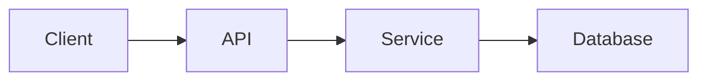

# [Feature Name] - Technical Documentation

### 🎯 Overview
Brief technical description of what this feature does.

### 🏗️ Architecture

#### Components
- Component 1: Description
- Component 2: Description

#### Services
- Service 1: Purpose and responsibility
- Service 2: Purpose and responsibility

### 📋 Technical Specifications

#### Database Schema
```sql
-- Schema changes or relevant tables
```

#### GraphQL API
```graphql
# Relevant queries, mutations, subscriptions
```

#### REST API Endpoints
```
GET /api/endpoint
POST /api/endpoint
```

### 🔧 Implementation Details

#### Frontend
- Framework/libraries used
- Key components and structure
- State management approach

#### Backend
- Services involved
- Data processing logic
- Integration points

#### Data Flow


### ⚙️ Configuration
Required environment variables, settings, or configuration options.

### 🧪 Testing

#### Unit Tests
Location and coverage details

#### Integration Tests
Test scenarios and approach

#### E2E Tests
User flow testing details

### 📊 Performance Considerations

#### Optimizations
- List optimization strategies applied
- Caching approaches
- Query optimization techniques

#### Bottlenecks
- Identified performance bottlenecks
- Resource-intensive operations
- Rate limits or constraints

#### Metrics
- Response time: under 100ms
- Throughput: X requests per second
- Success rate: over 95%
- Note: Use "under", "over", "approximately" instead of < > symbols to avoid MDX parsing errors

### 🚫 Technical Limitations
- Current constraints
- Known issues
- Future improvements needed

### 🔗 Related Documentation
- [Related feature 1](./related-feature.md)
- [API Documentation](../API/endpoint.md)
- External references

### 📚 Development Resources
- GitHub repositories
- Design files
- Architecture diagrams

### 💬 Technical Notes
Implementation notes, gotchas, or important context for developers.

---
## Change Log

**Last Updated**: [Date]