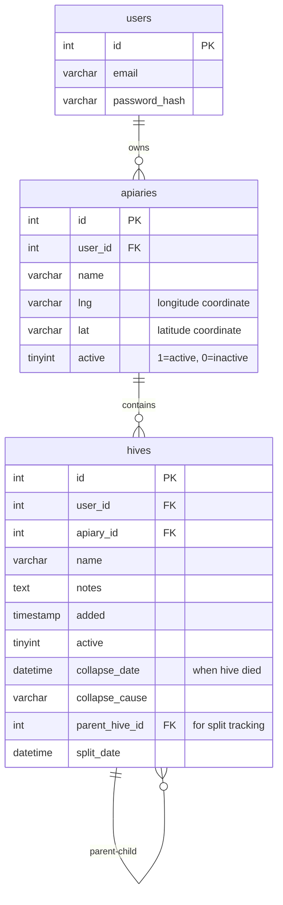
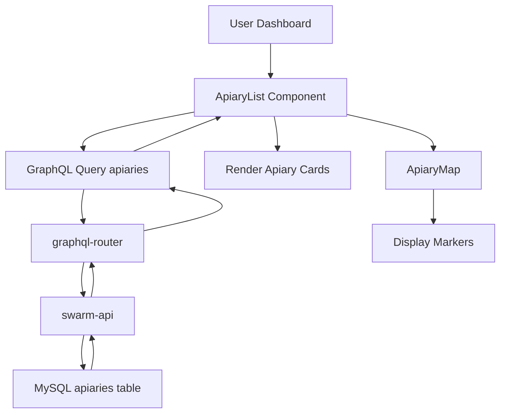

# Apiary Management - Technical Documentation
### 🎯 Overview
Hierarchical apiary management system enabling users to organize hives into location-based or operational groups. Provides CRUD operations for apiaries with GPS coordinate tracking, hive associations, and multi-site support for beekeepers managing colonies across multiple locations.

### 🏗️ Architecture

#### Components
- **ApiaryList**: React component displaying all user apiaries with map view
- **ApiaryEditor**: Form component for creating/editing apiary details
- **ApiaryMap**: Interactive map showing apiary locations with markers
- **HiveList**: Nested component showing hives within selected apiary

#### Services
- **swarm-api**: Primary service handling apiary/hive data management
- **graphql-router**: Federated gateway routing apiary queries
- **gate-video-stream**: Uses apiary location for camera association (future integration)

### 📋 Technical Specifications

#### Database Schema


#### GraphQL API
```graphql
type Apiary {
  id: ID!
  name: String
  location: String
  lat: String
  lng: String
  hives: [Hive]
}

type Query {
  apiaries: [Apiary]
  apiary(id: ID!): Apiary
}

type Mutation {
  addApiary(name: String!, lat: String, lng: String, location: String): Apiary
  updateApiary(id: ID!, name: String, lat: String, lng: String, location: String): Apiary
  deleteApiary(id: ID!): Boolean
}

input HiveInput {
  apiaryId: ID!
  name: String!
  boxCount: Int!
  frameCount: Int!
  colors: [String]
}

type Mutation {
  addHive(input: HiveInput!): Hive
  updateHive(input: HiveUpdateInput!): Hive
  deleteHive(id: ID!): Boolean
}
```

### 🔧 Implementation Details

#### Frontend
- **Framework**: React with TypeScript
- **Map Library**: Leaflet (react-leaflet) for location visualization
- **State Management**: Apollo Client cache for apiary/hive data
- **Forms**: React Hook Form with validation
- **Location Input**: 
  - Manual GPS coordinate entry
  - Address geocoding (future feature)
  - Map click to set coordinates

#### Backend (swarm-api)
- **Language**: Go
- **Framework**: Custom HTTP server with GraphQL
- **Database**: MySQL with prepared statements
- **Authentication**: JWT token validation
- **Authorization**: User-scoped queries (apiaries filtered by user_id)

#### Data Flow


#### Key Operations

**Create Apiary**
```go
func (r *mutationResolver) AddApiary(ctx context.Context, name string, lat *string, lng *string, location *string) (*model.Apiary, error) {
    userID := ctx.Value("user_id").(int)
    
    query := `INSERT INTO apiaries (user_id, name, lat, lng) VALUES (?, ?, ?, ?)`
    result, err := r.DB.Exec(query, userID, name, safeString(lat, "0"), safeString(lng, "0"))
    
    id, _ := result.LastInsertId()
    
    return &model.Apiary{
        ID: strconv.FormatInt(id, 10),
        Name: &name,
        Lat: lat,
        Lng: lng,
    }, nil
}
```

**List Apiaries with Hives**
```go
func (r *queryResolver) Apiaries(ctx context.Context) ([]*model.Apiary, error) {
    userID := ctx.Value("user_id").(int)
    
    apiaries, err := r.DB.Query(`
        SELECT id, name, lat, lng 
        FROM apiaries 
        WHERE user_id = ? AND active = 1
        ORDER BY name
    `, userID)
    
    for apiaries.Next() {
        var a model.Apiary
        apiaries.Scan(&a.ID, &a.Name, &a.Lat, &a.Lng)
        
        a.Hives, _ = r.loadHivesForApiary(a.ID, userID)
        result = append(result, &a)
    }
    
    return result, nil
}
```

**Delete Apiary**
```go
func (r *mutationResolver) DeleteApiary(ctx context.Context, id string) (bool, error) {
    userID := ctx.Value("user_id").(int)
    
    hiveCount, _ := r.DB.QueryRow(`
        SELECT COUNT(*) FROM hives 
        WHERE apiary_id = ? AND user_id = ? AND active = 1
    `, id, userID).Scan(&count)
    
    if count > 0 {
        return false, errors.New("cannot delete apiary with active hives")
    }
    
    _, err := r.DB.Exec(`
        UPDATE apiaries SET active = 0 
        WHERE id = ? AND user_id = ?
    `, id, userID)
    
    return err == nil, err
}
```

### ⚙️ Configuration

#### Environment Variables
```bash
MYSQL_HOST=localhost
MYSQL_PORT=3306
MYSQL_DATABASE=swarm
MYSQL_USER=root
MYSQL_PASSWORD=pass

JWT_SECRET=xxx

GEOCODING_API_KEY=xxx
```

### 🧪 Testing

#### Unit Tests
- Location: `/test/apiary_test.go`
- Coverage: CRUD operations, authorization checks
- Tests:
  - Create apiary with valid/invalid coordinates
  - List apiaries for user (isolation)
  - Update apiary details
  - Delete apiary (with/without hives)
  - Hive association validation

#### Integration Tests
- Location: `/test/integration/apiary_flow_test.go`
- Tests:
  - Full apiary lifecycle (create → add hives → update → delete)
  - Multi-user isolation
  - Coordinate validation
  - Cascade behavior on deletion

#### E2E Tests
Manual test scenarios:
- Create apiary, add hives, verify map display
- Edit apiary location, verify coordinates update
- Attempt to delete apiary with hives (should fail)
- Move hive between apiaries
- Multi-apiary management workflow

### 📊 Performance Considerations

#### Optimizations
- **Indexed Queries**: user_id + active columns indexed
- **Eager Loading**: Hives loaded with apiary in single query batch
- **Client Caching**: Apollo cache reduces redundant requests
- **Pagination**: Future improvement for users with many apiaries

#### Bottlenecks
- Loading many hives per apiary (100+) slows initial render
- Map rendering with 50+ apiary markers
- N+1 query issue when loading hives (partially optimized)

#### Metrics
- Average apiary query: under 50ms
- Create/update operation: under 100ms
- Map render time: under 1 second (up to 20 apiaries)
- Typical user has 1-5 apiaries, 5-30 hives

### 🚫 Technical Limitations

#### Current Constraints
- **GPS Precision**: Stored as VARCHAR(20), limits precision
- **No Address Geocoding**: Manual coordinate entry only
- **Cascade Delete**: Soft delete only (active=0)
- **No Bulk Operations**: Must delete hives individually before apiary deletion
- **Map Provider**: Depends on external tile service (OpenStreetMap)
- **No Clustering**: Map markers don't cluster at high zoom-out levels

#### Known Issues
- Coordinate validation is basic (accepts invalid lat/lng strings)
- No address-to-coordinate conversion (future feature)
- Deleting apiary requires manual hive reassignment (no auto-move)
- Map markers overlap when apiaries are close together

### 🔗 Related Documentation
- [Hive Management](./hive-management.md)
- [Split Colony](./split-colony.md) - Creates new hive in same apiary
- [swarm-api Service](https://github.com/Gratheon/swarm-api)

### 📚 Development Resources

#### GitHub Repositories
- [swarm-api](https://github.com/Gratheon/swarm-api) - Apiary/hive backend
- [web-app](https://github.com/Gratheon/web-app) - Frontend components

#### Key Files
- Frontend: `/src/page/apiary/ApiaryList.tsx`
- Backend: `/resolvers/apiary.go`
- Schema: `/schema.graphql`
- Migrations: `/migrations/20240818194700_init.sql`

### 💬 Technical Notes

- Apiary is foundational hierarchical entity (User → Apiary → Hive → Box → Frame)
- Soft delete pattern used (active=0) to preserve historical data
- GPS coordinates stored as strings for simplicity (consider POINT type for spatial queries)
- Future: Add address geocoding, bulk hive operations, apiary statistics
- Consider adding apiary-level notes, photos, or weather integration
- Deletion protection prevents orphaned hives (must reassign or delete hives first)

---
**Last Updated**: December 5, 2025

