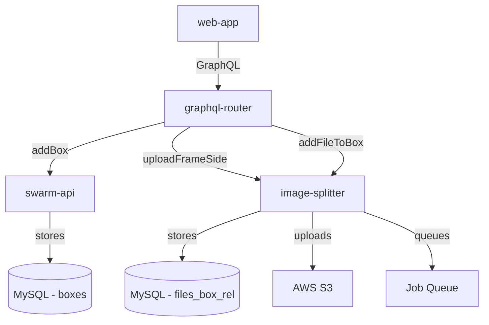

This document describes the technical implementation of the hive bottom board feature for varroa mite monitoring. The feature spans three microservices: swarm-api, image-splitter, and web-app.

## Architecture

### Service Dependencies



### Data Flow

1. **User creates bottom box**:
   - web-app → graphql-router → swarm-api
   - Creates record in `boxes` table with `type = 'BOTTOM'`

2. **User uploads image**:
   - web-app → graphql-router → image-splitter
   - Step 1: `uploadFrameSide` uploads to S3, returns `fileId`
   - Step 2: `addFileToBox` links file to box in `files_box_rel`

3. **Image processing**:
   - image-splitter queues varroa detection job
   - Job processes image asynchronously
   - Results stored in `detectedObjects` JSON field

## Database Schema

### swarm-api Schema

#### boxes table
```sql
CREATE TABLE `boxes` (
  `id` int unsigned NOT NULL AUTO_INCREMENT,
  `user_id` int unsigned NOT NULL,
  `hive_id` int NOT NULL,
  `active` tinyint(1) NOT NULL DEFAULT '1',
  `color` varchar(10) DEFAULT '#ffc848',
  `position` mediumint DEFAULT NULL,
  `type` enum('SUPER','DEEP','GATE','VENTILATION','QUEEN_EXCLUDER','HORIZONTAL_FEEDER','BOTTOM') 
         CHARACTER SET utf8mb4 COLLATE utf8mb4_0900_ai_ci NOT NULL DEFAULT 'DEEP',
  PRIMARY KEY (`id`)
) ENGINE=InnoDB DEFAULT CHARSET=utf8mb4 COLLATE=utf8mb4_general_ci;
```

**Migration**: `migrations/20251201025115_add_bottom_box_type.sql`

### image-splitter Schema

#### files_box_rel table
```sql
CREATE TABLE `files_box_rel` (
  `box_id` int unsigned NOT NULL,
  `file_id` int unsigned NOT NULL,
  `user_id` int unsigned NOT NULL,
  `inspection_id` INT NULL DEFAULT NULL,
  `added_time` datetime DEFAULT CURRENT_TIMESTAMP,
  INDEX (`user_id`, `box_id`, `inspection_id`)
) ENGINE=InnoDB DEFAULT CHARSET=utf8mb4 COLLATE=utf8mb4_bin;
```

**Migration**: `migrations/018-box-files.sql`

**Purpose**: Links uploaded files to specific boxes with inspection versioning support.

#### Relationships
- `box_id` → `swarm-api.boxes.id` (foreign service reference)
- `file_id` → `image-splitter.files.id`
- `user_id` → user ownership
- `inspection_id` → `swarm-api.inspections.id` (NULL = current state)

## GraphQL API

### swarm-api

#### Add Box Mutation
```graphql
mutation addBox($hiveId: ID!, $position: Int!, $type: BoxType!) {
  addBox(hiveId: $hiveId, position: $position, type: $type) {
    id
    type
    position
    color
  }
}
```

**Variables**:
```json
{
  "hiveId": "123",
  "position": 0,
  "type": "BOTTOM"
}
```

**Implementation**: `graph/schema.resolvers.go::AddBox()`

### image-splitter

#### Upload File Mutation
```graphql
mutation uploadFrameSide($file: Upload!) {
  uploadFrameSide(file: $file) {
    id
    url
    resizes {
      id
      url
      max_dimension_px
    }
  }
}
```

**Returns**:
```json
{
  "data": {
    "uploadFrameSide": {
      "id": "456",
      "url": "https://s3.../original.jpg",
      "resizes": [...]
    }
  }
}
```

**Implementation**: `src/graphql/upload-frame-side.ts`

#### Link File to Box Mutation
```graphql
mutation addFileToBox($boxId: ID!, $fileId: ID!, $hiveId: ID!) {
  addFileToBox(boxId: $boxId, fileId: $fileId, hiveId: $hiveId)
}
```

**Variables**:
```json
{
  "boxId": "123",
  "fileId": "456",
  "hiveId": "789"
}
```

**Implementation**: `src/graphql/resolvers.ts::addFileToBox()`

## Frontend Implementation

### BottomBox Component

**Location**: `web-app/src/page/hiveEdit/bottomBox/BottomBox.tsx`

**Key Features**:
- File upload with validation
- Two-step mutation process
- Error handling
- Loading states

**Code Structure**:
```typescript
export default function BottomBox({ boxId, hiveId }) {
  // Step 1: Upload file
  const [uploadFile] = useUploadMutation(...)
  
  // Step 2: Link to box
  const [addFileToBoxMutation] = useMutation(...)
  
  async function onFileSelect(event) {
    const file = event.target.files?.[0]
    
    // Upload file to S3
    const uploadResult = await uploadFile({ file })
    const fileId = uploadResult.data.uploadFrameSide.id
    
    // Link file to box
    await addFileToBoxMutation({ boxId, fileId, hiveId })
  }
  
  return (
    <div>
      <input type="file" onChange={onFileSelect} />
      {data && }
    </div>
  )
}
```

### Integration Points

**hiveButtons.tsx**: Adds "Add bottom" button
```typescript
<Button onClick={() => onBoxAdd(boxTypes.BOTTOM)}>
  <span><T>Add bottom</T></span>
</Button>
```

**index.tsx**: Renders BottomBox component
```typescript
{box && box.type === boxTypes.BOTTOM && (
  <BottomBox boxId={boxId} hiveId={hiveId} />
)}
```

## Backend Implementation

### swarm-api (Go)

#### Box Model
**Location**: `graph/model/box.go`

**Key Methods**:
- `Create()` - Creates new box with type validation
- `ListByHive()` - Fetches boxes for a hive
- `Get()` - Retrieves single box

**Type Constants**:
```go
const (
    BoxTypeDeep             BoxType = "DEEP"
    BoxTypeSuper            BoxType = "SUPER"
    BoxTypeGate             BoxType = "GATE"
    BoxTypeVentilation      BoxType = "VENTILATION"
    BoxTypeQueenExcluder    BoxType = "QUEEN_EXCLUDER"
    BoxTypeHorizontalFeeder BoxType = "HORIZONTAL_FEEDER"
    BoxTypeBottom           BoxType = "BOTTOM"
)
```

### image-splitter (TypeScript)

#### boxFile Model
**Location**: `src/models/boxFile.ts`

**Key Methods**:
```typescript
export default {
  async addBoxRelation(fileId, boxId, userId, inspectionId = null) {
    await storage().query(
      sql`INSERT INTO files_box_rel 
          (file_id, box_id, user_id, inspection_id) 
          VALUES (${fileId}, ${boxId}, ${userId}, ${inspectionId})`
    );
  },
  
  async getBoxFiles(boxId, userId, inspectionId = null) {
    // Returns files for specific box
  }
}
```

#### Resolver
**Location**: `src/graphql/resolvers.ts`

```typescript
addFileToBox: async (_, {boxId, fileId, hiveId}, {uid}) => {
  await boxFileModel.addBoxRelation(fileId, boxId, uid);
  await fileModel.addHiveRelation(fileId, hiveId, uid);
  return true;
}
```

## Inspection Versioning

### How It Works

1. **Current State**: Images have `inspection_id = NULL`
2. **Create Inspection**: 
   - Current images are cloned
   - Clones get new `inspection_id`
   - Original images remain with `NULL` (becomes new current state)
3. **Historical View**: Query with specific `inspection_id`

### SQL Queries

**Get current images**:
```sql
SELECT * FROM files_box_rel 
WHERE box_id = ? AND user_id = ? AND inspection_id IS NULL;
```

**Get historical images**:
```sql
SELECT * FROM files_box_rel 
WHERE box_id = ? AND user_id = ? AND inspection_id = ?;
```

## Job Queue Integration

### Varroa Detection Job

When file is uploaded, a varroa detection job is queued:

```typescript
await jobs.addJob(TYPE_VARROA, fileId);
```

**Job Type**: `TYPE_VARROA = 'varroa'`

**Processing**:
1. Job worker picks up job from queue
2. Downloads image from S3
3. Runs varroa detection model
4. Stores results in `detectedObjects` JSON field
5. Updates job status to complete

## Deployment

### Prerequisites
- MySQL database for both services
- AWS S3 bucket configured
- Redis for job queue

### Migration Steps

1. **Deploy swarm-api**:
```bash
cd swarm-api
just migrate-db-dev
# Applies: migrations/20251201025115_add_bottom_box_type.sql
```

2. **Deploy image-splitter**:
```bash
cd image-splitter
just stop && just start
# Auto-runs: migrations/018-box-files.sql
```

3. **Deploy web-app**:
```bash
cd web-app
pnpm build
# Upload dist/ to hosting
```

4. **Restart graphql-router**:
```bash
docker restart gratheon-graphql-router-1
```

### Verification

```sql
-- Check box type enum
SHOW COLUMNS FROM boxes LIKE 'type';

-- Check files_box_rel table
DESCRIBE files_box_rel;

-- Test data flow
INSERT INTO boxes (user_id, hive_id, type, position) 
VALUES (1, 1, 'BOTTOM', 0);

-- Should return the box
SELECT * FROM boxes WHERE type = 'BOTTOM';
```

## Testing

### Unit Tests

**swarm-api**:
```bash
cd swarm-api
go test ./...
```

**image-splitter**:
```bash
cd image-splitter
npm test
```

**web-app**:
```bash
cd web-app
pnpm test:unit
```

### Integration Test Flow

1. Create hive via API
2. Add BOTTOM box to hive
3. Upload image via BottomBox component
4. Verify:
   - File exists in S3
   - Record in `files` table
   - Record in `files_box_rel` table
   - Record in `files_hive_rel` table
   - Varroa job queued

### Manual Test

1. Navigate to hive in web-app
2. Click "Add bottom" button
3. Verify bottom box appears in structure
4. Click on bottom box
5. Upload image file
6. Check database:
```sql
SELECT * FROM files_box_rel 
ORDER BY added_time DESC LIMIT 1;
```

## Troubleshooting

### Common Issues

**Issue**: "Data truncated for column 'type'"
- **Cause**: Migration not run
- **Fix**: Run `just migrate-db-dev` in swarm-api

**Issue**: "Unknown field addFileToBox"
- **Cause**: graphql-router not restarted
- **Fix**: Restart graphql-router to reload schema

**Issue**: "Unable to resolve table files_box_rel"
- **Cause**: Migration not run in image-splitter
- **Fix**: Rebuild image-splitter container

**Issue**: Image uploads but not linked
- **Cause**: Missing `addFileToBox` call
- **Fix**: Check BottomBox component calls both mutations

## Future Enhancements

### Phase 2: Display Images
- Add query to fetch box images
- Display images in UI
- Show upload history
- Image deletion capability

### Phase 3: Varroa Detection
- Implement varroa counting model
- Display count on images
- Show detection regions
- Confidence scores

### Phase 4: Analytics
- Historical trend charts
- Treatment correlation
- Predictive alerts
- Comparison across hives

## Related Documentation

- [Bottom Board User Guide](../../about/products/web_app/starter-tier/🧮 Hive bottom board & varroa monitoring.md)
- [DB Schemas](./🥞 DB schemas/)

## Change Log

- **2025-12-01**: Initial implementation
  - Added BOTTOM box type
  - Created files_box_rel table
  - Implemented upload flow
  - Added BottomBox component

