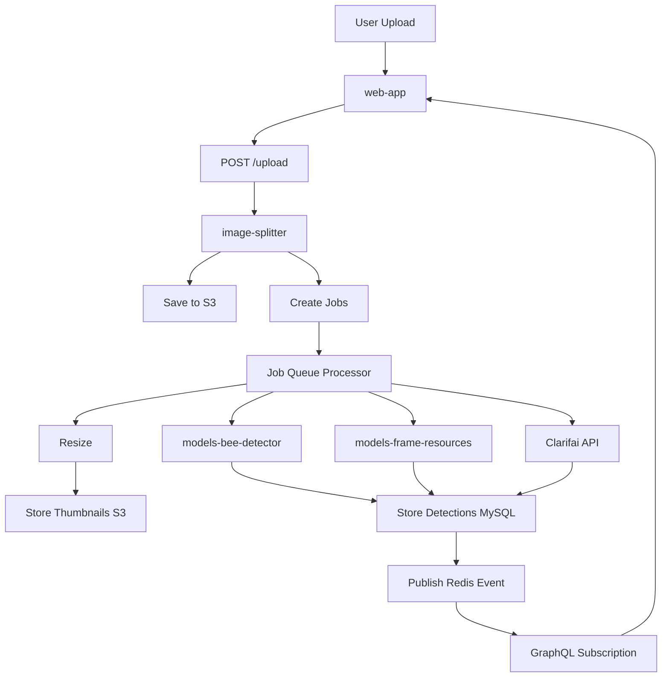

# Frame Photo Upload - Technical Documentation

### 🎯 Overview
Frame photo upload system enabling users to upload images of beehive frames with automatic processing pipeline that triggers AI detection models, generates thumbnails, stores images in object storage, and provides real-time analysis feedback. Core workflow feature for all frame-based AI analysis.

### 🏗️ Architecture

#### Components
- **FileUploader**: React component for drag-drop and click-to-upload interface
- **FrameSideView**: Container managing upload state and detection visualization
- **DetectionOverlay**: Canvas-based rendering of AI detection results
- **ZoomableImage**: Optimized image viewer with lazy loading

#### Services
- **image-splitter**: Primary service orchestrating image processing, ML model invocation, storage
- **models-bee-detector**: Worker bee, drone, queen detection
- **models-frame-resources**: Cell detection (brood, honey, pollen)
- **Clarifai API**: Queen cup, varroa mite detection
- **AWS S3/Minio**: Object storage for original and thumbnail images

### 📋 Technical Specifications

#### Image Processing Pipeline
```
1. Upload (web-app) → Direct POST to image-splitter
2. Store original → S3/Minio bucket
3. Create job queue entries (resize, detect_bees, detect_cells, etc.)
4. Process jobs asynchronously:
   - Generate thumbnails (200px, 800px, 1600px)
   - Invoke ML models
   - Store detection results
5. Publish Redis events for real-time updates
6. Update GraphQL cache
```

#### GraphQL API
```graphql
mutation uploadFrameSide($frameId: ID!, $side: FrameSide!, $file: Upload!) {
  uploadFrameSide(frameId: $frameId, side: $side, file: $file) {
    id
    url
    thumbnailUrl
    detections {
      type
      count
      boxes {
        x
        y
        width
        height
        confidence
      }
    }
  }
}

query frameSide($id: ID!) {
  frameSide(id: $id) {
    id
    url
    resizedSmall: url(size: SMALL)
    resizedMedium: url(size: MEDIUM)
    resizedLarge: url(size: LARGE)
    detections {
      bees
      queens
      cells {
        total
        capped_brood
        larvae
        eggs
        pollen
        honey
        empty
      }
    }
  }
}

subscription frameSideProcessing($frameSideId: ID!) {
  frameSideProcessing(frameSideId: $frameSideId) {
    status
    progress
    message
  }
}
```

#### REST API Endpoints
```
POST /upload/:frameSideId
  - Direct file upload endpoint
  - Multipart form-data
  - Returns: { url, id, status }

GET /file/:frameSideId/:size?
  - Retrieve image by size (original, small, medium, large)
  - Returns: Image binary with appropriate Content-Type
```

#### Database Schema
```sql
CREATE TABLE frame_sides (
  id INT PRIMARY KEY AUTO_INCREMENT,
  frame_id INT NOT NULL,
  side ENUM('left', 'right') NOT NULL,
  file_url VARCHAR(512),
  created_at TIMESTAMP DEFAULT CURRENT_TIMESTAMP,
  updated_at TIMESTAMP DEFAULT CURRENT_TIMESTAMP ON UPDATE CURRENT_TIMESTAMP,
  FOREIGN KEY (frame_id) REFERENCES frames(id) ON DELETE CASCADE
);

CREATE TABLE detections (
  id INT PRIMARY KEY AUTO_INCREMENT,
  frame_side_id INT NOT NULL,
  detection_type ENUM('bee', 'queen', 'cell', 'varroa', 'cup', 'beetle', 'ant'),
  bbox_json JSON,
  confidence FLOAT,
  created_at TIMESTAMP DEFAULT CURRENT_TIMESTAMP,
  FOREIGN KEY (frame_side_id) REFERENCES frame_sides(id) ON DELETE CASCADE
);

CREATE TABLE jobs (
  id INT PRIMARY KEY AUTO_INCREMENT,
  type ENUM('resize', 'detect_bees', 'detect_cells', 'detect_queens', 'detect_varroa', 'detect_cups'),
  frame_side_id INT NOT NULL,
  status ENUM('pending', 'processing', 'completed', 'failed'),
  retries INT DEFAULT 0,
  created_at TIMESTAMP DEFAULT CURRENT_TIMESTAMP,
  processed_at TIMESTAMP NULL
);

CREATE INDEX idx_jobs_status ON jobs(status, created_at);
CREATE INDEX idx_detections_frame_side ON detections(frame_side_id, detection_type);
```

### 🔧 Implementation Details

#### Frontend
- **Framework**: React with TypeScript
- **File Upload**: Direct POST to image-splitter (bypasses GraphQL router for large files)
- **State Management**: Apollo Client cache + local component state
- **Optimization**: 
  - Progressive image loading (small → medium → large)
  - Canvas-based detection rendering with GPU acceleration
  - Virtual scrolling for frame lists
- **Real-time Updates**: GraphQL subscriptions via Redis pub/sub

#### Backend (image-splitter)
- **Language**: TypeScript/Node.js with Fastify
- **Job Queue**: MySQL-based persistent queue with retry logic
- **Image Processing**: 
  - Jimp for resizing
  - webp-converter for format optimization
  - 3 thumbnail sizes: 200px, 800px, 1600px
- **ML Orchestration**: Sequential job processing
  1. Resize job (creates thumbnails)
  2. Bee detection (internal model)
  3. Cell detection (internal model)
  4. Queen/varroa/cup detection (Clarifai)
- **Storage**: AWS S3 (production), Minio (development)
- **Error Handling**: Sentry integration, job retry mechanism (max 3 attempts)

#### Data Flow



### 🧪 Testing

#### Unit Tests
- Location: `/test/unit/upload.test.ts`
- Coverage: Image validation, thumbnail generation, job creation
- Mock S3 and database interactions

#### Integration Tests
- Location: `/test/integration/upload-flow.test.ts`
- Tests: Full upload → storage → job processing → detection
- Uses Docker Compose test environment

#### E2E Tests
- Manual testing guide focuses on:
  - Upload various image formats (JPEG, PNG, WebP)
  - Large file handling (up to 10MB)
  - Network interruption recovery
  - Concurrent uploads
  - Detection visualization accuracy

### 📊 Performance Considerations

#### Optimizations
- **Direct Upload**: Bypasses GraphQL router to reduce latency
- **Progressive Loading**: Show low-res first (200px) → upgrade to 800px → full resolution on zoom
- **Lazy Job Processing**: Background processing doesn't block upload response
- **Connection Pooling**: MySQL connection pool (10 connections)
- **Batch Detection**: Process multiple frames in single ML model request where possible

#### Bottlenecks
- ML model inference time: 5-15 seconds per frame
- Clarifai API rate limits: 10 requests/second
- S3 upload speed: Network dependent
- Large images (>5MB): Slower processing

#### Metrics
- Average upload time: under 2 seconds
- Average processing time: 15-30 seconds (all detections)
- Thumbnail generation: under 3 seconds
- Success rate: over 98%
- Job retry rate: under 5%

### 🚫 Technical Limitations

#### Current Constraints
- **File Size**: 10MB limit (configurable)
- **Formats**: JPEG, PNG, WebP only
- **Concurrent Uploads**: 5 per user (rate limited)
- **Processing Queue**: FIFO, no prioritization
- **Storage**: No automatic cleanup of old images
- **Thumbnails**: Fixed sizes (200px, 800px, 1600px)

#### Known Issues
- Large portrait images may exceed memory during resize
- Clarifai model precision for queens is low (~60% accuracy)
- No image rotation correction (EXIF orientation ignored)
- Duplicate upload detection missing

### 🔗 Related Documentation
- [Frame Side Management](./frame-side-management.md)
- [Queen Detection](./queen-detection.md)
- [image-splitter Service](https://github.com/Gratheon/image-splitter)
- [models-bee-detector](https://github.com/Gratheon/models-bee-detector)

### 📚 Development Resources

#### GitHub Repositories
- [image-splitter](https://github.com/Gratheon/image-splitter)
- [web-app](https://github.com/Gratheon/web-app) (upload component)
- [models-bee-detector](https://github.com/Gratheon/models-bee-detector)
- [models-frame-resources](https://github.com/Gratheon/models-frame-resources)

#### Key Files
- Frontend: `/src/page/hive/frameSide/FileUploader.tsx`
- Backend: `/src/routes/upload.ts`
- Job Processor: `/src/jobs/processor.ts`
- Detection Storage: `/src/db/detections.ts`

### 💬 Technical Notes

- Direct upload endpoint bypasses GraphQL for performance (large file handling)
- Job queue uses MySQL for persistence (survives service restarts)
- Redis pub/sub provides real-time updates to web-app
- Thumbnail generation is critical for fast UI rendering (full images are 3-8MB)
- ML models run on separate services to isolate GPU resources
- Clarifai used for models not yet trained internally (queens, varroa)
- Consider implementing image deduplication (hash-based) to save storage
- Future: Add image preprocessing (rotation, crop, brightness adjustment)

---
**Last Updated**: December 5, 2025

